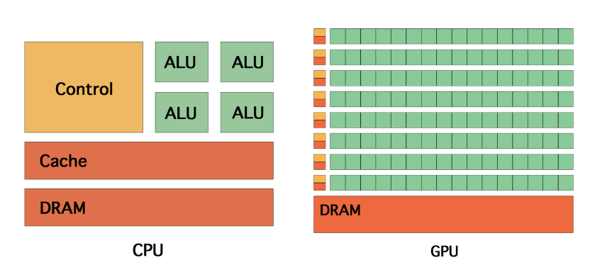
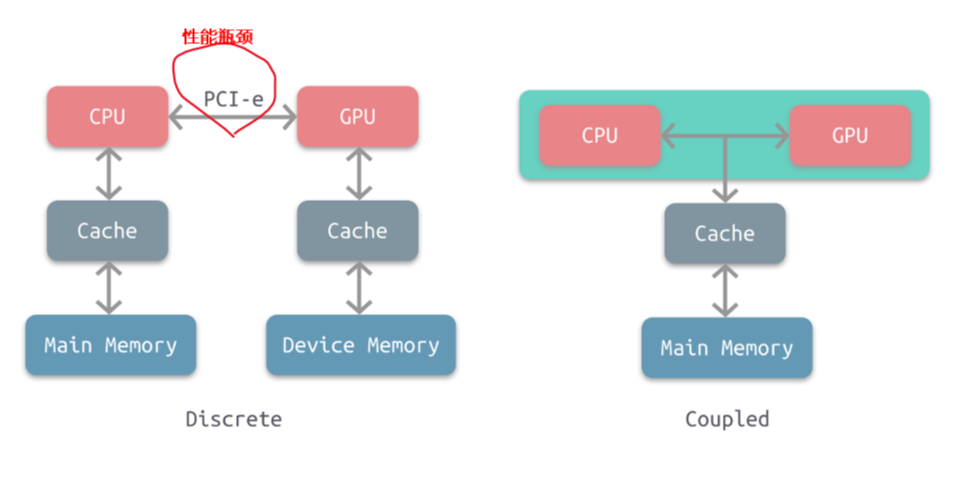
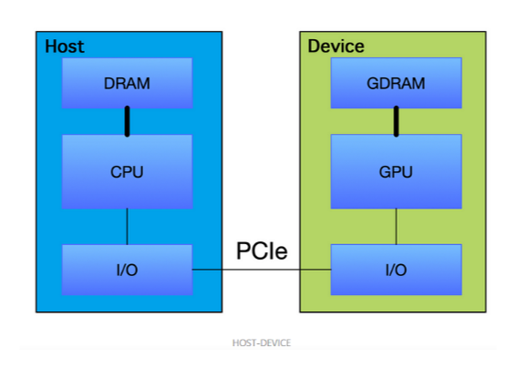

[TOC]

# 1. 概述
## 1.1. GPU是什么？

图形处理器（英语：Graphics Processing Unit，缩写：GPU），又称显示核心、视觉处理器、显示芯片，是一种专门在个人电脑、工作站、游戏机和一些移动设备（如平板电脑、智能手机等）上做图像和图形相关运算工作的**微处理器**。

**GPU不是显卡**

GPU是显卡（Video card、Display card、Graphics card）最核心的部件，但除了GPU，显卡还有扇热器、通讯元件、与主板和显示器连接的各类插槽。

## 1.2. 为什么要GPU？

在PC诞生之初，并不存在GPU的概念，所有的图形计算都由CPU进行计算。

然而，使用**CPU做图形计算速度较慢**，于是就设计了专门的图形加速卡用以帮助处理图形计算。

再后来，NVIDIA提出了GPU的概念，将GPU提升带了一个单独的计算单元的地位。


## 1.3. 独立显卡和集成显卡

显卡可以分为**独立显卡**和**集成显卡**。

### 1.3.1. 独立显卡
独立显卡的GPU一般焊接在显卡的电路板上，位置在显卡的风扇下面。独立GPU使用的是专用的显示存储器，显存带宽决定了和GPU的连接速度。

### 1.3.2. 集成显卡
物理上，集成GPU一般与CPU集成在一起。集成GPU与CPU共有一个风扇和缓存。集成GPU由于设计制作、驱动程序都由CPU厂家完成，因此兼容性较好。

此外，由于CPU与GPU实现了集成，因此，集成GPU的占用空间小；实现GPU与CPU的适配与兼容。

集成GPU的性能相对独立GPU较弱，因此功耗和成本相对独立GPU较低。

# 2. GPU与CPU 的异同点及关系

## 2.1. 相同点

处理器 

## 2.2. 不同点


CPU和GPU的差异可以描述在下面表格中：

| --           | CPU          | GPU          |
| ------------ | ------------ | ------------ |
| 延迟容忍度   | 低           | 高           |
| 并行目标     | 任务（Task） | 数据（Data） |
| 核心架构     | 多线程核心   | SIMT核心     |
| 线程数量级别 | 10           | 10000        |
| 吞吐量       | 低           | 高           |
| 缓存需求量   | 高           | 低           |
| 线程独立性   | 低           | 高           |


CPU一般由逻辑运算单元、控制单元和存储单元组成。CPU虽然有多核，但总数没有超过两位数，每个核都有足够大的缓存。[^2]

CPU一般由逻辑运算单元、控制单元和存储单元组成。CPU虽然有多核，但总数没有超过两位数，每个核都有足够大的缓存;CPU有足够多的数字和逻辑运算单元，并辅助有很多加速分支判断甚至更复杂的逻辑判断的硬件。因此，CPU拥有超强的逻辑能力。GPU的优势在于多核，核数远超CPU，可以达到数百个，每个核拥有的缓存相对较小，数字逻辑运算单元少且简单。因此，GPU相对于CPU更适用于处理数据并行计算问题。[^1]



## 2.3. 关系

计算行业正在从只使用CPU的`中央处理`向CPU与GPU并用的`协同处理`发展，但是目前还**没有完全依靠GPU运行得机器**。
根据CPU和GPU是否共享内存，可分为两种类型的CPU-GPU架构：
1. 分离式架构
2. 耦合式架构



### 2.3.1. 耦合式架构
**特点**
上图右是耦合式架构，GPU没有独立的内存，CPU 和 GPU 共享内存和缓存，由 MMU 进行存储管理。

**应用**

AMD 的 APU 采用的就是这种结构，目前主要使用在游戏主机中，如 PS4。


### 2.3.2. 分离式架构
**特点**
上图左是分离式架构，CPU和GPU各自有独立的缓存和内存，两者共享一套虚拟地址空间，必要时会进行内存拷贝，它们通过PCI-e等总线通讯。

**应用**

目前使用非常广泛，如PC、智能手机等。

**缺点**

这种结构的缺点在于 PCI-e 相对于两者具有低带宽和高延迟，数据的传输成了其中的性能瓶颈。

>特别的是，当1个CPU会对应2个或2个以上GPU，那么CPU与GPU之间的很容易成为瓶颈，

**其他**

因为目前还没有完全依靠GPU运行得机器，通常CPU总驱动GPU程序运行，因此该架构图也就是Host与Device架构

而通常，我们将在 CPU上执行的代码称为**主机代码**， 而将在GPU上运行的代码称为**设备代码**。




# 3. GPU 硬件厂商

GPU主流供应商包括：
1. Intel
2. Nvidia
3. AMD

## 3.1. 英特尔

Intel ：intel不但是世界上最大的CPU生产销售商，也是世界最大的GPU生产销售商。 intel的GPU在现在完全是集成显卡，用于intel的主板和intel的笔记本。要是只按发售数量计算，Intel随着他主板发售的集成GPU占据了整个GPU市场的60%以上。


## 3.2. 英伟达

英伟达是现在最大的独立显卡生产销售商，旗下有民用的Geforce系列，还有专业的Quadro系列。其GPU具有cuda通用运算， PureVideo高清视频技术，PhysX物理加速，Optimus智能显卡切换等。


### 3.2.1. 英伟达GPU的命名规则


Nvidia的GPU命名有3个层次：
1. 显卡系列
2. GPU架构
3. 芯片型号及其他（针对GeForce系列的版本号）


描述一个显卡的时候，一般是：`系列名`+`GPU架构`+`芯片型号`，如 `Tesla` `K` `80`。

针对GeForce系列，芯片型号一般是：`系列名`+`显卡型号`+`具体编号`的形式，如 `GeForce` `GT` `705` ，其中GT是显卡型号。

最近新出了一款 TiTan X, 主要要和GeForce GTX Tian X 区分。


#### 3.2.1.1. 显卡系列


Nvidia的GPU根据使用场景的不同分成： GeForce 、Quadro 、Tesla系列等。

- `GeForce` 用于家庭和个人电脑，包括游戏和娱乐等。
- `Quadro` 用于工业渲染、艺术设计，工作站等场合。
- `Tesla` 用于科学计算，深度学习加速等场景。

当然这三者的使用场景并没有严格的边界，想GeForce 系列的GTX 1080也可以用来做深度学习实验。


#### 3.2.1.2. 显卡架构

GPU 架构（microarchitecture）表示GPU在芯片设计层面上的不同处理方式，包括的内容有：
1. 计算单元(SIMD)的个数
2. 有无L1、L2缓存
3. 是否有双精度支持 等

Nvidia的GPU 架构按时间顺序依次是：


| 时间 | 架构    | 说明                                                                                                                               |
| ---- | ------- | ---------------------------------------------------------------------------------------------------------------------------------- |
| 2008 | Tesla   | Tesla最初是给计算处理单元使用的，，并不是真正意义上的普通图形处理芯片。                                                            |
| 2009 | Fermi   | Fermi是第一个完整的GPU计算架构。首款可支持与共享存储结合纯cache层次的GPU架构，支持ECC的GPU架构。                                   |
| 2012 | Keple   |                                                                                                                                    |
| 2014 | Maxwell | 让游戏 GPU 能够提供实时的动态全局光照效果。                                                                                        |
| 2016 | Pascal  | Pascal 架构将处理器和数据集成在同一个程序包内，以实现更高的计算效率。                                                              |
| 2017 | Volta   | Volta 配备640 个Tensor 核心，每秒可提供超过100 兆次浮点运算(TFLOPS) 的深度学习效能，比前一代的Pascal 架构快5 倍以上                |
| 2018 | Turing  | Turing 架构配备了名为 RT Core 的专用光线追踪处理器，能够以高达每秒 10 Giga Rays 的速度对光线和声音在 3D 环境中的传播进行加速计算。 |


```shell
# 全程
Tesla-> Fermi-> Keple -> Maxwell-> Pascal->Volta->Turing
# 简写
T-> F->F->M->P->V->?

# 注意区分Tesla GPU架构和Tesla系列
```
注意区分Tesla **显卡架构** 和Tesla**显卡系列**。前者已经用的不是很多了，而后者是最近才出的针对深度学习的系列，使用很多，像我们实验室用的K20、K80都是这个系列。


更多信息参考：[博客园：深入GPU硬件架构及运行机制](https://www.cnblogs.com/timlly/p/11471507.html#222-nv-gpu%E6%9E%B6%E6%9E%84%E5%8F%91%E5%B1%95%E5%8F%B2)


#### 3.2.1.3. 芯片型号
##### 3.2.1.3.1. 常规
单纯的芯片型号应该是的是数字，例如：100，20等

通常，芯片型号都会带上GPU架构的简写，例如：K80、M40等。其中，K40中的K表示Kepler架构，P100中的P表示Pascal架构，G`M` `107`中M代表Maxwell架构。


##### 3.2.1.3.2. GeForce系列显卡


针对GeForce系列（例如`GT` `200`、`GK` `210` 、`GF` `104` 等）的芯片型号就不对GPU架构进行体现，以`显卡型号`+`具体编号`形式体现。

其中，显卡型号是不同的硬件定制，越往后性能越好，时钟频率越高显存越大，

具体编号还有2系列，3系列，200系列，400系列等分类，像GeForce GTX 1080 就是10系列。

最后一个GeForce的显卡型号是不同的硬件定制，越往后性能越好，时钟频率越高显存越大，即
```shell
G/GS<GT<GTS<GTX
```


## 3.3. AMD

AMD(ATI)是世界上第二大的独立显卡生产销售商。他的前身就是ATI。旗下有民用的Radeon系列，还有专业的FireGL系列等。就发售量和发售盈利方面，AMD显卡方面仍然略输于nv，不过两者不相伯仲，差距只是几个百分点。其GPU具有Stream通用运算，ATI Video Converter视频转码，UVD高清视频技术，Havok、Bullet和Pixelux DMM三种物理引擎等。

# 4. GPU 参数解读

## 4.1. 算力


| 设备                         | 算力 |        | 备注           |
| ---------------------------- | ---- | ------ | -------------- |
| NVIDIA Tesla K40             | 5    | TFLOPS |                |
| NVIDIA Tesla K80             | 8.74 | TFLOPS | Colab          |
| NVIDIA GeForce GTX Titan X   | 7    | TFLOPS |                |
| NVIDIA Tesla P100 PCIe 16 GB | 9.3  | TFLOPS | Kaggle         |
| NVIDIA Tesla V100 PCIe 16 GB | 14.1 | TFLOPS | 百度 AI Studio |
| NVIDIA Tesla T4              | 260  | TFLOPS |                |
| Google Colab Cloud TPU       | 180  | TFLOPs |                |


在挑选的时候要注意的几个参数是处理器核心(core)、工作频率、显存位宽、单卡or双卡。
### 4.1.1. 处理器核心数

### 4.1.2. 工作频率

## 4.2. 内存


在windows 系统下独立显卡会显示共享GPU内存与专有GPU内存两个概念。

### 4.2.1. 共享GPU内存

共享GPU内存空间是从物理内存条中分出来的，这个大小一般是可以随系统动态调节。该部分内存空间只是优先GPU使用，并不代表GPU程序会占用这么多的空间。

共享GPU内存也可以实现内存交换的功能，使用部分内存作为额外显存，减少爆显存的情况。

共享GPU内存不超过物理内存的大小，一般为物理内存的大小的一半。

### 4.2.2. 专有GPU内存

专有GPU内存是指独立显卡上专有的显存大小。


# 5. GPU监测工具
## 5.1. nvidia-smi

nvidia-smi 简称NVSMI，提供监控GPU使用情况和更改GPU状态的功能，是一个跨平台工具，它支持所有标准的NVIDIA驱动程序支持的Linux发行版以及从WindowsServer 2008 R2开始的64位的系统。

该工具是**Nvidia显卡驱动**附带的，只要安装好驱动后就会有它。

```
nvidia-smi
>>>
Fri Sep 27 09:14:07 2019 
+-----------------------------------------------------------------------------+ 
| NVIDIA-SMI 418.67 Driver Version: 418.67 CUDA Version: 10.1 | 
|-------------------------------+----------------------+----------------------+ 
| GPU Name Persistence-M| Bus-Id Disp.A | Volatile Uncorr. ECC | 
| Fan Temp Perf Pwr:Usage/Cap| Memory-Usage | GPU-Util Compute M. |
|===============================+======================+======================| 
| 0 Tesla K80 Off | 00000000:00:04.0 Off | 0 | 
| N/A 35C P8 26W / 149W | 0MiB / 11441MiB | 0% Default | 
+-------------------------------+----------------------+----------------------+ +-----------------------------------------------------------------------------+ 
| Processes: GPU Memory |
| GPU PID Type Process name Usage |
|=============================================================================|
| No running processes found |
 +-----------------------------------------------------------------------------+

```


| 名称              | 解释                                                                                                     |
| ----------------- | -------------------------------------------------------------------------------------------------------- |
| GPU               | GPU 编号；                                                                                               |
| Name              | GPU 型号                                                                                                 |
| Persistence-M     | 持续模式的状态。持续模式虽然耗能大，但是在新的GPU应用启动时，花费的时间更少，这里显示的是off的状态；     |
| Fan               | 风扇转速，从0到100%之间变动；                                                                            |
| Temp              | 温度，单位是摄氏度；                                                                                     |
| Perf              | 性能状态，从P0到P12，P0表示最大性能，P12表示状态最小性能（即 GPU 未工作时为P0，达到最大工作限度时为P12） |
| Pwr               | Usage/Cap：能耗；                                                                                        |
| Memory Usage      | 显存使用率；                                                                                             |
| Bus-Id            | 涉及GPU总线的东西，domain:bus:device.function；                                                          |
| Disp.A            | Display Active，表示GPU的显示是否初始化；                                                                |
| Volatile GPU-Util | 浮动的GPU利用率；                                                                                        |
| Uncorr. ECC       | Error Correcting Code，错误检查与纠正；                                                                  |
| Compute M         | compute mode，计算模式。                                                                                 |

## 5.2. gpustat

`gpustat`: 基于nvidia-smi的监控GPU 小工具
```shell
# 安装
pip install gpustat
#使用
watch --color -n1 gpustat -cpu 
>>>
```


# 6. CUDA

## 6.1. 什么是CUDA

CUDA（Compute Unified Device Architecture），是显卡厂商NVIDIA推出的运算平台。 CUDA™是一种由NVIDIA推出的通用并行计算架构，该架构使GPU能够解决复杂的计算问题。

它包含**1. CUDA指令集架构**以及**2. GPU内部的并行计算引擎**。

Cuda 基于GPU驱动。

**历史** 
2006年基于GPU计算的CUDA问世。


## 6.2. 使用CUDA
你只要使用一种类似于C语言的`CUDA C`语言，就可以开发CUDA程序，从而可以更加方便的利用GPU强大的计算能力，而不是像以前那样先将计算任务包装成图形渲染任务，再交由GPU处理。


进行CUDA开发需要依次安装驱动、toolkit、SDK三个软件

**注意**
注意，并不是所有GPU都支持CUDA。


# 7. CUDNN
## 7.1. CUDNN
NVIDIA cuDNN是用于深度神经网络的GPU加速库。它强调性能、易用性和低内存开销。

NVIDIA cuDNN可以集成到更高级别的机器学习框架中，如谷歌的Tensorflow、加州大学伯克利分校的流行caffe软件。简单的插入式设计可以让开发人员专注于设计和实现神经网络模型，而不是简单调整性能，同时还可以在GPU上实现高性能现代并行计算。


# 8. GPU 的虚拟化

NVIDIA 虚拟 GPU (vGPU) 解决方案将 NVIDIA GPU 的强大性能应用于虚拟桌面、应用和工作站，从而加速图形和计算工作，以使居家办公或随时随地办公的创意和技术专业人士能够访问虚拟化工作空间。

# 9. 参考文献

[^1]:[东莞证券：集成电路系列报告三--从全球领先企业看GPU发展方向](http://pdf.dfcfw.com/pdf/H3_AP202003121376165580_1.pdf)

[^2]:[CUDA编程(三): GPU架构了解一下!](https://www.jianshu.com/p/87cf95b1faa0)

[^3]:[深入GPU硬件架构及运行机制](https://www.cnblogs.com/timlly/p/11471507.html)
