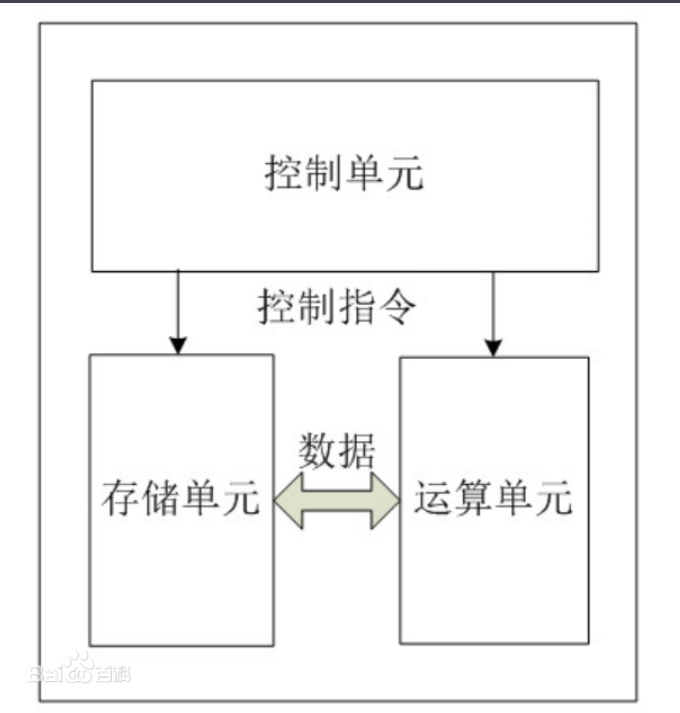
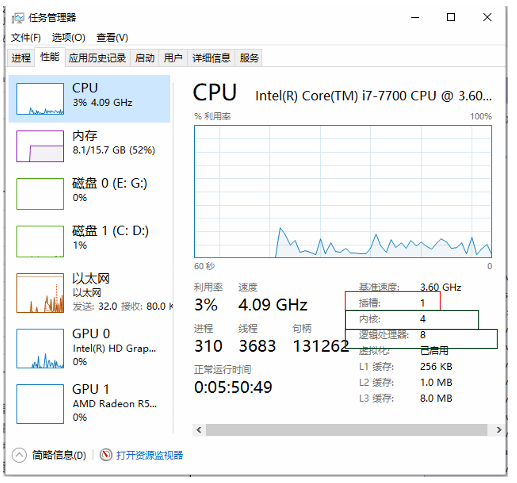

[TOC]

# 1. CPU概念

中央处理器（英文Central Processing Unit，CPU）是一台计算机的运算核心和控制核心。

# 2. CPU 结构



## 2.1. 控制单元

## 2.2. 运算单元

### 2.2.1. 插槽

- [ ] `socket` : 插槽、插口
- [x] `sockets/number of sockets` : 主板上CPU插口的数量，指的是整个主板上物理CPU的个数。


### 2.2.2. 核
- [ ] `Core` : 核 ，就是平时说的核，双核、四核等。
- [x] `Cores` ：核数，又称为运算核心数，是指每个CPU上的核数。

`Cores=sockets * Cores per socket`

$$总核数 = 物理CPU个数 \times  每颗物理CPU的核数$$
### 2.2.3. 超线程技术 

- [ ] `超线程技术（HT, Hyper-Threading）` : 也成为`CPU虚拟化技术`，是在一个实体CPU中提供多个逻辑线程的技术。
- [x] `Thread(s) per core` : 单核线程数，指的是每个CPU核的线程数。

一般来说，没有超线程技术的CPU，单核线程数=1，对于Intel 的新开发CPU ，单核线程数=2。[^超线程]

`Thread(s) per core=2`

**示例**：

4核8线程：即物理核心是4个，但是从计算机的角度来看，被虚拟为了8个核心。


### 2.2.4. 逻辑CPU数量

- [x] `CPU(s)`: 逻辑CPU数量
  
`CPU(s)=Socket(s)* Core(s) per socket * Thread(s) per core`

$$总逻辑CPU数 = 物理CPU个数 \times 每颗物理CPU的核数 \times 超线程数$$

## 2.3. 存储单元
### 2.3.1. 高速缓存Cache

Cache，即高速缓存，是介于CPU和内存之间的高速小容量存储器。在金字塔式存储体系中它位于自顶向下的第二层，仅次于CPU寄存器。其容量远小于内存，但速度却可以接近CPU的频率。
当CPU发出内存访问请求时，会先查看 Cache 内是否有请求数据: 
1. 如果存在（命中），则直接返回该数据；
2. 如果不存在（失效），再去访问内存 —— 先把内存中的相应数据载入缓存，再将其返回处理器。

提供`高速缓存`的目的是让数据访问的速度适应CPU的处理速度，通过**减少访问内存的次数来提高数据存取的速度**。

Cache 技术所依赖的原理是`程序执行与数据访问的局部性原理`，这种局部性表现在两个方面：
1. `时间局部性`：如果程序中的某条指令一旦执行，不久以后该指令可能再次执行，如果某数据被访问过，不久以后该数据可能再次被访问。
2. `空间局部性`：一旦程序访问了某个存储单元，在不久之后，其附近的存储单元也将被访问，即程序在一段时间内所访问的地址，可能集中在一定的范围之内，这是因为指令或数据通常是顺序存放的。

时间局部性是通过将近来使用的指令和数据保存到Cache中实现。空间局部性通常是使用较大的高速缓存，并将 预取机制 集成到高速缓存控制逻辑中来实现。


## 2.4. 查看CPU信息
**Linux**
```shell
lscpu 
>>>
Architecture:        x86_64
CPU op-mode(s):      32-bit, 64-bit
Byte Order:          Little Endian
CPU(s):              8
On-line CPU(s) list: 0-7
Thread(s) per core:  2
Core(s) per socket:  4
Socket(s):           1
Vendor ID:           GenuineIntel
CPU family:          6
Model:               158
Model name:          Intel(R) Core(TM) i7-7700 CPU @ 3.60GHz
Stepping:            9
CPU MHz:             3600.000
CPU max MHz:         3600.0000
BogoMIPS:            7200.00
Virtualization:      VT-x
Hypervisor vendor:   Windows Subsystem for Linux
Virtualization type: container
```
Family（系列）
系列标识可用来确定处理器属于那一代产品。如6系列的INTEL处理器包括Pentium Pro、Pentium II、Pentium II Xeon、Pentium III和Pentium III Xeon处理器。5系列（第五代）包括Pentium处理器和采用 MMX技术的Pentium处理器。AMD的6系列实际指有K7系列CPU，有DURON和ATHION两大类。最新一代的INTEL Pentium 4系列处理器（包括相同核心的Celerom处理器）的系列值为“F”

**Windows下**：
在cmd命令中输入`wmic`，然后在出现的新窗口中输入`cpu get *`
```shell
wmic
>>>
wmic:root\cli>

cpu get Name
>>>
Intel(R) Core(TM) i7-7700 CPU @ 3.60GHz
# 表示物理CPU的名称，共有1个。

cpu get NumberOfCores
>>>
NumberOfCores
4
# 表示CPU核心数

cpu get NumberOfLogicalProcessors
>>>
NumberOfLogicalProcessors
8
# 表示CPU逻辑核数。当有超线程时，比如2，逻辑核数=核心数*2
```


# 3. 指令集问题

## 3.1. 背景
- [ ] `指令集` ：存储在CPU内部，对CPU运算进行指导和优化的硬程序。

拥有这些指令集，CPU就可以更高效地运行。


Intel主要有 [x86，EM64T，MMX，SSE，SSE2，SSE3，SSSE3 (Super SSE3)，SSE4A，SSE4.1，SSE4.2，AVX，AVX2，AVX-512，VMX] **（时间排序）** 等指令集。

AMD主要是x86，x86-64，3D-Now!指令集。


| 厂家  | 指令集 | 说明                                                      |                                                                              |
| :---- | :----- | :-------------------------------------------------------- | :--------------------------------------------------------------------------- |
| Intel | SSE2   | Streaming SIMD Extensions                                 |
| Intel | AVX    | 高级矢量扩展,Intel Advanced Vector Extensions (Intel AVX) | AVX引入了融合乘法累加（FMA）运算，加速了线性代数计算，即点积，矩阵乘法，卷积 |

# 4. 虚拟化问题

**`虚拟化`** 就是由位于下层的软件模块，根据上层的软件模块的期待，抽象（虚拟）出一个虚拟的软件或硬件模块，使上一层软件直接运行在这个与自己期待完全一致的虚拟环境上。

CPU 虚拟化 主要指 intel 的 VT-x 和 AMD 的 AMD-V 为主的硬件辅助的 CPU 虚拟化技术

其中，Intel VT 包括 VT-x （支持 CPU 虚拟化）、EPT（支持内存虚拟化）和 VT-d（支持 I/O 虚拟化）


VMM 全称是 Virtual Machine Monitor，虚拟机监控系统，也叫 Hypervisor，是虚拟化层的具体实现。主要是**`以软件的方式，实现一套和物理主机环境完全一样的虚拟环境`**，物理主机有的所有资源，包括 CPU、内存、网络 IO、设备 IO等等

KVM 是一种硬件辅助的虚拟化技术，支持 Intel VT-x 和 AMD-v 技术，怎么知道 CPU 是否支持 KVM 虚拟化呢？可以通过如下命令查看：

CPU 是否支持虚拟化关系到是否能使用docker 等虚拟化工具 

# 5. CPU硬件识别

使用 **英特尔® 处理器识别实用程序** 产看 intel 系列 CPU 数据

https://www.intel.cn/content/www/cn/zh/support/products/5982/processors/processor-utilities-and-programs/intel-processor-identification-utility.html


# 6. 参考资料
[^超线程]: [知乎:为什么 Intel 的超线程技术是一个核两条线程，而不是更多？](https://www.zhihu.com/question/55984133)


