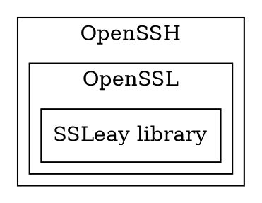

[TOC]

# 1. OpenSSH 是什么？

>[OpenSSH](https://www.openssh.com) is the premier connectivity **tool** for remote login with the SSH protocol

OpenSSH 是安全 Shell (SSH) 工具的开放源代码版本，是一个软件。
Linux 及其他非 Windows 系统的管理员使用此类工具跨平台管理远程系统。




> 官网:https://www.openssh.com/
> Github:https://github.com/PowerShell/openssh-portable/tree/v8.1.0.0

## 特色与组成

SSH 基于客户端-服务器体系结构，用户在其中工作的系统是客户端，所管理的远程系统是服务器。 OpenSSH 包含一系列组件和工具，用于提供一种安全且简单的远程系统管理方法，其中包括：
1. `sshd.exe`，它是远程所管理的系统上必须运行的 SSH 服务器组件
2. `ssh.exe`，它是在用户的本地系统上运行的 SSH 客户端组件
3. `sftp.exe`，这是提供安全文件传输协议的服务，通过 SSH 运行
4. `scp.exe` 是在 SSH 上运行的文件复制实用工具

5. `ssh-keygen.exe`，为 SSH 生成、管理和转换身份验证密钥
6. `ssh-agent.exe`，存储用于公钥身份验证的私钥
7. `ssh-add.exe`，将私钥添加到服务器允许的列表中
8. `ssh-keyscan.exe`，帮助从许多主机收集公用 SSH 主机密钥

## ssh和ssl的联系和区别


ssh：Secure Shell，安全Shell，是一个软件，处于应用层旨在取代明文通信的telnet；对应的开源实现程序是openssh。 

ssl：Secure Sockets Layer，安全套接字层，是一个协议，处于传输层之上应用层之下用于协商密钥；对应的开源实现库是openssl。

简写	全称	译名	身份	所处层	目的	加密算法	开源实现
ssh	Secure Shell	安全shell	应用	应用层	取代telnet	RSA	openssh
ssl	Secure Sockets Layer	安全套接字层	协议	传输层之上应用层之下	协商密钥	协商得到对称密钥	openssl

# 2. 安装
## 2.1. Linux
## 2.2. Windwows
参考 [微软：安装适用于 Windows Server 2019 和 Windows 10 的 OpenSSH](https://docs.microsoft.com/zh-cn/windows-server/administration/openssh/openssh_install_firstuse)


# 3. OpenSSH实践 

## 3.1. sshd 

## 3.2. ssh 

```shell
ssh username@servername 22 
```


### 3.2.1. ssh 掉线的问题 

```shell
vim /etc/ssh/sshd_config

>>>
# 找到ClientAliveInterval和ClientAliveCountMax ，去掉注释并修改
ClientAliveInterval 30
ClientAliveCountMax 86400

service sshd restart
```


# 4. 案例
## 4.1. 远程服务器的免密登入

将`客户端`生成的公钥写入`指定远程服务器`的**指定用户**授权清单里面

```shell
# 方案1
ssh-copy-id -i id_rsa root@172.28.44.120

# 方案2
scp id_rsa.pub root@xxx.xxx.xxx.xxx:/root
mkdir ~/.ssh                # 如果不存在该文件夹需先创建，若已存在则忽略
cat ~/id_rsa.pub >> ~/.ssh/authorized_keys
rm ~/id_rsa.pub                 # 用完就可以删掉了
```

## 4.2. gitlab 


# 5. 参考资料 

https://docs.microsoft.com/zh-cn/windows-server/administration/openssh/openssh_install_firstuse