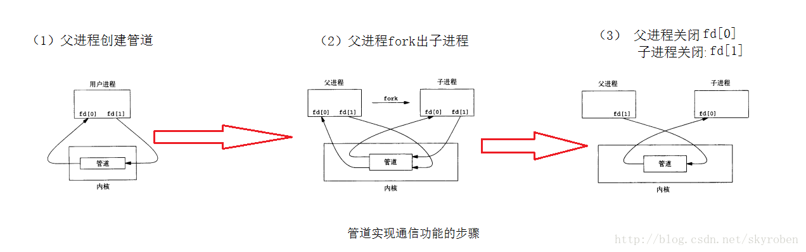
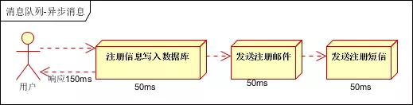
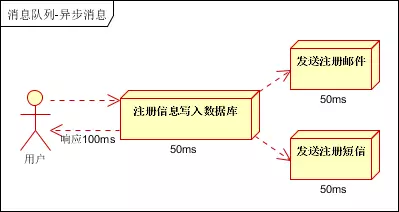
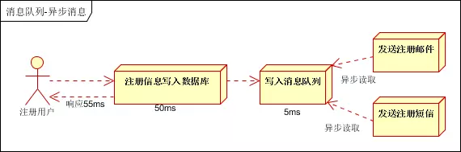

[TOC]
# 1. 通讯协议Protocols

## 1.1. 对于同一服务器上

Unix 提供了信号、管道、命名管道、消息列队、共享内存等通讯机制

### 1.1.1. 管道（Pipe）
管道（Pipe）：管道基于fork机制可用于具有亲缘关系（父进程和子进程）进程间的通信，




### 1.1.2. 命名管道 （named pipe）
用于没有亲缘关系的进程之间建立连接

由于基于fork机制，所以管道只能用于父进程和子进程之间，或者拥有相同祖先的两个子进程之间 (有亲缘关系的进程之间)。为了解决这一问题，Linux提供了FIFO方式连接进程。FIFO又叫做命名管道(named PIPE)。

FIFO (First in, First out)为一种特殊的文件类型，它在文件系统中有对应的路径。当一个进程以读(r)的方式打开该文件，而另一个进程以写(w)的方式打开该文件，那么内核就会在这两个进程之间建立管道，

所以**FIFO实际上也由内核管理，不与硬盘打交道**。之所以叫FIFO，是因为管道本质上是一个先进先出的队列数据结构，最早放入的数据被最先读出来，从而保证信息交流的顺序。

FIFO只是借用了文件系统(file system,命名管道是一种特殊类型的文件，因为**Linux中所有事物都是文件**，它在文件系统中以文件名的形式存在。)

来为管道命名。写模式的进程向FIFO文件中写入，而读模式的进程从FIFO文件中读出。当删除FIFO文件时，管道连接也随之消失。FIFO的好处在于我们可以通过文件的路径来识别管道，从而让没有亲缘关系的进程之间建立连接

### 1.1.3. 信号（Signal）

信号（Signal）：信号是比较复杂的通信方式，用于通知接受进程有某种事件发生，除了用于进程间通信外，进程还可以发送信号给进程本身；linux除了支持Unix早期信号语义函数sigal外，还支持语义符合Posix.1标准的信号函数sigaction（实际上，该函数是基于BSD的，BSD为了实现可靠信号机制，又能够统一对外接口，用sigaction函数重新实现了signal函数）；
### 1.1.4. 消息队列(Message queue)

消息队列（Message queue）是一种进程间通信或同一进程的不同线程间的通信方式。有足够权限的进程可以向队列中添加消息，被赋予读权限的进程则可以读走队列中的消息。

#### 1.1.4.1. 优势
1. 和信号相比，消息队列克服了信号承载信息量少，
2. 与管道相比，息队列提供了有格式的数据，管道只能承载无格式字节流以及缓冲区大小受限等缺点，这可以减少开发人员的工作量。
#### 1.1.4.2. 劣势
消息队列仍然有大小限制。


#### 1.1.4.3. 适用场景

消息队列本身是异步的，它允许接收者在消息发送很长时间后再取回消息，这和大多数通信协议是不同的。

例如WWW中使用的HTTP协议（HTTP/2之前）是同步的，因为客户端在发出请求后必须等待服务器回应。然而，很多情况下我们需要异步的通信协议。

比如，一个进程通知另一个进程发生了一个事件，但不需要等待回应。但消息队列的异步特点，也造成了一个缺点，就是接收者必须轮询消息队列，才能收到最近的消息。


消息队列除了可以当不同线程或进程间的缓冲外，更可以透过消息队列当前消息数量来侦测接收线程或进程性能是否有问题。


#### 1.1.4.4. 场景实例

场景说明：用户注册后，需要发送注册邮件和发送注册信息，传统的做法有两种：串行方式、并行方式

##### 1.1.4.4.1. 串行方式
将注册信息写入数据库成功后，发送注册邮件，然后发送注册短信，而所有任务执行完成后，返回信息给客户端



##### 1.1.4.4.2. 并行方式
将注册信息写入数据库成功后，同时进行发送注册邮件和发送注册短信的操作。而所有任务执行完成后，返回信息给客户端。同串行方式相比，并行方式可以提高执行效率，减少执行时间。



上面的比较可以发现，假设三个操作均需要50ms的执行时间，排除网络因素，则最终执行完成，串行方式需要150ms，而并行方式需要100ms。

因为cpu在单位时间内处理的请求数量是一致的，假设：CPU每1秒吞吐量是1000次，则串行方式1秒内可执行的请求量为1000/150，不到7次；并行方式1秒内可执行的请求量为1000/100，为10次。

##### 1.1.4.4.3. 异步处理
由上可以看出，传统串行和并行的方式会受到系统性能的局限，那么如何解决这个问题？
我们需要引入消息队列，将不是必须的业务逻辑，异步进行处理，由此改造出来的流程为


引入消息队列，异步处理消息

根据上述的流程，用户的响应时间基本相当于将用户数据写入数据库的时间，发送注册邮件、发送注册短信的消息在写入消息队列后，即可返回执行结果，写入消息队列的时间很快，几乎可以忽略，也有此可以将系统吞吐量提升至20QPS，比串行方式提升近3倍，比并行方式提升2倍

### 1.1.5. 共享内存
共享内存：使得多个进程可以访问同一块内存空间，是最快的可用IPC形式。是针对其他通信机制运行效率较低而设计的。往往与其它通信机制，如信号量结合使用，来达到进程间的同步及互斥。
### 1.1.6. 信号量（semaphore）
信号量（semaphore）：主要作为进程间以及同一进程不同线程之间的同步手段。
### 1.1.7. 套接口
套接口（Socket）：起初是由Unix系统的BSD分支开发出来的，但现在一般可以移植到其它类Unix系统上：Linux和System V的变种都支持套接字。

前面说到的进程间的通信，所通信的进程都是在同一台计算机上的，而使用socket进行通信的进程可以是同一台计算机的进程，也是可以是通过网络连接起来的不同计算机上的进程，通常我们使用socket进行网络编程。

下面用多个客户程序和一个服务器程序来展示进程间如何利用套接字进行通信。

Socket_S 是一个服务器程序，它首先创建套接字，然后绑定一个端口监听套接字，忽略子进程的停止消息等，然后它进入循环，一直循环检查是否有客户连接到服务器，如果有，则调用fork创建一个子进程来处理请求。利用read系统调用来读取客户端发来的信息，利用write系统调用来向客户端发送信息。这个服务器的工作非常简单，就是把客户发过来的字符+1，再发送回给客户。

Socket_C 是一个客户程序，它同样要先创建套接，然后连接到指定服务器的端口，如果连接成功，就用 write 来发送信息给服务器，再用read获取服务器处理后的信息，再输出。

运行结果如下：
```shell 
$ ./Socket_S.o&
[1] 13903
Server waiting
$ ./Socket_C.o& ./Socket_C.o& ./Socket_C.o
[2] 13984
[3] 13985
Server waiting
Server waiting
Server waiting
char form server = B
[2]  - 13984 done       ./Socket_C.o
char form server = B
char form server = B
[3]  + 13985 done       ./Socket_C.o
关于 Socket 的更多内容，参考 Socket.md
消息列队
消息的链表

共享内存
多个进程共享一个指定的存储区
```

## 1.2. 对于不同节点上
提供了网络套接字等

	1. socket通信
	2. PVM/MPI通信
	3. 中间件模式的通信
		a. rpc
基于web服务的通信


消息传递接口（Message Passing Interface, MPI）

TCP/IP是个协议组，可分为四个层次：网络接口层、网络层、传输层和应用层。

     在网络层有IP协议、ICMP协议、ARP协议、RARP协议和BOOTP协议。

     在传输层中有TCP协议与UDP协议。

     在应用层有FTP、HTTP、TELNET、SMTP、DNS等协议。

     因此，HTTP本身就是一个协议，是从Web服务器传输超文本到本地浏览器的传送协议


Kafka：接收用户日志的消息队列。

Logstash：做日志解析，统一成JSON输出给Elasticsearch。

Elasticsearch：实时日志分析服务的核心技术，一个schemaless，实时的数据存储服务，通过index组织数据，兼具强大的搜索和统计功能。

Kibana：基于Elasticsearch的数据可视化组件，超强的数据可视化能力是众多公司选择ELK stack的重要原因。


##
