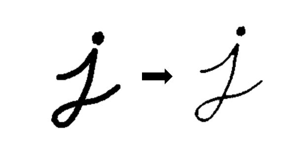
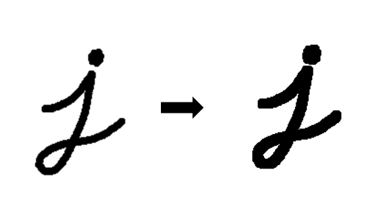

[TOC]
# 1. 数字图像与颜色空间

数字图像指的是现在的图像都是以二维数字表示，每个像素的灰度值均由一个数字表示，范围为`0-255` (2^8)


- `二值图像`(Binary Image): 图像中每个像素的灰度值仅可取0或1，即不是取黑，就是取白，二值图像可理解为黑白图像

- `灰度图像(`Gray Scale Image): 图像中每个像素可以由0-255的灰度值表示，具体表现为从全黑到全白中间有255个介于中间的灰色值可以取

- `彩色图像`(Color Image): 每幅图像是由三幅灰度图像组合而成，依次表示红绿蓝三通道的灰度值，即我们熟知的RGB，此时彩色图像要视为三维的[height，width, 3]

下面用一张图来感受一下灰度图与彩色图像之间的联系与差别


## 1.1. RGB 颜色空间基本概念

`RGB颜色空间`基于颜色的**加法混色**原理，从黑色不断叠加红、绿、蓝的颜色，最终可以得到白色光。

RGB颜色空间的图像具有三种颜色通道: 红色，绿色和蓝色（RGB），可在像素中产生颜色。


### 1.1.1. RBG通道直方图

直方图，是一种对数据分布情况的图形表示，也就是一种二维的统计图表（**统计学的概念**）。

在图像领域里，我们选取的坐标一般是统计样本（图像、视频帧）和样本的某种属性（亮度、像素值、梯度、方向、色彩等等任何特征）。

图像的直方图是用来表现图像中亮度分布的直方图，给出的是图像中某个亮度或者某个范围亮度下共有几个像素。


可以看到，红色通道直方图的凸起主要集中在右边，这说明在很多像素中的  R值都是非常大的，也就意味着红色的发光强度大；而红色通道直方图最左端没有凸起，这意味着没有任何一个像素中的 R 值为0，也就意味着在所有像素中红色都发光了。而绿色通道直方图和蓝色通道直方图的凸起都集中在左边，这也就意味着所有的 G 值和 B 都是较小的，因此绿色和蓝色的发光强度弱，所以最后画面呈现出较强的红色。


### 1.1.2. 直方图的均衡化

直方图均衡化是通过拉伸像素强度的分布范围，使得在0~255灰阶上的分布更加均衡，提高了图像的对比度，达到改善图像主观视觉效果的目的。对比度较低的图像适合使用直方图均衡化方法来增强图像细节。

## 1.2. CMY颜色模型

CMY（CMYK）颜色空间是另一种基于颜色**减法混色**原理的颜色模型。在工业印刷中它描述的是需要在白色介质上使用何种油墨，通过光的反射显示出颜色的模型。CMYK描述的是青，品红，黄和黑四种油墨的数值。


## 1.3. HSV颜色模型
HSV（Hue Saturation Value）颜色模型是面向用户的。
这个模型中颜色的参数分别是: 色调（H），饱和度（S），明度（V）。


# 2. 图像解压

OpenCV使用JPEG图像的整数精确解压缩而引起的。相反，TensorFlow使用离散余弦变换作为默认值。这种类型的解码不准确，因此要使其与OpenCV相同，我们需要使用整数精确解压缩对其进行解码。可以通过设置参数dct_method ='INTEGER_ACCURATE'来完成，如下所示

```python
image_tf = tf.io.read_file（image_path）
image_tf = tf.image.decode_jpeg（image_tf，channel = 3，dct_method ='INTEGER_ACCURATE'）
与tf.Session（）sess: 
    image_tf = image_tf.eval（）
plt_display（image_tf，'TF_INT_ACC'）
```

# 3. 数据增强


图像增广（image augmentation）是数据增强在图像上说明，图像增广技术通过对训练图像做一系列随机改变，来产生相似但又不同的训练样本，从而扩大训练数据集的规模。

图像增广的另一种解释是，随机改变训练样本可以降低模型对某些属性的依赖，从而提高模型的泛化能力。


# 4. 滤波操作

`滤波`一词借用于频域处理。本意是指信号有各种频率的成分，`滤掉不想要的波段`，即为滤掉常说的噪声，留下想要的成分，这既是滤波的过程，也是滤波的目的。

滤波操作可以分为
1. `频率域滤波`
2. `空间滤波`

## 4.1. 类型
### 4.1.1. 频率域滤波

频率域滤波就是频域处理领域处理不想要的波段，此时一般是对图像像素进行的是线性操作时，也称为`线性滤波器`，线性空间滤波器和频率域滤波器存在一一对应关系。

### 4.1.2. 空间滤波
空间滤波可以提供相当多的功能，还可以用于非线性滤波，


对于空间滤波器就是对图片中的一个邻域比如矩形区域执行预定义的操作，对于线性滤波器而言，就是通过使用一个核函数和图片中的区域做空间相关操作，一般来说，核函数是大小为奇数的正方形


滤波器的作用效果可以分为两类：
1. 图像平滑（图像钝化）
2. 图像模糊（图像锐化）


空间滤波机理
我们知道，空间滤波器由：

一个邻域（典型的较小的矩形）
对该邻域包围的图像像素执行的预定义操作组成。
即，数据+算法。滤波产生的新像素的坐标值等于邻域中心的坐标（这也是OpenCV中一些算子的size是奇数的原因），像素的值是滤波操作的结果。由操作是否是线性运算可以分为：

线性空间滤波器
非线性空间滤波器
我们以线性空间滤波器为例，一般来说使用大小为 [公式] 的滤波器对大小为 [公式] 的图像进行线性空间滤波，可以由以下公式和图形表达：


## 4.2. 应用


图像平滑与图像模糊是同一概念，主要用于图像的去噪。平滑要使用滤波器，为不改变图像的相位信息，一般使用线性滤波器。

### 4.2.1. 图像锐化（模糊）

`图像锐化`（image sharpening）是补偿图像的轮廓，增强图像的边缘及灰度跳变的部分，使图像变得清晰的方法，这种方法提高了地物边缘与周围像元之间的反差，因此也被称为`边缘增强`。
分为空间域处理和频域处理两类。

#### 4.2.1.1. 锐化滤波器


锐化滤波器是为了突出显示图像的边界和其他的细节，这些锐化是基于一阶导数和二阶导数的。
一阶导数可以产生粗的图像边缘，并广泛的应用于边缘提取，二阶导数对于精细的细节相应更好，常被用于图像增强

### 4.2.2. 图像钝化（平滑）

`图像钝化`（image blur）抑制图像中的跳变部分，使图像变得更平滑，也叫做`图像平滑`。


# 5. 滤波处理

数字图像本质上是数字信号，图像的滤波就是对信号的不同频率进行筛选。体现在图像上，模糊操作实际是抑制高频，锐化操作实际是抑制低频。


1频域滤波与空间域滤波比较
(1)空间域滤波简介

        空间域滤波是在图像空间中借助模板对图像进行邻域操作,处理图像的每一个像素的取值都是根据模板对输入像素邻域内的像素值进行加权叠加得到的，空间域滤波是应用模板卷积对图像每一个像素进行局部处理。

 

(2)频域滤波器简介

        频域滤波是图像经傅里叶变换后,边缘和其他尖锐信息在图像中主要出于高频部分,因此,可以通过衰减图像傅里叶变换中的高频成分的范围来实现。

 

(3)频域滤波与空间域滤波的比较

       1)在空间域滤波中,平滑滤波器算法简单,处理速度快,但在降噪同时使图像产生模糊,特别是在边缘和细节处。中值滤波器对椒盐噪声抑制效果比较好,但对点、线等细节较多的图像却不太合适。低通滤波器对椒盐噪声过滤效果差,图像较为模糊。空间域滤波算法简单,处理速度较快,在锐化方面效果明显,线条突出。

        2)在频域滤波中,去噪同时将会导致边缘信息损失,使图像边缘模糊,并且产生振铃效果。频域滤波算法复杂,计算速度慢,有微量振铃效果,图像平缓。

# 6. 形态学图像处理

形态学图像处理（简称形态学）是指一系列处理图像形状特征的图像处理技术，是基于形状的一系列图像处理操作。

形态学的基本思想是利用一种特殊的结构元来测量或提取输入图像中相应的形状或特征，以便进一步进行图像分析和目标识别。

形态学方法的基础是`集合论`。

形态学方法由J. Serra 于1964年提出，被广泛应用于：
1. 消除噪声
2. 分割(isolate)独立的图像元素，以及连接(join)相邻的元素。
3. 寻找图像中的明显的极大值区域或极小值区域。


形态学最基本的操作是`腐蚀`和`膨胀`。

形态学操作的使用需要先定义: 
1. 一个结构元(Structuring Elements，SE)
2. 指定结构元的原点


不做特殊说明，输入图像为二值图像。图像中1是前景，0是背景。

## 6.1. 结构元

`结构元`（Structuring Elements，SE）可以是`任意形状`、`任意大小`，SE中的的值可以是0或1。常见的结构元有:
1. 矩形
2. 十字形
3. 椭圆形

`结构元的原点`(锚点)O可以是任意位置，一般定义为结构元的中心。

如下图所示，红色区域是几个不同形状的结构元，紫红色区域为锚点O。


## 6.2. 膨胀

膨胀（Dilation），就是将结构元$s$ 在图像 $f$ 上滑动，把结构元锚点位置的图像像素点的灰度值设置为结构元值为1的区域对应图像区域像素的最大值。用公式表示如下:
$$dst(x,y)=\max(src(x+x^{'},y+y^{'}))$$

其中element为结构元，(x,y)为锚点O的位置，x'和y'为结构元值为1的像素相对锚点O的位置偏移，src表示原图，dst表示结果图。



## 6.3. 腐蚀
进行腐蚀操作时，将内核 B 划过图像,将内核 B 覆盖区域的最小相素值提取，并代替锚点位置的相素。
以与膨胀相同的图像作为样本,我们使用腐蚀操作。从下面的结果图我们看到亮区(背景)变细，而黑色区域(字母)则变大了。

$$dst(x,y)=\min(src(x+x^{'},y+y^{'})) $$




## 6.4. 组合操作

相比腐蚀和膨胀，基于他们的组合操作在图像处理中的应用更为广泛，常见的组合方式有: 
1. 开运算
2. 闭运算。

开操作对图片先腐蚀再膨胀，可以将图片中细小的连接结构断开；
闭操作对图片先膨胀再腐蚀，可以将断裂的物体重新连成一个整体。 

通过基本形态学操作的组合和多种集合关系的应用，可以实现: **边界提取**、**孔洞填充**、**连通分量提取**、计算区域的凸壳、细化、粗化、提取骨架和裁剪等复杂功能。[^1]

### 6.4.1. 开运算
开运算（Opening）: 先腐蚀再膨胀
```python
# 开运算
kernel = np.ones((23, 23), np.uint8)
opened = cv2.morphologyEx(blurred, cv2.MORPH_OPEN, kernel)  
# cv2.imshow('opened',opened)
opened = cv2.addWeighted(blurred, 1, opened, -1, 0)
```

关于图像融合的线性方法即使用addweighted函数进行图像融合，其核心是ROI感兴趣区域的定义，ROI区域在opencv中就是矩形区域(RECT)

```python 
# 得到一个5x5的矩形结构元
kernel = cv2.getStructuringElement(cv2.MORPH_RECT,(5,5))
iterations = 10  # 执行开闭运算的次数 
open_res = cv2.morphologyEx(img, cv2.MORPH_OPEN, kernel, iterations)
```


### 6.4.2. 闭运算

闭运算（Closing）:  先膨胀再腐蚀

```python
kernel = cv2.getStructuringElement(cv2.MORPH_RECT,(5,5))
iterations = 10  # 执行闭操作的次数 
close_res = cv2.morphologyEx(img, cv2.MORPH_CLOSE, kernel, iterations)
```


### 6.4.3. 白色顶帽变换
白色顶帽变换（white top-hat）是原图像与开运算结果图之差，用公式表示为: 

$$T_w(f)=f-fs$$
$$T_w(f)=原始图片-开运算图$$
白色顶帽变换变换可以得到图像中那些面积小于结构元且比周围亮的区域，示意图如下: 


### 6.4.4. 黑色顶帽变换
黑色顶帽变换（blacktop-hat）是闭运算结果图与原图之差，用公式表示为: 

$$T_w(f)=fs-f$$

$$T_w(f)=闭运算图-原始图片$$
黑色顶帽变换可以得到图像中那些面积小于结构元且比周围暗的区域。


# 7. 边缘检测

## 7.1. 边缘是什么？
边缘就是灰度值变化较大的的像素点的集合。一道黑边一道白边中间就是边缘，它的灰度值变化是最大的，在图像中，用梯度来表示灰度值的变化程度和方向。

由于图像中不可避免的存在噪声和模糊，边缘检测往往与滤波操作结合使用。边缘检测可以通过计算图片中像素点的一阶导数或者二阶导数实现。

**边缘检测本质上就是一种滤波算法**，区别在于滤波器的选择，滤波的规则是完全一致的。

## 7.2. 基本步骤
边缘检测的一般步骤: 
1. 滤波——消除噪声
2. 增强——使边界轮廓更加明显
3. 检测——选出边缘点


图像的滤波**一般是基于灰度图**进行的。


边缘检测是基于灰度突变实现图像分割最常用的方法，根据灰度剖面分类，边缘模型有:
1. 台阶模型
2. 斜坡模型
3. 屋顶边缘模型


## 7.3. 高级算法

### 7.3.1. Canny

Canny边缘检测是一种流行的边缘检测算法。它是由约翰坎尼在1986年开发的。这是一个多阶段的算法。其目标是找到一个最优的边缘，其最优边缘的定义是: 
1. 好的检测 --算法能够尽可能多地标示出图像中的实际边缘
2. 好的定位 --标识出的边缘要与实际图像中的实际边缘尽可能接近
3. 最小响应 --图像中的边缘只能标识一次，并且可能存在的图像噪声不应该标识为边缘

步骤: 
1. Noise Reduction
2. Finding Intensity Gradient of the Image
3. Non-Maximun Suppression
4. Double Threhold
5. Edge tracking by hysteresis


#### 7.3.1.1. 降噪
图片中的高频信息指颜色快速变化，低频信息指颜色平缓的变化。边缘检测过程中需要检测的图片边缘属于高频信息。而图片中噪声部分也属于高频信息，因此我们需要对图像进行去噪处理。

常用的是使用5*5的**高斯滤波核**来平滑图像，滤波核的数量呈高斯分布。


#### 7.3.1.2. 找出梯度较大的区域
计算像素梯度的幅值以及方向，常用的算子有Rober，sobel，计算水平及垂直方向的差分。找出梯度较大的区域，这部分区域属于图像增强的区域，此时得到的边缘信息比较粗大。

#### 7.3.1.3. 非极大值抑制
非极大值抑制属于一种边缘细化的方法，梯度大的位置有可能为边缘，在这些位置沿着梯度方向，找到像素点的局部最大值，并将非最大值抑制。

#### 7.3.1.4. 双阀值
由于存在很多伪边缘，因此Canny算法中所采用的算法为双阈值法，具体思路为选取两个阈值，将小于低阈值的点认为是假边缘置0，将大于高阈值的点认为是强边缘置1，介于中间的像素点需进行进一步的检查。

双阀值方法，设置一个maxval，以及一个minval，梯度大于maxval则为强边缘，梯度值介于maxval与minval则为弱边缘点，小于minval为抑制点。

#### 7.3.1.5. 滞后边缘追踪

滞后边缘追踪，主要处理梯度值位于maxval，minval中的一些像素点。由于边缘是连续的，因此可以认为弱边缘如果为真实边缘则和强边缘是联通的，可由此判断其是否为真实边缘。


# 8. 目标检测

## 8.1. MSER

对图像进行二值化，二值化阈值取[0, 255]，这样二值化图像就经历一个从全黑到全白的过程。在这个过程中，有些连通区域面积随阈值上升的变化很小，这种区域就叫最大极值稳定区域(the Maximally Stable Extremal Regions,MSER)


这本节翻译自文献 Robust Wide Baseline Stereo from Maximally Stable Extremal Regions。

其中描述了一个新的图像元素类型－最大极值稳定区域 。相关概念可以通俗的介绍如下。想象使用所有阈值对灰度图像  进行二值化。假定低于阈值的为黑色，高于阈值的为白色。我们想象将这所有的二值图像组成一个电影 
，其中  是阈值为  的二值图像。这样我们首先将会看到一个纯白的图像，随后，与局部强度极小值对应的黑点将出现并增长。在某个点上，与两个局部极小值对应的区域将合并。最终整幅图像将变成纯黑。电影所有帧的所有连通分量的集合是所有极大区域的集合；通过反转  的强度并运行相同的过程，可以得到极小的区域。如下给出了MSER概念的形式化定义和必要的辅助定义。


MSER算法


MSER 是一种基于连通性分析的区域提取方法，该方法于 2002 年被提出，用 于匹配同一场景下不同视角获得的图片[26]。由于 MSER 对于单调的灰度变换具 有不变性，可以跟随连续的空间坐标变化，具有仿射不变性，可以实现多种尺度的 区域提取，并且对于单通道图片的计算速度和像素数目近似呈现线性关系等优点， 近些年来已经成为一种很常用的区域检测方法[27]。在字符提取中，当字符区域的 像素灰度值具有较好的一致性并且和背景呈现鲜明的强度对比时，使用 MSER 可 以快速提取字符候选人，但 MSER 对于模糊的图片和对比度低的图片处理效果较 差。近些年来，多种基于 MSER 的改进方法被提出用于提高字符的检测率[28]，而 基于 MSER 的实时文字处理方法也在视频中得到应用[29]。 MSER 是极值区域（Extremal Region，ER）中对阈值操作不敏感的对象。设集 合 D 为对图片 I 进行一系列阈值操作后的有序排列的黑白图片集合，对于 8 比特 图片 I 对应的集合 D 使用的阈值操作序列 S 为S = {0,1,2,…,255}，并设定集合 D
(4-6) 


中的连通关系为 A，通常使用四连通。设 Q 为集合 D 中满足关系 A 的区域，∂Q为 区域 Q 的外部边界，当∀p ∈ Q,q ∈ ∂Q，都满足 p 的灰度值大于 q 的灰度值时，区 域 Q 为 ER+；当∀p ∈ Q,q ∈ ∂Q，都满足 p 的灰度值小于 q 的灰度值时，区域 Q 为 ER-。ER+和 ER-在图片中分别对应比背景亮的连通区域和比背景暗的连通区域。 设𝑄1,…,𝑄𝑖−1,𝑄𝑖,…为一系列嵌套的极值区域，并且𝑄𝑖 ∈ 𝑄𝑖+1，极值区域𝑄𝑖的稳 定性Φ(𝑄𝑖)如公式（4-7）所示:  
 (4-7) 
 
式中  |.|——区域的像素点个数； Δ——属于序列 S 的参数。  当Φ(𝑄𝑖)为序列Φ(𝑄1),…,Φ(𝑄𝑖−1),Φ(𝑄𝑖),…中的局部最小值时，𝑄𝑖即为最大稳 定极值区域。根据 ER 的不同，MSER 分为 MSER+和 MSER-两种，在实际中 MSER 的提取一般是先进行阈值递增寻找 MSER-，再对图片取反，重复上一操作实现 MSER+的提取。由于本文研究的“蓝牌”字符区域比背景区域明亮，在字符提取 中，只检测图片中的 MSER+。在基于连通性分析的车牌区域提取中，由于使用的 是蓝色通道的强度值，所以只检测图片中的 MSER+。图 4-2 展示了对同一图片分 别检测 MSER+和 MSER-的结果，其中黄色边框为检测区域的最小外接旋转矩形。
 
   本文使用的字符检测主要参考了论文[28]，这篇文章指出虽然 MSER 适合用于 字符的提取，但由于 MSER 不是针对字符检测提出的理论方法，只是利用了字符 区域连通的性质，所以提取结果会包含很多非字符区域；而且由于 MSER 为一系 列嵌套区域中稳定性最大的极值区域，当字符和背景区域同时出现在一条路径中 时，如果字符的稳定性低于背景，就会导致字符被剔除在外，无法被检测出来。文 章通过加入连通区域树结构、子路径分裂、路径修剪和基于面积的稳定值校正得到 改进的 MSER 区域，相比直接使用 MSER，该方法提高了字符提取率，降低了非 字符区域的提取率，但子路径分裂导致提取结果存在严重的嵌套现象。 连通区域树[29]554 就是集合 D 中所有极值区域组成的树状关系图，树结构的 每一层对应一个阈值操作的结果，从树的根部向上阈值递增，具有嵌套关系的极值
a) 待处理图片 
 
c) MSER-提取结果 
 
b) MSER+提取结果 
 图 4-2 基于 MSER 的区域提取效果 
 

S(𝑄𝑖,𝑄𝑖
+1) =
𝐴(𝑄𝑖) ∩ 𝐴(𝑄𝑖+1) 𝐴(𝑄𝑖) ∪ 𝐴(𝑄𝑖+1)
 
区域组成一条贯穿每一层的路径，MSER 就是这条路径中稳定性最高的区域。 子路径分裂是指当同一路径中的相邻连个极值区域𝑄𝑖、𝑄𝑖+1的最小外接矩形 的相似度低于设定的阈值ϵ时，则分裂出一条新的路径，该路径的起点是区域𝑄𝑖+1， 阈值ϵ的值越低，路径分裂越频繁。相似度S的计算公式如（4-8）所示:  
(4-8) 
式中  A(.)——最小外接矩形区域。 路径修剪是指当一条路径的长度低于设定值τ时，则在 ER 树中删除该条路径。 由于字符往往包含角点、边缘这样的灰度值变化强烈的区域，所在的路径一般较长， 通过路径修剪可以滤除较为平滑的对象。 基于面积的稳定值校正的实现如公式（4-9）所示:  
 Φ ̅(𝑄𝑖)={ Φ(𝑄𝑖) + 𝜃1(|Φ(𝑄𝑖)| − 𝑎𝑚𝑎𝑥) Φ(𝑄𝑖) + 𝜃1(𝑎𝑚𝑖𝑛 − |Φ(𝑄𝑖)|) Φ(𝑄𝑖)
|Φ(𝑄𝑖)| > 𝑎𝑚𝑎𝑥 |Φ(𝑄𝑖)| < 𝑎𝑚𝑖𝑛 𝑎𝑚𝑖𝑛 ≤ |Φ(𝑄𝑖)| ≤ 𝑎𝑚𝑎𝑥
     (4-9)


式中，Φ(𝑄𝑖)的定义如式（4-7）所示，𝑎𝑚𝑎𝑥、𝑎𝑚𝑖𝑛为需要设置的参数，表示区 域的最大像素点数和最小像素点数，当区域过大或者过小时，会使得不稳定值 Φ ̅(𝑄𝑖)增大，降低选择这类区域的可能性，但依然可以作为结果输出。改进的 MSER 最终得到的区域为路径中Φ 

# 9. 阈值


**阈值操作在图像分割领域处于核心地位**。阈值操作可以将物体像素和背景像素有效地分割开，具有直观、实现简单和计算快速的优点。


当阈值操作的阈值对于整个图像而言是一个常数时，称为全局阈值，当阈值随着处理像素位置或者像素的领域情况改变时，称为局部阈值。

## 9.1. 全局阈值
全局阈值中除了单阈值操作还有多阈值操作，本文使用了Otsu 方法的最佳全局阈值处理和基于均值的自适应阈值处理方法。
### 9.1.1. 单阈值操作
参数决定。类型如下

```python
cv2.THRESH_BINARY
cv2.THRESH_BINARY_INV
cv2.THRESH_TRUNC
cv2.THRESH_TOZERO
cv2.THRESH_TOZERO_INV

# 阈值取邻近区域的平均值
cv2.ADAPTIVE_THRESH_MEAN_C 

# 阈值取带权邻近区域值的和，并且权值是高斯窗口
cv2.ADAPTIVE_THRESH_GAUSSIAN_C 
```
### 9.1.2. 多阈值操作
## 9.2. 局部阈值


# 10. 参考资料

[^1]:[知乎: 图像处理中常见的形态学方法](https://zhuanlan.zhihu.com/p/110787009)
