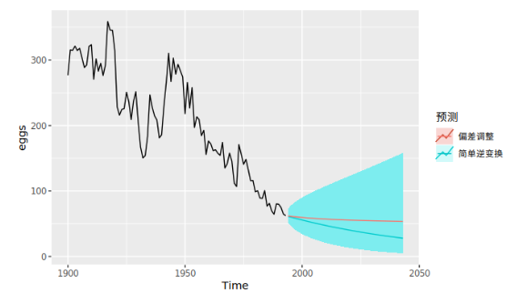
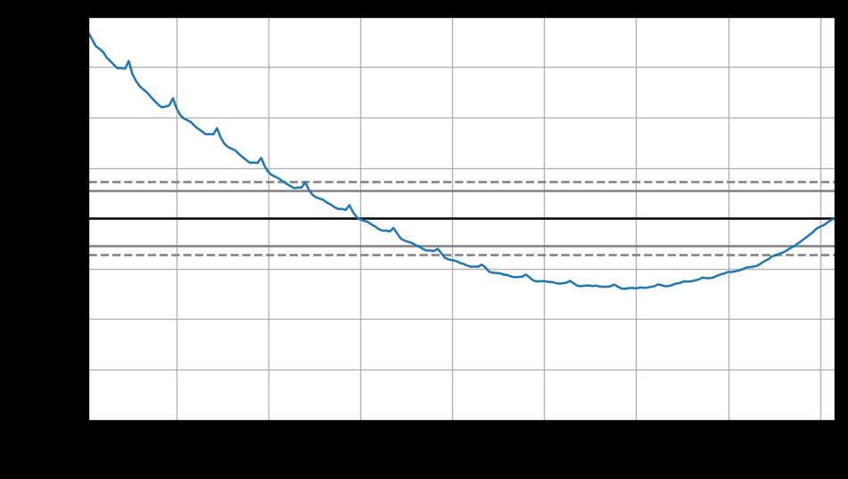
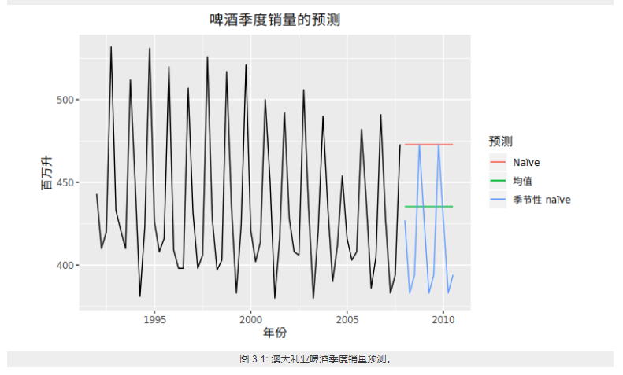
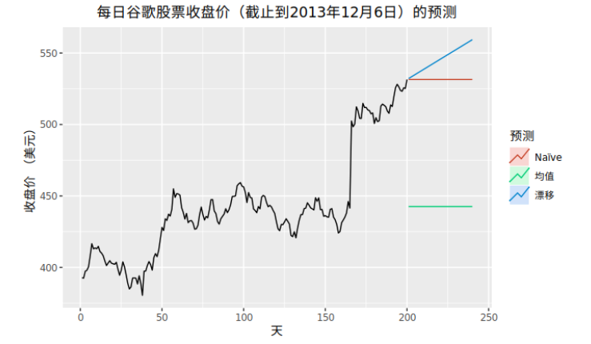

[TOC]

# 1. 前言

一说起时间序列大家并不会陌生。每时刻的甲醛浓度变化、每日股票闭盘价格、共享单车每日租车数等等都可以看做一系列时间点上的观测，在一系列时间点上观测获取的数据也就是我们俗称的时间序列数据。


# 2. 随机变量的数学统计特征

## 2.1. 单变量的数学特征

### 2.1.1. 期望--中心度

对于连续型随机变量$X$，有概率密度函数$f(x)$,则定义
$$E(X)= \int_{ - \infty }^{ + \infty } {f(x)dx} $$
为$X$的数学期望。

对于离散型的随机变量$X$，$X$的数学期望就是随机变量$X$的取值与发生概率相乘得到的加和。

$$E(X)= \sum {f(x_i)} $$

### 2.1.2. 方差--分散度

设$X$是一个随机变量，若 $E{[X-E(X)]^2}$存在，则称$E{[X-E(X)]}$为$X$的**方差**，记为$D(X)$或$Var(X)$，即
$$D(X) = Var(x) = E{[X-E(X)]^2}$$


$\sqrt{D(X)}$称为$X$的标准差；

若$X$是离散型随机变量,则

$$D(X)= \sum_{k=1}^{\infty}[x_{k}-E(X)]^{2}p_{k}$$

若$X$是连续型随机变量，则

$$D(X)= \int_{-\infty}^{\infty}[x-E(X)]^{2}f(x)dx$$

补充：
> 方差的推导关系：
> $\color{blue}{D(X) }$
> $= E{[X-E(X) ]^2 }$
> $= E{X^2-2XE(X)+[E(X) ]^2 }$
$=E(X^2 )-2E(X)E(X)+[E(X) ]^2$
$\color{blue}{=E(X^2 )-[E(X)]^2}$


## 2.2. 多变量的数学特征
### 2.2.1. 协方差--关联方向协同性

称$E{(X-E(X))(y-E(Y))}$为随机变量$X$与$Y$的协方差，记为$Cov(X,Y)$

$${Cov(X,Y)}
=E{(X-E(X) )(y-E(Y))}
{=E(XY)-E(X)E(Y)}$$

### 2.2.2. 相关系数--关联紧密性

相关性（correlation）是两个随机变量和之间**线性关系的强度**和方向。

#### 2.2.2.1. 皮尔逊相关系数
Pearson product-moment correlation coefficient
称
$$ρ_{X,Y}=\frac{Cov(X,Y)}{\sqrt{D(X)D(Y)}}$$

为随机变量$X$与$Y$的相关系数。描述X 与Y的关联度。相关系数就是消除了量纲的影响。


## 2.3. 单变量序列的数学特征

类比于随机变量的数学特征，下面是随机变量序列的一些数学特征：


随机变量序列$\{y_{t}:t=0,1,2,... \}$称为一个时间序列模型。

### 2.3.1. 均值函数--中心度

$$u_{t}=E(y_{t} )，t=0,1,2,…$$


### 2.3.2. 方差


### 2.3.3. 自相关性

序列相关（serial correlation），也叫自相关（autocorrelation），是指一个时间序列{x1,x2,x3...,xn}这些值前后自己相关，又称为滞后相关性。


#### 2.3.3.1. 依据自相关性的序列分类

###### 2.3.3.1.1. 白噪音

白噪声序列的自相关函数为0（ρ0 =1除外）。


实际应用中如果样本自相关函数近似为零（ACF 图中都位于控制线之内或基本不超出控制线），则可认为该序列是白噪声的样本。


设 {Xt} 是独立同分布的二阶矩有限的随机变量，称 {Xt} 为**独立同分布白噪声 (white noise)**，又称为**纯随机序列**。最常用的白噪声一般假设均值为零。如果 {Xt} 独立同 N(0,σ2) 分布，称 {Xt} 为**高斯 (Gaussian) 白噪声**或正态白噪声。

###### 2.3.3.1.2. 自相关序列


判定序列的自相关性指标有：
1. 自协方
2. ACF
3. PACF
4. LB 检验

ACF还是PACF都仅仅考虑是否存在某一特定滞后阶数的相关。LB检验则是基于一系列滞后阶数，

#### 2.3.3.2. 自协方差函数 AutoCovariance

$$\color{red}{\gamma{(t,s)}}
=Cov(y_t  ,y_s )
=E[(y_t-u_t )(y_s-u_s ) ]
\color{red}{=E(y_t y_s )-u_{t} u_{s}},
t,s=0,1,2,…$$
某个信号与其自身经过一定时间平移之后的相似性
#### 2.3.3.3. 自相关函数 ACF


$$ρ_{k}=\frac{Cov(y_{t},y_{t-k})}{\sqrt{Var(y_{t-k})Var(y_t)}}$$

$k$ 滞后因子(置滞后项),就是做差分的 时差 
$ρ_{k}$ 当滞后因子为k时的自相关系数
$y_{t-k}$ 做差分后的序列

应为对于特定序列Y而言，自相关系数 是一个与 滞后因子k 相关的函数。将其称为自相关函数 ACF

```python
import statsmodels.tsa.api as smt
"""
tsa是Time Series analysis缩写
tsa的stattools（统计工具）提供了计算acf和pacf以及后面要用到的adfuller单位根检验函数
使用help(smt.stattools.acf)可以查看相关参数设置
"""

# 计算自相关系数，这里设置滞后项为5期,默认是40期滞后
acf=smt.stattools.acf(df,nlags=5)
# 计算偏自相关系数
pacf=smt.stattools.pacf(df,nlags=5)
print(f'自相关系数为：{acf};\n偏自相关系数为：{pacf}')

>>>
自相关系数为：[1. 0.99098764 0.98189466 0.97312885 0.96252012 0.95335064]
偏自相关系数为：[ 1. 0.99231072 -0.01047826  0.01620047 -0.12635305  0.09200772]


from statsmodels.graphics import tsaplots
tsapltots.plot_acf(Train_Y,use_vlines=True,lags=80)
print("60 以后tsapltots判定为acf==0 (alpha=0.05,95%置信度)")
plt.show()
```


#### 2.3.3.4. 偏自相关函数 PACF


PACF
```python

import statsmodels.tsa.api as smt

pacf=smt.stattools.pacf(df,nlags=5)
# pacf .shape ==df.shape 

from statsmodels.graphics import tsaplots
tsaplots.plot_pacf(
    x,
    ax=None,
    lags=None,
    alpha=0.05,
    method='ywunbiased',
    use_vlines=True,
    title='Partial Autocorrelation',
    zero=True,
    vlines_kwargs=None,
    **kwargs,
)

print("60 以后tsapltots判定为acf==0 (alpha=0.05,95%置信度)")
plt.show()
```
滞后相关的一种统计检验


#### 2.3.3.5. Ljung-box 检验（白噪音检测）


对于序列
$$X_n=\{ x_1,x_2,...x_n  \}$$

为了检验时间序列样本是否来自白噪声序列，可以检验 ρk =0,k =1,2,... 的零假设。
Box 和 Pierce(Box and Pierce, 1970) 提出了混成统计量 (Portmanteau statistic)用来检验零假设H0。
$$H0 : ρ1 =···= ρm =0$$

$$Ha : 不全为零$$

在{Xt}是独立白噪声序列条件下，Q∗(m) 近似服从 χ2(m) 分布。给定检验水平 α，当 Q∗(m) > qchisq(1− α,m) 时拒绝 H0，否定白噪声假设。


Ljung 和 Box(Ljung and Box, 1978) 对此检验方法进行了改进。统计量改为
$$Q(m)= T(T +2) \sum_{j=1}^m=\frac{ρ2}{T −j} $$

在独立同分布白噪声假设下仍近似服从 χ2(m) 分布。当 Q(m) > qchisq(1−α,m) 时拒绝 H0，否定白噪 声假设。这个检验称为 Ljung-Box 白噪声检验。

```python

import statsmodels
q_statarray,p_value =statsmodels.tsa.stattools.q_stat(x, nobs, type='ljungbox')

q_statarray  # shape =x.shape
>>>

p_value  # shape =x.shape
>>>

# p_valeue 一般查看最后一个值
# 当 p_valeue > 5%(0.05) ,则接收假设，认为序列是白噪音 
# 当 p_valeue <5% , 则拒绝假设，认为序列是非白噪音 
```

### 2.3.4. 平稳性

**平稳性**就是时间序列的统计性质关于时间平移的不变性，要求序列的均值和方差不发生明显变化。

#### 2.3.4.1. 平稳性分类


**严平稳**
严平稳表示所用统计性质不随时间的改变而改变。

$$F(x_1,x_2..x_n)=F(x_{1+t},x_{2+t}...,x_{n+t})$$
F为{x1,x2,...xn}的联合分布。过于严苛，一般实际中都是弱平稳序列。一般提及稳定序列指的是弱平稳序列。 
**弱平稳**
弱平稳：期望与相关系数（依赖性）不变未来某时刻的$t$的值$Y_{t}$就要依赖于它的过去信息，所以需要依赖性

 1. 均值$E(Y_{t})= μ$与时间$t$无关的常数；
 
 2. 方差$Var(Y_{t} )= \gamma$与时间$t$无关的常数；
 
 3. 协方差$Cov(Y_{t},Y_{t+k} )= \gamma_{0,k}$只与时间间隔$k$有关，与时间$t$无关的常数。

 4.  自相关系数$ρ_{k }=\frac{Cov(y_{t },   y_{t-k})}{\sqrt{Var(y_{t-k)}Var{(y_t)}}}=\frac{Cov(y_{t },   y_{t-k})}{Var{(y_t)}}= \frac{\gamma_{k}}{\gamma_{0}} $


#### 2.3.4.2. 定性判断平稳性

##### 2.3.4.2.1. 时序图

平稳序列：在一定范围内上下波动
非平稳序列：有上升、下降趋势 


##### 2.3.4.2.2. 自相关图/偏相关图

平稳序列: 自相关系数快速（或某一阶段后）降低为0（或附近）
非平稳序列: 自相关系数缓慢降低

#### 2.3.4.3. 定量判定平稳性


##### 2.3.4.3.1. ADF检验
ADF检验全称是 Augmented Dickey-Fuller test，也叫做单位根（unit root）检验。顾名思义，ADF是 Dickey-Fuller检验的增广形式。DF检验只能应用于一阶情况，当序列存在高阶的滞后相关时，可以使用ADF检验，所以说ADF是对DF检验的扩展。
**单位根**就是指单位根过程，可以证明，序列中存在单位根过程就不平稳，会使回归分析中存在伪回归

主要思想：


```python
from arch.unitroot import ADF

ADF_instance=ADF(x,lags=10)

print (ADF_instance)
>>>
   Augmented Dickey-Fuller Results   
=====================================
Test Statistic                 -8.635
P-value                         0.000
Lags                               10
-------------------------------------

Trend: Constant
Critical Values: -3.43 (1%), -2.86 (5%), -2.57 (10%)
Null Hypothesis: The process contains a unit root.
Alternative Hypothesis: The process is weakly stationary.

# 若按照5% 致信区间判定

if ADF_instance.stat<ADF_instance.critical_values["5%"]:
    print("拒绝假设，不存在单元根，序列是宽平稳的，是平稳序列")

if ADF_instance.p_value<0.05:
    print("拒绝假设，不存在单元根，序列是宽平稳的，是平稳序列")

```


### 2.3.5. 概念漂移

概念漂移（Concept drift）就是**目标变量随着时间的推移发生改变**。概念指的就是一个模型要去预测的一个目标变量


#### 2.3.5.1. 分类
* sudden 指的是迅速同时又不可逆的改变，强调的是发生的迅速。

* incremental和gradual都是强调改变发生的缓慢，incremental强调值的随时间改变，gradual则是数据分布的改变。也有些研究者将这两种变化划分为同一类，用incremental gradual这个术语来代替。

* recurring则是一种temporary（临时性）的改变，在一段短时间内会恢复之前的状态。所以也有些研究者将其称为local drift，它不具有周期性，是在不规则的时间间隔内反复转换。

* blip是代表一种很稀少的事件，它可以被视为一种anomaly或者outlier（异常）。

* noise是一种随机的改变，通常这种数据会从样本数据中filter out。

#### 2.3.5.2. 检测

DDM（Drift Detection Method）

EDDM（Early Drift Detection Method）

DDD（Diversity for Dealing with Drifts）  

Ensemble with different diversity

Hoeffding trees

Ensemble Learnings


## 2.4. 多变量序列的数学特征

### 2.4.1. 多变量之间的相关性/独立性

相关关系（correlation）

```python 

stattools.ccovf(x, y[, adjusted, demean])

Calculate the crosscovariance between two series.

stattools.ccf(x, y[, adjusted])

The cross-correlation function.
```

### 2.4.2. 多变量之间的协整关系
如果两组序列是非平稳的，但它们的线性组合可以得到一个平稳序列，那么我们就说这两组时间序列数据具有协整(cointegration)的性质。
#### 2.4.2.1. 多个序列变量组合的规则


#### 2.4.2.2. Engle-Granger两步协整检验

若$Y_t$,$X_t$ 属于I(1) 
**步骤**
1. 通过最小二乘回归得到协整系数$\beta$和残差序列$R_t$
   $Y_t=\beta X_t+R_t$
2. 对残差序列$R_t$ 进行自稳定性检验（ADF），如果$R_t$ 平稳则协整

**缺点** 

不能同时处理多个协整关系


原假设H0是不存在协整关系，替代假设是存在协整关系。如果p值很小，低于临界大小，那么我们可以拒绝没有协整关系的假设，认为存在协整关系。

```python
#cointegration 协整性
coint_t,p_value,crit_value=statsmodels.tsa.stattools.coint(y0,y1,trend ='c',method ='aeg',maxlag = None,autolag ='aic',return_results = None)

if p_value<0.01:
    print("y0 y1 存在协整关系")
y0:
```

**应用**

两组时间序列数据的差是平稳的
当两只股票的价差过大，根据平稳性我们预期价差会收敛，因此买入低价的股票，卖空高价的股票，等待价格回归的时候进行反向操作从而获利。
这就是配对交易（pairs trading）的由来。


(Phillips and Ouliaris 1990)给出了利用回归残差进行协整检验的方法， 包含两种方法， 方差比方法和多元迹统计量方法。 R扩展包urca的ca.po()可以用来计算Phillips-Ouliaris检验。 选项demean="constant"指定有确定性常数趋势， demean="trend"指定有确定性线性趋势， 缺省为demean="none"，没有确定性趋势（无漂移）。 选项type="Pu"指定使用方差比方法， 选项type="Pz"指定使用多元迹方法， 多元迹方法对哪个分量作为回归因变量不敏感。


#### 2.4.2.3. JJ检验

而Johansen协整检验法采用的是多元方程技术

```python
statsmodels.tsa.vector_ar.vecm.coint_johansen(endog, det_order, k_ar_diff)

def coint_johansen(endog, det_order, k_ar_diff):
    """
    Johansen 检验

    参数
    ----------
    endog : array_like (nobs_tot x neqs)
        Data to test
    det_order : int
        * -1 - no deterministic terms
        * 0 - constant term
        * 1 - linear trend
    k_ar_diff : int, nonnegative
        Number of lagged differences in the model.

    Returns
    -------
    result : JohansenTestResult
        An object containing the test's results. The most important attributes
        of the result class are:

        * trace_stat and trace_stat_crit_vals
        * max_eig_stat and max_eig_stat_crit_vals

    """
    import warnings
    if det_order not in [-1, 0, 1]:
        warnings.warn("Critical values are only available for a det_order of "
                      "-1, 0, or 1.", category=HypothesisTestWarning)
    if endog.shape[1] > 12:  # todo: test with a time series of 13 variables
        warnings.warn("Critical values are only available for time series "
                      "with 12 variables at most.",
                      category=HypothesisTestWarning)

    from statsmodels.regression.linear_model import OLS

    def detrend(y, order):
        if order == -1:
            return y
        return OLS(y, np.vander(np.linspace(-1, 1, len(y)),
                                order+1)).fit().resid

    def resid(y, x):
        if x.size == 0:
            return y
        r = y - np.dot(x, np.dot(np.linalg.pinv(x), y))
        return r

    endog = np.asarray(endog)
    nobs, neqs = endog.shape

    # why this?  f is detrend transformed series, det_order is detrend data
    if det_order > -1:
        f = 0
    else:
        f = det_order

    endog = detrend(endog, det_order)
    dx = np.diff(endog, 1, axis=0)
    z = lagmat(dx, k_ar_diff)
    z = z[k_ar_diff:]
    z = detrend(z, f)

    dx = dx[k_ar_diff:]

    dx = detrend(dx, f)
    r0t = resid(dx, z)
    # GH 5731, [:-0] does not work, need [:t-0]
    lx = endog[:(endog.shape[0]-k_ar_diff)]
    lx = lx[1:]
    dx = detrend(lx, f)
    rkt = resid(dx, z)  # level on lagged diffs
    # Level covariance after filtering k_ar_diff
    skk = np.dot(rkt.T, rkt) / rkt.shape[0]
    # Covariacne between filtered and unfiltered
    sk0 = np.dot(rkt.T, r0t) / rkt.shape[0]
    s00 = np.dot(r0t.T, r0t) / r0t.shape[0]
    sig = np.dot(sk0, np.dot(inv(s00), sk0.T))
    tmp = inv(skk)
    au, du = np.linalg.eig(np.dot(tmp, sig))  # au is eval, du is evec

    temp = inv(np.linalg.cholesky(np.dot(du.T, np.dot(skk, du))))
    dt = np.dot(du, temp)

    # JP: the next part can be done much  easier
    auind = np.argsort(au)
    aind = np.flipud(auind)
    a = au[aind]
    d = dt[:, aind]
    # Normalize by first non-zero element of d, usually [0, 0]
    # GH 5517
    non_zero_d = d.flat != 0
    if np.any(non_zero_d):
        d *= np.sign(d.flat[non_zero_d][0])

    #  Compute the trace and max eigenvalue statistics
    lr1 = np.zeros(neqs)
    lr2 = np.zeros(neqs)
    cvm = np.zeros((neqs, 3))
    cvt = np.zeros((neqs, 3))
    iota = np.ones(neqs)
    t, junk = rkt.shape
    for i in range(0, neqs):
        tmp = np.log(iota - a)[i:]
        lr1[i] = -t * np.sum(tmp, 0)
        lr2[i] = -t * np.log(1-a[i])
        cvm[i, :] = c_sja(neqs - i, det_order)
        cvt[i, :] = c_sjt(neqs - i, det_order)
        aind[i] = i

    return JohansenTestResult(rkt, r0t, a, d, lr1, lr2, cvt, cvm, aind)

```


# 3. 随机变量的数据处理

## 3.1. 离群点检测
外部干扰作用于系统的开始 ，并且其作用方式与系统的动态模型有关 ；第三种是水
平移位离群点（level shift outlier） ，造成这种离群点的干扰是在某一时刻 T ，系统
的结构发生了变化 ，并持续影响 T 时刻以后的所有行为 ，在数列上往往表现出 T
时刻前后的序列均值发生水平位移 ；第四种是暂时变更离群点（tempo rary change
outlier） ，造成这种离群点的干扰是在 T 时刻干扰发生时具有一定初始效应 ，以后
随时间根据衰减因子 δ的大小呈指数衰减的一类干扰事件 。


显然 ，在得到时间序列以后 ，首先要检验是否存在离群点 ，如果存在的话 ，还需
要进一步判明在何时出现了离群点 ，以及所出现的离群点属于何种类型 。 

检验离群点并对其进行处理的方法很多 ，但归纳起来大致有两类 

### 3.1.1. 阈值判定

某一时刻的数值超出了一定的范围 ，则认为该点是一个离群点 ，并用一
定的方法进行剔点（剔除离群点）处理。

#### 3.1.1.1. 平滑序列

假定正常的序列值是平滑的 ，而离群点是突变的，检测其是否显著地大（或小）

种方法是检测序列值与其相应的曲线平滑估计值的绝对离差是否大于某一预先设定值 k

### 3.1.2. 模型判定


## 3.2. 缺失值和离群值处理

离群值和缺失值已经用估计值进行替换。

缺失值可能会带来很多麻烦，所有有必要在对时间序列建模之前，分析一下缺失值是否会给预测带来偏差。例如，假设我们正在研究商店的销售额数据，当商店关闭时，在公共假期时就会出现缺失值，也就是当天的销售额为0。假期后的第二天会突然增加销售额。如果我们在预测模型中没有考虑到这一点，则会给模型带来预测偏差。解决这种情况的一种方法是使用动态回归模型（dynamic regression model），该模型具有虚拟变量（dummy variables），指示某一天是公共假日还是非公共假日。注意处理这样的缺失值没有自动化的方法，因为它们依赖于特定的预测上下文。对于缺失值的处理需要根据预测的具体场景有很多处理方法（比如截取最后一个缺失值后面的时间序列进行分析、让模型对缺失值产生估计来当做本来缺失的观测值），这里不展开详细讲解。

异常值是与时间序列中的大多数观测值非常不同的观测值。它们可能是错误的，如果数据中存在极端异常值，那么可能会导致预测方法不能很好地工作。

在这种情况下，我们需要有一些手段来处理异常值，比如用缺失值或与估计值来替换它们，视具体场景而定。但是如果简单地替换异常值而不考虑它们发生的原因是一种危险的做法。因为这些异常值可以提供关于产生异常数据的过程的一些有用信息，而这些信息在预测时应该被考虑到。

具体在实际应用中，时间序列的初步分析可能需要考虑更多的方面，这里仅做科普，仅列举了几种操作，目的是让读者脑海中有一个印象初步分析需要做哪些工作。


到这初步分析已经做完，那么接下来应该就是选择模型了，那时间序列预测分析有哪些模型呢？它们有怎样的使用条件呢？在介绍预测模型之前，你得先了解一些基本的预测方法，这些方法是在预测模型中的基础也是核心关键


#### 3.2.1. 模型分析


另一类是对数据进行模型分析 ，然后根据拟合模型后的剩余序列计算特定的统计量 ，测出显著的离群点及其类型 ，并用相应的模型进行修正 ，然后再对修正模型的剩余序列重复上述程序 ，依次测出各个离群点 。 


STL 分解
STL 表示基于损失的季节性分解的过程。该技术能够将时间序列信号分解为三个部分：季节性变化（seasonal）、趋势变化（trend）和剩余部分（residue）。


## 3.3. 采样

### 3.3.1. 过采样
增加时间频率，插值 NAN
### 3.3.2. 欠采样

以一定时间间隔采样，MA  最好符合 周期 


## 3.4. Box-cox变换


### 3.4.1. 标准 Box-cox 变换

$$w_t =
\begin{cases}
\frac{x_t^\lambda-1}{\lambda}& \lambda!=0\\
\ln{x_t}& \lambda==0
\end{cases}$$


**box1p**
$$w_t =
\begin{cases}
\frac{(x_t+1)^\lambda-1}{\lambda}& \lambda!=0\\
\ln{(x_t+1)}& \lambda==0
\end{cases}$$


```python
from scipy import stats

x = np.random.uniform(0, 1, 1000)

x_norm = stats.boxcox(x,lmbda=0.1)
```
### 3.4.2. 参数`lmbda` 确定
参数`lmbda` 确定 总体上依据参数估计的方法进行，
1. 最大释然估计(log-likelihood function,llf)
Box-cox 变换 中参数`lmbda` $\lambda$的确定方法
$$llf=(\lambda-1)\sum_i(\log{(x_i)})-\frac{N}{2}log(\frac{\sum_i(y_i-y)^2}{N})$$

其中Y是X的Box-cox 变换后的序列


   
```python 
x_norm, maxlog, = stats.boxcox(x,lmbda=None, alpha=None)
# alpha: 执行区间因子0.90，90%
# lmbda:  Box-cox
# maxlog: log似然函数的最大值 
maxlog
>>>
0.69

x_norm = stats.boxcox(x,lmbda=maxlog)
```


依据上图 确定 maxlog=4.08

1. 依据最大皮尔森相关系数估计

如果X符合正态分布，则y = boxcox(x,lmbda)，求得到最大化np.corr(y,x)时候的lmbda

```python
maxlog=scipy.stats.boxcox_normmax(x,method="pearsonr")
```


### 3.4.3. Box-cox逆变换

$$x_t =
\begin{cases}
e^{w_t}& \lambda==0\\
(\lambda w_t +1)^{\frac{1}{\lambda}} & \lambda!=0
\end{cases}$$

```python
scipy.special.inv_boxcox(y, lmbda)
``` 

 Box-cox 逆变换  处理数据偏执 
$$x_t =
\begin{cases}
e^{w_t}*[1+\frac{\sigma^2_h}{2}]& \lambda==0\\
(\lambda w_t +1)^{\frac{1}{\lambda}} *[1+\frac{\sigma^2_h(1-\lambda)}{2(\lambda w_t+1)^2}]& \lambda!=0
\end{cases}$$

```python
##没有现成的，只能自己写 

#Function
def invboxcox(y,ld):
   if ld == 0:
      return(np.exp(y))
   else:
      return(np.exp(np.log(ld*y+1)/ld))

# Test the code
x=[100]
ld = 0
y = stats.boxcox(x,ld)
print invboxcox(y[0],ld)
```




# 4. 随机变量序列的数据处理

## 4.1. 序列线性运算

### 4.1.1. 序列组合
时间序列X_n
$$ X_n=\{x_1,x_2..,x_n\}$$
时间序列Y_n
$$ Y_n=\{y_1,y_2..,y_n\}$$
时间序列Z_n

$$ Z_n= \{aX+bY+c\} $$

类似的减法、乘法（log变换后）、除法（log变换后）都可以进行序列组合


## 4.2. 序列差分运算


时间序列
$$ X_n=\{x_1,x_2..,x_n\}$$

一阶差分
$$  Y_{n-1}=\Delta^1 X_n=\{x_2-x_1,x_3-x_2..,x_n-x_{n-1}\} =\{y_1,y_2..,y_{n-1}\}$$

二阶差分
$$Z_{n-2}=\Delta^2 X= \Delta^1 Y=\{y_2-y_1,y_3-y_2..,y_{n-1}-y_{n-2}\} =\{z_1,z_2..,z_{n-2}\}$$

p阶/高阶差分
$$\Delta^p X=\Delta \Delta^{p-1}X$$

s步差分

$$\Delta_s X_n=X_n-X_{n+s}=\{x_1,x_2..,x_n\}-\{x_{1+s},x_{2+s}..,x_{n+s}\}$$

联合p阶差分和s步差分

$$\Delta_s^p X_n$$

**实践**
```python
# 1阶1步差分
# periods 步长
df.diff(periods=1, axis=0)
pd_series.diff(periods=1, axis=0)
numpy.diff(np_series, n=1,axis=-1)

# 1阶2步差分
df.diff(periods=2, axis=0)
pd_series.diff(periods=2, axis=0)

##2阶1步差分
pd_series.diff(periods=1, axis=0).diff(periods=1, axis=0)
numpy.diff(np_series, n=2,axis=-1)

```

差分的作用

对于不平稳的时间序列，我们一般会使用差分的方法得到想要的平稳序列，下图是美国消费者信心指数序列，一阶差分和二阶差分后的序列。

$\color{red}{如：下图中最上面的蓝色图像是原始数据，绿色图像一阶差分后的数据，红色图像是二阶差分后的数据，从差分效果来看，实现了平稳的基本需求。}$


## 4.3. 非平稳序列->平稳序列


我们要将时间序列转为平稳序列，有如下几种方法：

1. 取对数（Logarithmic）
2. 差分（Difference）
   a. 一阶差分 （First Difference）
   b. 季节性差分（Seasonal Difference）
3. 季节性调整 （Seasonal Adjustment）
4. 时间序列分解 EMD 分解 

季节调整是从原始时间序列中剔除季节性影响以分离出趋势、循环、季节、不规则

主流季节调整方法(即X-12-ARIMA和TRAMO/SEATS)


# 5. 时间序列数据的组成与分解


## 5.1. 时间序列的组成


**时间序列主要由以下4部分组成：**

1. 长期趋势Trend：现象在较长时期内受某种根本性因素作用而形成的总的变动趋势；

2. 循环变动\周期性Cyclic：现象以若干年为周期(**不固定频率**)所呈现出的波浪起伏形态的有规律的变动；

3. 季节性变化Seasonal variation：现象随着季节(**已知并且固定的频率**)的变化而发生的有规律的周期性变动；

4. 不规则变化Irregular movement：是一种无规律可循的变动，包括严格的随机变动和不规则的突发性影响很大的变动两种类型。


**时间序列成分的数学表达**

1. 加法
假设一条时间序列是由多种成分相加得来，那么它可以写为如下形式：

$$y_t=T_t+C_T+S_t+R_t$$

在上式中：趋势项T_t 、季节项S_t、周期项C_T、残差项R_t

如果**季节性波动S_t**的幅度或者**趋势T_t、周期项C_t**的波动不随时间序列水平的变化而变化，那么加法模型是最为合适的。
2. 乘法表示 
此外，时间序列也可以写成相乘的形式：

$$y_t=T_t*C_T*S_t*R_t = log{T_t}+log{C_t}+log{S_t}+log{R_t}$$

当**季节项S_t或趋势周期项T_t /C_t的变化与时间序列的水平成比例**时，则乘法模型更为合适。


在经济时间序列中，乘法模型较为常用。

### 5.1.1. 趋势

当一个时间序列数据长期增长或者长期下降时，表示该序列有趋势 。

**趋势强度**定义
$$F_{T_t}=\max(0,1-\frac{Var(R_t)}{Var(T_t+R_t)})$$

F_Tt接近0时表示该序列几乎没有趋势性
### 5.1.2. 周期性
现象以若干年为周期(不固定频率)所呈现出的波浪起伏形态的有规律的变动；


一般而言，周期的长度较长，并且周期的波动幅度也更大。

### 5.1.3. 季节性
季节性总是一个已知并且固定的频率。由于抗糖尿病药物的成本在年底时会有变化，导致上述抗糖尿药物的月销售额存在季节性。

**季节性强度**定义 
$$F_{S_t}=\max(0,1-\frac{Var(R_t)}{Var(S_t+R_t)})$$
F_St接近0时表示该序列几乎没有季节性

当季节模式明显时，ACF 图中季节窗口的整数倍处会反复出现特定的尖峰。


一般的时间频率有以下值可供选择。

| 数据类型 | 频率 |
| -------- | ---- |
| 年度     | 1    |
| 季度     | 4    |
| 月度     | 12   |
| 周       | 52   |

实际上，一年并不是精准的52周。由于每四年是一个闰年，平均来看每年有 365.25/7 = 52.18 周。但大多数使用ts对象的函数都需要频率为整数。

如果观测频率大于每周一次，可以采用多种方法来处理频率。例如，日观测数据可能具有周季节性（frequency=7）或者具有年度季节性（frequency=365.25）。类似地，一个每分钟观测一次的数据可能具有时季节性（frequency=60），可能是日季节性（frequency=24x60=1440），还可能是周季节性（frequency=24x60x7=10080），甚至可能具有年度周期性（frequency=24x60x365.25=525960）。在我们处理时间序列之前，确定其频率至关重要。

### 5.1.4. 不规则变化


## 5.2. 时间序列的分解

### 5.2.1. 基本步骤


1. 确定数据周期。
* 根据业务性质对数据周期进行判定
* 如果对数据周期性不确定的，可以通过傅里叶变换计算数据周期。

2.  确定拆分规则
拆分规则，是选择加法方式还是乘法方式。

* 加法方式：
原始数据 = 平均季节数据 + 趋势数据 + 残差
* 乘法方式：
原始数据 = 季节数据 * 趋势数据 * 残差

3. 计算趋势数据
4. 计算平均季节数据
5. 计算平均残差数据

### 5.2.2. 经典时间序列分解法

#### 5.2.2.1. 原理
经典的时间序列分解算法（Classical decomposition），起于1920年，直到1950年之前仍在广泛使用。经典算法步骤相对简单，同时也是很多其他分解算法的基础。经典分解法是假设**周期性成分在每个周期内都是相同的**（【例如每年的月周期成分都相同】）。

**加法模式分解**
步骤 1 ：计算趋势周期项 $T_t$ (移动平均MA)
步骤 2 ：计算去趋势序列 $Z =y-T_t$
步骤 3 ：估计每个季度的季节项 $S_t$
步骤 4 ：计算残差项。$R_t= y-T_t-S_t$

**乘法模式分解**

经典乘法分解与加法分解十分相似，只不过是用除法代替了减法。

步骤 1 ：计算趋势周期项$T_t$ (移动平均MA)
步骤 2 ：计算去趋势序列 $Z =y/T_t$
步骤 3 ：估计每个季度的季节项 $S_t$
步骤 4 ：计算残差项。$R_t= y/(T_t*S_t)$

**缺点**

1. 造成序列数据缺失。前几个项 和后几个项数据缺失
2. T_t 趋势数据收到极值影响。T_t倾向于反应对快速上升或快速下降
3. 假设S_t 是重复的，对某些场景不适合。无法捕捉季节项S_t随时间变化而变化
4. 对存在异常值数据处理robust。

#### 5.2.2.2. 使用

```python
from statsmodels.tsa.seasonal import seasonal_decompose

decomposition=seasonal_decompose(x, model='additive', filt=None, freq=None, two_sided=True, extrapolate_trend=0)

trend = decomposition.trend
seasonal = decomposition.seasonal
residual = decomposition.resid
# residual: np.array()

decomposition.plot()
plt.show()
```


```python
# model:str {“additive”, “multiplicative”}  加法模型 乘法模型表示的
# np_series:时间序列，series类型; 

# Filt : 过滤参数，用来过滤掉季节性成分(seasonal)和趋势成分(trend)。可以设置你自己的过滤矩阵，也可以直接设置该参数等于None(default)。当Filt设置自定义为None时，里面代码会根据你的period给你一个Filt矩阵，因为这个在计算时是必须要有的。

#当不设置filt参数时，即filt=None时，period为偶数时：


#当不设置filt参数时，period为奇数时：

# 过滤矩阵确定下来后，过滤时所使用的具体移动平均方法，由two_sided的参数决定。
# freq:周期，这里为1440分钟，即一天; 
# two_sided:观察下图2、4行图，左边空了一段，如果设为True，则会出现左右两边都空出来的情况，False保证序列在最后的时间也有数据，方便预测。
```


### 5.2.3. X11分解法

#### 5.2.3.1. 原理

X11分解法（X11 decomposition）是季度性数据和月度数据的分解算法。它发明于美国人口普查局和加拿大统计局。

这方法是基于经典分解法的，但是包括很多其他的步骤和特点来客服经典分解法的一些不足。特别的，所有的数据点的趋势成分都可以得到（【经典分解法最开始和最后的部分数据无法计算得到移动平均值】），周期成分允许随着时间变化。X11有一些 复杂的方法来处理交易日、假期、一些已知的影响因素的影响。它同时处理了加性模型和乘性模型。这个过程是全自动的，而且对于时间序列中的异常值和数据平平变动很鲁棒。

X11方法的细节可以参考 Dagum, E. B., & Bianconcini, S. (2016). Seasonal adjustment methods and real time trend-cycle estimation. Springer。

### 5.2.4. SEATS分解

#### 5.2.4.1. 原理
`SEATS`是指`Seasonal Extraction in ARIMA Time Series`。这个方法是由西班牙银行开发的，现在被广泛应用在各国的政府部门中。

**缺点**

这个算法只是针对季度性和月度数据。因此天级数据、小时级数据或者周数据，需要其他的方法。

详细的算法过程请参考 Dagum, E. B., & Bianconcini, S. (2016). Seasonal adjustment methods and real time trend-cycle estimation. Springer。


### 5.2.5. STL 分解法

#### 5.2.5.1. 原理

STL (Seasonal-Trend decomposition procedure based on Loess) 为时序分解中一种常见的算法，是时间序列分解的一种versatile和鲁棒的方法，基于LOESS将某时刻的数据分解为趋势分量（trend component）、周期分量（seasonal component）和余项（remainder component），其中Loess是一种鲁棒的回归算法。

STL（Seasonal + Trend + Loess）

STL分为内循环（inner loop）与外循环（outer loop），其中内循环主要做了趋势拟合与周期分量的计算。假定、为内循环中第k-1次pass结束时的趋势分量、周期分量，初始时。

##### 5.2.5.1.1. LOWESS 回归

用kNN做平均回归：

$$ f(x)^=Ave(yi|xi∈Nk(x))$$

其中，Nk(x)为距离点x最近k个点组成的邻域集合（neighborhood set）。这种邻域平均回归存在很多缺点：

没有考虑到不同距离的邻近点应有不同的权重；
拟合的曲线不连续（discontinuous），如下图。


因此引入kernel加权平滑：

$$ f(x0)^=∑Ni=1Kλ(x0,xi)yi∑Ni=1Kλ(x0,xi)$$


比如，Epanechnikov 二次kernel：

$$ Kλ(x0,xi)=D(|x0−xi|λ)$$

$$ D(t)={34(1−t2)0for|t|<1 otherwise } $$

其中，λ为kernel的参数，称之为window width。对于kNN，只考虑最近的k个点影响；基于此，

$$ λ=|x0−x[k]|$$

其中，x[k]为距离x0第k近的点。如上图，经kernel加权平滑后，回归拟合的曲线为连续的了。但是，这种kernel回归同样存在着边界（boundary）问题，如下图：


对于x序列的开始与结束区段的点，其左右邻域是不对称的，导致了平滑后的值偏大或偏小。因此，需要对权值做再修正，假定对$x_0$的估计值：

f(x0)^=∑j=0dβjxj0
定义目标函数：

minβ∑i=1NKλ(x0,xi)[yi−∑j=0dβjxji]2
令


minΔ(Y−BΔ)TWx0(Y−BΔ)
求偏导，可得到

Δ=(BTWx0B)−1(BTWx0Y)
那么，估计值

f(x0)^=e(x0)(BTWx0B)−1(BTWx0Y)=∑iwi(x0)yi
其中，e(x0)=(1,x0,⋯,xd0)。上述回归方法称之为`LOWESS` (Local Weighted regression)。


详细内容请参考 Cleveland, R. B., Cleveland, W. S., McRae, J. E., & Terpenning, I. J. (1990). STL: A seasonal-trend decomposition procedure based on loess. Journal of Official Statistics, 6(1), 3–33.


#### 5.2.5.2. 特点
相比于经典分解法、SEATS和X-11分解法STL分解法有几点优势：

1. 与SEATS和X-11不同的是，STL可以处理任何类型的季节性，不仅仅是月度数据和季度数据。

2. 季节项可以随时间变化而变换，并且变化的速率可以由用户掌控。

3. 趋势-周期项的平滑程度也可以由用户掌控。

4. 可以不受离群点干扰（例如，用户可以指定一个稳健的分解）

另一方面，STL也有一些不足之处。具体来讲，它不能自动地处理交易日或是其他有变动的日子，并且它提供了处理加法分解的方式。

为了得到乘法分解我们可以首先对数据取对数，然后对各成分进行反向变换。对数据进行  0<λ<1的Box-Cox变换可以得到加法分解与乘法分解。 其中  λ=0的值对应于乘法分解， λ=1等价于加法分解。

开始学习如何使用STL的最好方法是查看一些示例并对设置进行尝试。如图6.2展示了STL应用于电气设备订单数据的一个例子。 如图6.13显示了一种替代的STL分解，其中趋势-周期项更灵活，季节项不随时间变化，并且更加稳健。在这里，更明显的是，在该系列的末尾出现了向下转向，并且2009中的订单量异常低（对应于余数成分中的一些大的负值）。

#### 5.2.5.3. 使用

使用STL时要选择的两个主要参数是
1. 趋势-周期窗口(t.window) 和
2. 季节性窗口(s.window)。

这些参数控制了趋势-周期项和季节项的变化速度，它们的值越小允许变化的速度越快。在估计趋势-周期项和季节项的时候 t.window和 s.window都需要是奇数，并且所用的数据年份应是连续的。用户必须设定 s.window，因为它没有默认值，如果将该值设为无穷大就相当于令季节项为周期性的（即，各年相同）。t.window是可选项，若没有填写它则使用默认值。

mstl() 函数提供了一方便的自动STL分解，其中s.window=13，t.window也是自动选择的。它一般情况下平衡了季节性过拟合与允许其随时间缓慢变化。但是与其他自动化过程一样，对于某些时间序列默认设置需要调整。

同本书中讨论的其他分解方法一样，要获取如图6.8中的各个分量，使用 seasonal() 函数获取季节项，用 trendcycle() 函数获取趋势-周期项，用 remainder()函数获取残差项。 seasadj() 函数可以用于计算经季节调整后的时间序列。

```python
import statsmodels

statsmodels.tsa.seasonal.STL(endog, period=None, seasonal=7, trend=None, low_pass=None, seasonal_deg=0, trend_deg=0, low_pass_deg=0, robust=False, seasonal_jump=1, trend_jump=1, low_pass_jump=1)
```


## 5.3. 经验模态分解(EMD)

经验模态分解(EMD)的基本思想：将一个频率不规则的波化为多个单一频率的波+残波的形式。
$$原波形 =X_n= ∑IMFs + 余波$$


```ptyhon
python安装
!pip install EMD-signal

from PyEMD import EMD
import numpy as np

s = np.random.random(100)
emd = EMD()
IMFs = emd(s)
```


```ptyhon

from pyhht.emd import EMD
decomposer = EMD(x)               
```


# 6. 时间序列预测

## 6.1. 基本步骤

## 6.2. 任务分类

### 6.2.1. 一元时序时间预测

#### 6.2.1.1. 平稳性时序预测

常见的分析方法都是建立在统计学基础上，例如ARMA系列（包括AR，MA，ARMA，ARIMA），这类方法需要满足一些假设（例如平稳性假设等）
#### 6.2.1.2. 差分时序数据结构

自变量就是历史时间点的数值，因变量就是待预测时间点的数值。这样抛开所有的假设就可以使用很多方法，例如神经网络（BP，RBF之类的）或是一些深度学习的方法（LSTM）。

的问题，这种处理方式一般都在一些特定的领域，比如水动力学模型之类的。
当上面的步骤走完之后，就可以对数据进行预测了，也就是时间序列建模的主要目标之一，预测该序列未来的取值，此外我们要评估预测的精度。一般采用最小均方误差标准。




### 6.2.2. 多元时序时间预测

## 6.3. 前处理


### 6.3.1. 频域

### 6.3.2. 时域处理


#### 6.3.2.1. 异常检测


数据如果有异常，都会体现在残差数据集中。我们怎么从残差数据中早出有问题的数据时间点呢？我理解的会有下面几种方式：

1. 确认残差数据满足正太分布，或者近似正太分布，可以计算出残差数据集的标准差，常规方式是数据点与均值的差值绝对值在3倍标准差外，则认为是异常点，也就是3sigma方案。也有例外，下图的残差数据集可能不能被上述方法将异常检测出来，这段数据连续几分钟都是在3倍标准差内，但是出现这种的可能性（1-99.7%）^n，这种情况出现的概率相当低，如果出现也应该被识别为异常点。


2. 使用历史数据分段平均的方式，对我们的原始数据进行未来数据点补全，对得到的新数据集使用STL方法去除残差数据，得到业务数据的基线，通过基线与真实值的比对判断是否是异常点。

## 6.4. 模型评价与选择
### 6.4.1. 模型选择AIC与BIC：选择更简单的模型

1.AIC：赤池信息准则（Akaike Information Criterion，$AIC$）
$$AIC=2k-2ln⁡(L)$$

其中：k是参数的数量，L是似然函数。假设条件是模型的误差服从独立正态分布。

2.BIC：贝叶斯信息准则（Bayesian Information Criterion，$BIC$）
$$BIC=kln(n)-2ln⁡(L)$$
其中：$k$为模型参数个数，$n$为样本数量，$L$为似然函数


#### 6.4.1.1. 示例：ARMA(p,q) 模型中p q参数的确定
已知 p, q的上限 P_0,Q_0。存在一对(k,j)
$$0<=k<=P_0,0<j<P_0$$

$$L=\sigma^2(k,j)$$

$$AIC(k,j)=ln(\sigma^2(k,j))$$
AIC(k,j)的最小值点(p,q)称为的AIC定阶. 如果最小值不惟一, 应先取最小的, 然后取最小的.


### 6.4.2. 模型评估

模型诊断一般包括两个方面，一个是残差的检验分析，一个是关于模型过度拟合和参数冗余的问题，总体原则是尽量选择简单的模型。

#### 6.4.2.1. 残差检验分析
如果模型足够准确，残差应该为白噪声
对于残差检验分析还有很多的方法，这里只列出常见的方法以及要检验的内容：

 1. 残差图肉眼简单查看；

 2. ARIMA模型的残差是否是平均值为0且方差为常数的正态分布；
 
 3. QQ图：线性即正态分布；

 4. Ljung-Box检验：独立性


### 6.4.3. 过度拟合和参数冗余

对于统计建模或者是机器学习，我们一般都需要模型过拟合的问题，同样的，于时间序列而言，过度拟合和参数冗余也是不容忽视的问题：

1. 在过度拟合时，不要同时增加AR和MA部分的阶数

2. 例如：如果拟合了MA(1)模型后，残差在2阶滞后处仍存在明显的相关性，那么应该尝试MA(2)，而不是ARMA(1,1)模型。


# 7. 时间序列预测方法（模型）

## 7.1. 平均注意力预测
### 7.1.1. 移动平均MA

此方法中，所有未来值的预测值等于历史数据的平均值。我们把历史数据记作 
$$X=\{ x_1,x_2,x_3...x_n\}$$

预测值就可以表示为：
$$x_{n+1}=mean(X)$$


## 7.2. 近注意力
观察值越近，相应的权重越高
### 7.2.1. Naïve 方法

在 naïve 预测方法中，我们简单地将所有预测值设为最后一次的观测值，即：

 $$x_{n+1}=x_n$$

这种方法在很多经济和金融时间序列预测中表现得非常好。

* 季节性 Naïve 方法 

将每个预测值设为同一季节的前一期观测值（例如：去年的同一个月）

 $$X_{t+s}=\{x_{1+s},x_{2+s}..x_{n+s}\}=X_{t}=\{ x_1,x_2,x_3...x_n\}$$


### 7.2.2. 指数平滑
换句话说，观察值越近，相应的权重越高。该框架能够快速生成可靠的预测结果，并且适用于广泛的时间序列，这是一个巨大的优势并且对于工业应用来说非常重要。

#### 权重移动平均

Weighted Moving Average(WMA) in Python
The simple moving average is very naïve as it gives equal weightage to all the values from the past. However it may make much more sense to give more weightage to recent values assuming recent data is closely related to actual values.

To calculate WSMA all we do is multiply each observation in past by certain weights. For example we can give 6 weightage to recent value and 1 to the last value in the 6 week rolling window.

```python
import random
rand = [random.randint(1, i) for i  in range(100, 110)]
data = {}
data["Sales"] = rand
df = pd.DataFrame(data)
 
weights = np.array([0.5, 0.25, 0.10])
sum_weights = np.sum(weights)
 
df['WMA'] = (df['Sales']
    .rolling(window=3, center=True)
    .apply(lambda x: np.sum(weights*x) / sum_weights, raw=False)
)
 
print(df['WMA'])
```


### 7.2.3. 自回归模型 AR

描述**当前值**与**历史值**之间的关系，用变量自身的历史时间数据对自身进行预测；

自回归模型必须满足**平稳性**的要求；

`p阶`自回归过程的公式定义：
   $$y_{t}=u_{t}+\sum_{i=1}^{p}γ_{i} y_{t-i} +ϵ_{t} $$

其中：
$y_{t}$是当前值;
$u_{t}$是常数项;
$p$ 是阶数;
$γ_{i}$是自相关系数;
$ϵ_t$ 是误差

自回归模型的限制:
1. 自回归模型是用自身的数据来进行预测；
2. 必须具有平稳性；
3. 必须具有自相关性，如果自相关系数小于0.5，则不宜采用；
4. 自回归只适用于预测与自身前期相关的现象

```python 
from statsmodels.tsa.arima_model import AR

model = AR(data_ts, order=(p, 0))
#q=0
```

### 7.2.4. 移动平均模型 MA
移动平均模型关注的是自回归模型中的误差项的累加。 
`q阶`移动平均过程的公式定义：
$$y_{t}=u+\sum_{i=1}^{q}θ_{i} ϵ_{t-i} +ϵ_{t}$$
移动平均法能有效地`消除预测中的随机波动`

```python 
from statsmodels.tsa.arima_model import ARMA

model = ARMA(data_ts, order=(0, q))
#p=0
```

### 7.2.5. 自回归移动平均模型 ARMA
自回归AR与移动平均MA的结合；
公式定义：

$$y_t=u+\sum_{i=1}^pγ_{i} y_{t-i} +\sum_{i=1}^qθ_i ϵ_{t-i}+ϵ_t $$

```python
from statsmodels.tsa.arima_model import ARMA

tempModel = ARMA(train,order=(p,q)).fit()

# 产看预测的结果
tempModel.plot_predict()


tempMode.summary()
>>>
ARMA Model Results
Dep. Variable:	get_buy_ratio	No. Observations:	167
Model:	ARMA(4, 10)	Log Likelihood	376.798
Method:	css-mle	S.D. of innovations	0.025
Date:	Fri, 31 Jan 2020	AIC	-721.595
Time:	10:51:43	BIC	-671.707
Sample:	0	HQIC	-701.347
coef	std err	z	P>|z|	[0.025	0.975]
const	0.0951	0.009	10.309	0.000	0.077	0.113
ar.L1.get_buy_ratio	1.1934	0.142	8.425	0.000	0.916	1.471
ar.L2.get_buy_ratio	-0.3745	0.178	-2.098	0.038	-0.724	-0.025
ar.L3.get_buy_ratio	0.9050	0.270	3.355	0.001	0.376	1.434
ar.L4.get_buy_ratio	-0.8102	0.186	-4.350	0.000	-1.175	-0.445
ma.L1.get_buy_ratio	-0.4921	0.152	-3.243	0.001	-0.789	-0.195
ma.L2.get_buy_ratio	0.1812	0.148	1.221	0.224	-0.110	0.472
ma.L3.get_buy_ratio	-0.9148	0.230	-3.974	0.000	-1.366	-0.464
ma.L4.get_buy_ratio	0.2433	0.122	1.994	0.048	0.004	0.482
ma.L5.get_buy_ratio	-0.0706	0.113	-0.623	0.534	-0.293	0.151
ma.L6.get_buy_ratio	0.0391	0.113	0.346	0.730	-0.182	0.261
ma.L7.get_buy_ratio	0.1301	0.107	1.217	0.225	-0.079	0.340
ma.L8.get_buy_ratio	0.0610	0.127	0.481	0.631	-0.188	0.310
ma.L9.get_buy_ratio	0.1128	0.101	1.121	0.264	-0.084	0.310
ma.L10.get_buy_ratio	0.1229	0.096	1.282	0.202	-0.065	0.311
Roots
Real	Imaginary	Modulus	Frequency
AR.1	-0.4414	-0.9992j	1.0923	-0.3162
AR.2	-0.4414	+0.9992j	1.0923	0.3162
AR.3	0.9999	-0.1861j	1.0171	-0.0293
AR.4	0.9999	+0.1861j	1.0171	0.0293
MA.1	0.9786	-0.2058j	1.0000	-0.0330
MA.2	0.9786	+0.2058j	1.0000	0.0330
MA.3	0.7272	-1.0988j	1.3177	-0.1570
MA.4	0.7272	+1.0988j	1.3177	0.1570
MA.5	-0.5196	-0.9153j	1.0525	-0.3322
MA.6	-0.5196	+0.9153j	1.0525	0.3322
MA.7	-0.1605	-1.2826j	1.2926	-0.2698
MA.8	-0.1605	+1.2826j	1.2926	0.2698
MA.9	-1.4844	-0.5732j	1.5912	-0.4413
MA.10	-1.4844	+0.5732j	1.5912	0.4413

```


### 7.2.6. 差分自回归移动平均模型 ARIMA

差分自回归移动平均模型(Autoregressive Integrated Moving Average Model，简记ARIMA)。假设一个随机过程有d个单位根，经过d次差分后可变成一个**平稳**的`自回归移动平均过程`，则称该过程为`差分自回归移动平均过程`
 
* AR是自回归， $p$为自回归项； 
* MA为移动平均，$q$为移动平均项数，
* $d$为时间序列成为平稳时所做的差分次数，如一阶差分：时间序列在$t$与$t-1$时刻的差值；
$$X=\{x1,x2..x_t\}$$
1. 将序列$X$转换成d阶差分序列$\Delta^d X$
$$\Delta ^d X=\{\Delta x_1,\Delta x_2,...,\Delta x_{t-d}\}$$
2. d阶差分序列$\Delta^d X$ 构建ARMA 模型


原理：将非平稳时间序列转化为平稳时间序列然后将因变量仅对它的滞后值以及随机误差项的现值和滞后值进行回归所建立的模型

**ARIMA（p,d,q）参数确定**

| 模型      |          ACF          |                  PACF |
| --------- | :-------------------: | --------------------: |
| AR (P )   |   拖尾，衰减趋于零    |             P阶后截尾 |
| MA(q)     |       q阶后截尾       |      拖尾，衰减趋于零 |
| ARMA(p,q) | 拖尾，q阶后衰减趋于零 | 拖尾，P阶后衰减趋于零 |

截尾：落在置信区间内（95%的点都符合该规则）

> $AR(p)$ 看$PACF$
$MA(q)$ 看$ACF$

下图是Python做出的ACF和PACF图：


```python 
from statsmodels.tsa.arima_model import ARIMA


tempModel = ARIMA(train,order=(p,i,q)).fit()
```
## 7.3. 选择注意力

### 7.3.1. 漂移法（趋势法）
**只注意第一个观测点和最后一个观测点**

趋势法（漂移法）这相当于把第一个观测点和最后一个观测点连成一条直线并延伸到未来预测点。

$$ x_{n+t}=x_n+t*\frac{x_n-x_1}{n} $$



### 7.3.2. 马尔可夫链


### 7.3.3. 神经网络

主要设计思想：

CNN捕捉短期局部依赖关系
RNN捕捉长期宏观依赖关系
Attention为重要时间段或变量加权
AR捕捉数据尺度变化(没太搞懂啥意思~)

## 7.4. 预测区间

一个预测区间反映了单个数值的不确定性，给出了一定置信度下的置信区

例如，假设预测误差为正态分布，则置信度为95%的第h步的预测预测区间是h步预测标准差的预测分布的估计值，更一般地，可以将预测区间写为
$$ x_{t+h} \pm (k*\sigma_h) $$

式中：
$x_{t+h}$: 为预测值
$k$: 为与置信度概率有关的乘子
$sigma_h$: 为h步预测的标准差


**乘子k的计算**
乘子k取决于置信概率。下表给出了在不同正态分布预测误差范围（置信度）内对应乘子 k值。

| 置信概率百分比 | 乘子k |
| -------------- | ----- |
| 50             | 0.67  |
| 55             | 0.76  |
| 60             | 0.84  |
| 65             | 0.93  |
| 70             | 1.04  |
| 75             | 1.15  |
| 80             | 1.28  |
| 85             | 1.44  |
| 90             | 1.64  |
| 95             | 1.96  |
| 96             | 2.05  |
| 97             | 2.17  |
| 98             | 2.33  |
| 99             | 2.58  |

**标准差$\sigma_h$的计算**
* 对于一步预测区间
  预测分布的标准差与残差的标准差几乎相同
  $\sigma_h =\sigma_{R_h}$

（事实上，如果没有需要被估计的参数，这两个标准差是相同的，比如 naïve 方法。对于那些有需要估计参数的预测方法，预测分布的标准差略大于残差标准差，尽管这种差异经常被忽略。）
* 对于多步预测区间


# 9. 参考资料
1. statsmodels  V 0.10.0 太难用了 用V0.11.0

[^1]: 《预测：方法与实践》：https://otexts.com/fppcn/
