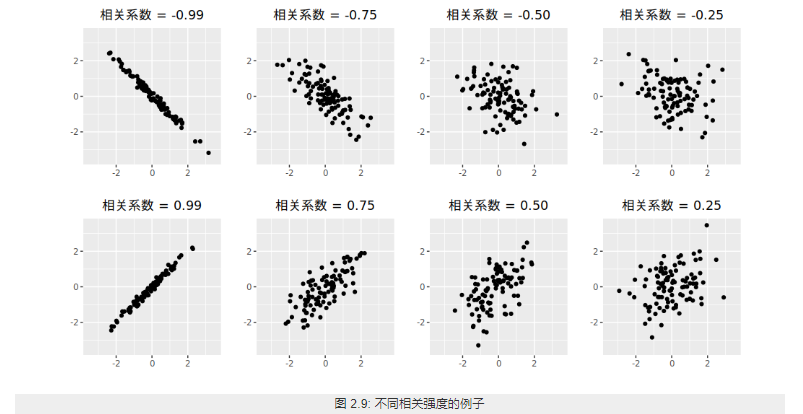

[TOC]


# 2. 随机变量的数学统计特征

## 2.1. 单变量的数学特征

### 2.1.1. 期望--中心度

对于连续型随机变量$X$，有概率密度函数$f(x)$,则定义
$$E(X)= \int_{ - \infty }^{ + \infty } {f(x)dx} $$
为$X$的数学期望。

对于离散型的随机变量$X$，$X$的数学期望就是随机变量$X$的取值与发生概率相乘得到的加和。

$$E(X)= \sum {f(x_i)} $$

### 2.1.2. 方差--分散度

设$X$是一个随机变量，若 $E{[X-E(X)]^2}$存在，则称$E{[X-E(X)]}$为$X$的**方差**，记为$D(X)$或$Var(X)$，即
$$D(X) = Var(x) = E{[X-E(X)]^2}$$


$\sqrt{D(X)}$称为$X$的标准差；

若$X$是离散型随机变量,则

$$D(X)= \sum_{k=1}^{\infty}[x_{k}-E(X)]^{2}p_{k}$$

若$X$是连续型随机变量，则

$$D(X)= \int_{-\infty}^{\infty}[x-E(X)]^{2}f(x)dx$$

补充：
> 方差的推导关系：
> $\color{blue}{D(X) }$
> $= E{[X-E(X) ]^2 }$
> $= E{X^2-2XE(X)+[E(X) ]^2 }$
$=E(X^2 )-2E(X)E(X)+[E(X) ]^2$
$\color{blue}{=E(X^2 )-[E(X)]^2}$


## 2.2. 多变量的数学特征
### 2.2.1. 协方差--关联方向协同性

称$E{(X-E(X))(y-E(Y))}$为随机变量$X$与$Y$的协方差，记为$Cov(X,Y)$

$${Cov(X,Y)}
=E{(X-E(X) )(y-E(Y))}
{=E(XY)-E(X)E(Y)}$$

### 2.2.2. 相关系数--关联紧密性

相关性（correlation）是两个随机变量和之间**线性关系的强度**和方向。

#### 2.2.2.1. 皮尔逊相关系数
Pearson product-moment correlation coefficient
称
$$ρ_{X,Y}=\frac{Cov(X,Y)}{\sqrt{D(X)D(Y)}}$$

为随机变量$X$与$Y$的相关系数。描述X 与Y的关联度。相关系数就是消除了量纲的影响。


## 2.3. 单变量序列的数学特征

类比于随机变量的数学特征，下面是随机变量序列的一些数学特征：


随机变量序列$\{y_{t}:t=0,1,2,... \}$称为一个时间序列模型。

### 2.3.1. 均值函数--中心度

$$u_{t}=E(y_{t} )，t=0,1,2,…$$


### 2.3.2. 方差


### 2.3.3. 自相关性

序列相关（serial correlation），也叫自相关（autocorrelation），是指一个时间序列{x1,x2,x3...,xn}这些值前后自己相关，又称为滞后相关性。


#### 2.3.3.1. 依据自相关性的序列分类

###### 2.3.3.1.1. 白噪音

白噪声序列的自相关函数为0（ρ0 =1除外）。


实际应用中如果样本自相关函数近似为零（ACF 图中都位于控制线之内或基本不超出控制线），则可认为该序列是白噪声的样本。


设 {Xt} 是独立同分布的二阶矩有限的随机变量，称 {Xt} 为**独立同分布白噪声 (white noise)**，又称为**纯随机序列**。最常用的白噪声一般假设均值为零。如果 {Xt} 独立同 N(0,σ2) 分布，称 {Xt} 为**高斯 (Gaussian) 白噪声**或正态白噪声。

###### 2.3.3.1.2. 自相关序列


判定序列的自相关性指标有：
1. 自协方
2. ACF
3. PACF
4. LB 检验

ACF还是PACF都仅仅考虑是否存在某一特定滞后阶数的相关。LB检验则是基于一系列滞后阶数，

#### 2.3.3.2. 自协方差函数 AutoCovariance

$$\color{red}{\gamma{(t,s)}}
=Cov(y_t  ,y_s )
=E[(y_t-u_t )(y_s-u_s ) ]
\color{red}{=E(y_t y_s )-u_{t} u_{s}},
t,s=0,1,2,…$$
某个信号与其自身经过一定时间平移之后的相似性


#### 2.3.3.3. 自相关函数 ACF


$$ρ_{k}=\frac{Cov(y_{t},y_{t-k})}{\sqrt{Var(y_{t-k})Var(y_t)}}$$

$k$ 滞后因子(置滞后项),就是做差分的 时差 
$ρ_{k}$ 当滞后因子为k时的自相关系数
$y_{t-k}$ 做差分后的序列

应为对于特定序列Y而言，自相关系数 是一个与 滞后因子k 相关的函数。将其称为自相关函数 ACF

```python
import statsmodels.tsa.api as smt
"""
tsa是Time Series analysis缩写
tsa的stattools（统计工具）提供了计算acf和pacf以及后面要用到的adfuller单位根检验函数
使用help(smt.stattools.acf)可以查看相关参数设置
"""

# 计算自相关系数，这里设置滞后项为5期,默认是40期滞后
acf=smt.stattools.acf(df,nlags=5)
# 计算偏自相关系数
pacf=smt.stattools.pacf(df,nlags=5)
print(f'自相关系数为：{acf};\n偏自相关系数为：{pacf}')

>>>
自相关系数为：[1. 0.99098764 0.98189466 0.97312885 0.96252012 0.95335064]
偏自相关系数为：[ 1. 0.99231072 -0.01047826  0.01620047 -0.12635305  0.09200772]


from statsmodels.graphics import tsaplots
tsapltots.plot_acf(Train_Y,use_vlines=True,lags=80)
print("60 以后tsapltots判定为acf==0 (alpha=0.05,95%置信度)")
plt.show()
```


#### 2.3.3.4. 偏自相关函数 PACF


PACF
```python

import statsmodels.tsa.api as smt

pacf=smt.stattools.pacf(df,nlags=5)
# pacf .shape ==df.shape 

from statsmodels.graphics import tsaplots
tsaplots.plot_pacf(
    x,
    ax=None,
    lags=None,
    alpha=0.05,
    method='ywunbiased',
    use_vlines=True,
    title='Partial Autocorrelation',
    zero=True,
    vlines_kwargs=None,
    **kwargs,
)

print("60 以后tsapltots判定为acf==0 (alpha=0.05,95%置信度)")
plt.show()
```
滞后相关的一种统计检验


#### 2.3.3.5. Ljung-box 检验（白噪音检测）


对于序列
$$X_n=\{ x_1,x_2,...x_n  \}$$

为了检验时间序列样本是否来自白噪声序列，可以检验 ρk =0,k =1,2,... 的零假设。
Box 和 Pierce(Box and Pierce, 1970) 提出了混成统计量 (Portmanteau statistic)用来检验零假设H0。
$$H0 : ρ1 =···= ρm =0$$

$$Ha : 不全为零$$

在{Xt}是独立白噪声序列条件下，Q∗(m) 近似服从 χ2(m) 分布。给定检验水平 α，当 Q∗(m) > qchisq(1− α,m) 时拒绝 H0，否定白噪声假设。


Ljung 和 Box(Ljung and Box, 1978) 对此检验方法进行了改进。统计量改为
$$Q(m)= T(T +2) \sum_{j=1}^m=\frac{ρ2}{T −j} $$

在独立同分布白噪声假设下仍近似服从 χ2(m) 分布。当 Q(m) > qchisq(1−α,m) 时拒绝 H0，否定白噪 声假设。这个检验称为 Ljung-Box 白噪声检验。

```python

import statsmodels
q_statarray,p_value =statsmodels.tsa.stattools.q_stat(x, nobs, type='ljungbox')

q_statarray  # shape =x.shape
>>>

p_value  # shape =x.shape
>>>

# p_valeue 一般查看最后一个值
# 当 p_valeue > 5%(0.05) ,则接收假设，认为序列是白噪音 
# 当 p_valeue <5% , 则拒绝假设，认为序列是非白噪音 
```

### 2.3.4. 平稳性

**平稳性**就是时间序列的统计性质关于时间平移的不变性，要求序列的均值和方差不发生明显变化。

#### 2.3.4.1. 平稳性分类


**严平稳**
严平稳表示所用统计性质不随时间的改变而改变。

$$F(x_1,x_2..x_n)=F(x_{1+t},x_{2+t}...,x_{n+t})$$
F为{x1,x2,...xn}的联合分布。过于严苛，一般实际中都是弱平稳序列。一般提及稳定序列指的是弱平稳序列。 
**弱平稳**
弱平稳：期望与相关系数（依赖性）不变未来某时刻的$t$的值$Y_{t}$就要依赖于它的过去信息，所以需要依赖性

 1. 均值$E(Y_{t})= μ$与时间$t$无关的常数；
 
 2. 方差$Var(Y_{t} )= \gamma$与时间$t$无关的常数；
 
 3. 协方差$Cov(Y_{t},Y_{t+k} )= \gamma_{0,k}$只与时间间隔$k$有关，与时间$t$无关的常数。

 4.  自相关系数$ρ_{k }=\frac{Cov(y_{t },   y_{t-k})}{\sqrt{Var(y_{t-k)}Var{(y_t)}}}=\frac{Cov(y_{t },   y_{t-k})}{Var{(y_t)}}= \frac{\gamma_{k}}{\gamma_{0}} $


#### 2.3.4.2. 定性判断平稳性

##### 2.3.4.2.1. 时序图

平稳序列：在一定范围内上下波动
非平稳序列：有上升、下降趋势 


##### 2.3.4.2.2. 自相关图/偏相关图

平稳序列: 自相关系数快速（或某一阶段后）降低为0（或附近）
非平稳序列: 自相关系数缓慢降低

#### 2.3.4.3. 定量判定平稳性


##### 2.3.4.3.1. ADF检验
ADF检验全称是 Augmented Dickey-Fuller test，也叫做单位根（unit root）检验。顾名思义，ADF是 Dickey-Fuller检验的增广形式。DF检验只能应用于一阶情况，当序列存在高阶的滞后相关时，可以使用ADF检验，所以说ADF是对DF检验的扩展。
**单位根**就是指单位根过程，可以证明，序列中存在单位根过程就不平稳，会使回归分析中存在伪回归

主要思想：


```python
from arch.unitroot import ADF

ADF_instance=ADF(x,lags=10)

print (ADF_instance)
>>>
   Augmented Dickey-Fuller Results   
=====================================
Test Statistic                 -8.635
P-value                         0.000
Lags                               10
-------------------------------------

Trend: Constant
Critical Values: -3.43 (1%), -2.86 (5%), -2.57 (10%)
Null Hypothesis: The process contains a unit root.
Alternative Hypothesis: The process is weakly stationary.

# 若按照5% 致信区间判定

if ADF_instance.stat<ADF_instance.critical_values["5%"]:
    print("拒绝假设，不存在单元根，序列是宽平稳的，是平稳序列")

if ADF_instance.p_value<0.05:
    print("拒绝假设，不存在单元根，序列是宽平稳的，是平稳序列")

```


### 2.3.5. 概念漂移

概念漂移（Concept drift）就是**目标变量随着时间的推移发生改变**。概念指的就是一个模型要去预测的一个目标变量


#### 2.3.5.1. 分类
* sudden 指的是迅速同时又不可逆的改变，强调的是发生的迅速。

* incremental和gradual都是强调改变发生的缓慢，incremental强调值的随时间改变，gradual则是数据分布的改变。也有些研究者将这两种变化划分为同一类，用incremental gradual这个术语来代替。

* recurring则是一种temporary（临时性）的改变，在一段短时间内会恢复之前的状态。所以也有些研究者将其称为local drift，它不具有周期性，是在不规则的时间间隔内反复转换。

* blip是代表一种很稀少的事件，它可以被视为一种anomaly或者outlier（异常）。

* noise是一种随机的改变，通常这种数据会从样本数据中filter out。

#### 2.3.5.2. 检测

DDM（Drift Detection Method）

EDDM（Early Drift Detection Method）

DDD（Diversity for Dealing with Drifts）  

Ensemble with different diversity

Hoeffding trees

Ensemble Learnings


## 2.4. 多变量序列的数学特征

### 2.4.1. 多变量之间的相关性/独立性

相关关系（correlation）

```python 

stattools.ccovf(x, y[, adjusted, demean])

Calculate the crosscovariance between two series.

stattools.ccf(x, y[, adjusted])

The cross-correlation function.
```

### 2.4.2. 多变量之间的协整关系
如果两组序列是非平稳的，但它们的线性组合可以得到一个平稳序列，那么我们就说这两组时间序列数据具有协整(cointegration)的性质。
#### 2.4.2.1. 多个序列变量组合的规则


#### 2.4.2.2. Engle-Granger两步协整检验

若$Y_t$,$X_t$ 属于I(1) 
**步骤**
1. 通过最小二乘回归得到协整系数$\beta$和残差序列$R_t$
   $Y_t=\beta X_t+R_t$
2. 对残差序列$R_t$ 进行自稳定性检验（ADF），如果$R_t$ 平稳则协整

**缺点** 

不能同时处理多个协整关系


原假设H0是不存在协整关系，替代假设是存在协整关系。如果p值很小，低于临界大小，那么我们可以拒绝没有协整关系的假设，认为存在协整关系。

```python
#cointegration 协整性
coint_t,p_value,crit_value=statsmodels.tsa.stattools.coint(y0,y1,trend ='c',method ='aeg',maxlag = None,autolag ='aic',return_results = None)

if p_value<0.01:
    print("y0 y1 存在协整关系")
y0:
```

**应用**

两组时间序列数据的差是平稳的
当两只股票的价差过大，根据平稳性我们预期价差会收敛，因此买入低价的股票，卖空高价的股票，等待价格回归的时候进行反向操作从而获利。
这就是配对交易（pairs trading）的由来。


(Phillips and Ouliaris 1990)给出了利用回归残差进行协整检验的方法， 包含两种方法， 方差比方法和多元迹统计量方法。 R扩展包urca的ca.po()可以用来计算Phillips-Ouliaris检验。 选项demean="constant"指定有确定性常数趋势， demean="trend"指定有确定性线性趋势， 缺省为demean="none"，没有确定性趋势（无漂移）。 选项type="Pu"指定使用方差比方法， 选项type="Pz"指定使用多元迹方法， 多元迹方法对哪个分量作为回归因变量不敏感。


#### 2.4.2.3. JJ检验

而Johansen协整检验法采用的是多元方程技术

```python
statsmodels.tsa.vector_ar.vecm.coint_johansen(endog, det_order, k_ar_diff)

def coint_johansen(endog, det_order, k_ar_diff):
    """
    Johansen 检验

    参数
    ----------
    endog : array_like (nobs_tot x neqs)
        Data to test
    det_order : int
        * -1 - no deterministic terms
        * 0 - constant term
        * 1 - linear trend
    k_ar_diff : int, nonnegative
        Number of lagged differences in the model.

    Returns
    -------
    result : JohansenTestResult
        An object containing the test's results. The most important attributes
        of the result class are:

        * trace_stat and trace_stat_crit_vals
        * max_eig_stat and max_eig_stat_crit_vals

    """
    import warnings
    if det_order not in [-1, 0, 1]:
        warnings.warn("Critical values are only available for a det_order of "
                      "-1, 0, or 1.", category=HypothesisTestWarning)
    if endog.shape[1] > 12:  # todo: test with a time series of 13 variables
        warnings.warn("Critical values are only available for time series "
                      "with 12 variables at most.",
                      category=HypothesisTestWarning)

    from statsmodels.regression.linear_model import OLS

    def detrend(y, order):
        if order == -1:
            return y
        return OLS(y, np.vander(np.linspace(-1, 1, len(y)),
                                order+1)).fit().resid

    def resid(y, x):
        if x.size == 0:
            return y
        r = y - np.dot(x, np.dot(np.linalg.pinv(x), y))
        return r

    endog = np.asarray(endog)
    nobs, neqs = endog.shape

    # why this?  f is detrend transformed series, det_order is detrend data
    if det_order > -1:
        f = 0
    else:
        f = det_order

    endog = detrend(endog, det_order)
    dx = np.diff(endog, 1, axis=0)
    z = lagmat(dx, k_ar_diff)
    z = z[k_ar_diff:]
    z = detrend(z, f)

    dx = dx[k_ar_diff:]

    dx = detrend(dx, f)
    r0t = resid(dx, z)
    # GH 5731, [:-0] does not work, need [:t-0]
    lx = endog[:(endog.shape[0]-k_ar_diff)]
    lx = lx[1:]
    dx = detrend(lx, f)
    rkt = resid(dx, z)  # level on lagged diffs
    # Level covariance after filtering k_ar_diff
    skk = np.dot(rkt.T, rkt) / rkt.shape[0]
    # Covariacne between filtered and unfiltered
    sk0 = np.dot(rkt.T, r0t) / rkt.shape[0]
    s00 = np.dot(r0t.T, r0t) / r0t.shape[0]
    sig = np.dot(sk0, np.dot(inv(s00), sk0.T))
    tmp = inv(skk)
    au, du = np.linalg.eig(np.dot(tmp, sig))  # au is eval, du is evec

    temp = inv(np.linalg.cholesky(np.dot(du.T, np.dot(skk, du))))
    dt = np.dot(du, temp)

    # JP: the next part can be done much  easier
    auind = np.argsort(au)
    aind = np.flipud(auind)
    a = au[aind]
    d = dt[:, aind]
    # Normalize by first non-zero element of d, usually [0, 0]
    # GH 5517
    non_zero_d = d.flat != 0
    if np.any(non_zero_d):
        d *= np.sign(d.flat[non_zero_d][0])

    #  Compute the trace and max eigenvalue statistics
    lr1 = np.zeros(neqs)
    lr2 = np.zeros(neqs)
    cvm = np.zeros((neqs, 3))
    cvt = np.zeros((neqs, 3))
    iota = np.ones(neqs)
    t, junk = rkt.shape
    for i in range(0, neqs):
        tmp = np.log(iota - a)[i:]
        lr1[i] = -t * np.sum(tmp, 0)
        lr2[i] = -t * np.log(1-a[i])
        cvm[i, :] = c_sja(neqs - i, det_order)
        cvt[i, :] = c_sjt(neqs - i, det_order)
        aind[i] = i

    return JohansenTestResult(rkt, r0t, a, d, lr1, lr2, cvt, cvm, aind)

```

