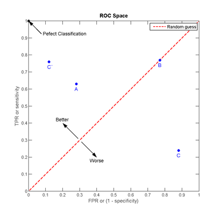

[TOC]


# 1. 模型评估与选择

## 1.1. 概述

在分类任务中，通常把错分的样本数占样本总数的比例称为**错误率（error rate）**。比如m个样本有a个预测错了，错误率就是`a/m`；与错误率相对的有**精度（accuracy）**，或者说**正确率**，数值上等于1-错误率。

更一般地，通常会把模型输出和真实值之间的差异称为**误差（error）**。在训练集上的误差称为**训练误差（training error）**或者**经验误差（empirical error）**。而在新样本上的误差则称为**泛化误差（generalization error）**。我们希望模型的泛化误差尽可能小，但现实是，我们无法知道新样本是怎样的，所以只能尽可能地利用训练数据来最小化经验误差。

但是否经验误差小，泛化误差就一定小呢？这不是一定的，如果模型相比训练数据来说过于复杂，那就很有可能把训练数据本身的一些特点当作整个样本空间的特点，从而使得在训练数据上有很小的经验误差，但一旦面对新样本就会有很大误差，这种情况叫做**过拟合（overfitting）**。相对的是**欠拟合（underfitting）**。

欠拟合很容易避免，只要适当地增加模型复杂度（比方说增加神经网络的层数）就好。但**过拟合是无法彻底避免的**，只能缓解（减少模型复杂度/增加训练数据），这也是机器学习发展中的一个关键阻碍。

在现实任务中，要处理一个问题，我们往往有多种算法可以选择，即使是同一个算法也需要进行参数的选择，这就是机器学习中的**模型选择（model selection）**问题。既然泛化误差无法使用，而经验误差又存在着过拟合问题，不适合作为标准，那么我们应该如何进行模型选择呢？针对这个问题，后面的三个小节会给出回答。


## 1.2. 调参和最终模型

**调参（parameter tuning）** 一般先选定一个范围和变化步长，比如(0,1]，步长0.2，这样就有五个参数候选值。然后进行评估，选出最好的一个。这样选出的未必是全局最优的参数，但为了在开销和性能之间折中，只能这么做，毕竟我们无法试尽参数的所有取值。而且多个参数组合的情况是指数上升的，比方说有3个参数，每个参数评估5种取值，就需要测试多达 $5^3$ 种情形。

**特别注意**，训练/验证这个过程是为了让我们**确定学习算法和算法的参数**，确定了这些之后，我们需要再利用整个源数据集进行训练，这次训练所得的模型才是最终模型，也即提交给用户，进行测试的模型。

这里先简单归纳一下，书中将模型选择问题拆解为（1）评估方法；（2）性能度量；（3）比较检验；三个子问题。可以这样理解：

- **评估方法**：用什么数据做评估？如何获得这些数据？

- **性能度量**：评估时如何衡量模型的好坏？有哪些评价标准？

- **比较检验**：如何比较模型的性能？注意不是简单地比大小！在机器学习中性能比较是相当复杂的。


# 2. 评估方法

前面已经提到了不能把经验误差用作模型评估，否则会存在过拟合的嫌疑。那么很自然地，我们就会想到是否有一种方法能近似泛化误差呢？答案是有的，就是使用**测试集testing set**进行评估，利用**测试误差testing error**来近似泛化误差。

测试集和训练集一样，从样本空间中独立同分布采样而得，并且应**尽可能与训练集互斥**，也即用于训练的样本不应再出现在测试集中，否则就会高估模型的性能。为什么呢？举个例子，老师布置了2道题做课后作业，如果考试还是出这2两题，只能证明大家记住了这2道题；只有出不一样的题，才能看出大家是否真的掌握了知识，具备了举一反三的能力。

**注意**

测试数据更多地是指模型在实际使用中遇到的数据，为了和模型评估中使用的测试集进行区分，一般会把模型评估用的测试集叫做**验证集validation set**。

举个例子，在Kaggle或者天池上参加比赛，我们一般会拿到一份带标记的原始数据集和一份不带标记的测试数据集。我们需要选用一种评估方法来把原始数据集划分成训练集和验证集，然后进行训练，并按照模型在验证集上的性能表现来进行选择。最后挑出最好的模型对测试集的样本进行预测，并提交预测结果。下文将介绍几种常用的评估方法。

## 2.1. 留出法 hold-out

直接将数据集划分为两个互斥集合，注意保持数据分布的一致性（比如比例相似）。保留类别比例的采样方式又叫**分层采样（stratified sampling）**。举个例子，原始数据集有100个样本，假设训练集占70个，验证集占30个。若训练集中正例反例各35个，也即比例为`1:1`，那么验证集中就应该正例反例个15个，同样保持`1:1`的比例。当然，这个比例最好还是遵循原始数据集中数据的分布规律。

单独一次留出法的结果往往不可靠，一般是进行多次随机划分，然后取各次评估的平均值作为评估结果。

留出法最大的缺点就是要进行划分，当训练集占的比例较大时，模型可以更准确地刻画原始数据集的特征，但是因为验证集较小，评估的结果往往不稳定也不准确；当训练集占的比例较小时，训练出的模型又不能充分学习到原始数据集的特征，评估结果可信度不高。这个问题没有完美的解决方案，一般取数据集2/3~4/5的样本作为训练集，余下的作为验证集。

## 2.2. 交叉验证 cross validation

又称为**k折交叉验证（k-fold cross validation）**，将数据集划分为k个互斥子集。每次使用k-1个子集的并集作为训练集，余下的一个子集作为验证集，这就构成了k组训练/验证集，从而可以进行k次训练和验证。最终取k次验证的均值作为评估结果。
常用的k值包括5，10，20。

类似于留出法，因为存在多种划分k个子集的方式，为了减少因不同的样本划分而引入的差别，需要进行多次k折交叉验证。例如10次10折交叉验证，指的是进行了总计100次训练和100次评估。

特别地，令k=数据集样本数的交叉验证称为**留一法（Leave-One-Out，简称LOO）**，即有多少样本就进行多少次训练/验证，并且每次只留下一个样本做验证。这样做的好处是不需要担心随即样本划分带来的误差，因为这样的划分是唯一的。一般来说，留一法的评估结果被认为是比较准确的。但是！当数据集较大时，使用留一法需要训练的模型太多了！这种计算开销是难以忍受的！

## 2.3. 自助法 bootstrapping

在留出法和交叉验证法中，我们都需要对数据集进行划分，从而使得训练所用的数据集比源数据集小，引入了一些因规模不同而造成的偏差，有没有办法避免规模不同造成的影响呢？

**自助法 bootstrapping**正是我们需要的答案，以**自助采样bootstrap sampling**为基础，对包含m个样本的源数据集进行有放回的m次采样以获得同等规模的训练集。在这m次采样中都不被抽到的概率大约为0.368，也即源数据集中有大约1/3的样本是训练集中没有的。因此，我们可以采用这部分样本作为验证集，所得的结果称为**包外估计（out-of-bag estimate）**。


**注意**，自助法适用于数据集小，难以划分训练/验证集的情况。因为自助法能产生多个不同训练集，所以对集成学习也大有好处。但是！**自助法改变了数据集的分布**，也因此引入了一些额外的误差。因此，数据量足的时候还是留出法和交叉验证法用得多一些。


# 3. 性能度量

**性能度量（performance measure）** 指的是用于衡量模型泛化能力的评价标准。使用不同的性能度量往往导致不同的评判结果。比方说搭建推荐系统，两个模型中一个精度高，一个覆盖度高，如果我们想让更多的商品得到推荐可以就会选后一个模型。所以说，模型的好坏是相对的，取决于我们采用什么性能度量，而**采用什么性能度量则应取决于我们的任务需求**。


### 3.1. 分类问题
这个小节主要介绍分类任务中常用的性能度量。

#### 3.1.1. 分类错误数 error
$$  e=\sum{count( Y_{true} !=Y_{predict})}$$


#### 3.1.2. 错误率 error rate

$$error\_rate=\frac{e}{N}$$
#### 3.1.3. 正确率/准确率 accuracy/ACC
错误率相对的有正确率/准确率
$$ accuracy =1-error\_rate=\frac{正确预测的数量}{样本总数} $$


#### 3.1.4. 混淆矩阵(二分类)

假设我们正常处理一个二分类问题，按照模型预测值和真实值可以把测试样本划分为四种情形：**真正例（true positive），假正例（false positive），真反例（true negative），假反例（false negative）**。可以把结果表示为下图这个矩阵——**混淆矩阵(confusion matrix)**。

<table>

<tr>
    <th rowspan="2" align="center">真实情况</th>
    <th colspan="2" align="center">预测结果</th>
</tr>

<tr>
    <td align="center">正例</td>
    <td align="center">反例</td>
</tr>
<tr>
    <td align="center">正例</td>
    <td align="center">TP（真正例）</td>
    <td align="center">FN（假反例）</td>
</tr>
<tr>
    <td align="center">反例</td>
    <td align="center">FP（假正例）</td>
    <td align="center">TN（真反例）</td>
</tr>
</table>


##### 3.1.4.1. 查准率/精确率 precision
**查准率，又称精确率（precision）**，用于衡量模型避免错误的能力，分母是模型预测的正例数目。

`模型正确预测正类别的频率`
你认为的正样本，有多少猜对了（猜的准确性如何）


$$precision = \frac{TP}{TP+FP}\frac{正例数}{(正例数+假正例数)}$$


##### 3.1.4.2. 查全率/召回率 recall
**查全率，又称召回率（recall）**，用于衡量模型避免缺漏的能力，分母是测试样本真正包含的正例数目。

正样本有多少被找出来了（召回了多少）。
$$recall = \frac{TP}{TP+FN}=\frac{正例数}{(正例数+假负例数)}$$


##### 3.1.4.3. F1，Fb

一般来说，`查准率`和`查全率`是矛盾的，提高其中一者则另一者必然会有所降低。有时候我们对查准率、查全率的需求是不同的。比方说

1. 广告推荐，要尽量避免打扰用户，因此**查准率更重要**；
2. 逃犯检索，因为漏检的危害很大，所以**查全率更重要**。


这时就需要使用$F_\beta$对模型性能进行评价。


**$F_\beta$**，是查准率和查全率的加权调和平均，用于综合考虑这两个性能度量，并采用不同的权重。

$$\frac{1}{F_\beta} = \frac{1}{1+\beta^2} \times (\frac{1}{precision} + \frac{\beta^2}{recall}) \Rightarrow F_\beta = \frac{(1+\beta^2) \times precision \times recall}{(\beta^2 \times presion) + recall}$$

 $F_\beta$的物理意义就是将准确率和召回率这两个分值合并为一个分值，在合并的过程中，召回率的权重是准确率的$\beta$倍。

 **b值的大小**


 $F_1$分数认为召回率和准确率同等重要，用于综合考虑这两个性能度量。
 
 $$\frac{1}{F1} = \frac{1}{2} \times (\frac{1}{precision} + \frac{1}{recall}) \Rightarrow F1 = \frac{2 \times precision \times recall}{presion + recall}$$

 $F_2$分数认为召回率的重要程度是准确率的2倍，$F_{\frac{1}{2}}$而分数认为召回率的重要程度是准确率的一半


其中 $\beta>0$ 度量了查全率对查准率的相对重要性，等于1时$F_\beta$退化为F1，小于1时查准率更重要，大于1时查全率更重要。


#### 3.1.5. ROC (二分类)

很多时候，使用模型对测试样本进行预测得到的是一个实值或者概率（比如神经网络），需要进一步设置**阈值（threshold）** $\theta$，然后把预测值和阈值进行比较才能获得最终预测的标记。

我们可以按照预测值对所有测试样本进行排序，最可能是正例的排前面，最不能是正例的排后面。这样分类时就像是在这个序列中以某个**截断点（cut point）**把样本分成两部分。我们需要**根据任务需求来设置截断点**。比如广告推荐更重视查准率，可能就会把截断点设置得更靠前。

因此！**排序本身的质量很能体现出一个模型的泛化性能**，ROC曲线就是一个用来衡量排序质量的工具。

**ROC，全称受试者工作特征（Receiver Operating Characteristic）**。怎样画ROC曲线呢？先定义两个重要的计算量：**真正例率（True Positive Rate，简称TPR）**和**假正例率（False Positive Rate，简称FPR）**。

$$TPR = \frac{TP}{TP+FN}$$

$$FPR = \frac{FP}{TP+FN}$$

TPR其实就等于召回率。在绘制ROC曲线时，纵轴为TPR，横轴为FPR。首先按预测值对样本进行排序，然后按序逐个把样本预测为正例，并计算此时的TPR和FPR，然后在图上画出该点，并与前一个点连线。如下图：



有两个值得注意的特例：

- 经过 (0,1) 点的曲线，这代表所有正例都在反例之前出现（否则会先出现假正例从而无法经过 (0,1) 点），这是一个**理想模型**，我们可以设置一个阈值，完美地分割开正例和反例。

- 对角线，这对应于**随机猜测**模型，可以理解为真正例和假正例轮换出现，即每预测对一次接下来就预测错一次，可以看作是随机猜测的结果。

#### 3.1.6. AUC (二分类)
若一个模型的ROC曲线完全包住了另一个模型的ROC曲线，我们就认为这个模型更优。但是如果两条曲线发生交叉，要怎么判断呢？比较合理的判据是**AUC（Area Under ROC Curve）**，即ROC曲线下的面积。

$$AUC=\frac{1}{2}\sum_{i=1}^{m-1}(x_{i+1}-x_i)\cdot(y_i+y_{i+1})$$


##### 3.1.6.1. AUC的排序特性

ROC曲线上的面积等于**排序损失（loss）**。也即有：

$$AUC = 1 - \ell_{rank}$$

根据上述概率解释，**AUC实际上在说一个模型把正样本排在负样本前面的概率**！ 所以，AUC常用在排序场景的模型评估，比如**搜索和推荐**等场景！ 

**分类问题转换排序问题**

二分类问题的输出
$$y=\{0,1\}$$

将其转换为0，1的**得分对**

当实际值 yi=0 时候，设$y_i=0$为 正样本，此时 $(S_{-},S_{+})$ 为`（负样本得分，正样本得分）`的**得分对**

$$y_0=(S_{-},S_{+})$$

当实际值 yi=1 时候，设$y_i=1$为 正样本，此时 $(S_{-},S_{+})$ 为`（负样本得分，正样本得分）`的**得分对**

$$y_1=(S_{-},S_{+})$$

好的分类模型：
$$S_{-}<S_{+}$$

将其转换为$S_{-}, S_{+}$的**排序问题**，$S_{-}$永远排在$S_{+}$后面。

**使用排序问题损失函数**

排序损失函数有多种形式，总体思路是 
$$ min (s_--s_+) $$


假设排序损失函数为：

$$\ell_{rank} = (1−w^T(s_+−s_−))^2 $$
则：
$$E[(1−w^T(s_+−s_−))^2]=\frac{1}{n_+ \times n_+} \sum_{i=1}^{n_+} \sum_{j=1}^{n_-}(1−w^T(s_{i+}−s_{j−}))^2$$

这样的排序损失函数接近AUC的表达形式


##### 3.1.6.2. AUC对正负样本比例不敏感
这个解释还表明，如果将所有的样本的得分都加上一个额外的常数，并不改变这个概率，因此AUC不变！ 因此，在广告等需要绝对的点击率场景下，AUC并不适合作为评估指标，而是用logloss等指标。


利用概率解释，还可以得到AUC另外一个性质，对正负样本比例不敏感。 在训练模型的时候，如果正负比例差异比较大，例如正负比例为1:1000，训练模型的时候通常要对负样本进行下采样。当一个模型训练完了之后，用负样本下采样后的测试集计算出来的AUC和未采样的测试集计算的AUC基本一致，或者说前者是后者的无偏估计！

如果采样是随机的，对于给定的正样本，假定得分为s+，那么得分小于s+的负样本比例不会因为采样而改变！

例如，假设采样前负样本里面得分小于s+的样本占比为70%，如果采样是均匀的，即>s+的负样本和<s+的负样本留下的概率是相同的，那么显然采样后这个比例仍然是70%。这表明，该正样本得分大于选取的负样本的概率不会因为采样而改变，也就是y(t)dx(t)是不变的，因此，AUC也不变！

相比于其他评估指标，例如准确率、召回率和F1值，负样本下采样相当于只将一部分真实的负例排除掉了，然而模型并不能准确地识别出这些负例，所以用下采样后的样本来评估会高估准确率；因为采样只对负样本采样，正样本都在，所以采样对召回率并没什么影响。这两者结合起来，最终导致高估F1值！


采用极大似然估计对应的损失函数是`logloss`，因此极大似然估计的优化目标并不是AUC。 在一些排序场景下，AUC比logloss更贴近目标，**因此直接优化AUC可以达到比极大似然估计更好的效果**。 实际上，`pairwise`的目标函数就可以看做一种对AUC的近似。因为损失函数都是作用与正负样本得分差之上！ 例如，


问：试证明 $AUC=1-\ell_{rank}$

先回顾一下AUC的计算方法：

$$AUC=\frac{1}{2}\sum_{i=1}^{m-1}(x_{i+1}-x_i)\cdot(y_i+y_{i+1})$$

计算方法类似于积分，把ROC曲线下的面积分解为m（样本个数）个小矩形，然后对这些小矩阵的面积求和。每个矩形的宽等于相邻的两个点横坐标的差值，每个矩形的高等于相邻两个点纵坐标之和的 $\frac{1}{2}$。上式把常数 $\frac{1}{2}$ 提到求和项外了。

再看看排序损失（指按算法预测值排序时带来的损失）：

$$\ell_{rank} = \frac{1}{m^+ \cdot m^-} \sum_{x^+ \in D^+}\sum_{x^- \in D^-} (\mathbb{I}(f(x^+) < f(x^-)) + \frac{1}{2}\mathbb{I}(f(x^+) = f(x^-)))$$

其中 $m^+$ 和 $m^-$ 分别表示测试集中的正例集和反例集。

这题目前还没有头绪，AUC曲线上的面积是：

$$\frac{1}{2}\sum_{i=1}^{m-1}(x_{i+1}-x_i)\cdot((1-y_i)+(1-y_{i+1})) \\
= -\frac{1}{2}\sum_{i=1}^{m-1}(x_{i+1}-x_i)\cdot(y_i+y_{i+1}-2)$$

怎么证明这个表达式和 $\ell_{rank}$ 相等呢？

#### 3.1.7. 代价敏感错误率与代价曲线

现实任务中，有时会遇到不同类型错误造成后果不同的状况。比如医生误诊，把患者诊断为健康人的影响远大于把健康人诊断为患者，因为可能因为这次误诊丧失了最佳治疗时机。为了权衡不同类型错误带来的不同损失，可以为这些错误类型赋以**非均等代价（unequal cost）**。

还是举二分类为类，可以**根据任务的领域知识**来设定一个**代价矩阵（cost matrix）**:

<table>

<tr>
    <th rowspan="2" align="center">真实类别</th>
    <th colspan="2" align="center">预测类别</th>
</tr>

<tr>
    <td align="center">第0类</td>
    <td align="center">第1类</td>
</tr>
<tr>
    <td align="center">第0类</td>
    <td align="center">0</td>
    <td align="center">$cost_{01}$</td>
</tr>
<tr>
    <td align="center">第1类</td>
    <td align="center">$cost_{10}$</td>
    <td align="center">0</td>
</tr>
</table>

预测值与真实值相等时，自然错误代价为0。但把第0类错预测为第1类和把第1类错预测为第0类这两种错误的代价是不同的。注意，**重要的不是代价在数值上的大小，而是它们的比值**。比方说 $\frac{cost_{01}}{cost_{10}} > 1$， 这就说明把第0类错预测为第1类的代价更高。

使用了非均等代价之后，我们在使用性能度量时自然也需要作出相应的改变，比方说**代价敏感cost-sensitive**版本的错误率：

$$E(f;D;cost) = \frac{1}{m}\lgroup\sum_{x_i \in D^+}\mathbb{I}(f(x_i) \neq y_i) \times cost_{01} + \sum_{x_i \in D^-}\mathbb{I}(f(x_i) \neq y_i) \times cost_{10}\rgroup$$


由于ROC曲线不能反应使用非均等代价之后的期望总体代价，所以改用**代价曲线cost curve**来取替。

代价曲线图的纵轴为归一化代价（将代价映射到 [0,1] 区间），横轴为正例概率代价。画法类似于ROC曲线，它是将ROC曲线的每一个点转为图中的一条线。依次计算出ROC曲线每个点对应的FPR和FNR，然后把点 (0,FPR) 和点 (0,FNR) 连线。最终所得的图中，所有线的下界所围成的面积就是该模型的期望总体代价。

### 3.2. 回归问题


#### 3.2.1. 平均绝对误差 MAE
Mean Absolute Error （MAE）平均绝对误差，也称L1损失

$$AE(y\_ ,y)=|y\_ -y|$$

$$MAE(y\_ ,y)=\frac{1}{N}\sum\ |y\_ -y|$$


#### 3.2.2. 平均相对误差 MRE
相对误差 Relative Error (RE)
$$RE(y\_ ,y)=\frac{|y\_ -y|}{y}$$


平均相对误差 Mean Relative Error (MRE)
$$MRE(y\_ ,y)=\frac{1}{N}\sum\ RE(y\_ ,y)=\frac{1}{N}\sum\frac{|y\_ -y|}{y}$$


#### 3.2.3. 平均平方误差 MSE

平方误差 squared_error  (SE)
$$SE(y\_ ,y)=(y\_ -y)^2$$


平均相对误差 Mean Squared Error (MSE)，也称为L2损失
$$MRE(y\_ ,y)=\frac{1}{N}\sum\ SE(y\_ ,y)=\frac{1}{N}\sum(y\_ -y)^2$$


平均相对误差的数学形式与**方差/平方差** 相同 
$$\sigma^2=\frac{\sum_{i=0}^N{(x-\mu)^2}}{N}$$


#### 3.2.4. 1.4.2.3.均方根误差 RMSE

$$MRE(y\_ ,y)=\frac{1}{N}\sqrt{\sum(y\_ -y)^2} $$
**标准差/根方差**
$$\sigma=\frac{\sum_{i=0}^N\sqrt{{(x-\mu)^2}}}{N}$$


#### 3.2.5. 相对误差的中位数 MAPE
MAPE是一个相对误差的中位数
$$MAPE=medain(\frac{|y_i-y_i^{hat}|}{y_i})$$
可以用来解决评估指标鲁棒性问题。
MAPE是一个相对误差的中位数，当然也可以使用别的分位数。


#### 3.2.6. 决定系数 r2
Coefficient of determination 决定系数 也称为 $R^2 score$


### 3.3. 排序问题

#### 3.3.1. MAP

平均准确率(Mean Average Precision):

假设有两个主题，`主题1`有4个相关网页，`主题2`有5个相关网页。某系统对于主题1检索出4个相关网页，其rank分别为1, 2, 4, 7；对于主题2检索出3个相关网页，其rank分别为1,3,5。
$$rank_1=[1, 2, 4, 7]$$

$$rank_2=[1,3,5]$$

对于主题1，平均准确率为

$$  MAP_{rank_1}=\frac{(\frac{1}{1}+\frac{2}{2}+\frac{3}{4}+\frac{4}{7})}{4}=0.83$$
对于主题2，平均准确率为
$$ MAP_{rank_2}=\frac{(\frac{1}{1}+\frac{2}{3}+\frac{3}{5})}{3}=0.45$$

则
$$MAP= \frac{1}{n} \sum_{i=0}^n(MAP_i)=(0.83+0.45)/2=0.64$$

#### 3.3.2. NDCG


整体相关性--> **带排序**的整体相关性-->**归一化的**考虑排序的整体相关性
CG-->DCG-->NDCG


**CG （cumulative gain，累计增益）**
CG（cumulative gain，累计增益）可以用于评价基于打分/评分的个性推荐系统。假设我们推荐k个物品，这个推荐列表的CGk计算公式如下：
$$CG^{<k>} =\sum_{i=1}^{k}rel_i$$


$rel_i$表示k个物品种第i个物品的相关性或者评分。

比如豆瓣给用户推荐了五部电影，

$$[M1,M2,M3,M4,M5]$$

该用户对这五部电影的评分分别是

$$[5, 3, 2, 1, 2]$$

那么这个推荐列表的CG等于
$$CG^{<5>}=5+3+2+1+2=13$$

CG**没有**考虑推荐的**次序**，在此基础之后我们引入对物品顺序的考虑，就有了DCG(discounted CG)，折扣累积增益。公式如下：

**DCG(discounted CG)折扣累计增益**

$$DCG^{<k>}=\sum_{i=1}^k \frac{2^{rel_i}−1}{\log_2(i+1)}$$
比如豆瓣给用户推荐了五部电影，

$$[M1,M2,M3,M4,M5]$$

该用户对这五部电影的评分分别是

$$[5, 3, 2, 1, 2]$$

那么这个推荐列表的DCG等于

$$DCG^{<5>}=\frac{2^5−1}{log_2(1+1)}+\frac{2^3−1}{log_2(2+1)}+ \frac{2^2−1}{log_2(3+1)}+\frac{2^1−1}{log_2(4+1)}+\frac{2^2−1}{log_2(5+1)}=38.5$$

DCG没有考虑到推荐列表和每个检索中真正有效结果个数，不同的推荐列表之间，很难进行横向的评估。 所以最后我们引入 NDCG(normalized discounted CG)，顾名思义就是标准化之后的DCG。


**NDCG归一化折扣累计增益**

$$NDCG^{<k>}=\frac{DCGk}{IDCGk}$$

其中IDCG是指ideal DCG，也就是完美结果下的DCG。
继续上面的例子，如果相关电影一共有7部：

$$[M1,M2,M3,M4,M5,M6,M7]$$

该用户对这七部电影的评分分别是

$$[5, 3, 2, 1, 2 , 4, 0]$$

把这7部电影按评分排序

$$ [5, 4, 3, 2, 2, 1, 0]$$

这个情况下的完美DCG是
$$IDCG^{<5>}=\frac{2^5-1}{\log_2(1+1)}++\frac{2^4-1}{\log_2(2+1)}+\frac{2^3-1}{\log_2(3+1)}+\frac{2^2-1}{\log_2(4+1)}+\frac{2^2-1}{\log_2(5+1)} =31+9.5+3.5+1.3+1.2=46.5$$

所以：


$$NDCG^{<5>}=\frac{DCG^{<5>}}{IDCG^{<5>}}=\frac{38.5}{46.5}=0.827$$

NDCG是0到1的数，越接近1说明推荐越准确。


#### 3.3.3. MRR
平均排序倒数  MRR(Mean Reciprocal Rank)
给定查询$q_i$，q在相关文档的位置是r（正确答案在系统种给出的排序位置），那么
$$mrr_{q_i}=\frac{1}{r}$$

$$MRR=\frac{1}{n}\sum_{i=1}^{N}mrr_{q_i}=\frac{1}{n}\sum_{i=1}^{N}\frac{1}{r}$$


## 1.7. 选择度量指标时的考虑

1. 要区分度量方法、目标函数、损失函数的概念
2. 要有性能度量偏重


## 1.7.1. 分类问题


**二分类** 

**正样本的选择**

在二元分类中，两种可能的类别分别被标记为正类别和负类别。正类别结果是我们要测试的对象。
例如：
1. 在医学检查中，正类别可以是 "`肿瘤`"

### 1.7.2. 回归问题

### 1.7.3. 排序问题


# 4. 模型比较与检验

看起来似乎有了获取测试集$^{*}$的评估方法和用于比较模型的性能度量之后，就能够通过不同模型在测试集上的性能表现来判断优劣了。但是！事实上，在机器学习中，模型比较并不是这样简单的比大小，而是要考虑更多。

注：指验证集，但无论是书中还是论文中，都使用测试集较多，明白两者的区别就可以了。

在模型比较中，主要有以下三个重要考虑：

1. 测试集上的性能只是泛化性能的近似，未必相同；
2. 测试集的选择对测试性能有很大影响，即使规模一致，但测试样例不同，结果也不同；
3. 一些机器学习算法有随机性，即便算法参数相同，在同一测试集上跑多次，结果也可能不同；

那么应该如何有效地进行模型比较呢？答案是采用**假设检验（hypothesis test）**。基于假设检验的结果，我们可以推断出，若在测试集上观察到模型A优于B，则是否A的泛化性能在统计意义上也优于B，以及做这个结论的把握有多大。

本小节首先介绍最基本的二项检验和t检验，然后再深入介绍其他几种比较检验方法。默认以错误率作为性能度量。

几个基础概念：

- **置信度**：表示有多大的把握认为假设是正确的。
- **显著度**：也称“显著性水平”，表示假设出错的概率。显著度越大，假设被拒绝的可能性越大。
- **自由度**：不被限制的样本数，也可以理解为能自由取值的样本数，记为 $v$ 或 $df$。

## 4.1. 单个模型、单个数据集上的泛化性能检验

> 我们有多大把握相信对一个模型泛化性能的假设？

### 4.1.1. 二项检验

在进行比较检验前，完成了一次模型预测，已知测试错误率为 $\hat{\epsilon}$。

一个泛化错误率为 $\epsilon$ 的模型在 $m$ 个样本上预测错 $m'$ 个样本的概率为：

$$ P(\hat{\epsilon};\epsilon) = \binom{m}{m'} \epsilon^{m'} (1-\epsilon)^{m - m'}$$

这个概率符合二项分布:


又因为已知测试错误率为 $\hat{\epsilon}$，也即知道了该模型在 $m$ 个样本上实际预测错 了$\hat{\epsilon} \times m$ 个样本。代入公式，对 $\epsilon$ 求偏导会发现，给定这些条件时，**$\epsilon = \hat{\epsilon}$ 的概率是最大的**。

使用**二项检验（binomial test）**，假设泛化错误率 $\epsilon \leq \epsilon_0$，并且设定置信度为 $1-\alpha$。则可以这样定义错误率的阈值 $\overline{\epsilon}$：

$$\overline{\epsilon} = \max{\epsilon} \qquad s.t. \qquad \sum_{i=\epsilon_0 \times m+1}^m \binom{m}{i}\epsilon^i (1-\epsilon)^{m-i} < \alpha$$

其中 $s.t.$ 表示左式在右边条件满足时成立。右式计算的是发生不符合假设的事件的总概率，如果我们要有 $1-\alpha$ 的把握认为假设成立，那么发生不符合假设的事件的总概率就必须低过 $\alpha$。

在满足右式的所有 $\epsilon$ 中，选择最大的作为阈值 $\overline{\epsilon}$。如果在测试集中观测到的测试错误率 $\hat{\epsilon}$ 是小于阈值 $\overline{\epsilon}$的， 我们就能以$1-\alpha$ 的把握认为假设成立，即该模型的泛化误差 $\epsilon \leq \epsilon_0$。

### 4.1.2. t检验

二项检验只用于检验某一次测试的性能度量，但实际任务中我们会进行多次的训练/测试，得到多个测试错误率，比方说进行了k次测试，得到 $\hat{\epsilon}_1$,$\hat{\epsilon}_2$, ... ,$\hat{\epsilon}_k$。这次就会用到**t检验(t-test)**。

定义这 $k$ 次测试的平均错误率 $\mu$ 和方差 $\sigma^2$：

$$\mu = \frac{1}{k} \sum_{i=1}^k \hat{\epsilon_i}$$

$$\sigma^2 = \frac{1}{k-1} \sum_{i=1}^k (\hat{\epsilon_i} - \mu)^2$$

注意！这里使用的是**无偏估计**的**样本方差**，分母是 $k-1$，因为当均值确定，并且已知 $k-1$ 个样本的值时，第 $k$ 个样本的值是可以算出来的，也可以说是**受限的**。

假设泛化错误率 $\epsilon = \epsilon_0$，并且设定显著度为 $\alpha$。计算统计量t：

$$t = \frac{\sqrt{k}(\mu-\epsilon_0)}{\sigma}$$

该统计量服从自由度 $v = k-1$ 的t分布，如下图：


自由度越大，约接近于正态分布，自由度为无穷大时变为标准正态分布（$\mu=0$，$\sigma=1$）。

如果计算出的t统计量落在临界值范围 [$t_{-a/2}$,$t_{a/2}$] 之内（注：临界值由自由度 $k$ 和显著度 $\alpha$ 决定，通过查表得出），我们就能以$1-\alpha$ 的把握认为假设成立，即该模型的泛化误差 $\epsilon = \epsilon_0$。

## 4.2. 两个模型/算法、单个数据集上的泛化性能检验

> 我们有多大把握相信两个模型的泛化性能无显著差别？

### 4.2.1. 交叉验证t检验

对两个模型A和B，各使用k折交叉验证分别得到k个测试错误率，即$\hat{\epsilon}_1^A$,$\hat{\epsilon}_2^A$, ... ,$\hat{\epsilon}_k^A$ 和 $\hat{\epsilon}_1^B$,$\hat{\epsilon}_2^B$, ... ,$\hat{\epsilon}_k^B$。使用**k折交叉验证成对t检验（paired t-tests）**来进行比较检验。

对于这两组k个测试错误率，计算两组之间的每一对的差，即 $\triangle_i = \hat{\epsilon}_k^A - \hat{\epsilon}_k^B$，从而得到k个 $\triangle$。我们可以计算 $\triangle$ 的均值 $\mu$ 和方差 $\sigma^2$，定义统计量t：

$$t = \lvert \frac{\sqrt{k}\mu}{\sigma} \rvert$$

可以看到，和前面的t检验相比，这里的分子没有被减项，其实是省略了。因为我们假设两个模型的泛化错误率相同，实际上是假设 $\lvert \epsilon^A - \epsilon^B \rvert = 0$，这个 $0$ 被省略了。

类似地，这个统计量服从自由度 $v = k-1$ 的t分布。我们设定好显著度 $\alpha$，查表获取临界值范围，如果计算出的t统计量落在在范围内，就能以$1-\alpha$ 的把握认为假设成立，即两个模型的泛化性能无显著差别，否则认为平均测试错误率较低的模型更胜一筹。

### 4.2.2. McNemar检验

对于一个二分类问题，如果使用留出法，我们不仅可以获得两个算法A和B各自的测试错误率，或能够获得它们分类结果的差别（都预测正确、都预测错误、一个预测正确一个预测错误），构成一张**列联表（contingency table）**：

<table>

<tr>
    <th rowspan="2" align="center">算法B</th>
    <th colspan="2" align="center">算法A</th>
</tr>

<tr>
    <td align="center">分类正确</td>
    <td align="center">分类错误</td>
</tr>
<tr>
    <td align="center">分类正确</td>
    <td align="center"> $\e_{00}$</td>
    <td align="center">$e_{01}$</td>
</tr>
<tr>
    <td align="center">分类错误</td>
    <td align="center">$e_{10}$</td>
    <td align="center">$e_{11}$</td>
</tr>
</table>

假设两个算法的泛化性能无显著区别，则 $e_{01}$ 应该等于 $e_{10}$，变量 $\lvert e_{01}-e_{10} \rvert$ 应服从均值为 $1$，方差为 $e_{01} + e_{10}$ 的正态分布，可以计算统计量 $\chi^2$：

$$\chi^2 = \frac{(\lvert e_{01}-e_{10} \rvert -1)^2}{e_{01} + e_{10}}$$

该变量服从自由度为 $v=1$ 的 $\chi^2$ 分布（卡方分布），类似t检验，设定好显著度 $\alpha$，按照自由度和显著度查表获得临界值。若计算所得的统计量 $\chi^2$ 小于临界值，则能以$1-\alpha$ 的把握认为假设成立，即两个算法的泛化性能无显著差别，否则认为平均测试错误率较低的算法更胜一筹。

注：这里 $v$ 为1是因为只有2个算法

### 4.3. 多个模型/算法、多个数据集上的泛化性能检验

> 我们有多大把握相信多个模型的泛化性能皆无显著差别？若有，接下来怎样做？

在**一组数据集**上进行**多个算法**的比较，情况就变得较复杂了，一种做法是使用前面的方法分开两两比较；另一种更直接的做法是使用基于算法排序的Friedman检验。

### 4.3.1. Friedman检验

假设有 $N=4$ 个数据集，$k=3$ 种算法，可以使用一种评估方法，获得各个算法在各个数据集上的测试结果，然后按照性能度量由好到坏进行排序，序值为1，2，3。若并列，则取序值的平均值。然后对各个算法在各数据集上的序值求平均得到平均序值，如：

|  数据集  | 算法A | 算法B | 算法C |
| :------: | :---: | :---: | :---: |
|    D1    |   1   |   2   |   3   |
|    D2    |   1   |  2.5  |  2.5  |
|    D3    |   1   |   2   |   3   |
|    D4    |   1   |   2   |   3   |
| 平均序值 |   1   | 2.125 | 2.875 |

令 $r_i$ 表示第 $i$ 个算法的平均序值，则 $r_i$ 服从均值为 $\frac{k+1}{2}$，方差为 $\frac{(k^2)-1}{12}$ 的正态分布。可以计算统计量 $\chi^2$：

$$\chi^2 = \frac{12N}{k(k+1)}(\sum_{i=1}^k r_i^2 - \frac{k(k+1)^2}{4})$$

在 $k$ 和 $N$ 都较大时(通常要求 $k>30$)，该变量服从自由度为 $v=k-1$ 的 $\chi^2$ 分布（卡方分布）。

以上这种检验方式也称为**原始Friedman检验**，被认为过于保守，现在通常用统计量 $F$ 代替：

$$F = \frac{(N-1)\chi^2}{N(k-1)-\chi^2}$$

该变量服从于自由度为 $v=k-1$ 或 $v=(k-1)(N-1)$ 的 $F$ 分布。

和前面的检验方式有所区别，F检验是根据设定的显著度 $\alpha$ 和**算法个数** $k$ 以及 **数据集个数**$N$ 这三者来查表的，如果计算出的统计量 $F$ 小于查表所得的临界值，则假设成立，能以$1-\alpha$ 的把握认为认为这 $k$ 个算法的泛化性能无显著区别。

但如果这个假设被拒绝了呢？这时就需要进行**后续检验（post-hoc test）**，常用的有 **Nemenyi后续检验**。

### 4.3.2. Nemenyi后续检验

定义**平均序值差别的临界值域**为：

$$CD = q_\alpha \sqrt{\frac{k(k+1)}{6N}}$$

其中 $q_\alpha$是由 显著度 $\alpha$ 和**算法个数** $k$ 确定的，通过查表获取。若两个算法的平均序值之差不超过 $CD$，则能以$1-\alpha$ 的把握认为这两个算法的泛化性能无显著区别，否则认为平均序值较小的更胜一筹。

Nemenyi后续检验还可以通过Friedman检验图更直观地体现出来，横轴为性能度量，纵轴为算法，每个算法用一段水平线段表示，线段中心点为该算法的平均序值，线段长度为 $CD$。若两个算法的线段投影到x轴上有重叠部分，则可以认为这两个算法的泛化性能无显著区别。

## 1.6. 偏差与方差

除了估计算法的泛化性能，我们往往还希望知道**为什么有这样的性能**？这时一个有用的工具就是**偏差-方差分解（bias-variance decomposition）**。

知乎上面有两个问题都有不错的答案，不妨先看看。[1] [机器学习中的Bias(偏差)，Error(误差)，和Variance(方差)有什么区别和联系？](https://www.zhihu.com/question/27068705)；[2] [偏差和方差有什么区别？](https://www.zhihu.com/question/20448464)。

对学习算法的期望繁华错误率进行拆解，最终会发现能拆解为三个项（需要推导）：

$$E(f;D) = \mathbb{E}_D[(f(x;D) - \overline{f}(x))^2] + (\overline{f}(x) - y)^2 + \mathbb{E}_D[(y_D - y)^2]$$

依次对应于**方差（variance）**、**偏差（bias）**、**噪声（noise）**：

$$E(f;D) = var(x) + bias^2(x) + \epsilon^2$$

这三者的含义是这样的：

- 方差：使用同规模的不同训练集进行训练时带来的性能变化，刻画**数据扰动带来的影响**；

- 偏差：学习算法的期望预测与真实结果的偏离程度，刻画**算法本身的拟合能力**；

- 噪声：当前任务上任何算法所能达到的期望泛化误差的下界（即不可能有算法取得更小的误差），刻画**问题本身的难度**；

也即是说，泛化性能是有学习算法的拟合能力，数据的充分性以及问题本身的难度共同决定的。给定一个任务，噪声是固定的，我们需要做得就是尽量降低偏差和方差。

但是这两者其实是有冲突的，这称为**偏差-方差窘境（bias-variance dilemma）**。给定一个任务，我们可以控制算法的训练程度（如决策树的层数）。在训练程度较低时，拟合能力较差，因此训练数据的扰动不会让性能有显著变化，此时偏差主导泛化错误率；在训练程度较高时，拟合能力很强，以至于训练数据自身的一些特性都会被拟合，从而产生过拟合问题，训练数据的轻微扰动都会令模型产生很大的变化，此时方差主导泛化错误率。

**注意**，将泛化性能完美地分解为方差、偏差、噪声这三项仅在**基于均方误差的回归任务**中得以推导出，分类任务由于损失函数的跳变性导致难以从理论上推导出分解形式，但已经有很多方法可以通过实验进行估计了。


# 2. 模型计算需求指标[^模型计算性能分析]

模型`计算`的两个指标：计算量和访存量。

要区分 **训练模型**的计算量 和 **预测（应用）模型**的计算量

## 2.1. 计算量
计算量：指的是输入单个样本（对于CNN而言就是一张图像），模型进行一次完整的前向传播所发生的浮点运算个数，也即模型的时间复杂度。单位是FLOPS。其中卷积层的计算量公式如下。

```shell
1. [先乘后加]
1*2+3 	
# 1 flop
1*2 + 3*4 + 4*5  	
# 3 flop
```


## 2.2. 访存量
访存量：指的是输入单个样本，模型完成一次前向传播过程中所发生的内存交换总量，也即模型的空间复杂度。在理想情况下（即不考虑片上缓存），模型的访存量就是模型各层权重参数的**内存占用（Kernel Mem）**与每层所输出的特征图的内存占用（Output Mem）之和。单位是Byte。由于数据类型通常为float32 ，因此需要乘以四。
[公式]
```shell
显存占用 = 模型显存占用 + batch_size × 每个样本的显存占用
=[模型参数w占用现存+dw占用现存+momentum动量占用现存]+batch_size x sample每个样本的显存占用
```

## 2.3. 模型的计算强度

由计算量除以访存量就可以得到模型的计算强度，它表示此模型在计算过程中，每Byte内存交换到底用于进行多少次浮点运算。单位是FLOP/Byte。可以看到，模计算强度越大，其内存使用效率越高。


## 2.4. 模型的理论性能
我们最关心的指标，即模型在计算平台上所能达到的每秒浮点运算次数（理论值）。单位是 FLOP/s。下面我们即将介绍的 Roof-line Model 给出的就是计算这个指标的方法。终于可以进入正题了。


# 3. 参考资料
[^模型计算性能分析]:[知乎：Roofline Model与深度学习模型的性能分析](https://zhuanlan.zhihu.com/p/34204282)