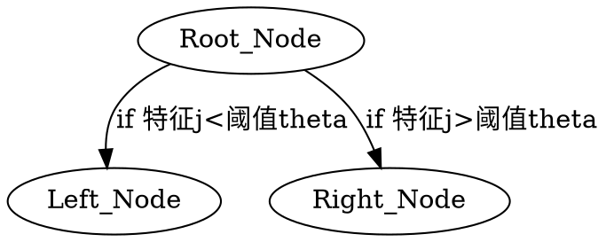
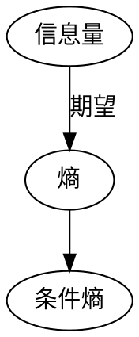

[TOC]

# 1. 决策树背景
## 1.1. 树的意义
决策树是一棵`if-then`树。 内部节点代表一个属性或特征，叶节点代表一个类。
决策树也是给定各个特征的情况下，某类别的概率。即条件概率 `P(Y∣X)`。



**关键**
1. 节点关键特征j
2. 阈值$\theta$
3. 预测值p

## 1.2. 树的生成
构建根节点，选择最优特征。按照特征划分子集，继续选择新的最优特征，直到没有或者全部被正确分类。

## 1.3. 剪枝

决策树的生成对应于模型的局部选择，会尽量拟合训练数据，导致模型复杂和过拟合。

决策树的剪枝对应于模型的全局选择， 自下而上删掉一些节点。

## 1.4. 熵和信息增益
在每个节点，要选择一个最优特征生成。

ID3 使用**信息增益**最大选择最优特征
C4.5 使用**信息增益率-ratio**最大来选择最优特征
CART回归树**平方误差MSE** 最小
CART分类树**基尼指数**最小



### 1.4.1. 信息量
信息量是随机变量X不确定性的度量。
$$I(X)=−log(x)$$
### 1.4.2. 熵
熵(Entropy)是信息量的期望，也是随机变量不确定性的度量。
熵偏向`离散属性`， 基尼指数偏向`连续属性`。
$$H(X)=−\sum_ {x∈X} p(x)logp(x)$$
### 1.4.3. 条件熵
条件熵是在给定随机变量X的情况下，随机变量Y的不确定性。
$$H(Y∣X)=\frac{1}{k}\sum_{i=1} p(x_i)H(Y|X=x_i) X$$
共有K类，其中 $p(x_i)$表示X属于第i类的概率。$H(Y|X=x_i)$ 表示$X=x_i$时Y的子集的熵。
### 1.4.4. 经验熵和经验条件熵
由数据估计（极大似然估计）得到的熵和条件熵。如数据集总共有D个样本，有$K$个类别。类别为$k$的样本数量为$C_k$经验熵是:
$$ H(D)=\frac{1}{k} \sum_{k=1}^K \frac{C_k}{D} \log_2\frac{C_k}{D} $$ 
特征A根据取值把数据集D划分为n个子集，则给定特征A时数据集D的经验条件熵是：
$$ H(D|A)=\sum_{i=1}^n \frac{D_i}{D}H(D_i)=-\sum_{i=1}^n \frac{|D_i|}{|D|}\sum_{k=1}^{K}\frac{|D_{ik}|}{|D_i|}log_2\frac{|D_{ik}|}{|D_i|}$$

### 1.4.5. 信息增益
信息增益是给定特征A，使得数据集D不确定性减少的程度。
$$信息增益 = 划分前熵 - 划分后熵 $$

$$信息增益= 熵g - 条件熵g(D,A)=H(D)−H(D∣A)$$

特征A的信息增益越大，不确定性减少越多，A的分类能力就越强。

* 信息增益**不适合**`连续型`、`取值多`的特征
* 使得所有分支下的样本集合都是纯的，极端情况每一个叶子节点都是一个样本
* 数据更纯，信息增益更大，选择它作为根节点，结果就是庞大且深度很浅的树
* 
### 1.4.6. 信息增益比
特征A的有n个取值：
$$HA(D)=-\sum_{i=1}^n\frac{|D_i|}{|D|}\log_2\frac{|D_i|}{|D|}$$

$$信息增益比 = \frac{信息增益}{划分前熵}=\frac{信息增益}{D}$$

关于特征A的熵 ：gR(D,A)=g(D,A)HA(D)=H(D)−H(D∣A)HA(D)解决信息增益
的问题：特征A分的类别越多，D关于A的熵就越大，作为分母，所以信息增益
gR(D,A) 就越小。在信息增益的基础上增加了一个分母惩罚项。信息增益比的
问题：实际上偏好可取类别数目较少的特征。


### 1.4.7. 基尼指数
CART分类树使用基尼指数来选择最优特征。 基尼指数也是度量不确定性。 熵偏向`离散属性`， 基尼指数偏向`连续属性`。
1. **概率分布基尼指数**
分类问题中，有$K$类。 样本属于第$k$类的概率为$p_k$
$$ Gini(p)=\sum_{k=1}^{K}p_k(1-p_k)=1-\sum_{k=1}^Kp_k^2$$


2. **样本集合基尼指数**
集合D，有$K$类，$D_k$ 是第k类的样本子集。则D的基尼指数:

$$ Gini(D)=1-\sum_{k=1}^K(\frac{|D_k|}{|D|})^2$$

3. **特征A条件基尼指数**
特征A取值为某一可能取值为a。 根据A是否取值为a把D划分为$D_1$和$D_2$两个集合。
在特征A的条件下，D的基尼指数如下：
$$ Gini(D,A)=\frac{|D_1|}{|D|}Gini(D_1)+\frac{|D_2|}{|D|}Gini(D_2)$$

$Gini(D,A)$是集合D根据特征A分割后，集合D的不确定性。


## 1.5. 分类树

```python
XGBRegressor(base_score=0.5, booster='gbtree', colsample_bylevel=1,
             colsample_bynode=1, colsample_bytree=0.8, gamma=0.1,
             importance_type='gain', learning_rate=0.02, max_delta_step=0,
             max_depth=20, min_child_weight=0.8, missing=None, n_estimators=500,
             n_jobs=1, nthread=None, objective='reg:linear', random_state=128,
             reg_alpha=0, reg_lambda=1, scale_pos_weight=1, seed=None, silent=1,
             subsample=0.8, verbosity=1)
```

## 1.6. 回归树
```python
class BaseDecisionTree(six.with_metaclass(ABCMeta, BaseEstimator)):
    """Base class for decision trees.

    Warning: This class should not be used directly.
    Use derived classes instead.
    """

    @abstractmethod
    def __init__(self,
                 criterion,
                 splitter,
                 max_depth,
                 min_samples_split,
                 min_samples_leaf,
                 min_weight_fraction_leaf,
                 max_features,
                 max_leaf_nodes,
                 random_state,
                 min_impurity_decrease,
                 min_impurity_split,
                 class_weight=None,
                 presort=False):
        self.criterion = criterion 
        self.splitter = splitter
        self.max_depth = max_depth
        self.min_samples_split = min_samples_split
        self.min_samples_leaf = min_samples_leaf
        self.min_weight_fraction_leaf = min_weight_fraction_leaf
        self.max_features = max_features
        self.random_state = random_state
        self.max_leaf_nodes = max_leaf_nodes
        self.min_impurity_decrease = min_impurity_decrease
        self.min_impurity_split = min_impurity_split
        self.class_weight = class_weight
        self.presort = presort

class BinaryTree(object):
    def __init__(self, node, left, right):
        self.node = node
        self.left = left
        self.right = right


class CART(BinaryTree):
    def __init__(self, DataSetMat):
        # DataSetMat =pd.DataFrame([[]]) DataSetMat.shape=(counts,features)
        self.node = DataSetMat
        self.select_feature_index = None        # 选择划分的特征名称
        self.select_feature_split_value = None  # 该特征
        self.samples_counts = 0                 # 节点样本数量
        self.impurity = 0                       # 纯度

    def calcErr(self):
        """
        """
        error = 0
        return error

    def chooseBestFeatVal2Split(self):
        # 如果所有目标变量相等，停止
        if self.samples_counts <= 1:
            return None, None

        best_feature_name = ""
        best_value = 0
        lowestErr = 100000
        totalErr = self.impurity
        features_names = list(self.node)
        for feature_name in features_names:
            all_values_for_spec_feature = self.node[feature_name].tolist()
            uniq_values_for_spec_feature = set(all_values_for_spec_feature)
            for value in uniq_values_for_spec_feature:
                leftChild, rightChild = splitByFeatVal(
                    feature_name, value)
                curErr = calcErr(leftChild) + calcErr(rightChild)
                if(curErr < lowestErr):
                    best_feature_name = feature_name
                    bestValue = value
                    lowestErr = curErr
        # 如果误差减少很小，停止
        if(totalErr - lowestErr < 1):
            return None, None
        return best_feature_name, best_value

    def splitByFeatVal(self, feature, value, dataSetMat):
        # 左子树的值大于根节点的值
        leftChild = self.node[nonzero(dataSetMat[:, feature] > value)[0], :]
        # 右子树的值小于等于根节点的值
        rightChild = self.node[nonzero(dataSetMat[:, feature] <= value)[0], :]
        return leftChild, rightChild

```


# 2. 决策树算法

```python

class BaseDecisionTree(six.with_metaclass(ABCMeta, BaseEstimator)):
    """Base class for decision trees.

    Warning: This class should not be used directly.
    Use derived classes instead.
    """
    @abstractmethod
    def __init__(self,
                 criterion,
                 splitter,
                 max_depth,
                 min_samples_split,
                 min_samples_leaf,
                 min_weight_fraction_leaf,
                 max_features,
                 max_leaf_nodes,
                 random_state,
                 min_impurity_decrease,
                 min_impurity_split,
                 class_weight=None,
                 presort=False):
        self.criterion = criterion # 纯度
        self.splitter = splitter # 制决策树中的随机选项的
        self.max_depth = max_depth
        self.min_samples_split = min_samples_split
        self.min_samples_leaf = min_samples_leaf
        self.min_weight_fraction_leaf = min_weight_fraction_leaf
        self.max_features = max_features
        self.random_state = random_state
        self.max_leaf_nodes = max_leaf_nodes
        self.min_impurity_decrease = min_impurity_decrease
        self.min_impurity_split = min_impurity_split
        self.class_weight = class_weight
        self.presort = presort
```
## 2.1. ID3--最大信息增益
ID3算法决策树的生成，ID3算法以**信息增益最大**为标准选择特征。
递归构建，不断选择最优特征对训练集进行划分。递归终止条件：当前节点的所有样本，属于同一类别Ck，无需划分。该节点为叶子节点，类标记为Ck当前属性集为空，或所有样本在属性集上取值相同当前节点的样本集合为空，没有样本在集合D中，选择信息增益最大的特征Ag ：增益小于阈值，则不继续向下分裂，到达叶子节点。该节点的标记为该节点所有样本中的majority classCk。 这也是预剪枝增益大于阈值，按照特征Ag的每一个取值Ag=ai把D划分为各个子集Di，去掉特征Ag继续对每个内部节点进行递归划分。

## 2.2. C4.5--最大信息增益

C4.5算法是ID3的改进，C4.5以信息增益率最大为标准选择特征。

ID3/C4.5决策树剪枝决策树的生成，会过多地考虑如何提高对训练数据的分类，从而构建出非常复杂的决策树。就容易过拟合。剪枝就是裁掉一些子树和叶节点，并将其根节点或父节点作为叶节点。剪枝分为预剪枝和后剪枝。预剪枝在生成树的时候，设定信息增益的阈值，如果某节点的某特征的信息增益小于该阈值，则不继续分裂，直接设为叶节点。选择该节点的D中类别数量最多的类别 （majority class）作为类别标记。后剪枝树构建好以后，基于整体，极小化损失函数，自下而上地进行剪枝。

树T的参数表示叶节点的个数|T|叶节点t叶节点t上有Nt个样本有K类叶节点t上的经验熵Ht(T)α≥0 为惩罚系数叶节点t上的经验熵Ht(T)=−K∑k=1 NtkNtlogNtkNt模型对训练数据的拟合程度C(T) ，所有叶节点的经验熵和：C(T)=|T|∑t=1 NtHt(T)最终损失函数 = 拟合程度 + 惩罚因子：Cα(T)=C(T)+α|T|参数α权衡了训练数据的拟合程度和模型复杂度。α大，决策树简单，拟合不好α小，决策树复杂，过拟合剪枝步骤计算每个节点的经验熵递归从树的叶节点向上回缩。叶节点回缩到父节点：整体树：回缩前T1 ，回缩后T2Cα(T2)≤Cα(T1)， 则回缩到父节点， 父节点变成新的叶节点。


## 2.3. CART--最大基尼Gini指数

CART-Classification and regression tree分类与回归树。


# 参考资料 


