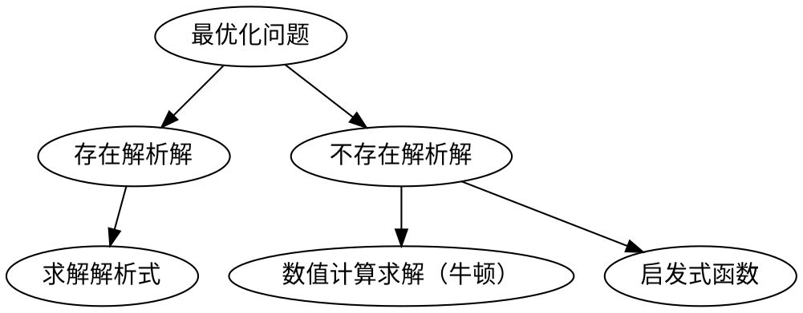
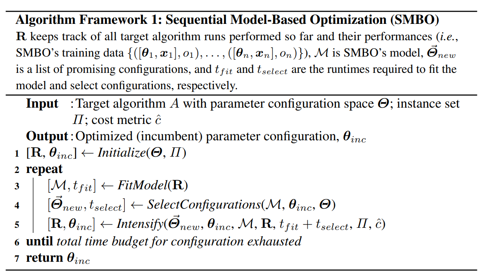
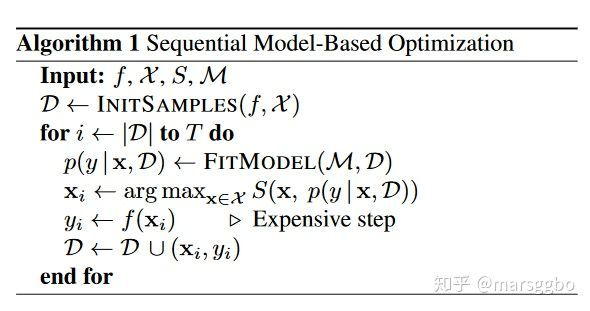
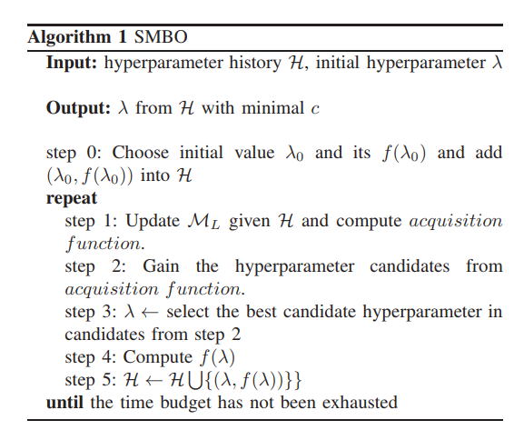

[TOC]
# 1. 常用的调超参方法

## 1.1. Grid Search 网格搜索/穷举搜索
搜索整个超参数空间，在高维空间容易遇到维度灾难，不实用。
网格搜索是一种昂贵的方法。假设我们有n个超参数，每个超参数有两个值，那么配置总数就是2的N次方。因此，仅在少量配置上进行网格搜索是可行的。
网格搜索可以并行化，使得网格搜索在足够的计算能力下更加可行。
每次trial之间是相互独立的，不能利用先验知识选择下一组超参数。

$$搜索超参数=n^M$$
## 1.2. Random Search 随机搜索
稀疏的简单抽样，试验之间是相互独立的，不能利用先验知识选择下一组超参数。
超参通过并行选择，但试验次数要少得多，而性能却相当。一些超参可能会产生良好的性能，另一些不会。
## 1.3. Heuristic Tuning 手动调参
经验法，耗时长。 

## 1.4. Automatic Hyperparameter Tuning  自动调参


略，详细见下文。


# 2. 自动调参的数学问题

对于机器学习模型或其他计算模型$Model_i$，我们都有一个评价模型的指标$score_i$。
基于历史的超参及这些超参在模型中获得得分，我们可以得到相应的模型f(x)
$$score=f(hyperparameters)$$

$$y==f(\Lambda)=f(\{\lambda_i\})$$

问题描述：
```
max_score=0
for Lambda_i in range(Lambda_i search space):
    score=f(Lambda_i)
    if score==max_score:
        lambda=Lambda_i
return lambda
# find lambda_i when score_i==max_score
```

对于参数估计过程（Parameter estimation），统计学有两类解决方案：
1. 频率主义学派：
   1. 参数是固定的
   2. 通过最优化似然函数
   - 最大释然估计
2. 贝叶斯学派：
   1. 参数是具有某一种分布形态的概率分布 
   2. 加速参数服从某一分布，然后计算观测参数，后验分布

一个问题统计数学建模后，就变成了又给最优化问题。




# 3. 启发式算法


启发式算法（heuristicalgorithm)是相对于最优化算法提出的。

启发式算法可以这样定义：一个基于直观或经验构造的算法，在可接受的花费（指计算时间和空间）下给出待解决组合优化问题每一个实例的一个可行解，该可行解与最优解的偏离程度一般不能被预计。

这些算法大部分都是黑箱模型，对于这些黑箱能处理问题的边界以及理论上限都缺乏相关的证明。

**keywords**: 黑箱模型

## 3.1. Naïve Evolution 进化算法

参考:https://arxiv.org/pdf/1703.01041.pdf

## 3.2. Anneal 退火算法


# 4. 构造性能模型进行最优值求解


## 4.1. 基于先验假设的概率性能模型
由于性能模型f(x) 不能通过具体表达式获得，贝叶斯方法跟踪过去的评估结果，这些结果用于形成将超参数映射到目标函数得分概率的概率模型。
$$P(score|hyperparameters)$$


### 4.1.1. 贝叶斯优化算法

Bayesian optimization is a sequential design strategy for global optimization of black-box functions[1] that doesn't require derivatives.
贝叶斯优化是一种**不需要求导**的**黑箱**函数全局优化的**序贯**设计策略。


**基本步骤**
1. 假设性能模型（Prior Function/先验函数,f）的概率分布形式
2. 启动：使用一些参数计算出一些（超参，输出）
3. 用（超参，输出）的历史信息刻画出概率分布的形式
4. 根据已有的性能模型求出当前模型下最优的超参
5. 使用超参计算新的（超参，输出），并将其加入历史信息
6. 重复步骤3
Algorithm 1 Basic pseudo-code for Bayesian optimization
```
    Place a Gaussian process prior on f
    Observe f at n0 points according to an initial space-filling experimental design. Set n = n0.
    while n ≤ N do
        Update the posterior probability distribution on f using all available data
        Let xn be a maximizer of the acquisition function over x, where the acquisition function is computed using
        the current posterior distribution.
        Observe yn = f(xn).
        Increment n
        end while
    Return a solution: either the point evaluated with the largest f(x), or the point with the largest posterior mean
```


**优势**
1. 比随机搜索需要更少的迭代
2. 能利用先验知识高效地调节超参数，每个试验不独立，前一个推动下一个选择
3. 不依赖人为猜测所需的样本量为多少，优化技术基于随机性，概率分布
4. 在目标函数未知且计算复杂度高的情况下极其强大
5. 在测试集表现优秀于手工调参结果，泛化性/鲁棒性好
6. 不易陷入局部最优
   
**适用于**
通常适用于连续值的超参，例如 learning rate, regularization coefficient

**缺点**

效果不稳定。由于初始化存在随机性，其效果不稳定。也有论文表明，贝叶斯优化算法并不显著优于随机搜索(random search)

**具体**
性能模型的概率分布形式一般假定为 高斯分布

| 算法 | 代理函数     | 采集函数               | 优缺点                             |
| ---- | ------------ | ---------------------- | ---------------------------------- |
| BO   | 高斯过程     | Expected Improvement   | 应用广泛，在低维空间表现出色       |
| SMAC | 回归随机森林 | Upper Confidence Bound | 对离散型变量表现出色               |
| TPE  | 高斯混合模型 | Expected Improvement   | 高维空间表现出色，有论文表明最实用 |


#### 4.1.1.1. 顺序模型的优化方法（SMBO）
基于顺序模型的优化方法（Sequential Model-Based Optimization, SMBO）是贝叶斯优化的形式化，是叶斯优化的最简形式。顺序是指一个接一个地运行试验，每次通过应用贝叶斯推理和更新概率模型（代理模型）来尝试更好的超参数。








那么超参和输出的关系如果假设为树型的关系，那么这个算法就成为TPE算法，
如果假设为高斯分布的话，就变成了SMAC算法。

##### 4.1.1.1.1. SMAC

我们假设针对一组超参$\{λ_i\}$，性能模型的输出值的概率是关于超参的正态分布，剩下的就是根据历史信息来计算均值方差了。


当然在标准的SMAC算法中，历史信息并没有多到能够计算出一个高斯过程的程度，为了达到这个目的，标准的SMAC算法建议已有的信息先构造出一个随机森林出来，使用随机森林算出来一些“预测”（超参，输出）（当然这些“预测”的信息并不进入历史信息），使用历史信息和预测信息一起构造当前迭代中的高斯过程。继而选择最优参数。


##### 4.1.1.1.2. TPE

我们假设针对一组超参λ，性能模型的输出为c的概率是关于超参的树的模型：


而l和g函数是根据先前已有的历史信息学习出来的函数（具体学习方法各有不同，限于篇幅这里不过多解释），剩下的也就是不断循环贝叶斯优化算法，逐步完善求优这棵树的具体形状了。

总之这类性能模型在边求精边求优，逐步给出在假设的条件下那个只有天知道的性能模型的解析形式，最终给出参考的最优超参的选择。


用一句话概括就是：在有限的迭代轮数内，按照损失函数的期望值最小同时方差最大的方式选择参数。直观点理解，就是选择loss小，并且最有可能更小的地方进行探索，寻找更优超参。


##### 4.1.1.1.3. Metis

**优势**
大多数调参工具仅仅预测最优配置，而 Metis 的优势在于有两个输出：(a) 最优配置的当前预测结果， 以及 (b) 下一次 Trial 的建议。 不再需要随机猜测!

大多数工具假设训练集没有噪声数据，但 Metis 会知道是否需要对某个超参重新采样。

大多数工具都有着重于在已有结果上继续发展的问题，而 Metis 的搜索策略可以在探索，发展和重新采样（可选）中进行平衡。
**过程**
 为了对超参-性能空间建模，Metis 同时使用了高斯过程（Gaussian Process）和高斯混合模型（GMM）。 由于每次 Trial 都可能有很高的时间成本，Metis 大量使用了已有模型来进行推理计算。 在每次迭代中，Metis 执行两个任务：
在高斯过程空间中找到全局最优点。 这一点表示了最佳配置。

它会标识出下一个超参的候选项。 这是通过对隐含信息的探索、挖掘和重采样来实现的。


更多详情，参考论文：https://www.microsoft.com/en-us/research/publication/metis-robustly-tuning-tail-latencies-cloud-systems/ 

##### 4.1.1.1.4. GP

高斯过程 

作为序列的基于模型的全局优化（SMBO）算法，GP Tuner 使用了代理优化问题（找到采集函数的最大值）。虽然这仍然是个难题，但成本更低（从计算的角度来看），并且有通用的工具。 因此，GP Tuner 适合于函数的优化成本非常高时来使用。 GP 也可在计算资源非常有限时使用。 由于需要反转 Gram 矩阵，GP Tuner 的计算复杂度以 O(N^3) 的速度增长，因此不适合于需要大量 Trial 的情形。 详细说明


## 4.2. 谱模型

相比于概率模型的假设，谱模型的假设相对来说并没有那么强。

泛函分析认为，绝大多数函数在特定条件下，都可以用一组正交函数系解析成傅里叶级数（实变函数，泛函分析中的傅里叶级数）（使用三角函数作为基底就是我们大一学的傅里叶级数（这里的傅里叶级数是狭义的傅里叶级数），而连续函数解析成正交函数基底表达的级数是由维尔斯特拉斯第二逼近定理所保证的）。这里我们并不想过多讨论数学，大家只需要明白正交函数系对应的傅里叶级数可以展开非常多函数这个事实即可。

那么我们假设的这个“天知道”的性能函数如果也能解析为傅里叶级数吗？我们假设可以的话，使用傅里叶级数所表达的这个性能模型，就是所谓的“谱模型”。

思路到这里，这种方法也就浮出了水面，整个思路落实到算法总共分类两部：


1. 构造一个足够好算的正交函数系。

2. 计算足够多的（超参，输出）样例，通过解方程的方法，计算出傅里叶级数前面的系数。

3. 使用这个傅里叶级数所表达的函数作为性能函数，求解出最优的超参选择。

谱模型算法

在这个思路下，我们就可以用很多信号的思考方式去对谱模型进一步优化，比如我们可以对这个谱进行滤波，通过刨去稀疏较小的项目进一步加快计算时间，甚至可以考虑一些噪音的因素，使用信号还原对噪音的处理方式处理这些傅里叶系数。


这类算法有非常好的理论思考方式，理论结果也非常漂亮。但是终归也是有一些问题的：

1. 傅里叶级数展开多少才是一个比较好的逼近？
2. “天知道”如果不是一个固定模型而是一个如贝叶斯算法所构造的概率模型该怎么样做？


在相关文献里，作者们认为为了得到更精确更好的解，依旧可以使用迭代的方法将上一轮得到的函数作为下一轮的先验函数进行校正，通过不断校正，使得得到的函数尽可能包容更多做实验得到的（超参，输出）结果。在思想上，这种方式有点接近最小二乘法。


# 5. 构造多臂赌博机问题进行最佳参数搜索


多臂赌博机问题(multi-armed bandit problem),也称为顺序资源分配问题(sequential resource allocation problem). 

在相关文献中，被转化的问题被称为“纯探索，非随机，无穷臂老虎机问题”(NIBP问题)。


整个问题的描述如下：

我们可以通过特定的分布生成一串老虎机，这些老虎机对应了一个编号，第k次拉动第i号老虎机我们可得到一个损失 li,k，当k趋向于无穷的时候li,k->vi.我们的目标是找到最小vi对应的第i号老虎机，当然整个过程中我们希望为了找到这个最小老虎机的过程的代价最小。

这个过程对应到自动求参问题如下：

已知：为了知道每组超参对应的输出需要花费一定的代价，比如时间，花费的代价越多，得到的输出和最终收敛结果的差距（波动）也就越小。这是显而易见的，训练的时间越长，得到的结果离最终收敛的结果也就越接近。我们希望在已有的多组超参中，用尽可能少的代价，找到收敛结果最小的那组超参。


## 5.2. successive halving 算法

这个问题可以通过如下的successive halving 算法求解：


问题：有n个超参组，我们希望在总资源B有限的情况下找到这n个超参中最好的参数。

输入：n个超参组，总资源B，每组超参最多使用的限制R，每轮选择a%的超参进入下一轮。

1.每一轮将资源平均分给各个超参，每组超参最多使用R个资源。每一轮总资源也是相同的。

2.模型使用这些超参和资源计算出对应的损失值。

3.取出每轮选择百分之a的超参组进入下一轮，重复步骤1。


显然，successive halving算法有其不合理的地方，其中最重要的是资源分配的问题（每轮都要分配的资源都要一致？）和探索步长（每轮选择多少超参组进入下一轮？）的问题。

作为successive halving的升级，Hyperband算法为此做了进一步的资源分配方案。


## 5.3. Hyperband算法

通过逐步改变每组超参可以用的资源的量和每轮计算所使用的资源的量，Hyperband实现了多步长探索最优参数。

理论证明，在总资源大于特定值的情况下，Hyperband可以搜索到我们期望的最优的老虎机。

了解决上述问题，Hyperband算法被提出。在介绍Hyperband之前我们需要理解怎样的超参数优化算法才算是好的算法，如果说只是为了找到最优的超参数组合而不考虑其他的因素，那么我们那可以用穷举法，把所有超参数组合都尝试一遍，这样肯定能找到最优的。但是我们都知道这样肯定不行，因为我们还需要考虑时间，计算资源等因素。而这些因素我们可以称为Budget,用\(B\)表示。

假设一开始候选的超参数组合数量是\(n\)，那么分配到每个超参数组的预算就是\(\frac{B}{n}\)。所以Hyperband做的事情就是在\(n\)与\(\frac{B}{n}\)做权衡(tradeoff)。

上面这句话什么意思呢？也就是说如果我们希望候选的超参数越多越好，因为这样能够包含最优超参数的可能性也就越大，但是此时分配到每个超参数组的预算也就越少，那么找到最优超参数的可能性就降低了。反之亦然。所以Hyperband要做的事情就是预设尽可能多的超参数组合数量，并且每组超参数所分配的预算也尽可能的多，从而确保尽可能地找到最优超参数。


Hyperband算法对 Jamieson & Talwlkar(2015)提出的SuccessiveHalving算法做了扩展。所以首先介绍一下SuccessiveHalving算法是什么。

其实仔细分析SuccessiveHalving算法的名字你就能大致猜出它的方法了：假设有\(n\)组超参数组合，然后对这\(n\)组超参数均匀地分配预算并进行验证评估，根据验证结果淘汰一半表现差的超参数组，然后重复迭代上述过程直到找到最终的一个最优超参数组合。

基于这个算法思路，如下是Hyperband算法步骤：


r: 单个超参数组合实际所能分配的预算；
R: 单个超参数组合所能分配的最大预算；
\(s_{max}\): 用来控制总预算的大小。上面算法中\(s_{max}=\lfloor log_\eta(R) \rfloor\),当然也可以定义为\(s_{max}=\lfloor log_\eta(n_{max}) \rfloor\)
B: 总共的预算,\(B=(s_{max}+1)R\)
\(\eta\): 用于控制每次迭代后淘汰参数设置的比例
get_hyperparameter_configuration(n):采样得到n组不同的超参数设置
run_then_return_val_loss(t,ri):根据指定的参数设置和预算计算valid loss。\(L\)表示在预算为\(r_i\)的情况下各个超参数设置的验证误差
top_k(\(T,L,\lfloor \frac{n_i}{\eta}\rfloor\)):第三个参数表示需要选择top k(\(k=\frac{n_i}{\eta}\rfloor\))参数设置。
注意上述算法中对超参数设置采样使用的是均匀随机采样，所以有算法在此基础上结合贝叶斯进行采样，提出了BOHB:Practical Hyperparameter Optimization for Deep Learning


文中给出了一个基于MNIST数据集的示例，并将迭代次数定义为预算(Budget),即一个epoch代表一个预算。超参数搜索空间包括学习率，batch size,kernel数量等。

令\(R=81,\eta=3\)，所以\(s_{max}=4,B=5R=5×81\)。

下图给出了需要训练的超参数组和数量和每组超参数资源分配情况。

由算法可以知道有两个loop，其中inner loop表示SuccessiveHalving算法。再结合下图左边的表格，每次的inner loop，用于评估的超参数组合数量越来越少，与此同时单个超参数组合能分配的预算也逐渐增加，所以这个过程能更快地找到合适的超参数。

右边的图给出了不同\(s\)对搜索结果的影响，可以看到\(s=0\)或者\(s=4\)并不是最好的，所以并不是说\(s\)越大越好


## 5.4. BOHB

与 Hyperband 类似，当计算资源有限但搜索空间相对较大时，建议使用此方法。 中间结果能够很好的反映最终结果的情况下，此算法会非常有效。 在这种情况下, 由于贝叶斯优化使用, 它可能会收敛到更好的配置
# 6. 总结

机器学习自动调整超参的框架现行的算法的求解思路基本上可以分为上述三种，具体落实的算法各有不同，比如我们可以调整传统强盗问题中置信度方法或者贝叶斯方法到新的NIBP问题中，或者构造新的正交函数系来刻画“天知道”的那个函数，或者加入数据库的信息进行热启动等。而且这些落实的算法近期也发表了不少文章。但是现行的框架如sklearn或者autoweka等还是主要使用传统的贝叶斯优化方法（SMAC）。

# 7. 参考资料


