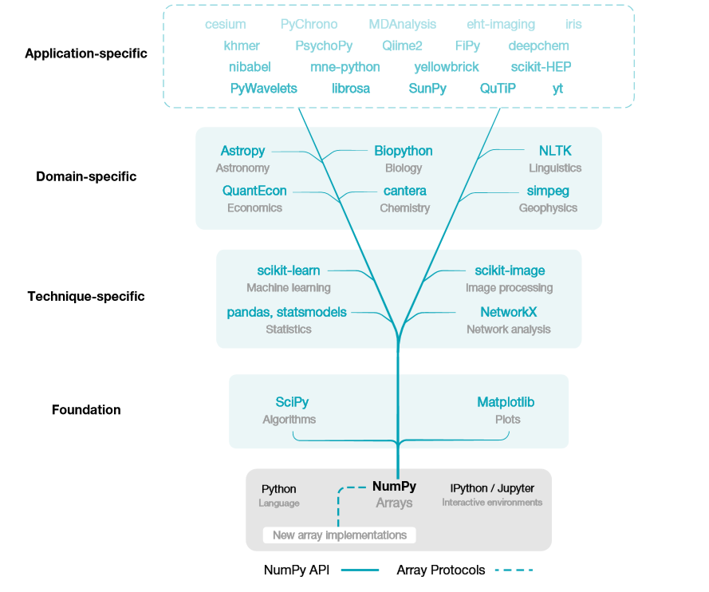
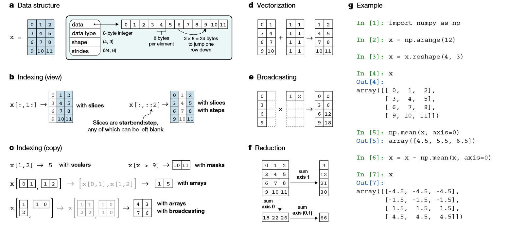

[TOC]

# 1. 简介

# 2. 地位
NumPy 是Python数据科学生态系统的基础[^1]

>NumPy is the base of the scientific Python ecosystem.




# 3. 基本概念



# 4. 创建数组对象

## 4.1. N维数组

```python
# zeros创建0矩阵
array=np.zeros((3, 4))
# ones创建1矩阵
array=np.ones((2, 3, 4), dtype=np.int16)
# empty不初始化数组，值随机
array=np.empty((2, 3))


# 创建[0, n-1]的数组
np.arange(3)

# 创建1-10范围类，3个数
np.arange(1, 10, 3)

# 取均值步长
np.linspace(0, 1.5, 3)
# array([ 0.  ,  0.75,  1.5 ])


##
#创建随机
```

## 4.2. one-hot
```python
a = np.array([1, 0, 3])
b = np.zeros((a.size, a.max()+1))
b[np.arange(a.size),a] = 1
b
>>>
array([[ 0.,  1.,  0.,  0.],
    [ 1.,  0.,  0.,  0.],
    [ 0.,  0.,  0.,  1.]])
```
# 5. 索引

`np.ravel_multi_index()`工作如何？

```shell 
array
>>>
# shape (30,2)
# array[1]'s unique value count is 5 

dims=(30,5)
# 线性index,linear indices
lidx=np.ravel_multi_index(array.T,dims)
>>>
[15,23...,..]
# shape=150


```

此函数为我们提供了线性索引当量数。它接受，设置为列的2D数组n-dimensional indices和该n维网格本身的形状，这些索引将映射到该n维网格上并计算等效的线性索引。

# 6. 数学运算

```python

a = np.array([20, 30, 40, 50])
b = np.arrange(4)
# 减法
c = b - a 
# 乘法
b * 2  # 新建一个矩阵
b *= 2 # 直接改变b，不会新建一个矩阵 a += 2 同理
# 次方
b ** 2
# 判断
a < 30 
# array([ True, False, False, False], dtype=bool)
10 * np.sin(a)

# 矩阵乘法
A = np.array([[1, 1], [0, 1]])
B = np.array([[2, 0], [3, 4]])
A.dot(B)
B.dot(A)
np.dot(A, B)

# sum, max, min
a = np.arange(12).reshape(3, 4)
array([[ 0,  1,  2,  3],
       [ 4,  5,  6,  7],
       [ 8,  9, 10, 11]])
# 所有元素sum, min, max
a.sum()
a.max()
# 使用axis=0按列, axis=1按行
a.sum(axis=0)
array([12, 15, 18, 21])
a.sum(axis=1)
array([ 6, 22, 38])

# 通用函数
B = np.arange(3)
np.exp(B) # 求e的次方
np.sqrt(B) # 开方
C = np.array([2, -1, 4])
np.add(B, C) # 相加
```

# 7. 数组shape操作
```python
a = np.floor(10*np.random.random((3,4)))	# <1的小数*10，取整
array([[ 9.,  6.,  3.,  8.],
       [ 2.,  8.,  4.,  2.],
       [ 5.,  3.,  3.,  1.]])
# 形状
a.shape
(3, 4)
# 打平，返回array
a.ravel()
array([ 9.,  6.,  3.,  8.,  2.,  8.,  4.,  2.,  5.,  3.,  3.,  1.])
# reshape 生成新的
a.reshape(2, 6) 
a.reshape(3, -1) # 给定一个，自动计算另外的
# resize 改变自己
a.resize(4, 3)
# 转置
a.T
```

```python 
res=np.where(condition, x, y)
# 满足条件(condition)，输出x，不满足输出y。

res=np.where(condition)
# 返回索引
```

# 8. 参考资料


[^1]: [Nature: Array programming with NumPy](https://www.nature.com/articles/s41586-020-2649-2)