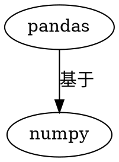

[TOC]

# 1. 概述

## 1.1. 关系
* numpy 和 pandas 都是采用 C 语言编写， pandas 又是基于 numpy, 是 numpy 的升级版本。
* **numpy 可以是多维数组，pandas 1维/2维 数组**

* Pandas是基于Numpy构建的，让Numpy为中心的应用变得更加简单。
## 1.2. 性能
* numpy 和 pandas消耗资源少：采用的是矩阵运算，会比 python 自带的字典或者列表快好多 

• numpy consumes (roughtly 1/3) less memory compared to pandas
• numpy generally performs better than pandas for 50K rows or less
• pandas generally performs better than numpy for 500K rows or more
• for 50K to 500K rows, it is a toss up between pandas and numpy depending on the kind of operation

# 2. 参考资料

[1]:numpy-vs-pandas-comparison: http://gouthamanbalaraman.com/blog/numpy-vs-pandas-comparison.htm

