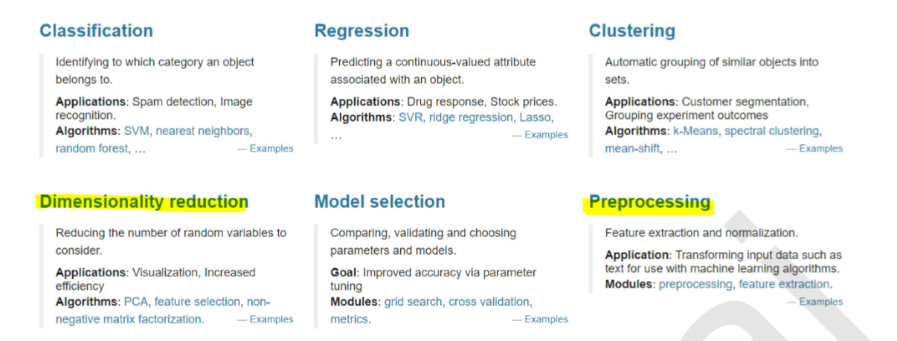

[TOC]

# 1. Scikit-learn 介绍

Scikit-learn 是开源的 Python 库，通过统一的界面实现机器学习、预处理、交叉验证及可视化算法。

Scikit-learn 基于 numpy、scipy 开发。numpy基于C编写，不支持GPU。

scikit-learn 网站：https://scikit-learn.org

scikit-learn 的6大模块


1 分类
2 回归
3 聚类
4 降维
5 模型选择
6 预处理


# 2. Scikit-learn 机器学习步骤

Scikit-learn 机器学习基本步骤：
```python 
# 导入 sklearn
from sklearn import neighbors, datasets, preprocessing
from sklearn.model_selection import train_test_split
from sklearn.metrics import accuracy_score

# 加载数据
iris = datasets.load_iris()

# 划分训练集与测试集
X, y = iris.data[:, :2], iris.target
X_train, X_test, y_train, y_test = train_test_split(X, y, random_state=33)

# 数据预处理
scaler = preprocessing.StandardScaler().fit(X_train)
X_train = scaler.transform(X_train)
X_test = scaler.transform(X_test)

# 创建模型
knn = neighbors.KNeighborsClassifier(n_neighbors=5)
# 模型拟合
knn.fit(X_train, y_train)

# 预测
y_pred = knn.predict(X_test)
# 评估
accuracy_score(y_test, y_pred)
```
scikit-learn (sklearn) 官方文档中文版[^1]

# 3. 库使用路线图


# 4. 参考资料

[^1]: scikit-learn (sklearn) 官方文档中文版
：https://sklearn.apachecn.org/docs/0.21.3/


