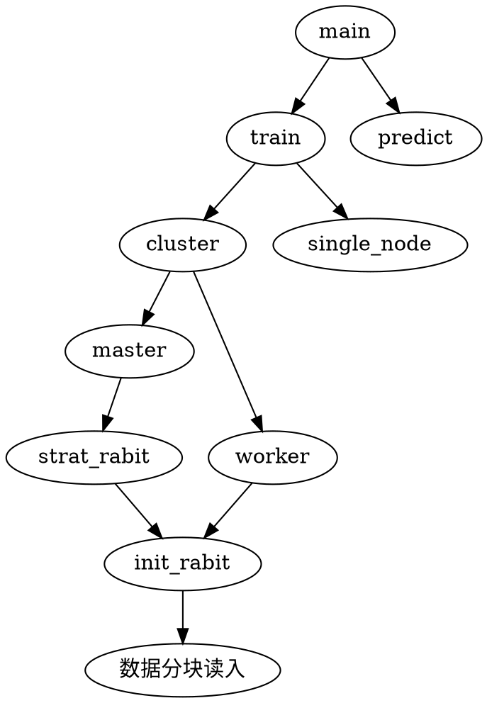

[TOC]

# 1. Distributed XGBoost with Kubernetes

## 1.1. 数据并行
将训练数据分割，数据并行进行模型的训练、预测。
## 1.2. 模型并行
`xgboost工具` 支持并行计算，可基于分布式系统，进行模型并行分布式计算。

## 1.3. 原理

### 1.3.1. 并行计算的可行性

**boosting算法的并行计算可能性？** 
>boosting算法是一种串行结构的算法，顺序处理完成上一个树，再构建下一个树，算法上没有并行计算的可能性

**xgboost 工具为什么有并行计算的可能性**
> xgboost在训练之前，对输入的每个特征进行了预排序，并保存为block结构，为并行计算成为了可能。

**并行计算什么？**
> 多线程计算各个特征的增益

boosting是一种串行的结构，怎么并行的？注意xgboost的并行不是tree粒度的并行，xgboost也是一次迭代完才能进行下一次迭代的（第t次迭代的代价函数里包含了前面t-1次迭代的预测值）。xgboost的并行是在特征粒度上的。


决策树的学习最耗时的一个步骤就是: **对特征的值进行排序**（因为要确定最佳分割点）

xgboost在训练之前，预先对数据进行了排序，然后保存为block结构，后面的迭代中重复地使用这个结构，大大减小计算量。这个block结构也使得并行成为了可能，在进行节点的分裂时，需要计算每个特征的增益，最终选增益最大的那个特征去做分裂，那么**各个特征的增益计算就可以开多线程进行**。


### 1.3.3. XGBoost的并行处理的工程实践
XGBoost的分布式逻辑其实还是通过RABIT来完成的，并且是通过RabitTracker完成任务的co-ordination。

#### 1.3.3.1. rabit
rabit(Reliable Allreduce and Broadcast Interface)是一个实现 `Allreduce（规约）` 和 `Broadcast` 的容错接口的轻量级库。它旨在支持便捷的、可拓展、可实现的分布式机器学习程序。底层是通过`socket`通讯.
CAP 
说它可容错是因为它为所有的节点设计了一个环状结构，假如某个节点down掉了可以通过ring replication strategy从相邻的节点恢复。


Allreduce 结构


1 当一个xgboost任务提交到yarn上时，先在driver端启动一个RabitTracker，RabitTracker提供N个end point给worker连接。
2 然后通过yarnclient向RM请求资源来创建AM。
3 RM先在NM上创建一个container，并在这个container里面启动任务的AM。
4 AM根据资源配置向RM请求具体执行的容器。
5 AM申请到容器之后，会将boost程序发送到容器并启动，同时管理这些容器。
6 每一个xgboost通过rabit框架和rabitTracker通信完成注册，rabitTracker将这些rabit编号并形成环形网络结构。
7那么AM监控和管理容器的运行情况，rabittracker协调xgboost的运作。

RabitTracker过执行dmlc-core工程下的tracker.py来创建。具体做得事：
1启动daemon线程，提供worker结点注册联接所需的end point，所有的worker结点都可以通过与Tracker程序通信来完成自身状态信息的注册。
2 co-ordinate worker结点的执行：
为worker结点分配Rank编号。 基于收到的worker注册信息完成环形网络结构的构建，并广播给worker结点，以确保worker结点之间建立起合规的网络拓扑。 当所有的worker结点都建立起完备的网络拓扑关系以后，就可以启动计算任务监控整个执行过程。


[Parallel Gradient Boosting Decision Trees](http://zhanpengfang.github.io/418home.html)

# 2. 基本步骤

## 2.1. 架构设计
## 2.2. 安装
官方推荐再kubernetes集群上使用 Kubeflow 提供的 [XGBoost Operator](https://github.com/kubeflow/xgboost-operator) 来支持分布式的 XGBoost 训练及预测

## 2.3. 源代码编写



1. `main()` 函数设置传入命令行参数(分为 `train`,`predict`模式)
2. 设置Master,Works架构
3. 
### 2.3.1. main() 函数构建训练及预测模式

`main()` 函数需要通过命令行参数处理：

1. 训练模式
2. 预测模式

```python 
import argparse
import logging

from train import train
from predict import predict
from utils import dump_model


def main(args):

    model_storage_type = args.model_storage_type
    if (model_storage_type == "local" or model_storage_type == "oss"):
      print ( "The storage type is " + model_storage_type)
    else:
      raise Exception("Only supports storage types like local and OSS")

    if args.job_type == "Predict":
        logging.info("starting the predict job")
        predict(args)

    elif args.job_type == "Train":
        logging.info("starting the train job")
        model = train(args)

        if model is not None:
            logging.info("finish the model training, and start to dump model ")
            model_path = args.model_path
            dump_model(model, model_storage_type, model_path, args)

    elif args.job_type == "All":
        logging.info("starting the train and predict job")

    logging.info("Finish distributed XGBoost job")


if __name__ == '__main__':
    parser = argparse.ArgumentParser()

    parser.add_argument(
           '--job_type',
           help="Train, Predict, All",
           required=True
           )
    parser.add_argument(
           '--xgboost_parameter',
           help='XGBoost model parameter like: objective, number_class',
          )
    parser.add_argument(
          '--n_estimators',
          help='Number of trees in the model',
          type=int,
          default=1000
          )
    parser.add_argument(
           '--learning_rate',
           help='Learning rate for the model',
           default=0.1
          )
    parser.add_argument(
          '--early_stopping_rounds',
          help='XGBoost argument for stopping early',
          default=50
          )
    parser.add_argument(
          '--model_path',
          help='place to store model',
          default="/tmp/xgboost_model"
          )
    # 模型默认存储在对象存储oss上
    parser.add_argument(
          '--model_storage_type',
          help='place to store the model',
          default="oss"
          )
    
    parser.add_argument(
          '--oss_param',
          help='oss parameter if you choose the model storage as OSS type',
          )

    logging.basicConfig(format='%(message)s')
    logging.getLogger().setLevel(logging.INFO)
    main_args = parser.parse_args()
    main(main_args)
```

### 2.3.2. train() 函数构建单机及分布式模式
train() 函数需要通过命令行参数输入确定：
1. Master 节点
2. Worker 节点

```python 
import logging
import xgboost as xgb
import traceback

from tracker import RabitTracker
from utils import read_train_data, extract_xgbooost_cluster_env

logger = logging.getLogger(__name__)


def train(args):
    """
    :param args: configuration for train job
    :return: XGBoost model
    """
    addr, port, rank, world_size = extract_xgbooost_cluster_env()
    rabit_tracker = None

    try:
        """start to build the network"""
        if world_size > 1:
            # 如果有多个节点
            if rank == 0:
                logger.info("start the master node")

                rabit = RabitTracker(hostIP="0.0.0.0", nslave=world_size,
                                     port=port, port_end=port + 1)
                rabit.start(world_size)
                rabit_tracker = rabit
                logger.info('###### RabitTracker Setup Finished ######')
            # 每个节点都运行以下
            envs = [
                'DMLC_NUM_WORKER=%d' % world_size,
                'DMLC_TRACKER_URI=%s' % addr,
                'DMLC_TRACKER_PORT=%d' % port,
                'DMLC_TASK_ID=%d' % rank
            ]
            logger.info('##### Rabit rank setup with below envs #####')
            for i, env in enumerate(envs):
                logger.info(env)
                envs[i] = str.encode(env)

            # 每个节点都要进行初始化
            xgb.rabit.init(envs)
            logger.info('##### Rabit rank = %d' % xgb.rabit.get_rank())
            rank = xgb.rabit.get_rank()

        else:
            world_size = 1
            logging.info("Start the train in a single node")

        df = read_train_data(rank=rank, num_workers=world_size, path=None)
        kwargs = {}
        kwargs["dtrain"] = df
        kwargs["num_boost_round"] = int(args.n_estimators)
        param_xgboost_default = {'max_depth': 2, 'eta': 1, 'silent': 1,
                                 'objective': 'multi:softprob', 'num_class': 3}
        kwargs["params"] = param_xgboost_default

        logging.info("starting to train xgboost at node with rank %d", rank)
        bst = xgb.train(**kwargs)

        if rank == 0:
            model = bst
        else:
            model = None

        logging.info("finish xgboost training at node with rank %d", rank)

    except Exception as e:
        logger.error("something wrong happen: %s", traceback.format_exc())
        raise e
    finally:
        logger.info("xgboost training job finished!")
        if world_size > 1:
            xgb.rabit.finalize()
        if rabit_tracker:
            rabit_tracker.join()

    return model
```


## 2.3.3. 构建容器镜像
构建镜像 并命名为 `xgboost-dist-iris`
```dockerfile
# Use an official Ubuntu 18.04 as parent image
FROM ubuntu:18.04

# Install python 2.7
FROM python:2.7

RUN apt-get update
RUN apt-get install -y git make g++

# Build XGBoost
RUN git clone --recursive https://github.com/dmlc/xgboost && \
    cd xgboost && \
    make -j4 && \
    cd python-package; python setup.py install

# Download code and install dependencies
# 下载源代码 同时安装依赖包
RUN cd .. && \
    git clone https://github.com/kubeflow/examples.git && \
    cd examples && \
    cd xgboost_ames_housing && \
    pip install -r seldon_serve/requirements.txt

ENTRYPOINT ["python", "examples/xgboost_ames_housing/housing.py"] 
```

## 镜像推送到镜像仓库
```shell 
docker push xxx
```

## 2.3.4. 编写 job yaml

1个Master2个Worker 节点规划的训练模式配置文件

```yml
apiVersion: "xgboostjob.kubeflow.org/v1alpha1"
kind: "XGBoostJob"
metadata:
  name: "xgboost-dist-iris-test-train"
spec:
  xgbReplicaSpecs:
    Master:
      # 设置Master 副本数量
      replicas: 1
      restartPolicy: Never
      template:
        apiVersion: v1
        kind: Pod
        spec:
          containers:
          - name: xgboostjob
            image: docker.io/merlintang/xgboost-dist-iris:1.1 # 使用自定义的镜像（注意镜像仓库地址）
            ports:
            - containerPort: 9991
              name: xgboostjob-port
            imagePullPolicy: Always
            # 设置python 程序 参数
            args:
              - --job_type=Train
              - --xgboost_parameter=objective:multi:softprob,num_class:3
              - --n_estimators=10
              - --learning_rate=0.1
              - --model_path=autoAI/xgb-opt/2
              - --model_storage_type=oss
              - --oss_param=unknown
    Worker:
      replicas: 2
      restartPolicy: ExitCode
      template:
        apiVersion: v1
        kind: Pod
        spec:
          containers:
          - name: xgboostjob
            image: docker.io/merlintang/xgboost-dist-iris:1.1 # 使用自定义的镜像（与Master相同）
            ports:
            - containerPort: 9991
              name: xgboostjob-port
            imagePullPolicy: Always
            # 设置传入python 的参数 
            args:
              - --job_type=Train
              - --xgboost_parameter="objective:multi:softprob,num_class:3"
              - --n_estimators=10
              - --learning_rate=0.1
```

1 Master 2 Work 的预测模式配置文件

```yml
apiVersion: "xgboostjob.kubeflow.org/v1alpha1"
kind: "XGBoostJob"
metadata:
  name: "xgboost-dist-iris-test-predict"
spec:
  xgbReplicaSpecs:
    Master:
      replicas: 1
      restartPolicy: Never
      template:
        apiVersion: v1
        kind: Pod
        spec:
          containers:
          - name: xgboostjob
            image: docker.io/merlintang/xgboost-dist-iris:1.1
            ports:
            - containerPort: 9991
              name: xgboostjob-port
            imagePullPolicy: Always
            args:
              - --job_type=Predict
              - --model_path=autoAI/xgb-opt/2
              - --model_storage_type=oss
              - --oss_param=unknown
    Worker:
      replicas: 2
      restartPolicy: ExitCode
      template:
        apiVersion: v1
        kind: Pod
        spec:
          containers:
          - name: xgboostjob
            image: docker.io/merlintang/xgboost-dist-iris:1.1
            ports:
            - containerPort: 9991
              name: xgboostjob-port
            imagePullPolicy: Always
            args:
             - --job_type=Predict
             - --model_path=autoAI/xgb-opt/2
             - --model_storage_type=oss
             - --oss_param=unknown

```

### 2.3.5. 提交XGBoost job 到Kubernetes 集群


```shell
## For training job 
kubectl create -f xgboostjob_v1alpha1_iris_train.yaml 

## For bath prediction job 
kubectl create -f xgboostjob_v1alpha1_iris_predict.yaml
```


**监控任务** 

```shell
kubectl get -o yaml XGBoostJob/xgboost-dist-iris-test-predict
```
# 最佳实践

1. 下模板（[地址](https://github.com/kubeflow/xgboost-operator/tree/master/config/samples/xgboost-dist)），改代码
2. 新建镜像
3. 修改编排yml
4. 提交


# 3. 参考资料

[^官方]: [官方文档 Distributed XGBoost with Kubernetes](https://xgboost.readthedocs.io/en/latest/tutorials/kubernetes.html)