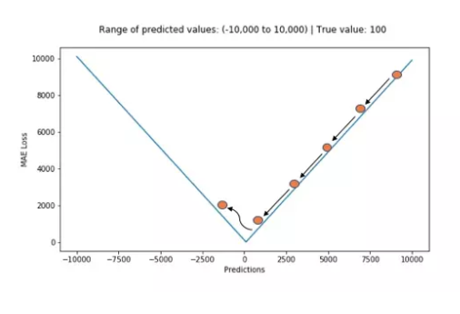
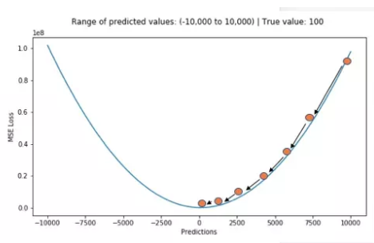
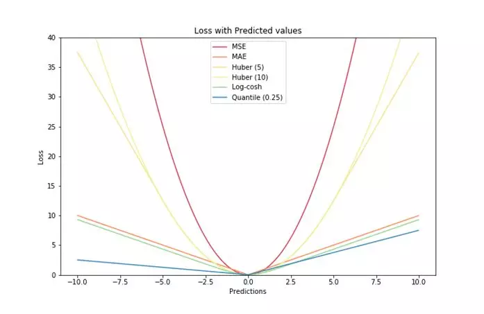
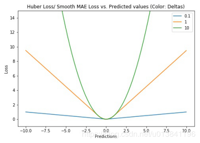

[TOC]
[] (https://github.com/tankywoo/simiki/blob/master/LICENSE)

# 1.训练的管理（tf.train）
tensorflow 主要有2种方式进行训练监督
1. tf.train.MonitorSession()
2. tf.train.Supervisor

### 1. tf.train.Supervisor

tf.Supervisor 是一个比较简单的训练监督方法。

> 1. 自动save_model
> 2. 自动write_summary (tensorboard)
> 3. 检查停止点
> 4. check_point 文件中恢复模型
> 

* 它每10分钟(默认save_model_secs=600)向 'logdir'内保存图内的 vars
* 并且它每2分钟（默认save_summaries_secs=120）自动运行 所有的 summary_ops，同时把 event file 存进 'logdir' 。
* 他还自动记录 steps ， 在它自己的线程里启动  tf.train.QueueRunner 。
* 也可以用它来检查停止点 tf.Supervisor.should_stop() ，要使用这个的话需要自己来设定 stop creterion ，然后当满足该条件时再用 tf.Supervisor.request_stop() 来触发 tf.Supervisor.should_stop() ，下一次检查 should_stop() 时就会停下。


> 
        sv.prepare_or_wait_for_session(server.target)
        merged_summary_op = tf.merge_all_summaries()
        sv = tf.train.Supervisor(logdir="/home/keith/tmp/",init_op=init_op) 
        #logdir用来保存checkpoint和summary
        saver=sv.saver

从上面代码可以看出，Supervisor帮助我们处理一些事情：
1. 自动去checkpoint加载数据或初始化数据
2. 自身有一个Saver，可以用来保存checkpoint
3. 有一个summary_computed用来保存Summary

所以，我们就不需要：
1. 手动初始化或从checkpoint中加载数据
2. 不需要创建Saver，使用sv内部的就可以
3. 不需要创建summary writer


        __init__(
        graph=None,
        ready_op=USE_DEFAULT,
        ready_for_local_init_op=USE_DEFAULT,
        is_chief=True,
        init_op=USE_DEFAULT,
        init_feed_dict=None,
        local_init_op=USE_DEFAULT,
        logdir=None,
        summary_op=USE_DEFAULT,
        saver=USE_DEFAULT,
        global_step=USE_DEFAULT,
        save_summaries_secs=120,
        save_model_secs=600,
        recovery_wait_secs=30,
        stop_grace_secs=120,
        checkpoint_basename='model.ckpt',
        session_manager=None,
        summary_writer=USE_DEFAULT,
        init_fn=None,
        local_init_run_options=None
        )


### 2. tf.train.MonitorSession()

处理以下操作：
1. 参数初始化
2. 使用钩子hook
3. 从错误中恢复会话的运行

执行步骤:
> 1. MonitoredSession init
> 2. MonitoredSession run
> 3. MonitoredSession close

#### 1. MonitoredSession init 初始化
>
1. 调用 hook.begin()
2. 调用scaffold.finalize() 
   >初始化计算图
   >> 如果没有指定scaffold,使用 ops.GraphKeys.SUMMARY_OP 构建图，所有， tf.train.MonitorSession() 要指定图。tf.1.12 的init 中
3. Creatsession.
   >sess=tf.Seession as
   创建会话 
4. init Scaffold的操作(op)
   > sess.run(Scaffold.init_op) 初始化模型
   >>Scaffold.init_op 如果没有，

5. 如果checkpoint存在的话，restore模型的参数 launches queue runners
6. 调用hook.after_create_session()

#### 2. MonitoredSession run 运行
>
1. 调用hook.before_run()
2. 调用TensorFlow的 session.run()
3. 调用hook.after_run()
4. 返回用户需要的session.run()的结果

如果发生了AbortedError或者UnavailableError，则在再次执行run()之前恢复或者重新初始化会话
#### 3.  MonitoredSession close 关闭

>
1. 调用hook.end()
2. 关闭队列和会话
3. 阻止OutOfRange错误
>

#### 4. 关键点1： global step

global_step在训练中是计数的作用，每训练一个batch就加1

在初始化训练的监控程序之前，一个用于跟踪训练步数的张量 global step 必须 添加到图中

1. 初始化时，global step必须被设定:
    global_step = tf.train.get_global_step /tf.train.get_or_create_global_step
2. 在训练过程中，step可以被获取:
    step = tf.train.global_step(sess, global_step)
3. step 通过传递到min op 中自增加:
    tf.train.AdamOptimizer(self.learning rt).minimize(self.loss, global step=self.step)
*****


**Arg**:

**session_creator**: 制定用于创建回话的ChiefSessionCreator.
**hooks**: An iterable of `SessionRunHook' objects.


> 主要有
> 1. LoggingTensorHook  每 N step/每N 秒 输出指定 tensors
> 2. SummarySaverHook 每N steps 保存Summary
> 3. CheckpointSaverHook 每N steps 保存Checkpoint
> 4. NanTensorHook 监测loss 函数，当loss==NaN 时停止训练
> 5. FeedFnHook 运行 feed_fn 函数 通知是的 feed_dict 字典匹配 
> 6. GlobalStepWaiterHook 分布式使用GlobalStep时 
> 7. ProfilerHook 在分布式计算过程中用于逐步启动worker
> 8. tf.train.StopAtStepHook()设置停止训练的条件

#### 5. 关键点2： tf.train.Scaffold

当你建立以用于训练的模型的时候，你通常需要 初始化操作、一个保存检查点checkpoint 的操作，一个用于tensorboard 可视化的summary 操作等，Scaffold类 将帮助你创建并添加到一个集合里面

可以省略 init_op \ tensorboard  tf.summary.merge_all()
或者 在tf.train.Scaffold中定义 init_op、summary_op、ready_op
```python

__init__(
    init_op=None,
    init_feed_dict=None,
    init_fn=None,
    ready_op=None,
    ready_for_local_init_op=None,
    local_init_op=None,
    summary_op=None,
    saver=None,
    copy_from_scaffold=None
)

```

#### 6. 常用子类： tf.train.MonitoredTrainingSession()
属于.MonitorSession() 是其子类 ,返回.MonitorSession()
主要功能：

1. 自动保存检查点checkpoint saver_hook = CheckpointSaverHook(...)
2. 自动运行保存summary（tensorboard） summary_hook = SummarySaverHook(...)
3. 方便在多设备上运行tensorflow  session_creator


>注意上述的全部功能其实都是程序设定了默认值运行的。如 ，自动保存检查点checkpoint。里面靠寻找name为“global_step”的变量，来寻找global_step,所以需要在图中定义名称为global_step的变量。tf.train.MonitoredTrainingSession()作为sess, sess 里面主要是train—_op ，才能定义global_step

        tf.train.MonitoredTrainingSession(
        master='',
        is_chief=True,
        checkpoint_dir=None,
        scaffold=None,
        hooks=None,
        chief_only_hooks=None,
        save_checkpoint_secs=USE_DEFAULT,
        save_summaries_steps=USE_DEFAULT(100),
        save_summaries_secs=USE_DEFAULT,
        config=None,
        stop_grace_period_secs=120,
        log_step_count_steps=100,
        max_wait_secs=7200,
        save_checkpoint_steps=USE_DEFAULT,
        summary_dir=None
        )

>**Args:**
**master** 字符串 the TensorFlow master to use.
**is_chief**：用于分布式系统中，用于判断该系统是否是chief，如果为True，它将负责初始化并恢复底层TensorFlow会话。如果为False，它将等待chief初始化或恢复TensorFlow会话。
**checkpoint_dir**：字符串。指定一个用于恢复变量的checkpoint文件路径。
**scaffold** ：(脚手架) 用于集合或建立op 。如果未指定，则会创建默认一个默认的scaffold。它用于完成图
**hooks**：一个SessionRunHook对象的列表。
**chief_only_hooks**：SessionRunHook对象列表。如果is_chief== True，则激活这些挂钩，否则忽略。
**save_checkpoint_secs**：用默认的checkpoint saver保存checkpoint的频率（以秒为单位）。如果save_checkpoint_secs设置为None，不保存checkpoint。
**save_summaries_steps**：使用默认summaries saver将摘要写入磁盘的频率（以全局步数表示）。如果save_summaries_steps和**save_summaries_secs** 都设置为None，则不使用默认的summaries saver保存summaries。默认为100
**save_summaries_secs**：使用默认summaries saver将摘要写入磁盘的频率（以秒为单位）。如果save_summaries_steps和save_summaries_secs都设置为None，则不使用默认的摘要保存。默认未启用。
**config**：用于配置会话的tf.ConfigProtoproto的实例。它是tf.Session的构造函数的config参数。
**stop_grace_period_secs**：调用close（）后线程停止的秒数。
**log_step_count_steps**：记录全局步/秒的全局步数的频率

>**Return :**
一个MonitoredSession（） 实例。


#### tensorflow hook架构

所有的hook都继承自SessionRunHook，定义在session_run_hook.py 文件里。其包含五个通用接口：

        def begin(self)

        def after_create_session(self, session, coord)

        def before_run(self, run_context)

        def after_run(self, run_context, run_values)

        def end(self, session)


# 2. 设备的管理
### 2.1 tf.device
```python
tf.device(device_name_or_function)

with tf.device("/cpu:0"):
  ...
```
`device_name_or_function` 可以是
1. 设备名称字符串 
 /job:<JOB_NAME>/task:<TASK_INDEX>/device:<DEVICE_TYPE>:<DEVICE_INDEX>
2. 返回设备字符串的函数func
  
**其中：**

+ **<JOB_NAME>** 是一个字母数字字符串，并且不以数字开头。
+ **<DEVICE_TYPE>** 是一种注册设备类型（例如 GPU 或 CPU）。

+ **<TASK_INDEX>** 是一个非负整数，表示名为 
+  **<JOB_NAME>** 的作业中的任务的索引。请参阅 tf.train.ClusterSpec 了解作业和任务的说明。
+ **<DEVICE_INDEX>** 是一个非负整数，表示设备索引，例如用于区分同一进程中使用的不同 GPU 设备。


### 2.2 当设备为分布式设备时候

```python
tf.train.replica_device_setter(cluster=cluster)
```

intra_op_parallelism_threads 控制运算符op内部的并行(一个op内部的多个并行)

https://blog.csdn.net/rockingdingo/article/details/55652662
****


### 2.3 查看可用设备 

```python
from tensorflow.python.client import device_lib

print ("可用计算硬件情况：{}".format(device_lib.list_local_devices()))

>>>可用计算硬件情况：[[name: "/device:CPU:0"
device_type: "CPU"
memory_limit: 268435456
locality {
}
incarnation: 16732882166560050894
, name: "/device:XLA_CPU:0"
device_type: "XLA_CPU"
memory_limit: 17179869184
locality {
}
incarnation: 799772212799803613
physical_device_desc: "device: XLA_CPU device"
, name: "/device:XLA_GPU:0"
device_type: "XLA_GPU"
memory_limit: 17179869184
locality {
}
incarnation: 2714282392667418740
physical_device_desc: "device: XLA_GPU device"
, name: "/device:GPU:0"
device_type: "GPU"
memory_limit: 14892338381
locality {
  bus_id: 1
  links {
  }
}
incarnation: 10914707427568231652
physical_device_desc: "device: 0, name: Tesla T4, pci bus id: 0000:00:04.0, compute capability: 7.5"
]]
```


Tensorflow把数据输送到计算图的方式主要有三种：

| 编号 |         方式 |                                                                                                                                                                                                                                                                                                                                                                                                                                                                                说明 | 优缺点                                                                                                                                                                                                                                                                                                                                                                                                                                                     |
| ---: | -----------: | ----------------------------------------------------------------------------------------------------------------------------------------------------------------------------------------------------------------------------------------------------------------------------------------------------------------------------------------------------------------------------------------------------------------------------------------------------------------------------------: | :--------------------------------------------------------------------------------------------------------------------------------------------------------------------------------------------------------------------------------------------------------------------------------------------------------------------------------------------------------------------------------------------------------------------------------------------------------- |
|    1 | **Constant** |                                                                                                                                                                                                                                                                                                                                                                                            把Dataset中的数据以const的形式存放在tensorflow的计算图中，主要使用的是tf.constant 函数。 | 这种形式主要适用于小数据集，由于数据固化到了计算图中，所以它的数据读取速度是最快的。                                                                                                                                                                                                                                                                                                                                                                       |
|    2 |  **Feeding** | <p align="left">在每次session.run 时，把numpy形式的数据输入到feed_dict参数中。这种方式主要包括两种存在的状态。<br>1：数据一次性全部load到内存中。自己维护一个DataProvider 类，每次都会获取一部分训练数据。需要注意的是training的时候最好把数据集shuffle，test的时最好不shuffle。<br/> <br>2：训练数据无法一次性全部load到内存中时，分批次load数据。自己维护的DataProvider 类要做好队列的管理。这种形式一个小的trick是每次载入的数据使用多次进行训练，这样可以减少重复地读取数据。</p> | 优点：<br>    1. 当数据集较小的时候，数据可以全部载入到内存，这时数据的处理速度就会比较快。<br>    2. 训练和测试几乎可以共用一套代码，仅需要把反馈网络去掉，不使用参数更新即可。<br>    3. 在预测的时候，一般数据不会是文件的形式，所以只能使用feeding方式。<br>缺点：<br>    1.自己维护DataProvider类相对麻烦，而且自己写的类原生是不支持多进程的（主要是Python API的问题）<br>    2.单进程读取数据较慢，很多时间花费在数据读取上，所以训练时间相对较长。 |
|    3 |    **Queue** |                                                                                                                                                                                                                                                                                                           从文件中读取数据，使用QueueRunner形式从文件中读取。tensorflow以一种黑箱的方式读取数据,必要的时候会启动多进程（需要设置，这些代码是用c++封装的，多线程支持的效果比较好）。 |

**加载数据的选择**
取大量小文件会显著影响 I/O 性能。
实现最大 I/O 吞吐量的一种方法是将输入数据预处理为更大（约 100MB）的 TFRecord 文件。
1. 对于较小的数据集 (200MB-1GB)，最好的方法通常是将整个数据集加载到内存中
2. 对于较大的数据集。 将输入数据预处理为更大（约 100MB）的 TFRecord 文件。 
i. 下载并转换为 TFRecord 格式文档包含用于创建 TFRecord 的信息和脚本，此脚本会将 CIFAR-10 数据集转换为 TFRecord。


tensorflow gfile文件操作详解

翻译过来就是 **无线程锁的文件I/O操作包装器**

1. 提供了一种类似于python文件 I/O操作的API；
2. 提供了一种操作tensorflow C++文件系统的API；
3. tensorflow c++文件操作接口支持多个文件系统实现，包括本地文件、谷歌云存储(以gs://开头)和HDFS(以HDFS://开头)，tensorflow封装这些接口到tf.gfile，以便我们可以使用这些接口来存储和加载检查点文件、将tensorboard log信息写到文本里以及访问训练数据(在其他用途里)。但是，如果所有文件都放在本地，那么我们直接使用python提供的常规文本操作接口也是一样效果且毫无问题的

https://zhuanlan.zhihu.com/p/31536538

###　4.1 TFRecord 格式

#### 4.1.1  TFRecord 是什么？
>TFRecord 是谷歌推荐的一种二进制`文件格式`，理论上它可以保存任何格式的信息。

TFRecord文件将数据存储为 <**二进制**> <**字符串**> <**序列**> .

将数据写入TFRecord文件之**前**需要**指定数据的结构**，
Tensorflow为此提供了两个组件：tf.train.Example 和 tf.train.SequenceExample。必须将每个数据样本存储在其中一个组件中，然后对其进行序列化并使用tf.python_io.TFRecordWriter把它写到磁盘上。


#### 4.1.2  为什么要使用TFRecord和Queuerunner?

1. Python不支持多线程（伪多线程，虽可以启用multi-thread，但所有启用线程的处理能力加起来等于一个核的处理能力）
2. Python多进程如果是任务可分，不用和主线程交互的情况下是可用的，但对于tensorflow的训练来说，肯定需要使用多（线程、进程）与主（线程、进程）交互。

3. Tensorflow使用黑箱的方式为数据的解析提供支持，相比于自己写multi-process然后共享变量来说在代码实现上更加友好。


#### 4.1.3 TFRecord 核心--Example
TFRecord文件本身是 <**二进制**> <**字符串**> <**序列**>，还原数据原本面目的**核心在于说明数据的结构**
##### 1. 参数说明

```python

tf.train.Example(features:tf.train.Features=xxx)
 |__tf.train.Features(feature:dict=feature_dict)
   |__feature_dict={key:value}
    |__tf.train.Feature(Int64List=int_a)  |__ string
        |__tf.train.BytesList(value=[])
```


tf.train.Example 是protocol buffer  协议下的**消息体(message)**,不是普通的python类

一个 Example **消息体**包含了 **一系列的feature 属性**
```python
example=tf.train.Example(features:tf.train.Features=xxx)
>>>type(xxx) 
tf.train.Features
```
tf.train.Features是命名特征的集合。它有一个形参 feature ，类型为一个字典，其中key是特征的名称，value是tf.train.Feature
```python
tf.train.Features(feature:dict=feature_dict)
>>> type(feature_dict)
dict
```

```python
feature_dict = {key:value,}
>>>type(key)
string
>>>type(value)
tf.train.Feature  ## 注意没有s

tf.train.Feature(Int64List:tf.train.BytesList=None,FloatList:tf.train.FloatList=None, BytesList:tf.train.Int64List=None)

tf.train.Feature(Int64List=int_a)
tf.train.Feature(FloatList=float_b)
tf.train.Feature(BytesList=bytes_c)

>>>type(int_a)
tf.train.BytesList
>>>type(float_b)
tf.train.FloatList
>>>type(bytes_c)
tf.train.Int64List

tf.train.BytesList(value:list=[])
tf.train.FloatList(value:list=[])
tf.train.Int64List(value:list=[])

tf.train.BytesList(value:list=[b"hello world"])
tf.train.FloatList(value:list=[0.1,0.2])
tf.train.Int64List(value:list=[1,2,3,4])

```
##### 2. 方法说明

tf.train.Example和tf.train.SequenceExample提供SerializeToString方法,进行结构化数据首先需要序列化

example.SerializeToString()

#### 4.1.4 存储为 TFrecord格式文件
```python
tf.python_io.TFRecordWriter(path=None)

float_list=tf.train.Int64List(value:list=[1,2,3,4])
feature_value=tf.train.Feature(FloatList=float_list)
feature_dict={"feature_key",feature_value}
features=tf.train.Features(feature:dict=feature_dict)
example=tf.train.Example(features:tf.train.Features=features)

with tf.python_io.TFRecordWriter('customer_1.tfrecord') as writer:
    writer.write(example.SerializeToString())
```
#### 4.1.5  TFrecord格式文件在tensorflow图中输出
##### 1. 导入
从多个tfrecord文件中导入数据到Dataset类
```python 
filenames = ["test.tfrecord", "test2.tfrecord"]
dataset = tf.data.TFRecordDataset(filenames)
```
##### 2. 序列化样本解析
tfrecord文件是序列化样本，所以我们需要对每一个样本进行解析。 具体实现 通过dataset 的map方法，map 解析函数，如下：
```python
dataset=dataset.map(parse_function)
# parse_function 解析函数
```


###### 2.1 parse_function 解析函数

**1. 输入输出**
输入：example_proto  也就是序列化后的样本tf_serialized
输出： parsed_example 

```python
def parse_function(example_proto):
    # 只接受一个形参：example_proto，也就是序列化后的样本tf_serialized
    parsed_example = tf.parse_single_example(example_proto, feature_dicts)
    # feature_dicts 解析字典---feature的解析方式
    # feature_dicts={key:value}  key为feature名，value为feature的解析方式

    # 返回所有feature
    return parsed_example
```
**2. feature_dicts 解析字典**
feature_dicts={key:value}  key为feature名，value为feature的解析方式


**3. feature的解析方式**

feature的解析方式:

| 编号 | 解析方式       |
| ---: | :------------- |
|    1 | 定长特征解析   |
|    2 | 不定长特征解析 |

1. 定长特征解析：`tf.FixedLenFeature(shape, dtype, default_value)`
```python
tf.FixedLenFeature(shape:tuple=(1,2), dtype=tf.float32, default_value=None)
```
|          形参 | 备注                                                                                                            |
| ------------: | :-------------------------------------------------------------------------------------------------------------- |
|         shape | 1. 可当reshape来用，如vector的shape从(3,)改动成了(1,3)。<br>2. 如果写入的feature使用了.tostring() 其shape就是() |
|         dtype | 必须是tf.float32， tf.int64， tf.string中的一种。                                                               |
| default_value | feature值缺失时所指定的值。                                                                                     |

注：


2. 不定长特征解析：`tf.VarLenFeature(dtype)`
```python
tf.VarLenFeature(dtype)
#注：可以不明确指定shape，但得到的tensor是SparseTensor。
```
**4. 特殊 feature的 转变特征**


得到的parsed_example也是一个字典，其中每个key是对应feature的名字，value是相应的feature解析值。如果使用了下面两种情况，则还需要对这些值进行转变。其他情况则不用。

string类型：tf.decode_raw(parsed_feature, type) 来解码
注：这里type必须要和当初.tostring()化前的一致。如tensor转变前是tf.uint8，这里就需是tf.uint8；转变前是tf.float32，则tf.float32

VarLen解析：由于得到的是SparseTensor，所以视情况需要用tf.sparse_tensor_to_dense(SparseTensor)来转变成DenseTensor
```python
# 解码字符
parsed_example['tensor'] = tf.decode_raw(parsed_example['tensor'], tf.uint8)
# 稀疏表示 转为 密集表示
parsed_example['matrix'] = tf.sparse_tensor_to_dense(parsed_example['matrix'])
```
**5. 改变形状**
到此为止得到的特征都是向量，需要根据之前存储的shape信息对每个feature进行reshape。
```python

# 转变matrix形状
parsed_example['matrix'] = tf.reshape(parsed_example['matrix'], parsed_example['matrix_shape'])
    
# 转变tensor形状
parsed_example['tensor'] = tf.reshape(parsed_example['tensor'], parsed_example['tensor_shape'])
```

2.1.3. 执行解析函数

创建好解析函数后，将创建的parse_function送入dataset.map()得到新的数据集

new_dataset = dataset.map(parse_function)
##### 3. 创建迭代器
后续与其他dataset 处理一致
iterator = dataset.make_one_shot_iterator()
### 4.2. Protocol Buffer
Protocol Buffer 是谷歌开放的处理结构化数据的工具
特性：
1. 处理结构化数据的工具
2. 二进制流
3. 需要先定义数据格式（schema）,才能还原
4. 序列化数据比xml 小3~10倍，解析快20~100倍
5. 文件格式 `.proto`
6. 每一个message代表了一类结构体和的数据

## 其他

## parse_example
```python
tf.io.parse_example(
    serialized,
    features_spec,
    example_names=None,
    name=None
)
tf.io.parse_example()
tf.parse_example()

# serialized:一个batch的序列化的example 
# features_spec:解析example的规则 
# name：当前操作的名字 
# example_name:当前解析example的proto名称

```


这里重点要说的是第二个参数，也就是features，features是把serialized的example中按照键值映射到三种tensor: 1,VarlenFeature 2, SparseFeature 3,FixedLenFeature 
下面对这三种映射方式做一个简要的叙述：

VarlenFeature

是按照键值把example的value映射到SpareTensor对象，假设我们有如下的serialized数据：

 serialized = [
    features
      { feature { key: "ft" value { float_list { value: [1.0, 2.0] } } } },
    features
      { feature []},
    features
      { feature { key: "ft" value { float_list { value: [3.0] } } }
  ]

使用VarLenFeatures方法：

features={
    "ft":tf.VarLenFeature(tf.float32)
}
1
2
3
那么我们将得到的是：

{"ft": SparseTensor(indices=[[0, 0], [0, 1], [2, 0]],
                      values=[1.0, 2.0, 3.0],
                      dense_shape=(3, 2)) }
1
2
3
可见，显示的indices是ft值的索引，values是值，dense_shape是indices的shape

FixedLenFeature

而FixedLenFeature是按照键值对将features映射到大小为[serilized.size(),df.shape]的矩阵，这里的FixLenFeature指的是每个键值对应的feature的size是一样的。对于上面的例子，如果使用：

features: {
      "ft": FixedLenFeature([2], dtype=tf.float32, default_value=-1),
  }
1
2
3
那么我们将得到：

{"ft": [[1.0, 2.0], [3.0, -1.0]]}
1
可见返回的值是一个[2,2]的矩阵，如果返回的长度不足给定的长度，那么将会使用默认值去填充。 
【注意：】


# 5.持久化（保存和恢复）

参考：https://www.tensorflow.org/guide/saved_model
## 1. 几个概念

### 序列化
>>1. **数据序列化**就是将对象或者数据结构转化成特定的格式，使其可在网络中传输，或者可存储在内存或者文件中。
廖雪峰：变量从内存中变成可存储或传输的过程称之为序列化
对象序列化后的数据格式可以是二进制，可以是XML，也可以是JSON等任何格式。

### 反序列化
>>2. **反序列化**是相反的操作，将对象从序列化数据中还原出来。
廖雪峰：把变量内容从序列化的对象重新读到内存里称之为反序列化
### protobuf
>>3. **protobuf** 
 Google Protocol Buffers 简称 Protobuf，类似json的一种数据格式，但不同的是他是二进制格式，性能好、效率高
文件以.proto结尾 
https://tensorflow.juejin.im/extend/tool_developers/index.html
ProtoBuf 实际上支持两种不同的文件保存格式。
1.TextFormat 是一种人眼可读的文本形式，这在调试和编辑时是很方便的，但它在存储数值数据时会变得很大，比如我们常见的权重数据。文件名为 xxx.pbtxt。
2.二进制格式的文件会小得多，缺点就是它不易读。文件名为 xxx.pb


## 2. 需要保存什么

主要是：

| 编号 | 项目                   |
| ---- | ---------------------- |
| 1    | 图信息                 |
| 2    | 变量信息               |
| 3    | 其他信息（服务器信息） |

#### 1. 图信息
图被定义为 “一些 Operation（Node节点） 和 Tensor（Edge边缘） 的集合”。

**图信息的主要内容包括： 1.Node节点信息;2.边信息（Tensor）**

##### 1. Node节点信息--operation
   图中的节点又称为算子，它代表一个操作（operation，OP），一般用来表示施加的数学运算，也可以表示数据输入（feed in）的起点以及输出（push out）的终点，或者是读取/写入持久 变量（persistent variable）的终点。

Operation包含OpDef和NodeDef两个主要成员变量。
1. OpDef描述了op的静态属性信息，例如op入参列表，出参列表等。
2. NodeDef则描述op的动态属性信息，例如op运行的设备信息，用户给op设置的name等。包括placeholder,placeholder 是tensor 

```python
[op.values() for op in tf.get_default_graph().get_operations()]
```
##### 2. 边缘信息--Tensor
边用来表示计算的数据，它经过上游节点计算后得到，然后传递给下游节点进行运算。

Tensor中主要包含两类信息：
1. 是Graph结构信息，如边的源节点和目标节点(有向图)。
2. 它所保存的数据信息，例如数据类型，shape等（tensor.shape/tensor.dytpe）。


#### 2. 参数信息


主要为tf.Variables类的节点信息即变量的初始值、具体数值、shape等。
#### 3. 其他信息

1. 服务器信息
2. 集群信息
3. Checkpoint： 用于保存模型的权重，主要用于模型训练过程中参数的备份和模型训练热启动。model_checkpoint_path;all_model_checkpoint_path
4. 版本和其他用户信息
##### 1.2 MetaGraph 信息


## 3. 怎么保存

### 1. 常规保存 Meta+data
#### 1. MetaGraphDef 保存图信息和其他信息

MetaGraphDef 是 MetaGraph信息的序列化文件，同样是由 Protocol Buffer来定义的一个包含**更多图信息**的序列化文件。其中包括：
   
|          组成 |                                                                           内容 |                                                                              例如 |
| ------------: | -----------------------------------------------------------------------------: | --------------------------------------------------------------------------------: |
|   MetaInfoDef |                                                                   存一些元信息 |                                                                版本和其他用户信息 |
|      GraphDef |             Graph的序列化信息，MetaGraph的核心内容之一 ,不包含模型权重变量信息 |                                                            Node(Placeholder + op) |
|      SaverDef |                                                                  图的Saver信息 | 最多同时保存的check-point数量；需保存的Tensor名字等，但并不保存Tensor中的实际内容 |
| CollectionDef | 任何需要特殊注意的 Python 对象，需要特殊的标注以方便import_meta_graph 后取回。 |                                                       “train_op”,"prediction"等等 |
``` python 

graph=tf.get_default_graph()
graph_def=graph.as_graph_def()
type(graph_def)
>>> tensorflow.core.framework.graph_pb2.GraphDef

graph_def
>>>
  node {
    name: "start"
    op: "Const"
    attr {
      key: "dtype"
      value {
        type: DT_INT64
      }
    }
    attr {
      key: "value"
      value {
        tensor {
          dtype: DT_INT64
          tensor_shape {
          }
          int64_val: 0
        }
      }
    }
  }
  library {
    function {
      signature {
        name: "_make_dataset_YADYq1MF2s4"
        output_arg {
          name: "modeldataset"
          type: DT_VARIANT
        }
        description: "Factory function for a dataset."
        is_stateful: true
      }
      node_def {
        name: "RangeDataset/start"
        op: "Const"
        attr {
          key: "dtype"
          value {
            type: DT_INT64
          }
        }
        attr {
          key: "value"
          value {
            tensor {
              dtype: DT_INT64
              tensor_shape {
              }
              int64_val: 0
            }
          }
        }
      }
      ret {
        key: "modeldataset"
        value: "ModelDataset:handle:0"
      }
    }
  }
  versions {
    producer: 27
    min_consumer: 12
  }
```

在实际操作中，很少单独持久化Graph信息，一般都是直接保存MetaGraph信息，保存MetaGraph信息的文件格式主要有

1. pd 格式
形如`xxx_name.pd`

2. meta 格式
形如`xxx_name.meta`

#### 2.参数信息的保存

参数信息持久化时保存为(1)索引和(2)数据 两部分。其中：
1. 索引命名为: `xxx_name.index`
2. 数据命名为: `xxx_name.data`

| filename                          | 类型       | 内容       |
| --------------------------------- | ---------- | ---------- |
| model.ckpt-20.index               | 二进制文件 | 数据 index |
| model.ckpt-20.data-00000-of-00002 | 二进制文件 | 数据       |


#### 实践
##### 使用tf.saver 
.meta 格式 保存 MetaGraph，

保存的文件包括如下

|                            文件名 |   文件类型 |                             描述 |
| --------------------------------: | ---------: | -------------------------------: | ----------------------------------------------: |
|                        checkpoint |   文本文件 | 可直接记事本打开，记录检查点信息 | model_checkpoint_path;all_model_checkpoint_path |
|                 model.ckpt-0.meta | 二进制文件 |                           图结构 |
|               model.ckpt-20.index | 二进制文件 |                       数据 index |
| model.ckpt-20.data-00000-of-00002 | 二进制文件 |                             数据 |


> **文件的命名** 
**model.ckpt-20**
mode：可变的文件名
ckpt：文件格式
-20： 代表 global_step =20 
saver.save(sess, 'my-model', global_step=0) ==> filename: 'my-model-0'
saver.save(sess, 'my-model.ckpt', global_step=0) ==> filename: 'my-model.ckpt-0'
...
saver.save(sess, 'my-model', global_step=1000) ==> filename: 'my-model-1000'

同时保存 `xxx.meta`, `xxx.index`,`xxx.data-yyy-of-ttt`


其主要操作为`tf.saver`

```python
saver = tf.train.Saver()
``` 
saver是一个tensorflow.python.training.saver.Saver 类 

saver的建立主要通过 tf.train 子类建立，有以下方式:
>1. saver = tf.train.Saver()
>2. saver = tf.train.import_meta_graph()
> 返回MetaGraphDef里面的saver_def 或者None

参数
```python

class Saver()
        def __init__(
                var_list=None,
                reshape=False,
                sharded=False,
                max_to_keep=5,
                keep_checkpoint_every_n_hours=10000.0,
                name=None,
                restore_sequentially=False,
                saver_def=None,
                builder=None,
                defer_build=False,
                allow_empty=False,
                write_version=tf.train.SaverDef.V2,
                pad_step_number=False,
                save_relative_paths=False,
                filename=None
        )
```
方法
```python 
1. as_saver_def
         返回一个 SaverDef proto
2. build 
3. export_meta_graph  返回一个MetaGraphDef
4. from_proto   从  saver_def 返回以一个Saver built
5. recover_last_checkpoints 从错误中恢复 saver的初始状态
6. restore  --恢复先前保存的参数变量
7. save -- 保存参数变量

save(
    sess,
    save_path,
    global_step=None,
    latest_filename=None,
    meta_graph_suffix='meta',
    write_meta_graph=True,
    write_state=True,
    strip_default_attrs=False
)

8. set_last_checkpoints --
9. set_last_checkpoints_with_time
10. to_proto。将  Saver 转化成 a SaverDef protocol buffer.
```

##### .pd 格式

1. 通过 get_default_graph().as_graph_def() 得到当前图的计算节点（Node）信息
```python
graph=tf.get_default_graph()
graph_def=graph.as_graph_def()
```

2. 通过 graph_util.convert_variables_to_constants 将相关节点的values固定值
```python
var_list = tf.trainable_variables()
constant_graph = tf.graph_util.convert_variables_to_constants(sess, sess.graph_def, [var_list[i].name[:-2] for i in range(len(var_list))])
```
3. 通过 tf.gfile.GFile 进行模型持久化.保存trainable variables到.pb文件：
```python
        with tf.gfile.FastGFile(pb_path, mode='wb') as f:
                f.write(constant_graph.SerializeToString())
```


##### pd 格式/ckpt格式文件互换 


```python

def freeze_graph(input_checkpoint,output_graph):
    '''
    :param input_checkpoint:
    :param output_graph: PB模型保存路径
    :return:
    '''
    # checkpoint = tf.train.get_checkpoint_state(model_folder) #检查目录下ckpt文件状态是否可用
    # input_checkpoint = checkpoint.model_checkpoint_path #得ckpt文件路径
 
    # 指定输出的节点名称,该节点名称必须是原模型中存在的节点
    output_node_names = "InceptionV3/Logits/SpatialSqueeze"
    saver = tf.train.import_meta_graph(input_checkpoint + '.meta', clear_devices=True)
 
    with tf.Session() as sess:
        saver.restore(sess, input_checkpoint) #恢复图并得到数据
        output_graph_def = graph_util.convert_variables_to_constants(  # 模型持久化，将变量值固定
            sess=sess,
            input_graph_def=sess.graph_def,# 等于:sess.graph_def
            output_node_names=output_node_names.split(","))# 如果有多个输出节点，以逗号隔开
 
        with tf.gfile.GFile(output_graph, "wb") as f: #保存模型
            f.write(output_graph_def.SerializeToString()) #序列化输出
        print("%d ops in the final graph." % len(output_graph_def.node)) #得到


```

### 2. 以 SavedModel形式保存上线模型
SavedModel：使用saved_model接口导出的模型文件，包含模型Graph和权限可直接用于上线，TensorFlow和Keras模型推荐使用这种模型格式。


例如，图显示了一个包含三个 MetaGraphDef 的 SavedModel，它们三个都共享同一组检查点和资源：

SavedModel 是一种独立于语言且可恢复的神秘序列化格式，使较高级别的系统和工具可以创建、使用和转换 TensorFlow 模型。


```python
构建builder方法如下：
builder = tf.saved_model.builder.SavedModelBuilder("/home/xsr-ai/study/mnist/saved-model")
在训练完后，我们调用如下命令保存模型：

builder.add_meta_graph_and_variables(sess, [tf.saved_model.tag_constants.TRAINING], signature_def_map=None, assets_collection=None)
builder.save()

def add_meta_graph_and_variables(sess,tags,signature_def_map=None,assets_collection=None,legacy_init_op=None,clear_devices=False,main_op=None):


sess：用于执行添加元图和变量功能的会话；
tags：用于保存元图的标签；
signature_def_map：用于保存元图的签名；
assets_collection：使用SavedModel保存的资源集合；
legacy_init_op：在恢复模型操作后，对Op和Ops组的遗留支持；
clear_devices：如果默认图形上的设备信息应该被清除，则应该设置为true；
main_op：在加载图时执行Op或Ops组的操作。请注意，当main_op被指定时，它将在加载恢复op后运行；

```


### 3. 保存部署在移动设备上的轻量级模型

FrozenGraph：使用freeze_graph.py对checkpoint和GraphDef进行整合和优化，可以直接部署到Android、iOS等移动设备上。
TFLite：基于flatbuf对模型进行优化，可以直接部署到Android、iOS等移动设备上，使用接口和FrozenGraph有些差异


### 实践 


## 4. 怎么加载


#### 2 pd 文件加载

1. tf.io.gfile.GFile 打开pb文件
   
        model_f = tf.io.gfile.GFile("./Test/model.pb", mode='rb')
        # 无线程锁定的 I/O 处理
        tensorflow ->i/o->

2. 将pb文件输入到graph_def类中

2.1 创建一个空的graph_def 类

        graph_def = tf.GraphDef()

2.2 将 MetaGraph的二进制文件调入 空的graph_def，加载节点(Node)信息

        graph_def.ParseFromString(model_f.read())  ##二进制调用实际上是 ParseFromString

3. 将graph_def调入到现在的graph 中
   
        c = tf.graph_util.import_graph_def(graph_def, return_elements=["add2:0"])
        通过return_elements 确定返回的 op /tensor


4. 获得op/tensor ，可以运行
   
        print(sess.run(c))

##### 1.保存
```python
#1. 创建saver

saver=tf.train.Saver()

# 2. 保存参数变量
saver_path = saver.save(sess, save_path="./path/model.ckpt" ,global_step=100)

#1 sess 必须提前加载，同时参数没有初始化
#2 save_path : 返回 str 

```

##### 2.加载
1. 加载持久化图
   
        saver=tf.train.import_meta_graph(“save/model.ckpt.meta”)
        
注意：
如果图中使用了来自 tf.contrib.的operation 需要在加载图前 使用 tf.contrib.resampler

        import tensorflow as tf
        tf.contrib.resampler
        saver=tf.train.import_meta_graph(“save/model.ckpt.meta”)


2. 加载保存的参数
```python
dir_path="./model" # 文件夹地址
model_file=tf.train.latest_checkpoint(dir_path)
saver.restore(sess,model_file)

# sess 必须提前加载，同时参数没有初始化，因为restore 方法本身就是一个初始化的过
```


# 6. 可视化（tf.summary）

TensorBoard--tensorflow的可视化结构管理工具


### 1. 得到需要可视化的数据

使用tf.summary类下的子类机以实现如下功能：
1. 将输入的Tensor信息 生成Tensor.proto格式的二进制文件
2. 返回dtype=tf.string,shape=() ,内容为Tensor.proto格式的二进制文件信息（Summary protobuf）的Tensor

#### 1.1 标量
```python
# 1. 记录 标量
scalar_summary=tf.summary.scalar(name, tensor, collections=None)
# tensor: 标量 /一个数 A real numeric Tensor containing a single value
type(scalar_summary)
>>> tensorflow.python.framework.ops.Tensor
scalar_summary.dtype
>>> tf.string
scalar_summary.shape
>>>()
```
#### 1.2 图片
```python 
# 2. 记录 图片
image_summary=tf.summary.image(name, tensor, max_outputs=3, collections=None, family=None)
# tensor：tensor dtype=`uint8` or `float32`;shape=[batch_size, height, width, channels],其中`channels` 只能是 1, 3, or 4.
```


#### 1.3 音频
```python
audio_summary=tf.summary.audio(name, tensor, collections=None) 
# tensor: A 3-D `float32` `Tensor` of shape `[batch_size, frames, channels]`or a 2-D `float32` `Tensor` of shape `[batch_size, frames]`
```

#### 1.4 文本

```python
text_summary=tf.summary.text(name, tensor, collections=None)
# tensor: a string-type Tensor to summarize.
```
#### 1.5 直方图数据
```python
histogram_summary=tf.summary.histogram(name, values, collections=None, family=None)
#values: 数字类型的Tensor 
# A real numeric `Tensor`. Any shape. Values to use to build the histogram.
```
#### 1.6 分布图数据
(未确定)
```python
distribution_summary=tf.summary.distribution (记录 数据的分布图)
```

#### 1.7 快捷操作--所有可视化数据

上面的每一个op 都是 构建图的一部分，没有会话的执行sess.run 都不会计算

为了会话计算方便，可以把上面所有在默认图中的 summaries op 合并为一个


```python
summary_op=tf.summary.merge_all(name=None)

type(summary_op)
>>>tensorflow.python.framework.ops.Tensor
```

### 2  将输出的数据都保存到本地磁盘中
这是一个命令 不需要 sess run 

```python
filewriter=tf.summary.FileWriter(logdir, graph=None, max_queue=10, flush_secs=120, graph_def=None, filename_suffix=None, session=None)

>>>type(filewriter)
tensorflow.python.summary.writer.writer.FileWriter
```

# 7. 评价模型的优劣（tf.metrics）

### 7.1 tf.metrics 类
####  1.tf.metrics 类的通用特性

1. **需要初始化 LOCAL_VARIABLES**。

   计算时会创建几个变量，变量会加入tf.GraphKeys.LOCAL_VARIABLES集合中，所以需要初始化 LOCAL_VARIABLES。
   如果不重新初始化这些 LOCAL_VARIABLES，计算的tf.metrics的几个本地变量将持续更新，不随着一个batch的结束而结束。

```python
init_local_variables=tf.initialize_local_variables()
sess.run (init_local_variables)
```
1. 返回两个tensorflow op。
```python
# accuracy（相当于calculate_accuracy()）
# update_op（相当于update_running_variables()）
accuracy, update_op =tf.metrics.XXX
```


#### 2. tf.metrics 的执行过程 

以 tf.metrics.accuracy(predictions,labels )为例：
1. 构建2个本地变量 LOCAL_VARIABLES: total 和 count
2. 本地变量 total 和 count 初始化设置为 0
3. 当执行 accuracy_op 的时候，只是运行除法 0/0 ==0
4. 当执行 accuracy_update_op 的时候, 根据输入的predictions,labels的情况更新total 和count变化，并运行除法

#### 3. tf.metrics 与 tf.loss 的区别

1. tf.loss 及其子类用于在反向传播期间更新模型。 tf.metrics用于评估模型。
2. tf.loss 是直接针对输入到 tf.loss.xxx(predictions,labels) 的predictions,labels进行计算； tf.metrics是根据输入到tf.metrics.xxx(predictions,labels)的predictions,labels情况，将其添加到 从上一个本地变量初始化开始的数据集，根据更新的数据集进行计算。


### 7.2 如何评价一个模型 

#### 1 误差 error--离散度的测量

##### 1. 平均绝对误差 MAE

平均绝对误差 MAE,也称L1损失

$$AE(y\_ ,y)=|y\_ -y|$$

$$MAE(y\_ ,y)=\frac{1}{N}\sum\ |y\_ -y|$$



```python
tf.metrics.mean_absolute_error(...)

loss=tf.metrics.mean_absolute_error(
    labels,
    predictions,
    weights=None,
    metrics_collections=None,
    updates_collections=None,
    name=None
)
```
Computes the mean absolute error between the labels and predictions.

##### 2. 平均相对误差 MRE
相对误差 Relative Error (RE)
$$RE(y\_ ,y)=\frac{|y\_ -y|}{y}$$


平均相对误差 Mean Relative Error (MRE)，也称为L2损失
$$MRE(y\_ ,y)=\frac{1}{N}\sum\ RE(y\_ ,y)=\frac{1}{N}\sum\frac{|y\_ -y|}{y}$$

```python
tf.metrics.mean_relative_error(...)
```
Computes the mean relative error by normalizing with the given values.

##### 3. 平方差（方差）MSE 

平方误差 squared_error  (SE)
$$SE(y\_ ,y)=(y\_ -y)^2$$


平均相对误差 Mean Relative Error (MRE)，也称为L2损失
$$MRE(y\_ ,y)=\frac{1}{N}\sum\ SE(y\_ ,y)=\frac{1}{N}\sum(y\_ -y)^2$$



```python
tf.metrics.mean_squared_error(...):
```
 Computes the mean squared error between the labels and predictions.

##### 4. 均方差(标准差) RMSE 

$$MRE(y\_ ,y)=\frac{1}{N}\sqrt{\sum(y\_ -y)^2} $$
```python
tf.metrics.root_mean_squared_error(...):
```
Computes the root mean squared error between the labels and predictions.
#####  5. 余弦相似性
```python
tf.metrics.mean_cosine_distance(...):
```
 Computes the cosine distance between the labels and predictions.


#### 2 混合矩阵


##### 1. 准确率 (accuracy)
   $$ accuracy =\frac{正确预测的数量}{样本总数} $$

```python
tf.metrics.accuracy()


real_label=tf.constant([[1],[1],[1]]) # [1] [1] [1]
predict_label=tf.constant([1,1,1]) # [1] [1] [1]

accuracy_op = tf.metrics.accuracy(labels=real_label, predictions=predict_label, name="accuracy_op")
ini_op=[tf.global_variables_initializer(),tf.local_variables_initializer()]
sess=tf.Session()
sess.run(ini_op)
accuracy,update_op=sess.run(accuracy_op)
# (1.0, 1.0)
# accuracy：A Tensor，表示准确性，值total除以count。
# update_op ：适当增加total和count变量并且使其值匹配accuracy的操作。

``` 


##### 2. 精确率 (precision)
   模型正确预测正类别的频率
   你认为的正样本，有多少猜对了（猜的准确性如何）
   >正类别：在二元分类中，两种可能的类别分别被标记为正类别和负类别。正类别结果是我们要测试的对象。例如，在医学检查中，正类别可以是“肿瘤”

   $$precision=\frac{正例数}{(正例数+假正例数)}$$

```python
tf.metrics.precision()
```


##### 3. 召回率 (recall)
    正样本有多少被找出来了（召回了多少）。


   在所有可能的正类别标签中，模型正确地识别出了多少个？即
   $$recall=\frac{正例数}{(正例数+假负例数)}$$

```python
tf.metrics.recall()
```
##### 4. AUC
 AUC：ROC 曲线下面积 (AUC, Area under the ROC Curve)
   >受试者工作特征曲线（receiver operating characteristic，简称 ROC 曲线）
```python
tf.metrics.auc()
# Computes the approximate AUC via a Riemann sum.
```

##### 5. 敏感度(sensitivity)

```python
tf.metrics.mean_iou()
```
##### 6. 特异度(specificity)

sensitivity_at_specificity(...): Computes the specificity at a given sensitivity.


##### 7. 各种数量
false_negatives(...):
 Computes the total number of false negatives.
false_positives(...): 
Sum the weights of false positives.
true_negatives(...): 
Sum the weights of true_negatives.
true_positives(...): 

Sum the weights of true_positives.


#### 3 基本统计量 


mean_iou(...):

 Calculate per-step mean Intersection-Over-Union (mIOU).


##### 1. 平均数
mean(...): Computes the (weighted) mean of the given values.

##### 2. 百分百
percentage_below(...): Computes the percentage of values less than the given threshold.


# 8. 代码的可读性--作用域(scope)

## tf.name_scope
-(tf.name_scope/tf.variable_scope)

TensorFlow doesn’t know what nodes should be grouped together, unless you tell it to
TensorFlow 并不知道那个node 需要本整合
为了解决这个问题，我们引入了 `name_scope` 和 `variable_scope，` 二者又分别承担着不同的责任：

* name_scope: * 为了更好地管理变量的命名空间而提出的。比如在 tensorboard 中，因为引入了 name_scope， 我们的 Graph 看起来才井然有序,name_scope主要是给variable_name加前缀，也可以给op_name 加前缀；。
* variable_scope: * 大大大部分情况下，跟 tf.get_variable() 配合使用，实现变量共享的功能,，name_scope 是给 op_name 加前缀。

这两个函数在大部分情况下是等价的, 唯一的区别是在使用tf.get_variable函数时. 
```python
import tensorflow as tf

with tf.variable_scope("foo"):
        a = tf.get_variable("bar", [1])
        print a.name    # 输出 foo/bar: 0

with tf.variable_scope("bar"):
        b = tf.get_variable("bar", [1])
        print b.name     # 输出 bar/bar: 0

with tf.name_scope("a"):
        a = tf.Variable([1])
        print a.name     # 输出 a/Va        　　    a = tf.Variable("b", [1]):
　　    print a.name　# 输出 b: 0

with tf.name_scope("b"):
        tf.get_variable("b", [1])        # Error
```

## Tensor/op 改名
```python
with tf.name_scope("abc"):
    z = x + y
    z = tf.identity(z, name="z")
```
```
with tf.name_scope("abc") as scope:
    # z will get the name "abc". x and y will have names in "abc/..." if they
    # are converted to tensors.
    z = tf.add(x, y, name=scope)
```

# 9. 损失函数 tf.losses


**损失函数**是衡量由特征值x经过模型f得到的预测值y_=f(x)与真实值y的差距，是衡量预测错误程度的指标

函数的问题最终还是要归结于 任务类型，是处理 predict_label 和 real_label 的问题

单个样本：成本函数（Loss Function）
多个样本：成本函数（Cost Function）

目标：在有约束条件下的最小化成本函数（Cost Function）

1. 离散数据
   1. 分类
      1. 二分类
      2. 多分类
2. 连续数据
   1. 回归

tf.loss 类计算的都是平均值




### 9.1. 0-1函数
$$
Loss(y\_ ,y)=\begin{cases}
1   (y\_!=y)\\
0   (y\_==y)\\
\end{cases}
$$
**手动：**
```python
# real_label shape =(N,···)
# predict_label shape =(N,···)
# predict_label.shape==real_label.shape
loss = tf.cast(tf.equal(real_label, predict_label), tf.float32)
# loss shape =(N,1)
cost = tf.reduce_mean(loss)
# cost shape= ()  is a  val 数字
```
**封装：**
```python
# 注意正确率的定义中 相等以及不等 相反,函数为不正确率 
cost=tf.subtract(tf.constant([1])-accuracy)
```
**应用：**
感知机


但是由于0-1损失函数相等这个条件太过严格，因此我们可以放宽条件，即满足时认为相等

$$Loss(y\_ ,y)=\begin{cases}
1 (\|y\_ -y\|>=error)\\
0 (\|y\_ -y\|<error)\\
\end{cases}
$$


### 9.2 绝对值损失

$$Loss(y\_ ,y)=|y\_ -y|$$

**手动：**
```python
# real_label shape =(N,···)
# predict_label shape =(N,···)
# predict_label.shape==real_label.shape
loss=tf.abs(tf.subtract(real_label, predict_label))
# loss shape =(N,···)
cost = tf.reduce_mean(loss,axis=None,keep_dims=False,name=None,reduction_indices=None)
# cost shape= ()  is a  val 数字
```
**封装：**
```python
loss=tf.losses.absolute_difference(
    labels,
    predictions,
    weights=1.0,
    scope=None,
    loss_collection=tf.GraphKeys.LOSSES,
    reduction=Reduction.SUM_BY_NONZERO_WEIGHTS
)
```

### 9.3 log对数函数


**log对数函数**，又称为 **对数似然函数** ，是对**单个样本**的描述，表示为
$$Loss(y,P(y|x))$$

是关于**实际值y**，与 特征值x下的**后验概率P(y|x)** 的函数，**log对数**等于**后验概率**的对数。这个函数的值通过下面的**log函数的标准形式**计算：

$$Loss(y,P(y|x))=-\log{P(y|x)}$$

$$Coss(y,P(y|x))=-\frac{1}{N} \sum{log{P(y|x)}}$$

“似然性”与“或然性”或“概率”意思相近，都是指某种事件发生的可能性，但是在统计学中，“似然性”和“或然性”或“概率”又有明确的区分。

**概率**用于在已知一些参数$x$的情况下，预测接下来的观测所得到的结果y;  $P(y|x)$

**似然性**则是用于在已知某些观测所得到的结果y时，对有关事物的性质的参数x进行估计。$L(x|y)$


给定输出y时，关于参数的x似然函数$L(x|y)$（在数值上）等于给定参数x后变量y的概率$P(y|x)$：
$$ L(x|y) = P(y|x)$$


**关于后验概率P(y|x)**

在神经网络模型中，通常将经过激活函数的(0,1)范围的输出层值作为作为**后验概率P(y|x)**

$$P(y|x)=sigmod(Wx+b)$$


#### 对于二分类问题


二分类问题的后验概率P(label=0|x)（当输入为x时，label=0的概率）,可知

$$P(label=0|x)=1-P(label=1|x)$$
若令$y=P(label=0|x)$,则 正样本（label=0）的**对数机率** z
$$ln\frac{y}{1-y}=ln\frac{P(label=0|x)}{P(label=1|x)}=z$$

依据输入特征x，确定该特征对应的label=0的概率为$P(label=0|x)$

$$P(label=0|x)=\frac{1}{1+e^{-z}}=\frac{e^z}{1+e^{z}}$$

依据输入特征x，确定该特征对应的label=1的概率为$P(label=1|x)$，
$$P(label=1|x)=1-P(label=0|x)=\frac{1}{1+e^{z}}$$

即 
$$P(label∣x)=\begin{cases}
\frac{e^z}{1+e^{z}}=\frac{e^{wx+b}}{1+e^{wx+b}}, label=0\\
\frac{1}{1+e^{z}}=\frac{1}{1+e^{wx+b}}, label=1\\
\end{cases}
$$

$$Loss(y,P(y|x))=-\log {P(y|x)}=\begin{cases}
-\log{\frac{e^z}{1+e^{z}}}, y=0\\
-\log{\frac{1}{1+e^{z}}}, y=1\\
\end{cases}
$$


**手动：**
```python
import numpy as np

# y_true ==labels
# y_pred ==predictions

def logcoss(y_true, y_pred, eps=1e-15):
    # Prepare numpy array data
    y_true = np.array(y_true)
    y_pred = np.array(y_pred) 
    assert (len(y_true) and len(y_true) == len(y_pred))
    # Clip y_pred between eps and 1-eps
    p = np.clip(y_pred, eps, 1-eps)
    loss = np.sum(- y_true * np.log(p) - (1 - y_true) * np.log(1-p))
    cost=loss / len(y_true)
    return cost

```
**封装：**

$$logloss=weights\times(labels\times \log{(predictions+epsilon)} + (1-labels)* \log{(1-predictions+epsilon)}) $$


$$logloss=W\times(L\times \log{(P+e)} + (1-L)\times\log{(1-P+e)}) $$

```python
log_loss=tf.losses.log_loss(
    labels,
    predictions, 
    weights=1.0,
    epsilon=1e-07, 
    scope=None,
    loss_collection=tf.GraphKeys.LOSSES,
    reduction=Reduction.SUM_BY_NONZERO_WEIGHTS
)
# 注意
If reduction is NONE, this has the same shape as labels; otherwise, it is scalar.


log_loss=tf.losses.log_loss(y_true,y_predict,reduction=None)
type(log_loss)
>>> Tensor 
log_loss_results=sess.run(log_loss)
# log_loss_results.shape =y_true.shape 
log_cost=tf.reduce_sum(log_loss)


log_loss=tf.losses.log_loss(y_true,y_predict)
type(log_loss)
>>> Tensor 
log_loss_results=sess.run(log_loss)
# log_loss_results 标量

type(log_cost)
>>> 标量
```
**应用**
Logistic回归

### 9.4 平方函数

$$loss(y\_,y)=\frac{1}{N}\sum_{i=1}^{N}{(y\_-y)^2}$$

**手动：**
```python
# real_label shape =(N,···)
# predict_label shape =(N,···)
# predict_label.shape==real_label.shape
loss=tf.abs(tf.subtract(real_label, predict_label))
# loss shape =(N,···)
cost = tf.reduce_mean(loss,axis=None,keep_dims=False,name=None,reduction_indices=None)
# cost shape= ()  is a  val 数字
```
**封装：**
```python
mean_squared_error=tf.losses.mean_squared_error(
    labels,
    predictions,
    weights=1.0,
    scope=None,
    loss_collection=tf.GraphKeys.LOSSES,
    reduction=Reduction.SUM_BY_NONZERO_WEIGHTS
)
# mean_squared_error shape =() is a value

# 平方函数实际为 均方差（MSE）
mean_squared_error,update_op=tf.metrics.mean_squared_error(
    labels,
    predictions, #　predictions　为predict＿label
    weights=None,
    metrics_collections=None,
    updates_collections=None,
    name=None
)
# mean_squared_error shape =() is a value
```
**示例**
```python
import tensorflow as tf
a = tf.constant([[4.0, 4.0, 4.0], [3.0, 3.0, 3.0], [1.0, 1.0, 1.0]])
b = tf.constant([[1.0, 1.0, 1.0], [1.0, 1.0, 1.0], [2.0, 2.0, 2.0]])

cost = tf.losses.mean_squared_error(a, b)     
mse_op, mse_update_op= tf.metrics.mean_squared_error(a, b, name="mse")
init_op=tf.initialize_all_variables()
init_op2=tf.initialize_local_variables()
sess.run(init_op2)
sess.run(init_op)

sess.run(cost) #4.6666665
sess.run(mse_update_op) #4.6666665
```
**应用：**
最小二乘法通常用欧式距离进行距离的度量,使用平方损失函数

### 9.5 指数损失函数

$$loss(y\_,y)=e^{-y\_·y}=\frac{e^y} {e^{y\_}}$$

$$coss(y\_,y)=\frac{1}{N}\sum_{i=1}^{N}{e^{-y\_·y}}$$


Tensorflow中没有指数损失函数的封装包，可以自定义


```python
# real_label.shape ==predict_label.shape==(counts,····)
loss=tf.exp(tf.multiply(-real_label,predict_label))
# loss shape =(counts,····)
cost = tf.reduce_mean(loss,axis=None,keep_dims=False,name=None,reduction_indices=None)
# cost shape= ()  is a  val 数字
```

**应用**
AdaBoost使用指数损失函数。


### 9.6 Hinge损失函数

$$loss(y\_,y)=max(0,1-y\_ · y)$$

**手动：**
```python
loss = tf.maximum(0.0, 1.0-tf.multiply(real_label, predict_label))
# loss shape =real_label.shape==predict_label.shape
cost = tf.reduce_mean(loss,axis=None,keep_dims=False,name=None,reduction_indices=None)
# cost shape= ()  is a  val 数字
```

**封装：**
```python
hinge_loss=tf.losses.hinge_loss(
    labels,
    logits,
    weights=1.0,
    scope=None,
    loss_collection=tf.GraphKeys.LOSSES,
    reduction=Reduction.SUM_BY_NONZERO_WEIGHTS
)
```

**应用**
Hinge loss用于最大间隔（maximum-margin）分类，其中最有代表性的就是支持向量机SVM。


### 9.7 Huber损失函数

Huber损失函数，平滑平均绝对误差 相比平方误差损失，Huber损失对于数据中异常值的敏感性要差一些。在值为0时，它也是可微分的。它基本上是绝对值，在误差很小时会变为平方值。误差使其平方值的大小如何取决于一个超参数δ，该参数可以调整。当δ~ 0时，Huber损失会趋向于MAE；当δ~ ∞（很大的数字），Huber损失会趋向于MSE。
```python
# huber 损失
def huber(true, pred, delta):
    loss = np.where(np.abs(true-pred) < delta , 0.5*((true-pred)**2), delta*np.abs(true - pred) - 0.5*(delta**2))
    return np.sum(loss)
```



### 9.7 Log-Cosh损失


### 9.7. 神经网络里面的loss （tf.nn.loss）
参考：https://www.tensorflow.org/api_docs/python/tf/losses


>关于**概率的讨论**

**概率（Probability） P** 描述的是某事件A出现的次数与所有事件出现的次数之比:

$$P(A)=\frac{发生事件A的次数}{发送所有事件的次数}$$

$$P(A) \subset[0,1]$$

如果针对二分类问题，将P视为正样本的概率，则1-P为负样本的可能性，形如下面的则称为 事件为正样本的**几率 （Odds）**：
$$Odds(A)=\frac{P(A)}{1-P(A)}=\frac{事件A发生的概率}{事件A不发生的概率}$$
$$Odds(A) \subset[0,+\infty)$$

**Logit变换** 是指log it(它)，Logit Odds 就是对Odds 进行log(Odds)计算

对上式进行**Logit变换**,形如下面的则称为正样本的**对数机率** z
$$z=ln(Odds(A))=ln\frac{P(A)}{1-P(A)}$$
$$z \subset(-\infty,+\infty)$$


>数学上
$$ln\frac{P(A)}{1-P(A)}=z$$
可以推出，概率P(A) 形式如下：
$$P(A)=f(z)=\frac{1}{1+e^{-z}}=\frac{e^z}{1+e^{z}} $$


$f(z)=\frac{1}{1+e^{-z}}$称为**对数机率函数** ，其数形式与Sigmoid 函数相同


#### 熵

**熵--当只有一个变量分布**

熵是对于给定分布 $q(x)$ 的不确定性的度量， 当取自有限的样本时，熵的公式可以表示为。

$$H(q(x))=-\sum{q(x) \log{q(x)} }$$

如果我们已知 所有的点都是绿色的，单一的？ 那个分布的不确定性是0，熵为0。
如果我们已知，数据点服从q（x） 分布，我们可以依据上式计算该分布的熵


**交叉熵--当有2个变量分布**

在信息论中，基于相同事件测度的两个概率分布 P(x)和 q(x)的**交叉熵**是指，
$$H(P(x),q(x))=-\sum{P(x) \log{q(x)} }$$

交叉熵是用来描述p分布和q分布的距离

>**现实情况中**

现实情况中，多数情况式我们不知道数据的的真实分布。假设，数据真实分布为q(y)，我们推测其分为P（y_）。如果我们像这样计算熵，我们实际上是在计算两个分布之间的交叉熵：

$$H(q(y),P(y\_))=-\sum{q(y) * \log{ P(y\_ ) } }$$


模型训练的目的就是使 预测分布P(x) 逼近 q(x)，他们之间距离越小，函数越小。


#### 9.7.1  tf.nn.sigmoid_cross_entropy_with_logits

`predict_label=sigmoid(logits)`

```python
cross_entropy=tf.nn.sigmoid_cross_entropy_with_logits(
    _sentinel=None,
    labels=None,
    logits=None,
    name=None
)
# labels
# predict_label=sigmoid(logits)
# cross_entropy的shape ：cross_entropy.shape=predict_label.shape=labels.shape
```


#### 9.7.2 tf.nn.softmax_cross_entropy_with_logits

`predict_label=softmax(logits)`
```python
cross_entropy=tf.nn.softmax_cross_entropy_with_logits(
    _sentinel=None,
    labels=None,
    logits=None,
    dim=-1,
    name=None
)
```


#### 9.7.3 tf.nn.sparse_softmax_cross_entropy_with_logits

是`tf.nn.softmax_cross_entropy_with_logits`的易用版本。
label 为**未进行one hot编码**的数据，labels.shape==[counts,1]
logits不变，logits.shape==[counts,···]

如果已经对label进行了one hot编码，则可以直接使用 `tf.nn.softmax_cross_entropy_with_logits`

predict_label=softmax(logits)
real_label=tf.one_hot(label)


```python

cross_entropy=tf.nn.sparse_softmax_cross_entropy_with_logits(
    _sentinel=None,
    labels=None,
    logits=None,
    name=None
)

# labels.shape==[counts,1]   [1,2,3,4,5]
# logits.shape==[counts,···] 
# cross_entropy.shape====[counts,···]
b = tf.one_hot(label1,CLASS,1,0)
```


#### 9.7.4 tf.nn.l2_loss


output = sum(t ** 2) / 2
```python
l2_loss=tf.nn.l2_loss(
    t,
    name=None
)

type(l2_loss)
>>>tensor

t: A Tensor. Must be one of the following types: half, bfloat16, float32, float64. Typically 2-D, but may have any dimensions.

``` 


# 10. 图的管理 

> 图=edge(边缘)+node(节点)

### 10.1 图的管理

#### 10.1.1 图的建立/加载 
```python
graph=tf.Graph()
graph=tf.get_default_graph() 
```

#### 10.1.2 图的管理操作
##### 1. 设置为默认图
```python
graph.as_default()
graph.as_graph_def(from_version=None, add_shapes=False)
```
##### 1. 设置为默认图
tf中可以定义多个计算图，**不同计算图上的张量和运算是相互独立的**，不会共享。计算图可以用来隔离张量和计算，同时提供了管理张量和计算的机制。**计算图可以通过Graph.device函数来指定运行计算的设备**，为TensorFlow充分利用GPU/CPU提供了机制。
 
1. 使用 g = tf.Graph()函数创建新的计算图;
2. **在with g.as_default()语句下**定义属于计算图g的张量和操作
3. **在with tf.Session()中**通过参数 graph = xxx指定当前会话所运行的计算图;

4. 如果没有显式指定张量和操作所属的计算图，则这些张量和操作属于默认计算图;
5. 一个图可以在多个sess中运行，一个sess也能运行多个图


###　10.2 edge(边缘)操作
```python
op=tf.Graph.get_operation_by_name(name)    #根据名称返回操作节点 
tensor=tf.Graph.get_tensor_by_name(name)       #根据名称返回tensor数据 

```
 tf.Graph.as_graph_element(obj, allow_tensor=True, allow_operation=True) | 返回一个图中与obj相关联的对象，为一个操作节点或者tensor数据                                                                                                            |
                                                                                                                                                |
                                                                                                                                                |
tf.Graph.gradient_override_map(op_type_map)                             | 用于覆盖梯度函数的上下文管理器                                                                                                                                         |


###　10.3 node(节点)操作
```python
op_list=tf.Graph.get_operations()  
#返回图中的操作节点列表
```

tf.Graph

| 操作                                                       | 描述                                                                                                                                                                   |
| :--------------------------------------------------------- | :--------------------------------------------------------------------------------------------------------------------------------------------------------------------- |
| class tf.Graph                                             | tensorflow中的计算以图数据流的方式表示,一个图包含一系列表示计算单元的操作对象以及在图中流动的数据单元以tensor对象表现                                                  |
| `tf.Graph.__init__()`                                      | 建立一个空图                                                                                                                                                           |
| tf.Graph.as_default()                                      | 一个将某图设置为默认图，并返回一个上下文管理器，如果不显式添加一个默认图，系统会自动设置一个全局的默认图。所设置的默认图，在模块范围内所定义的节点都将默认加入默认图中 |
| tf.Graph.as_graph_def(from_version=None, add_shapes=False) | 返回一个图的序列化的GraphDef表示，序列化的GraphDef可以导入至另一个图中(使用 import_graph_def())或者使用C++ Session API                                                 |
| tf.Graph.finalize()                                        | 完成图的构建，即将其设置为只读模式                                                                                                                                     |
| tf.Graph.finalized                                         | 返回True，如果图被完成                                                                                                                                                 |
| tf.Graph.control_dependencies(control_inputs)              | 定义一个控制依赖，并返回一个上下文管理器                                                                                                                               |
| with g.control_dependencies([a, b, c])                     | # `d` 和 `e` 将在 `a`, `b`, 和`c`执行完之后运行.d = …e = …                                                                                                             |
| tf.Graph.device(device_name_or_function)                   | 定义运行图所使用的设备，并返回一个上下文管理器，with g.device('/gpu:0'): 、...with g.device('/cpu:0'): ...                                                             |
| tf.Graph.name_scope(name)                                  | 为节点创建层次化的名称，并返回一个上下文管理器                                                                                                                         |
| tf.Graph.add_to_collection(name, value)                    | 将value以name的名称存储在收集器(collection)中                                                                                                                          |
| tf.Graph.get_collection(name, scope=None)                  | 根据name返回一个收集器中所收集的值的列表                                                                                                                               |


# 11. 迁移学习

基本步骤：
1. Get input, output , saver and graph"""#从导入图中获取需要的东西（）
2. 构造新的variables用于后面的finetuning
3. 构造损失
4. 构造 op
5. 开始新的训练

https://blog.csdn.net/ying86615791/article/details/76215363

# 12. 正则化
正则化 的实现 
```python
layer2 = tf.layers.conv2d(input,filters,kernel_size,kernel_regularizer= tf.contrib.layers.l2_regularizer(scale=0.1)) 

... 
l2_loss = tf.losses.get_regularization_loss() 
loss += l2_loss 


```


# 13. tf.contrib.resampler
包含了 CPU 和 GPU 运算的图像可微重采样（differentiable resampling）


# 14. Session 会话

Session 分为tf.Session()，with tf.Session() as sess:和tf.InteractivateSession()：

1.tf.Session()和with tf.Session() as sess:区别：

如果用tf.Session()，使用完毕需要关闭会话如： 
```python
sess = tf.Session()
### 任务完成, 关闭会话.
sess.close()
 session对象在使用完后需要关闭以释放资源. 除了显式调用 close 外, 也可以使用 "with" 代码块 来自动完成关闭动作.
```

with tf.Session() as sess:
所以一般使用with tf.Session() as sess:

1. with tf.Session() as sess:和tf.InteractivateSession()： 区别

with tf.Session() as sess:是先构建计算图，然后通过sess启动计算图。

通过sess.run(Operation)或者sess.run(Tensor)启动计算

tf.InteractivateSession()：是交互式使用，如在Ipython环境中，可以在运行计算图的时候插入计算图

通过Tensor.eval()和Operation.run()计算

即吧张量还有操作放在外面了

# 15. TensorFlow 变量(tf.Variable)

-Tensorflow
--GraphKeys
---VARIABLES
Variable被收集在名为tf.GraphKeys.VARIABLES的colletion中

### 15.0 常量/变量/占位符/张量

| 项目        | 常量tf.Constant                | 变量tf.Variable          | 占位符tf.placehold | 张量tf.tensor                                           |
| :---------- | :----------------------------- | :----------------------- | :----------------- | :------------------------------------------------------ |
| 数值        | 不可变                         | 可变                     | 需要feed           | 可变，并没有保存数字，通过sess.run(tensor) 输出后才确定 |
| shape/dtype | 不可变                         | 不可变                   | 不可变             | 通过op 计算的                                           |
| 初始化      | 不需要                         | 需要                     | 需要feed 内存数据  | 不需要                                                  |
| 用途        | 储存超参数或其他结构信息的变量 | 储存权重和其他信息的矩阵 | feed               | 程序运行中间出现                                        |


1. constant
```python
tf.constant(
    value,
    dtype=None,
    shape=None,
    name='Const',
    verify_shape=False
)
```

2. Variable
```python
# tensorflow/python/ops/variables.py
@tf_export("Variable")
class Variable(object):
  def __init__(self,
               initial_value=None,
               trainable=True,
               collections=None,
               validate_shape=True,
               caching_device=None,
               name=None,
               variable_def=None,
               dtype=None,
               expected_shape=None,
               import_scope=None,
               constraint=None):
# initial_value: 初始值，为一个tensor，或者可以被包装为tensor的值
# trainable：是否可以训练，如果为false，则训练时不会改变
# collections：变量要加入哪个集合中，有全局变量集合、本地变量集合、可训练变量集合等。默认加入全局变量集合中
# dtype：变量的类型

```

3. Tensor
```python

# tensorflow/python/framework/ops.py

@tf_export("Tensor")
class Tensor(_TensorLike):
        def __init__(self, op, value_index, dtype)

```

关于变量性质的理解
1. 变量必须初始化
2. 变量可变
3. 变量类型/shape不能变
4. 变量在sess run 前没有往内存申请与变量数值有关的内存

关于张量性质的理解
1. 张量不需要初始化
2. 变量在sess run 前没有往内存申请与变量数值有关的内存
```python
# -------默认图下
val_a=tf.Variable([1,2,4]) 
# initial_value=[1,2,4] trainable=True,dtype=tf.int 
type(val_a)
>>> tensorflow.python.ops.variables.RefVariable

init_value=val_a.initial_value
type(init_value)
>>>tensorflow.python.framework.ops.Tensor
new_val_a=tf.assign(val_a,[2,2,2])

init_op=tf.global_variables_initializer()

#-------
# 1. 变量必须初始化
sess=tf.Session()
sess.run(val_a) # Error 

sess=tf.Session()
sess.run(init_op)
sess.run(val_a) # [1,2,4]


# 2. 变量数值可变
sess=tf.Session()
sess.run(init_op)
sess.run(val_a) # [1,2,4]
sess.run(new_val_a) # [2,2,2]
sess.run(val_a) # [2,2,2]
sess.run(init_value) # [1,2,4]
sess.run(val_a.initial_value) # [1,2,4]

# 3. 变量类型/shape不能变
# 在Graph中
new_val_a=tf.assign(val_a,[2.0,2.0,2.0]) #Error
new_val_a=tf.assign(val_a,[2,2,2,3]) #Error

# 4 变量内存占用
val_a=tf.Variable([1,2,4]) 
val_b=tf.Variable([1,2,4]*10) 
sys.getsizeof(val_a)
>>>56
sys.getsizeof(val_b)
>>>56

# 5. 张量不需要初始化
sess=tf.Session()
sess.run(init_value) # [1,2,4]

```

### 15.1 变量的类型
Variable被划分到不同的集合中，方便后续操作。主要通过collections设置划分，默认加入全局变量集合中

#### 15.1.1 全局变量

全局变量：全局变量可以在不同进程中共享，可运用在分布式环境中。变量默认会加入到全局变量集合中。
```python
tf.global_variables(scope=None)

@tf_export("global_variables")
def global_variables(scope=None):
  return ops.get_collection(ops.GraphKeys.GLOBAL_VARIABLES, scope)
  #可以查询全局变量集合。其op标示为GraphKeys.GLOBAL_VARIABLES

```
#### 15.1.2 本地变量
```python

tf.local_variables()

@tf_export("local_variables")
def local_variables(scope=None):
        return ops.get_collection(ops.GraphKeys.LOCAL_VARIABLES, scope)
# 其op标示为GraphKeys.LOCAL_VARIABLES
```

#### 15.1.3 可训练变量
可训练变量：一般模型参数会放到可训练变量集合中，训练时，做这些变量会得到改变。不在这个集合中的变量则不会得到改变。默认会放到此集合中。
```python
tf.trainable_variables() 
@tf_export("trainable_variables")
def trainable_variables(scope=None):
  return ops.get_collection(ops.GraphKeys.TRAINABLE_VARIABLES, scope)
# 其op标示为GraphKeys.TRAINABLE_VARIABLES
```
#### 15.1.4 模型变量
```python
tf.model_variables(scope=None)
```

#### 15.1.5 指数移动平均值变量

如果创建了指数移动平均值对象，并且在变量列表上调用了apply（）方法，则这些变量将添加到graphkeys.moving_average_variables集合中。此便利函数返回该集合的内容。
```python
tf.moving_average_variables(scope=None)
```


### 15.2 变量的操作
#### 15.2.1 变量初始化
变量只有初始化后才能使用。即`__init__ (initial_value)` 必须有数值

initial_value的赋值有两种方式：
1. 在build graph 时直接赋值，从内存读取一个树，生成一个tensor，initial_value=tensor,赋值给变量
```python
y = tf.Variable([5.3])
with tf.Session() as sess:
    initialization = tf.global_variables_initializer()
    print sess.run(y)
```
2. 通过op 在session中生成tensor，initial_value=tensor,赋值给变量
```python
Initializer_instance=···
tf.global_variables_initializer

```

tf.local_variables_initializer
tf.variables_initializer
例如：tf.global_variables_initializer() ,就是通过变量的赋值op assign 数值给所有global_variables变量


##### 1. 确定值初始化
1. 常标量
$$W=1$$
```python
W = tf.Variable(initial_value=1)
Initializer_instance=tf.initializers.constant(value=0)
```

2. 常张量

$$W=\left[
 \begin{matrix}
   1 & 1 & 1 \\
   1 & 1 & 1 \\
   1 & 1 & 1  \\
  \end{matrix} 
  \right]
$$

$$W=\left[
 \begin{matrix}
   0 & 0 & 0 \\
   0 & 0 & 0 \\
   0 & 0 & 0  \\
  \end{matrix} 
  \right]
$$

$$W=\left[
 \begin{matrix}
   1 & 0 & 0 \\
   0 & 1 & 0 \\
   0 & 0 & 1  \\
  \end{matrix} 
  \right]
$$

正交矩阵 A 有 $A^TA=AA^T=I$

```python
# 全1矩阵
W = tf.Variable(initial_value=np.ones(shape=[node_in, node_out]))
Initializer_instance=tf.initializers.ones()

## 0矩阵
W = tf.Variable(initial_value=np.zeros(shape=[node_in, node_out]))
Initializer_instance=tf.initializers.zeros()

## 单位矩阵
W = tf.Variable(initial_value=gain*np.identity(n))
Initializer_instance=tf.initializers.identity(gain=1.0,dtype=tf.float32) # gain: 用于单位矩阵的乘法因子。 


class uniform_unit_scaling：生成张量而不缩放方差的初始化程序.


```


#####2. 随机初始化

###### 2.1 正态分布
1. 标准正态分布

$$W \sim N[0,1]$$
```python
W = tf.Variable(initial_value=np.random.randn(size=(node_in, node_out)))
Initializer_instance=tf.initializers.random_normal(mean=0.0,stddev=1.0,seed=None,dtype=tf.float32)
```
2. 截断正态分布

在该分布下，产生的值$W_i$ 满足
$$W \sim N[mean=0,stddev=1]$$

$$|W_i-mean|<2* stddev$$
```python

W = tf.Variable(initial_value=numpy.random.uniform(low=0.0, high=1.0,size=(node_in, node_out)))

Initializer_instance=tf.initializers.truncated_normal(mean=0.0,stddev=1.0,seed=None,dtype=tf.float32)：生成截断正态分布的初始化程序.
```

3. 依据输入权重shape大小调整的方差的正态分布

$$n=W_i.shape[0]  ,or, n=W_{i-1}.shape[0] $$

$$  stddev = \sqrt{\frac{scale}  {n}} $$

$$W \sim N[mean=0,stddev]$$

𝑤[𝑙] = 𝑛𝑝.𝑟𝑎𝑛𝑑𝑜𝑚.𝑟𝑎𝑛𝑑𝑛(shape)∗ np.sqrt(1/𝑛[𝑙−1])，

如果mode='fan_in'，则n为输入权重的数量shape[0]
如果mode='fan_out'，则n为输出权重的数量shape[0]
如果mode='fan_avg'，则n为输入输出权重的数量的平均值 (W[i].shape[0]+W[i-1].shape[0])/2


```python

Initializer_instance=tf.initializers.variance_scaling(
    scale=1.0,
    mode='fan_in',
    distribution='untruncated_normal',
    seed=None
)
```
4. 依据输入权重shape大小调整的方差的截断正态分布

$$n=W_i.shape[0]  ,or, n=W_{i-1}.shape[0] $$

$$stddev = \sqrt{\frac{scale} {n}}$$

$$W \sim N[mean=0,stddev]$$

$$|W_i-mean|<2* stddev$$


如果mode='fan_in'，则n为输入权重的数量shape[0]
如果mode='fan_out'，则n为输出权重的数量shape[0]
如果mode='fan_avg'，则n为输入输出权重的数量的平均值 (W[i].shape[0]+W[i-1].shape[0])/2

```python
Initializer_instance=tf.initializers.variance_scaling(
    scale=1.0,
    mode='fan_in',
    distribution='truncated_normal',
    seed=None
)
```


###### 2.2 均匀分布
1. 标准均匀分布
$$W \sim U(0,1)$$

```python
W = tf.Variable(initial_value=numpy.random.uniform(low=0.0, high=1.0,size=(node_in, node_out)))
Initializer_instance=tf.initializers.random_uniform(minval=0,maxval=1,seed=None,dtype=tf.float32)
```
2. 依据输入权重shape大小调整 的均匀分布
$$n=W_i.shape[0]  ,or, n=W_{i-1}.shape[0] $$

$$W \sim U(-\sqrt{\frac{3*scale}{n}},\sqrt{\frac{3*scale}{n}})$$

```python
Initializer_instance=tf.initializers.variance_scaling(
    scale=1.0,
    mode='fan_in',
    distribution='uniform',
    seed=None
)
```

如果mode='fan_in'，则n为输入权重的数量shape[0]
如果mode='fan_out'，则n为输出权重的数量shape[0]
如果mode='fan_avg'，则n为输入输出权重的数量的平均值 (W[i].shape[0]+W[i-1].shape[0])/2


##### 3. 特殊函数初始化

对于深度神经网络,一旦随机分布选择不当，就会导致网络优化陷入困境。

###### 3.1 Xavier initialization/ Glorot initialization

Xavier Glorot 在《Understanding the difficulty of training deep feedforward neural network》 http://proceedings.mlr.press/v9/glorot10a/glorot10a.pdf 提出的针对神经网络权重参数初始化方法。

适合**Sigmoid或者Tanh作为激活函数**

```python
Initializer_instance=tf.initializers.glorot_normal(seed=None)
Initializer_instance=tf.initializers.glorot_uniform(seed=None)
```
1.  正态分布

$$n=\frac{W_i.shape[0]+W_{i-1}.shape[0]}{2} ,scale=1.0$$

$$stddev = \sqrt{\frac{scale} {n}}$$

$$W \sim N[mean=0,stddev]$$

$$|W_i-mean|<2* stddev$$

2.  均方分布


$$n=\frac{W_i.shape[0]+W_{i-1}.shape[0]}{2} ,scale=1.0$$


$$W \sim U(-\sqrt{\frac{3*scale}{n}},\sqrt{\frac{3*scale}{n}})= U(-\sqrt{\frac{6}{W_i.shape[0]+W_{i-1}.shape[0]}},\sqrt{\frac{6}{W_i.shape[0]+W_{i-1}.shape[0]}})$$


###### 3.2 He initialization
He initialization的思想是：**在ReLU网络中**，假定每一层有一半的神经元被激活，另一半为0，所以，要保持variance不变，只需要在Xavier的基础上再除以2：
1. 正态分布

$$n=W_i.shape[0] ,scale=2.0$$

$$stddev = \sqrt{\frac{scale} {n}}=\sqrt{\frac{2} {n}}$$

$$W \sim N[mean=0,stddev]$$

$$|W_i-mean|<2* stddev$$

```python
tf.keras.initializers.he_uniform(seed=None)
```
2. 均匀分布

$$n=W_i.shape[0]+W_{i-1},scale=2.0$$

$$W \sim U(-\sqrt{\frac{3*scale}{n}},\sqrt{\frac{3*scale}{n}})= U(-\sqrt{\frac{6}{W_i.shape[0]}},\sqrt{\frac{6}{W_i.shape[0]}})$$


```python
tf.keras.initializers.he_uniform(seed=None)
```
###### 3.3 Lecun initialization
1. 正态分布

$$n=W_i.shape[0] ,scale=1.0$$

$$stddev = \sqrt{\frac{scale} {n}}=\sqrt{\frac{1} {n}}$$

$$W \sim N[mean=0,stddev]$$

$$|W_i-mean|<2* stddev$$

```python
tf.keras.initializers.lecun_normal(seed=None)
```
2. 均匀分布

$$n=W_i.shape[0]+W_{i-1},scale=1.0$$

$$W \sim U(-\sqrt{\frac{3*scale}{n}},\sqrt{\frac{3*scale}{n}})= U(-\sqrt{\frac{3}{W_i.shape[0]}},\sqrt{\frac{3}{W_i.shape[0]}})$$


```python
tf.keras.initializers.lecun_uniform(seed=None)
```
###### 3.3 orthogonal initialization(正交初始化)-基于正态分布

适合RNN
基于正态分布
```python

def orthogonal(shape):
    flat_shape = (shape[0], np.prod(shape[1:]))
    a = np.random.normal(0.0, 1.0, flat_shape)
    u, _, v = np.linalg.svd(a, full_matrices=False)
    q = u if u.shape == flat_shape else v
    return q.reshape(shape)
W = tf.Variable(initial_value=orthogonal(shape))

Initializer_instance=tf.initializers.orthogonal(gain=1.0,seed=None)
# gain 放大范围
```


##### 4. 变量初始化的影响

###### 4.1  没有初始化，变量报错

变量没有初始化，无法运行

###### 4.2 糟糕的初始化影响变量的数值更新

针对神经网络中的权重变量初始化，若权重w没有得到好的初始化，则bp反馈中影响权重的更新。相关解决方案有
1. 更有神经网络的结构特点，选择好的初始化方式

2. 使用与训练的初始化值

3. Batch Normalization Layer


我们想要的是在非线性activation之前，输出值应该有比较好的分布（例如高斯分布），以便于back propagation时计算gradient，更新weight。Batch Normalization将输出值强行做一次Gaussian Normalization和线性变换：

Batch Normalization中所有的操作都是平滑可导，这使得back propagation可以有效运行并学到相应的参数$\gamma$，$\beta$。需要注意的一点是Batch Normalization在training和testing时行为有所差别。Training时$\mu_\mathcal{B}$和$\sigma_\mathcal{B}$由当前batch计算得出；在Testing时$\mu_\mathcal{B}$和$\sigma_\mathcal{B}$应使用Training时保存的均值或类似的经过处理的值，而不是由当前batch计算。

随机初始化，无Batch Normalization：
```python
W = tf.Variable(np.random.randn(node_in, node_out)) * 0.01
......
fc = tf.nn.relu(fc)
```

随机初始化，有Batch Normalization：
```python
W = tf.Variable(np.random.randn(node_in, node_out)) * 0.01

fc = tf.contrib.layers.batch_norm(fc, center=True, scale=True,
                                  is_training=True)
fc = tf.nn.relu(fc)
```


#####  4. 从磁盘中加载数据初始化

详细见 [15.2.3 变量恢复与保存]


#### 15.2.2 变量赋值

tf.assign(ref, value, validate_shape=None, use_locking=None, name=None) 
tf.assign_add
tf.assign_sub
#### 15.2.3 变量恢复与保存
变量信息保存在图中，在持久后具体存在meta_graph里 


##### 1. 变量保存
```python
tf.train.export_meta_graph(
    filename=None,
    meta_info_def=None,
    graph_def=None,
    saver_def=None,
    collection_list=None,
    as_text=False,
    graph=None,
    export_scope=None,
    clear_devices=False,
    clear_extraneous_savers=False,
    strip_default_attrs=False,
    **kwargs
)

```

##### 2. 变量加载回复
```python
saver=tf.train.import_meta_graph(“save/model.ckpt.meta”)
dir_path="./model" # 文件夹地址
model_file=tf.train.latest_checkpoint(dir_path)
saver.restore(sess,model_file)
```


#### 15.2.4 获得变量
```python
tf.is_variable_initialized
tf.report_uninitialized_variables
tf.assert_variables_initialized
tf.get_variable
tf.get_local_variable

#只读查询表
tf.initialize_all_tables
tf.tables_initializer
```


# 16. 程序性能评估(tf.profile)
和其他程序算法一样，基于tensorflow框架的运行算法同样需要注重算法效率：
1. 时间消耗
2. 内存空间消耗
3. 时间/空间复杂度

参考：
1. TensorFlow Profiler and Advisor： https://github.com/tensorflow/tensorflow/tree/r1.3/tensorflow/core/profiler
2. TensorFlow Profiler UI：https://github.com/tensorflow/profiler-ui


### 16.1 程序性能评估的过程
分为4步：
1. 创建评估器 tf.profiler.Profiler 实例 
```python
profiler = tf.profiler.Profiler(graph=sess.graph,op_log=None)
# profiler 实例
# op_log: optional. tensorflow::tfprof::OpLogProto proto. Used to define extra op types.
```

2. 创建protobuf格式的数据结构对象

```python
#2.1. 保存运行数据的run_metadata数据结构对象，以记录运行时候的每个OP 的运行时间和内存占用数据
run_metadata = tf.RunMetadata()
type(run_metadata)
>>>tensorflow.core.protobuf.config_pb2.RunMetadata

#2.2. 保存评估器运行参数的run_options数据结构对象 
run_options = tf.RunOptions(trace_level = tf.RunOptions.FULL_TRACE)
type(run_options)
>>>tensorflow.core.protobuf.config_pb2.RunOptions

```
RunOptions 设置评估器的运行参数选项，包括:全记录，记录硬件信息，记录软件信息，不记录。

```python
tf.RunOptions 类
类成员
tf.RunOptions.FULL_TRACE
tf.RunOptions.HARDWARE_TRACE
tf.RunOptions.NO_TRACE
tf.RunOptions.SOFTWARE_TRACE
tf.RunOptions.TraceLevel
```
3. 将上述二者结合并评估模型耗时、内存占用、参数数量等情况；
```python

op=···
for step in range (total_steps):
        sess.run(op, options=run_options, run_metadata=run_metadata) #@1
        profiler.add_step(step=step, run_meta=run_metadata) #@2
profiler.profile_graph(options=profile_graph_opts_builder.build()) #@3

```
profiler 分为数据搜集和数据显示两个主要步骤。

graph node的每一次执行，记录单步统计数据，主要是执行时间和占用内存，格式参见step_stats.proto，作为原始的最小粒度统计数据源；
@1 每一次session.Run()，所有执行到的graph node的统计数据，都集中汇总保存到 RunMetadata 数据结构中;
@2 用户程序把每一次搜集到的 RunMetadata 添加到profiler实例，做数据累计和加工处理。
@3 将profiler以某一视图按某一设定输出

4. profiler 持久后保存/可视化

```python
 with open(current_dir_path+'/profile.pd', 'wb') as f:
        f.write(profiler.serialize_to_string())
```
例子4： code view – 显示python代码的执行资源消耗 
按照python代码的方式来显示统计数据，也就是统计每一行python代码产生的node的执行性能

### 16.2 评估器实例

#### 16.2.1 实例的建立
```python
Profiler=tf.profiler.Profiler(graph=None,op_log=None)

#graph：tf.Graph。如果为“None”或者未启用“eager执行”，请使用默认图形。
#op_log：可选的。tensorflow :: tfprof :: OpLogProto proto。用于定义额外的op类型。
```
#### 16.2.2 实例操作
```python
# 将run_meta和step 添加到Profiler
Profiler.add_step(step,run_meta) # 添加步骤的统计信息。
#step:int->0
#run_meta->run_metadata:

#将ProfileProto序列化为二进制字符串。
Profiler.serialize_to_string()  

# 将run_meta输出到log_dir中
tf.profiler.write_op_log(
    graph,
    log_dir,
    op_log=None,
    run_meta=None,
    add_trace=True
)
```
#### 16.2.2 评估运行并得到结果
```python
Advise=Profiler.advise(options={}) # 自动检测问题并生成报告,返回一个包含所有检查者的报告的Advise原型。

GraphNodeProto=Profiler.profile_graph(options={}) #通过数据流图组织图形节点的统计信息。
GraphNodeProto=Profiler.profile_name_scope(options={})#按名称范围组织图形节点的统计信息。
MultiGraphNodeProto=Profiler.profile_operations(options={})#描述操作类型的统计信息（例如：MatMul，Conv2D）。
MultiGraphNodeProto=Profiler.Profiler.profile_python(options={})  #描述Python代码的统计信息。

type(options)
>>>dict 
```
```python
# ----------profile
profile=tf.profiler.profile(
    graph=None,
    run_meta=None,
    op_log=None,
    cmd='graph', # 'op'，'scope'，'graph','code'
    options={}
)
type(profile)
>>> tensorflow.core.profiler.tfprof_output_pb2.GraphNodeProto
# 上述等同于--|
Profiler=tf.profiler.Profiler(graph=None,op_log=None)
Profiler.add_step(step,run_meta)
Profiler.profile_graph(options={})

#---------advise
advise=tf.profiler.advise(
    graph=None,
    run_meta=None,
    options=_DEFAULT_ADVISE_OPTIONS
)
type(advise)
>>> tensorflow.core.profiler.tfprof_output_pb2.AdviceProto
# 上述等同于--|
Profiler=tf.profiler.Profiler(graph=None,op_log=None)
Profiler.add_step(step,run_meta)
Profiler.advise(options={})
```

### 16.3 protobuf格式的数据结构对象
我们注意到Profiler 运行是输出ProtocolMessage格式统计数据，tf.profile中定义了4种 数结构
```
class AdviceProto：ProtocolMessage

class GraphNodeProto：ProtocolMessage

class MultiGraphNodeProto：ProtocolMessage

class OpLogProto：ProtocolMessage
```
### 16.4 评估器的选项设置
评估器的选项设置options通过字典完成，

tf.profiler.profile中的options可选项为：
```
-max_depth 4       命名空间的深度阈值，超过该阈值的分支不予展示
-min_bytes 0       展示占用内存超过该阈值的OP
-min_micros 10       展示耗时超过该阈值的OP
-min_params  0       展示超过该阈值的参数大小的OP
-min_float_ops 0       展示超过该阈值的浮点计算量的 OP
-min_occurrence  0        展示超过该阈值的出现次数的 OP
-step -1       展示训练时候哪一步的统计情况，默认为最后一步
-order_by micros       统计结果排序字段设定
-account_type_regexes _trainable_variables 
Selectively counting statistics based on node types ，比如这里设定展示可训练变量；account_type_regexes=['.*gpu:0.*'] 设定展示 GPU 运行的变量；
-start_name_regexes .* 
      以下四个选项可以更加灵活的设置展示哪些 OP 
-trim_name_regexes 
-show_name_regexes siamese.*
-hide_name_regexes 
-account_displayed_op_only false
-select micros  选择展示的属性,这里选择查看计算耗时，
-output stdout: 输出方式，这里是标准输出
```
参考：https://github.com/tensorflow/tensorflow/blob/master/tensorflow/core/profiler/g3doc/options.md

同时选项字典可以通过tf.profile.ProfileOptionBuilder构建字典 

```python
class ProfileOptionBuilder：
# 用于Profiling API的Option Builder。
# 返回字典
```
评估器选项构建器 ProfileOptionBuilder
1. 记录内容选项
2. 输出内容格式选项
3. 限制节点选项
#### 16.4.1 记录内容选项

##### 1. 记录时间和内存消耗
```python
ProfileOptionBuilder=tf.profiler.ProfileOptionBuilder(options={})

# 时间和内存消耗
ProfileOptionBuilder.time_and_memory(
    min_micros=1,
    min_bytes=1,
    min_accelerator_micros=0,
    min_cpu_micros=0,
    min_peak_bytes=0,
    min_residual_bytes=0,
    min_output_bytes=0
)

```
##### 2. 记录浮点运算情况
```python
ProfileOptionBuilder.float_operation()
```

#### 16.4.2 输出选项
输出文件格式
1. time line : 输出JSON events file, 再用chrome浏览器tracing功能进行查看，可视性很棒。
2. stdout ： 标准输出设备打印。
3. pprof file: 输出pprof的文件格式，再用pprof工具查看。
4. file: 输出到普通的文本文件。
``` 
ProfileOptionBuilder.with_pprof_output(pprof_file="./xxx.pb.gz.") # 生成一个pprof profile gzip file.
ProfileOptionBuilder.with_stdout_output() # c++ std out Print the result to stdout.
ProfileOptionBuilder.with_timeline_output(timeline_file="./xxx.json") #生成一个json 文件
ProfileOptionBuilder.with_file_output(outfile="") #输出一个文件
ProfileOptionBuilder.with_empty_output()#不输出

#定义显示sess.Run() 第70步的统计数据,如果为-1，则使用所#有可用步骤的平均值。
ProfileOptionBuilder.with_step(70)

```

#### 16.4.3 限定选项
##### 1. 选择制定profiler节点
```python
attributes=[]
ProfileOptionBuilder.select(attributes)
```

##### 2. 选择消耗时间大于阈值的profiler节点
```python
ProfileOptionBuilder.with_min_execution_time(
    min_micros=0,
    min_accelerator_micros=0,
    min_cpu_micros=0
)
```
只显示消耗不少于“min_micros”的profiler节点。
##### 3. 选择消耗空间大于阈值的profiler节点
```python
ProfileOptionBuilder.with_min_memory(
    min_bytes=0,
    min_peak_bytes=0,
    min_residual_bytes=0,
    min_output_bytes=0
)

```

##### 4. 选择运算大于阈值的profiler节点
```python
ProfileOptionBuilder.with_min_float_operations(min_float_ops)
```

##### 5. 选择参数数量大于阈值的profiler节点
```python
ProfileOptionBuilder.with_min_parameters(min_params)
```
仅显示不超过'min_params'参数的profiler节点。

#### 16.4.4 评估器选项构建器-构建
```python
#构建profiling选项
profile_opt_dict=ProfileOptionBuilder.build()
type(profile_opt_dict)
>>>dict 
```
#### 16.4.4 输出视图

例子1：grpah view显示每个graph node运行时间，并输出到timeline

例子2：scope view显示模型中的参数数量分布 
例子4： code view – 显示python代码的执行资源消耗 


###  16.4 常用实例
#### 1. 浮点运算次数 flop
```python
def get_flops(model):
        run_meta = tf.RunMetadata()
        opts = tf.profiler.ProfileOptionBuilder.float_operation()

        # We use the Keras session graph in the call to the profiler.
        flop = tf.profiler.profile(graph=K.get_session().graph,
                                        run_meta=run_meta, cmd='op', options=opts)

        return flop.total_float_ops  # Prints the "flop" of the model.
```
#### 2. 总参数量
```python
## 统计参数量
opts = tf.profiler.ProfileOptionBuilder.trainable_variables_parameter()
param_stats = profiler.profile_name_scope(options=opts)
# 总参数量
print('总参数：', param_stats.total_parameters)
# 各scope参数量
for x in param_stats.children:
  print(x.name, 'scope参数：', x.total_parameters)

```

#### 3. 统计模型内存和耗时情况
```python
builder = tf.profiler.ProfileOptionBuilder
opts = builder(builder.time_and_memory())
#opts.with_step(1)
opts.with_timeline_output('timeline.json')
opts = opts.build()

#profiler.profile_name_scope(opts) # 只能保存单step的timeline
profiler.profile_graph(opts) # 保存各个step的timeline
```
#### 4. 给出使用profile工具给出建议
```python
opts = {'AcceleratorUtilizationChecker': {},
        'ExpensiveOperationChecker': {},
        'JobChecker': {},
        'OperationChecker': {}}
profiler.advise(opts)
```


###  16.5 基于profile的建议

不要每次　sess.run 里面都加入 runmetadata 对象，这样会使得整个模型每次都去收集时间耗费及内存占用数据，只需要隔N次收集一次就行了；

### 16.6 在 estimator 中使用profile

```python
with tf.contrib.tfprof.ProfileContext('/tmp/train_dir', dump_steps=[10]) as pctx:
  estimator.train() # any thing you want to profile
```
在`/tmp/train_dir` 中就会得到`profile_10` 文件 

### 16.7 在keras 中使用

```python
import tensorflow as tf
from tensorflow.python.client import timeline
from keras import backend as K

run_options = tf.RunOptions(trace_level=tf.RunOptions.FULL_TRACE)
run_metadata = tf.RunMetadata()

model = ...  # A Keras model

fn = K.function(model.inputs, model.outputs, options=run_options, run_metadata=run_metadata)

for i in range(4):
    x = K.variable(...)
    fn([x])
    tl = timeline.Timeline(run_metadata.step_stats)
    ctf = tl.generate_chrome_trace_format()
    with open('timeline_%d.json' % (i), 'w') as f:
        f.write(ctf)
```

# 17.命令行传递参数(tf.app.flags)

`tf.app.flags` 是tensorflow自定义的用于命令行传递参数的函数，是对 `argparse`的封装，它还实现了一部分`python-gflags`功能。

我们建议您使用argparse或任何您喜欢的库来实现自己的标志解析。

[stackoverflow: What's the purpose of tf.app.flags in TensorFlow?](https://stackoverflow.com/questions/33932901/whats-the-purpose-of-tf-app-flags-in-tensorflow)


**使用方法**
我们还可以定义多种类型数据，如：


```python
# /bin/bash/python
import tensorflow as tf


#1. 声明
## 第一个是参数名称，第二个参数是默认值，第三个是参数描述
tf.app.flags.DEFINE_string('str_name', 'default_value',"description1")
tf.app.flags.DEFINE_integer('int_name', 10,"description2")
tf.app.flags.DEFINE_boolean('bool_name', False, "description3")
tf.app.flags.DEFINE_float("float_name",1.111,"description4")
 
FLAGS = tf.app.flags.FLAGS
 
#必须带参数，否则：'TypeError: main() takes no arguments (1 given)';   main的参数名随意定义，无要求
def main(_):  
    print(FLAGS.str_name)
    print(FLAGS.int_name)
    print(FLAGS.bool_name)
    print(FLAGS.float_name)
if __name__ == '__main__':
    tf.app.run()  #执行main函数

```

```shell
# shell 
python "xxx.py" --str_name hahaha
```

**NOTE**
在python中可以使用修饰器@对FLAGS进行更新


# 18.归一化  tf.nn.batch_normalization


Aliases:
tf.compat.v1.nn.batch_normalization
tf.compat.v2.nn.batch_normalization
tf.nn.batch_normalization
```python
y=tf.nn.batch_normalization(
    x,
    mean,
    variance,
    offset,
    scale,
    variance_epsilon,
    name=None
)
```
Normalizes a tensor by mean and variance, and applies (optionally) a scale  to it,as well as an offset :
$$y=scale*\frac{x-mean}{variance}+offset$$
mean, variance, offset and scale are all expected to be of one of two shapes

# 19. tf.gfile文件操作模块

在文档中，该模块有两个类，FastGFile和GFile，但是查看源码可发现，二者其实是一样的。
###  复制
```python
tf.gfile.Copy(oldpath, newpath, overwrite=False)
```
将文件从oldpath拷贝到newpath，path是要包含文件名的。如果overwrite为False，当newpath已存在时会产生错误：AlreadyExistsError: file already exists。
###  删除
```python
tf.gfile.DeleteRecursively(dirname)
#删除dirname目录下的所有内容。

```
### 判断路径filename是否存在
```python
tf.gfile.Exists(filename)
#判断路径filename是否存在，filename可以是文件路径也可以是文件夹路径。
```

### 判断路径dirname是否为一目录
tf.gfile.IsDirectory(dirname)

tf.gfile.ListDirectory函数
tf.gfile.ListDirectory(dirname)

返回目录dirname下的所有内容，包含子目录，但不包含‘.’和‘..’。返回形式为：
[filename1, filename2, ... filenameN]

tf.gfile.MkDir
tf.gfile.MkDir(dirname)

创建目录dirname。注意上层目录必须存在，如：
tf.gfile.MkDir('./a/b/c')

则./a/b必须存在。
tf.gfile.MakeDirs函数
tf.gfile.MakeDirs(dirname)

创建目录dirname。与MkDir不同，上层目录可以不存在。
tf.gfile.Remove函数
tf.gfile.Remove(filename)

删除文件filename。
tf.gfile.Rename函数
tf.gfile.Rename(oldname, newname, overwrite=False)

重命名/移动文件/目录。
tf.gfile.Walk函数
tf.gfile.Walk( top, in_order=True)

返回一生成器，可用于递归目录树，top为顶层目录。若in_order为True，则按顺序递归。使用方式：
for i in tf.gfile.Walk('./datasets/'):
    print(i)

输出格式为(the pathname of a directory, followed by lists of all its subdirectories and leaf files)：
(dirname, [subdirname, subdirname, ...], [filename, filename, ...]) 

也可以使用next()函数来迭代。
tf.gfile.FastGFile类
提供了文件的读写操作。注意对于非UTF-8的文件，例化对象时，使用'rb'模式。

# 20. 计算梯度


```python
d=tf.gradients(y_, weight1)
```

# X1. 基于Tensorflow 的模型训练 基本步骤

1. 数据输入 （ETL）
 1.1 Extrat提取（来源：文件、数据库）
 1.2 Trans 转换（最后repeat）
 1.3 Load 加载 

2. 图的绘制
 graph定义了computation，它不计算任何东西，不包含任何值，只是定义了你在代码中指定的操作。其中图中最重要的工作就是定义op
2.1.  定义 op
先定义 train op
最后定义init op


3. 会话的运行
> 执行op

# X2. Tensorflow 的运行过程

1. 图构建：用户在client中基于TensorFlow的多语言编程接口，添加算子，完成计算图的构造。

2. 图传递：client开启session，通过它建立和master之间的连接。执行session.run()时，将构造好的graph序列化为graphDef后，以protobuf的格式传递给master。

3. 图剪枝：master根据session.run()传递的fetches和feeds列表，反向遍历全图full graph，实施剪枝，得到最小依赖子图

4. 图分裂：master将最小子图分裂为多个Graph Partition，并注册到多个worker上。一个worker对应一个Graph Partition。

5. 图二次分裂：worker根据当前可用硬件资源，如CPU GPU，将Graph Partition按照op算子设备约束规范（例如tf.device(’/cpu:0’)，二次分裂到不同设备上。每个计算设备对应一个Graph Partition。

6. 图运行：对于每一个计算设备，worker依照op在kernel中的实现，完成op的运算。设备间数据通信可以使用send/recv节点，而worker间通信，则使用GRPC或RDMA协议。

# 参考文献
[^1]: fff
