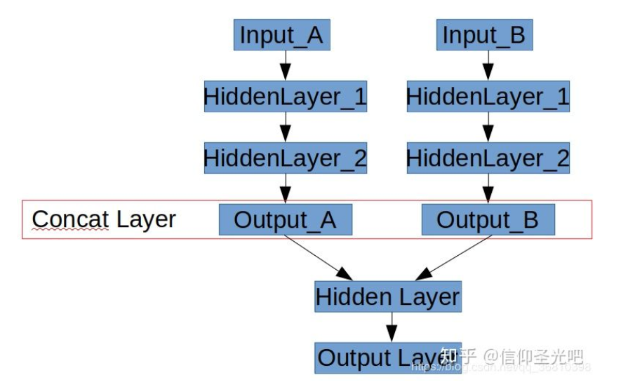

[TOC]


# 1. 图的概念

图=edge(边缘)+node(节点)


# 2. 图的操作
## 2.1. 图的建立/加载
```python
graph=tf.Graph()
graph=tf.get_default_graph() 
```

## 2.2. 图的管理操作
### 2.2.1. 设置为默认图
```python
graph.as_default()
graph.as_graph_def(from_version=None, add_shapes=False)
```
tensorflow 中可以定义多个计算图，**不同计算图上的张量和运算是相互独立的**，不会共享。计算图可以用来隔离张量和计算，同时提供了管理张量和计算的机制。计算图可以通过`Graph.device`函数来指定运行计算的设备，为TensorFlow充分利用GPU/CPU提供了机制。
 
1. 使用 g = tf.Graph()函数创建新的计算图;
2. **在with g.as_default()语句下**定义属于计算图g的张量和操作
3. **在with tf.Session()中**通过参数 graph = xxx指定当前会话所运行的计算图;

4. 如果没有显式指定张量和操作所属的计算图，则这些张量和操作属于默认计算图;
5. 一个图可以在多个sess中运行，一个sess也能运行多个图

### 2.2.2. 多图合并
1. 什么是并联神经网络
如下图所示，有时候需要搭建一个如下图的网络：“并联”两个子网络，将他们的输出层Concat到一起，然后在二者合并之后的网络上继续添加隐层。




```python
with tf.Graph().as_default() as g_combined:
	with tf.Session(graph=g_combined) as sess:
		graph_def_detect = load_def(detect_pb_path)
		graph_def_seg= load_def(seg_pb_path)
		input_image = tf.placeholder(dtype=tf.uint8,shape=[1,None,None,3], name="image")#定义新的网络输入
		input_image1 = tf.placeholder(dtype=tf.float32,shape=[1,None,None,3], name="image1")
		#将原始网络的输入映射到input_image(节点为：新的输入节点“image”)
		detection = tf.import_graph_def(graph_def_detect, input_map={'image_tensor:0': input_image},return_elements=['detection_boxes:0', 'detection_scores:0','detection_classes:0','num_detections:0' ])
                #新的输出节点为“detect”
		tf.identity(detection, 'detect')
		# second graph load
		seg_predict = tf.import_graph_def(graph_def_seg, input_map={"create_inputs/batch:0": input_image1}, return_elements=["conv6/out_1:0"])
		tf.identity(seg_predict, "seg_predict")
 
		# freeze combined graph
		g_combined_def = graph_util.convert_variables_to_constants(sess, sess.graph_def, ["seg_predict","detect"])
                #合成大图，生成新的pb
		tf.train.write_graph(g_combined_def, out_pb_path, 'merge_model.pb', as_text=False)
```

## 2.3. edge(边缘)操作
```python
#根据名称返回操作节点 
op=tf.Graph.get_operation_by_name(name)
#根据名称返回tensor数据     
tensor=tf.Graph.get_tensor_by_name(name)       

#返回一个图中与obj相关联的对象，为一个操作节点或者tensor数据
tf.Graph.as_graph_element(obj, allow_tensor=True,allow_operation=True) 
#用于覆盖梯度函数的上下文管理器
tf.Graph.gradient_override_map(op_type_map) 
```


## 2.4. node(节点)操作
```python
op_list=tf.Graph.get_operations()  
#返回图中的操作节点列表
```

tf.Graph

| 操作                                                       | 描述                                                                                                                                                                   |
| :--------------------------------------------------------- | :--------------------------------------------------------------------------------------------------------------------------------------------------------------------- |
| class tf.Graph                                             | tensorflow中的计算以图数据流的方式表示,一个图包含一系列表示计算单元的操作对象以及在图中流动的数据单元以tensor对象表现                                                  |
| `tf.Graph.__init__()`                                      | 建立一个空图                                                                                                                                                           |
| tf.Graph.as_default()                                      | 一个将某图设置为默认图，并返回一个上下文管理器，如果不显式添加一个默认图，系统会自动设置一个全局的默认图。所设置的默认图，在模块范围内所定义的节点都将默认加入默认图中 |
| tf.Graph.as_graph_def(from_version=None, add_shapes=False) | 返回一个图的序列化的GraphDef表示，序列化的GraphDef可以导入至另一个图中(使用 import_graph_def())或者使用C++ Session API                                                 |
| tf.Graph.finalize()                                        | 完成图的构建，即将其设置为只读模式                                                                                                                                     |
| tf.Graph.finalized                                         | 返回True，如果图被完成                                                                                                                                                 |
| tf.Graph.control_dependencies(control_inputs)              | 定义一个控制依赖，并返回一个上下文管理器                                                                                                                               |
| with g.control_dependencies([a, b, c])                     | # `d` 和 `e` 将在 `a`, `b`, 和`c`执行完之后运行.d = …e = …                                                                                                             |
| tf.Graph.device(device_name_or_function)                   | 定义运行图所使用的设备，并返回一个上下文管理器，with g.device('/gpu:0'): 、...with g.device('/cpu:0'): ...                                                             |
| tf.Graph.name_scope(name)                                  | 为节点创建层次化的名称，并返回一个上下文管理器                                                                                                                         |
| tf.Graph.add_to_collection(name, value)                    | 将value以name的名称存储在收集器(collection)中                                                                                                                          |
| tf.Graph.get_collection(name, scope=None)                  | 根据name返回一个收集器中所收集的值的列表                                                                                                                               |


Module: tf.contrib.graph_editor
TensorFlow Graph Editor.


# 3. 集合机制

将 op 加入到集合中
```python 
tf.add_to_collection("training_collection",loss)

tf.add_to_collection("training_collection",train_op)

```
