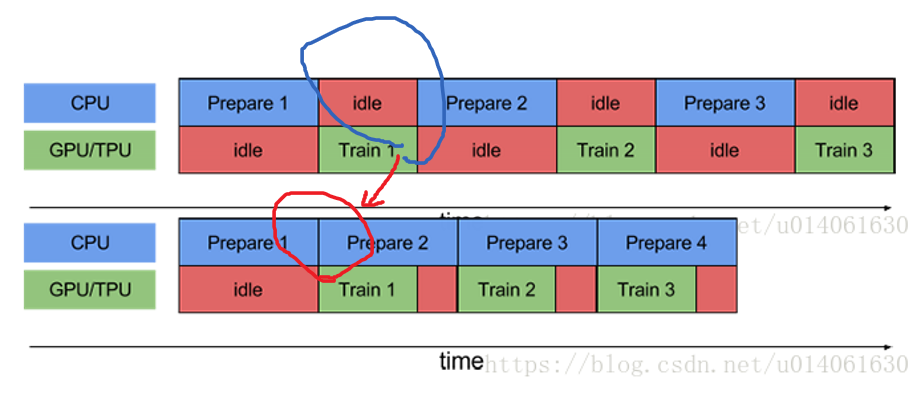

[TOC]

# 1. Tensorflow将数据加载到计算图中
Tensorflow把数据输送到计算图的过程中，在内存里的数据结构形式主要有三种：

## 1.1. Constant 转换为常量存在图中
### 1.1.1. 描述

把Dataset中的数据以const的形式存放在tensorflow的计算图中，主要使用的是`tf.constant` 函数。	 

### 1.1.2. 优劣及适用情景
**优势**
[速度最快]。
由于数据固化到了计算图中，所以它的数据读取速度是最快的。

**劣势**
小数据。适用于小数据集。

## 1.2. Feeding 自建 DataProvider 喂给图
### 1.2.1. 描述

磁盘数据->独立内存空间1->计算图

在每次session.run 时，把numpy形式的数据输入到feed_dict参数中。这种方式主要包括两种存在的状态。
1. **全部加载到内存**。自己维护一个DataProvider 类，每次都会获取一部分训练数据。需要注意的是training的时候最好把数据集shuffle，test的时最好不shuffle。

2. **分批加载到内存**。训练数据无法一次性全部load到内存中时，分批次load数据。自己维护的DataProvider 类要做好队列的管理。这种形式一个小的trick是每次载入的数据使用多次进行训练，这样可以减少重复地读取数据。

### 1.2.2. 优劣及适用情景

**优点：**
1. 当数据集较小的时候，数据可以全部载入到内存，这时数据的处理速度就会比较快。
2. 训练和测试几乎可以共用一套代码，仅需要把反馈网络去掉，不使用参数更新即可。
3. 在预测的时候，一般数据不会是文件的形式，所以只能使用feeding方式。

**缺点：**
1. 自己维护DataProvider类相对麻烦，而且自己写的类原生是不支持多进程的（主要是Python API的问题）
2. 单进程读取数据较慢，很多时间花费在数据读取上，所以训练时间相对较长。
3. feed_dict是利用python读取数据，python读取数据的时候，tensorflow无法计算，而且会将数据再次拷贝一份
4. 不适用大规模数据集

### 1.2.3. 实践

以字典`{tensor:value}`的形式将数据传入到图中，构成feed_dict 系统。
```python 
import tensorflow as tf
x = tf.placeholder(dtype=tf.float32, shape=None)
y=tf.add(x,2.0)
with tf.Session() as sess:
    _y = sess.run(y,feed_dict={x:1.2})
```


## 1.3. Queue 使用队列多线程输入到图中

磁盘数据->导入队列的内存空间->队列的内存空间导出->计算图

### 1.3.1. 描述

使用Queue Runner形式从文件中读取。tensorflow以一种黑箱的方式读取数据,必要的时候会启动多进程（需要设置，这些代码是用c++封装的，多线程支持的效果比较好）。

队列运行器QueueRunner需要2个东西：
1. 队列
2. 一些队列操作器((you can have multiple enqueue operations for one queue))

支持：

1. FIFOQueue: A queue implementation that dequeues elements in first-in first-out order.

2. PaddingFIFOQueue: A FIFOQueue that supports batching variable-sized tensors by padding.

3. PriorityQueue: A queue implementation that dequeues elements in prioritized order.

4. QueueBase: Base class for queue implementations.

5. RandomShuffleQueue: A queue implementation that dequeues elements in a random order.


### 1.3.2. 优劣及适用情景


1. Python不支持多线程（伪多线程，虽可以启用multi-thread，但所有启用线程的处理能力加起来等于一个核的处理能力）
2. Python多进程如果是任务可分，不用和主线程交互的情况下是可用的，但对于tensorflow的训练来说，肯定需要使用多（线程、进程）与主（线程、进程）交互。

所以在数据I/O阶段使用python 解释器对磁盘文件进行操作会影响性能
**优势**

1. Tensorflow使用黑箱的方式为数据的解析提供支持，相比于自己写multi-process然后共享变量来说在代码实现上更加友好。
2. python 写的 Tensorflow 程序在运行阶段是调用底层c++运行，更具有I/O 效率

**劣势** 

过于繁琐 目前推荐 `tf.data`  更高级别的封装


### 1.3.3. 实践

一句话概括就是：
1. 构建图阶段: 创建队列Queue 和队列执行器QueueRunner
2. 执行图阶段：tf.train.start_queue_runners() 开始填充队列
3. tf.train.Coordinator() 在线程出错时关闭之。

```python
#-*- coding:utf-8 -*-  
import tensorflow as tf  
  
#创建的图:

# 构建一个size=3的先入先出队列q
q = tf.FIFOQueue(3, "float")  
# 入队操作  
enqueue_op = q.enqueue_many(([0.1, 0.2, 0.3],)) 
# 出列 
x = q.dequeue()  
y = x + 1  
q_inc = q.enqueue([y])  
  
#开启一个session,session是会话,会话的潜在含义是状态保持,各种tensor的状态保持  
with tf.Session() as sess:  
    sess.run(enqueue_op) 
    for i in range(2):  
        sess.run(q_inc)  

    quelen =  sess.run(q.size())  
    for i in range(quelen):  
        print (sess.run(q.dequeue())) 
```

```python
def read_example(filename_queue):
    """Read one example from filename_queue"""
    reader = tf.TFRecordReader()
    key, value = reader.read(filename_queue)
    features = tf.parse_single_example(value, features={"image": tf.FixedLenFeature([], tf.string),
                                                        "label": tf.FixedLenFeature([], tf.int64)})
    image = tf.decode_raw(features["image"], tf.uint8)
    image = tf.reshape(image, [28, 28])
    label = tf.cast(features["label"], tf.int32)
    return image, label

if __name__ == "__main__":
    queue = tf.train.string_input_producer(["TFRecords/train.tfrecords"], num_epochs=10)
    image, label = read_example(queue)

    img_batch, label_batch = tf.train.shuffle_batch([image, label], batch_size=32, capacity=5000,
                                                    min_after_dequeue=2000, num_threads=4)
    with tf.Session() as sess:
        sess.run(tf.local_variables_initializer())
        sess.run(tf.global_variables_initializer())

        coord = tf.train.Coordinator()
        threads = tf.train.start_queue_runners(sess=sess, coord=coord)

        try:
            while not coord.should_stop():
                # Run training steps or whatever
                images, labels = sess.run([img_batch, label_batch])
                print(images.shape, labels.shape)

        except tf.errors.OutOfRangeError:
            print('Done training -- epoch limit reached')

        coord.request_stop()
        coord.join(threads)
```

## 1.4. 数据的输入（tf.data）

https://cs230-stanford.github.io/tensorflow-input-data.html


> 本质上还是 分为4步：
> 1. 构建 数据集 dataset
> 2. 构建 迭代器 interator 
> 3. 构建 next 操作 get_next
> > next 操作得出相应数据变量 切入到模型中
> 4. 构建 初始化 操作  init_op
> > 初始化操作可能在运行时候被 全局一次性初始化替代

### 1.4.1. 构建数据集
读取输入数据
```python
# 1. constant 数字
dataset = tf.data.Dataset.range(100)

# 2. 从内存中读取数组
dataset = tf.data.Dataset.from_tensor_slices((features, labels))
>>>type(features)
numpy.ndarray

>>>type(labels)
numpy.ndarray

# 3. 从磁盘中读取文件
## 3.1 tfrecord 文件
filenames = ["/var/data/file1.tfrecord", "/var/data/file2.tfrecord"]
dataset = tf.data.TFRecordDataset(filenames)

## 3.2 txt 文件
filenames = ["/var/data/file1.txt", "/var/data/file2.txt"]
dataset = tf.data.TextLineDataset(filenames)

## 3.3 csv 文件
filenames = ["/var/data/file1.csv", "/var/data/file2.csv"]
record_defaults = [tf.float32] * 8  
dataset = tf.contrib.data.CsvDataset(filenames, record_defaults)
```
从文件中读取数据，使用QueueRunner形式从文件中读取。tensorflow以一种黑箱的方式读取数据,必要的时候会启动多进程（需要设置，这些代码是用c++封装的，多线程支持的效果比较好）


### 1.4.2. 构建迭代器 
构建怎么样的迭代器？惰性的，不能知道序列的长度


| 迭代器类型      | 难度  |                                                                 应用场景 |
| --------------- | :---: | -----------------------------------------------------------------------: |
| one-shot        |   0   | 仅支持对整个数据集访问一遍，不需要显式的初始化(不需要多写一行初始化命令) |
| initializable   |   1   |          支持动态数据集（通过参数或其他设置，获得动态数据集,即再初始化） |
| reinitializable |   2   |                                             支持多个相同数据结构的数据集 |
| feedable        |   3   |                                                             支持调用机制 |


#### 1.4.2.1. one-shot
```python

# 构建dataset 
dataset = tf.data.Dataset.range(100)
# 构建 迭代器（生成器）
iterator = dataset.make_one_shot_iterator() 
# 构建 next op操作
next_element = iterator.get_next()  

# 构建 初始化 操作（one-shot 模式 无）
# run
for i in range(100):
    value = sess.run(next_element)
    assert i == value
```
next_element 就是一个tensor,与tf.placehold/tf.constant 一样

|                                             code |                                   type |
| -----------------------------------------------: | -------------------------------------: |
|             `next_element = iterator.get_next()` | tensorflow.python.framework.ops.Tensor |
| `x=tf.placeholder(dtype=tf.float32,shape=(1,2))` | tensorflow.python.framework.ops.Tensor |
|                         `y=tf.constant([1,2,3])` | tensorflow.python.framework.ops.Tensor |


####  1.4.2.2. initializable （可初始化的）
   > Q: 为什么要创立 initializable的 dataset？
   > A: 当我们想要创建一个动态的dataset的时候
```python        
# 构建dataset （数据集元素数量待定）
max_value = tf.placeholder(tf.int64, shape=[])
dataset = tf.data.Dataset.range(max_value)
# 构建 迭代器（生成器）
iterator = dataset.make_initializable_iterator()
# 构建 next op操作
next_element = iterator.get_next()
# 构建 初始化 操作
initializer_op=iterator.initializer

# 例子1 初始化一个含有10个元素的迭代器
sess.run(initializer_op, feed_dict={max_value: 10})
for i in range(10):
        value = sess.run(next_element)
        assert i == value

# 例子2 初始化一个含有100个元素的迭代器
sess.run(initializer_op, feed_dict={max_value: 100})
for i in range(100):
        value = sess.run(next_element)
        assert i == value

with tf.Session() as sess:
        # 初始化生成器
        sess.run(init_op)
        print(sess.run(next_element))
        print(sess.run(next_element))
        # 将生成器返回到初始状态
        sess.run(init_op)
        print(sess.run(next_element))

'I use Tensorflow'
'You use PyTorch'
'I use Tensorflow' # Iterator 会回到初始的位置
```
#### 1.4.2.3. reinitializable （可重复初始化的）
```python
# 构建dataset 
# 定义一个具有相同结构的 训练数据集 和 验证集
training_dataset = tf.data.Dataset.range(100).map(
lambda x: x + tf.random_uniform([], -10, 10, tf.int64))
validation_dataset = tf.data.Dataset.range(50)


# 构建 迭代器（生成器）
iterator = tf.Iterator.from_structure(training_dataset.output_types,training_dataset.output_shapes)

# 构建 next op操作
next_element = iterator.get_next()

# 构建 初始化 操作
training_init_op = iterator.make_initializer(training_dataset)
validation_init_op = iterator.make_initializer(validation_dataset)

for _ in range(20):
    # 初始化训练集的 迭代器.
    sess.run(training_init_op)
    for _ in range(100):
            sess.run(next_element)

    # 初始化验证集的 迭代器.
    sess.run(validation_init_op)
    for _ in range(50):
            sess.run(next_element)
```
#### 1.4.2.4. feedable（反馈的--正对有调用机制的）
  
   一个调用机制

> 1. 构建数据集
> 2. 针对数据集构建迭代器
> 3. 构建 next 操作 （使用handle）
>>   + 数据集建立 handle
>>   + 定义一种统一的迭代器类型（带有handle str 和数据结构）
>>   + 以统一的迭代器进行 next 操作

   定义完 操作后，可以通过feed 选择  
```python

# 构建不同的 数据集
training_dataset = tf.data.Dataset.range(100).map(lambda x: x + tf.random_uniform([], -10, 10, tf.int64)).repeat()
validation_dataset = tf.data.Dataset.range(50)


# 为不同数据集构建 迭代器
training_iterator = training_dataset.make_one_shot_iterator()
validation_iterator = validation_dataset.make_initializable_iterator()

# 为不同数据集构建 handle
training_handle = sess.run(training_iterator.string_handle())
validation_handle = sess.run(validation_iterator.string_handle())

# 定义一个handle str 
handle = tf.placeholder(tf.string, shape=[])

##定义一种数据结构的 iterator
iterator = tf.data.Iterator.from_string_handle(
handle, training_dataset.output_types, training_dataset.output_shapes)
# iterator 中的 output_types 和 output_shapes可以直接定义
iterator =tf.data.Iterator.from_string_handle(
    handle, (tf.float32, tf.float32), (tf.TensorShape([tf.Dimension(None), tf.Dimension(5), tf.Dimension(38)]), tf.TensorShape([tf.Dimension(None), tf.Dimension(5), tf.Dimension(1)])))

# 构建 next 操作
next_element = iterator.get_next()

while True:
    for _ in range(200):
            sess.run(next_element, feed_dict={handle: training_handle})

    sess.run(validation_iterator.initializer)
    for _ in range(50):
            sess.run(next_element, feed_dict={handle: validation_handle})

#
tf.data.Iterator.from_string_handle(
    string_handle,
    output_types,
    output_shapes=None,
    output_classes=None
    )

```
### 1.4.3. 数据集的操作

1. map
2. batch
3. shuffle
4. padded_batch
5. repeat
   
#### 1.4.3.1. map
Dataset.map(f) 转换通过将指定函数 f 应用于输入数据集的每个元素来生成新数据集
```python

>>>Dataset #[1,2,3,4,5,6]
>>>iterator.get_next()
1
2
...

>>>Dataset #[1,2,3,4,5,6]
Dataset=Dataset.map(f) #[11,12,13,14,15,16]
>>>iterator.get_next()
11
12
...
```
#### 1.4.3.2.  batch
```python

>>>Dataset #[1,2,3,4,5,6]
>>>iterator.get_next()
1
2
...

>>>Dataset #[1,2,3,4,5,6]
Dataset=Dataset.batch(2) #[[1,2],[3,4],[5,6]]
>>>iterator.get_next()
[1,2]
[3,4]
...
```
#### 1.4.3.3. shuffle

```python
>>>Dataset #[1,2,3,4,5,6]
Dataset=Dataset.shuffle(shuffle_size=10) #
>>>iterator.get_next()
[3]
[6]
```

**buffer_size 的理解**

代表將被加入緩衝器的元素的**最大数量**。
buffer_size 需要合理取值，然而不当的buffer size，会导致shuffle无意义。如 `buffer_size=1`


#### 1.4.3.4. padded_batch
```python
dataset.padded_batch(
    batch_size, padded_shapes=None, padding_values=None, drop_remainder=False
)
```
**适用场景** 
1. 变长度数据（常见于语音、视频、NLP等领域）
**通用解决方案**


1.在把数据写入tfrecord时，先把数据pad到统一的长度再写入tfrecord；这个方法的问题在于：若是有大量数据的长度都远远小于最大长度，则会造成存储空间的大量浪费。

2.使用dataset中的padded_batch方法来进行

可见每个batch的每个序列长度都是6，不足就补0


```python

>>>Dataset #[1,2,3,4,5,6]
>>>iterator.get_next()
1
2
...

>>>Dataset #[1,2,3,4,5,6]
Dataset=Dataset.padded_batch(2) #[[1,2],[3,4],[5,6]]
>>>iterator.get_next()
[1,2]
[3,4]


...
```
#### 1.4.3.5. repeat
```python
repeat(count=None)
```

count: (Optional.) A tf.int64 scalar tf.Tensor, representing the number of times the dataset should be repeated. The default behavior (if count is None or -1) is for the dataset be repeated indefinitely.(无限复制))

#### 1.4.3.6.  prefetch


### 1.4.4. 在训练中使用
#### 1.4.4.1. 在Session中使用
```python
iterator = dataset.make_one_shot_iterator()
next_example, next_label = iterator.get_next()
loss = model_function(next_example, next_label)
training_op = tf.train.AdagradOptimizer(...).minimize(loss)

with tf.train.MonitoredTrainingSession(...) as sess:
  while not sess.should_stop():
    sess.run(training_op)
```

#### 1.4.4.2. keras 里面使用tf.data
```python
dataset = tf.data.Dataset.from_tensor_slices((data, labels))
dataset = dataset.batch(32)
dataset = dataset.repeat()
 
# Don't forget to specify `steps_per_epoch` when calling `fit` on a dataset.
model.fit(dataset, epochs=10, steps_per_epoch=30)


model.evaluate(x, y, batch_size=32)
 
model.evaluate(dataset, steps=30)

model.predict(x, batch_size=32)
model.predict(dataset, steps=30)
```

# 2. I/O 问题

## 2.1. I/O数据的存储格式
### 2.1.1. Protocol Buffer

Protocol Buffers 是谷歌开放的一种轻便高效的结构化数据存储格式
特性：
1. 处理结构化数据的工具
2. 二进制流
3. 需要先定义数据格式（schema）,才能还原
4. 序列化数据比`.xml`小3-10倍，解析快20-100倍
5. 文件格式 `.proto`
6. 每一个message代表了一类结构体和的数据

### 2.1.2. json

## 2.2. TFRecord 格式的数据及其I/O操作

### 2.2.1. TFRecord 是什么？
>TFRecord 是谷歌推荐的一种二进制`文件格式`，理论上它可以保存任何格式的信息。

TFRecord文件将数据存储为 <**二进制**> <**字符串**> <**序列**> .

将数据写入TFRecord文件之**前**需要**指定数据的结构**，
Tensorflow为此提供了两个组件：
1. tf.train.Example  
2. tf.train.SequenceExample。
   必须将每个数据样本存储在其中一个组件中，然后对其进行序列化并使用tf.python_io.TFRecordWriter把它写到磁盘上。
### 2.2.2. 什么情景下使用

从磁盘提取<**大量**>-<**小文件**>会显著影响 I/O 性能。推荐的实现最大 I/O 吞吐量的一种方法是将输入数据预处理为更大（约 100MB）的 TFRecord 文件。
1. 对于较小的数据集 (200MB-1GB)，最好的方法通常是将整个数据集加载到内存中
2. 对于较大的数据集。 将输入数据预处理为更大（约 100MB）的 TFRecord 文件。 


### 2.2.3. TFRecord 核心概念--Example
TFRecord文件本身是 <**二进制**> <**字符串**> <**序列**>，还原数据原本面目的**核心在于说明数据的结构**
#### 2.2.3.1. 参数说明

```python
tf.train.Example(features:tf.train.Features=xxx)
 |__tf.train.Features(feature:dict=feature_dict)
   |__feature_dict={key:value}
      |__ value:string
      |__ key:tf.train.Feature(Int64List=int_a) 
          |__int_a:tf.train.BytesList(value=[])
```


tf.train.Example 是protocol buffer  协议下的**消息体(message)**,不是普通的python类
一个 Example **消息体**包含了 **一系列的feature 属性**
```python
example=tf.train.Example(features=_features)
>>>type(_features) 
tf.train.Features
```
tf.train.Features是命名特征的集合。它有一个形参 feature ，类型为一个字典，其中key是特征的名称，value是tf.train.Feature
```python
_features=tf.train.Features(feature=feature_dict)
>>> type(feature_dict)
dict
```

```python
feature_dict = {key:value,}
>>>type(key)
string
>>>type(value)
tf.train.Feature  ## 注意没有s

tf.train.Feature(Int64List:tf.train.BytesList=None,FloatList:tf.train.FloatList=None, BytesList:tf.train.Int64List=None)

value=tf.train.Feature(Int64List=int_a)
value=tf.train.Feature(FloatList=float_b)
value=tf.train.Feature(BytesList=bytes_c)

>>>type(int_a)
tf.train.BytesList
>>>type(float_b)
tf.train.FloatList
>>>type(bytes_c)
tf.train.Int64List

tf.train.BytesList(value:list=[])
tf.train.FloatList(value:list=[])
tf.train.Int64List(value:list=[])

tf.train.BytesList(value:list=[b"hello world"])
tf.train.FloatList(value:list=[0.1,0.2])
tf.train.Int64List(value:list=[1,2,3,4])

```
##### 2.2.3.1.1. 方法说明

`tf.train.Example`和`tf.train.SequenceExample``提供SerializeToString` 方法,进行结构化数据首先需要序列化

```python
example.SerializeToString()
```
### 2.2.4. 实践
#### 2.2.4.1. 存储为 TFrecord格式文件
```python

float_list=tf.train.Int64List(value:list=[1,2,3,4])
feature_value=tf.train.Feature(FloatList=float_list)
feature_dict={"feature_key",feature_value}
features=tf.train.Features(feature:dict=feature_dict)
example=tf.train.Example(features:tf.train.Features=features)

with tf.python_io.TFRecordWriter('customer_1.tfrecord') as writer:
    writer.write(example.SerializeToString())
```

```python
writer= tf.python_io.TFRecordWriter(path=<...>,options=None)
# path：TFRecord文件的存放路径；
# option：TFRecordOptions对象 定义TFRecord文件保存的压缩格式；
有三种文件压缩格式可选，分别为:
1. TFRecordCompressionType.ZLIB
2. TFRecordCompressionType.GZIP
3. TFRecordCompressionType.NONE
# 默认为最后一种，即不做任何压缩，定义方法如下
```
#### 2.2.4.2. 输入到tensorflow计算图中
使用tf.data将TFrecord格式文件输入到tensorflow图中
##### 2.2.4.2.1. 导入
从多个tfrecord文件中导入数据到Dataset类
```python 
filenames = ["test.tfrecord", "test2.tfrecord"]
dataset = tf.data.TFRecordDataset(filenames)
```
##### 2.2.4.2.2. 序列化样本解析
tfrecord文件是序列化样本，所以我们需要对每一个样本进行解析。 具体实现 通过dataset 的map方法，如下：
```python
dataset=dataset.map(parse_function)
# parse_function 解析函数
```

**NOTE**
parse_function 解析函数

**1. 输入输出**
输入：example_proto  也就是序列化后的样本tf_serialized
输出： parsed_example 

```python
def parse_function(example_proto):
    # 只接受一个形参：example_proto，也就是序列化后的样本tf_serialized
    parsed_example = tf.parse_single_example(example_proto, feature_dicts)
    # feature_dicts 解析字典---feature的解析方式
    # feature_dicts={key:value}  key为feature名，value为feature的解析方式

    # 返回所有feature
    return parsed_example
```
**2. feature_dicts 解析字典**
```python
feature_dicts={key:value}
# key为feature名，value为feature的解析方式
```  


**3. feature的解析方式**

feature的解析方式:

| 编号 | 解析方式       |
| ---: | :------------- |
|    1 | 定长特征解析   |
|    2 | 不定长特征解析 |

1. 定长特征解析：`tf.FixedLenFeature(shape, dtype, default_value)`
```python
tf.FixedLenFeature(shape:tuple=(1,2), dtype=tf.float32, default_value=None)
```
|          形参 | 备注                                                                                                            |
| ------------: | :-------------------------------------------------------------------------------------------------------------- |
|         shape | 1. 可当reshape来用，如vector的shape从(3,)改动成了(1,3)。<br>2. 如果写入的feature使用了.tostring() 其shape就是() |
|         dtype | 必须是tf.float32， tf.int64， tf.string中的一种。                                                               |
| default_value | feature值缺失时所指定的值。                                                                                     |


1. 不定长特征解析：`tf.VarLenFeature(dtype)`
```python
tf.VarLenFeature(dtype)
# 注：可以不明确指定shape，但得到的tensor是SparseTensor。
```
**4. 特殊 feature的 转变特征**

得到的parsed_example也是一个字典，其中每个key是对应feature的名字，value是相应的feature解析值。如果使用了下面两种情况，则还需要对这些值进行转变。其他情况则不用。

1. string类型：`tf.decode_raw(parsed_feature, type) `来解码
注：这里type必须要和当初.tostring()化前的一致。如tensor转变前是tf.uint8，这里就需是tf.uint8；转变前是tf.float32，则tf.float32

2. VarLen解析：由于得到的是SparseTensor，所以视情况需要用`tf.sparse_tensor_to_dense(SparseTensor)`来转变成DenseTensor

```python
# 解码字符
parsed_example['tensor'] = tf.decode_raw(parsed_example['tensor'], tf.uint8)
# 稀疏表示 转为 密集表示
parsed_example['matrix'] = tf.sparse_tensor_to_dense(parsed_example['matrix'])
```
**5. 改变形状**
到此为止得到的特征都是向量，需要根据之前存储的shape信息对每个feature进行reshape。
```python

# 转变matrix形状
parsed_example['matrix'] = tf.reshape(parsed_example['matrix'], parsed_example['matrix_shape'])
    
# 转变tensor形状
parsed_example['tensor'] = tf.reshape(parsed_example['tensor'], parsed_example['tensor_shape'])
```

##### 2.2.4.2.3. 执行解析函数

创建好解析函数后，将创建的parse_function送入dataset.map()得到新的数据集

```python
new_dataset = dataset.map(parse_function)
```
##### 2.2.4.2.4. 创建迭代器
后续与其他dataset 处理一致
```python
iterator = dataset.make_one_shot_iterator()
```


# 3. tensorflow 文件操作
## 3.1. tf.gfile

tensorflow gfile文件操作详解

翻译过来就是 **无线程锁的文件I/O操作包装器**
### 3.1.1. 作用
1. 提供了一种类似于python文件 I/O操作的API；
2. 提供了一种操作tensorflow C++文件系统的API；
3. tensorflow c++文件操作接口支持多个文件系统实现，包括：
   1. 本地文件
   2. 谷歌云存储(以gs://开头)
   3. HDFS(以HDFS://开头)
   
tensorflow封装这些接口到`tf.gfile`，以便我们可以使用这些接口来存储和加载检查点文件、将tensorboard log信息写到文本里以及访问训练数据(在其他用途里)。
### 3.1.2. 与 python的I/O操作的API区别
>支持远程IO操作

但是，如果所有文件都放在本地，那么我们直接使用python提供的常规文本操作接口也是一样效果且毫无问题的

https://zhuanlan.zhihu.com/p/31536538
## 3.2. 队列进阶

```python

def read_and_decode(filename):
    #根据文件名生成一个队列
    filename_queue = tf.train.string_input_producer([filename])

    reader = tf.TFRecordReader()
    _, serialized_example = reader.read(filename_queue)   #返回文件名和文件
    features = tf.parse_single_example(serialized_example,
                                       features={
                                           'label': tf.FixedLenFeature([], tf.int64),
                                           'img_raw' : tf.FixedLenFeature([], tf.string),
                                       })

    img = tf.decode_raw(features['img_raw'], tf.uint8)
    img = tf.reshape(img, [224, 224, 3])
    img = tf.cast(img, tf.float32) * (1. / 255) - 0.5
    label = tf.cast(features['label'], tf.int32)

    return img, label
```


```python
coord = tf.train.Coordinator()
threads = tf.train.start_queue_runners(sess=sess, coord=coord)
try:
    while not coord.should_stop():
        # Run training steps or whatever
        sess.run(train_op)
except tf.errors.OutOfRangeError:
    print('Done training -- epoch limit reached')
finally:
    # When done, ask the threads to stop.
    coord.request_stop()
# Wait for threads to finish.
coord.join(threads)
sess.close()
```


##### 3.2.0.0.1. 利用多进程 I/O 构建流水线

流水线将训练步骤的预处理和模型执行过程重叠到一起。当加速器正在执行第 N 个训练步时，CPU 正在准备第 N+1 步的数据。这样做不仅可以最大限度地缩短训练的单步用时（而不是总用时），而且可以缩短提取和转换数据所需的时间。



## 3.3. 多线程任务中的 TensorFlow/IO


## 3.4. parse_example
```python
# parse_example 的多种形式
tf.io.parse_example(
    serialized,
    features_spec,
    example_names=None,
    name=None
)
tf.io.parse_example()
tf.parse_example()

# serialized:一个batch的序列化的example 
# features_spec:解析example的规则 
# name：当前操作的名字 
# example_name:当前解析example的proto名称
```


这里重点要说的是第二个参数，也就是features，features是把serialized的example中按照键值映射到三种tensor: 
1. VarlenFeature 
2. SparseFeature 
3. FixedLenFeature 
下面对这三种映射方式做一个简要的叙述：

VarlenFeature

是按照键值把example的value映射到SpareTensor对象，假设我们有如下的serialized数据：

```python
 serialized = [
    features
      { feature { key: "ft" value { float_list { value: [1.0, 2.0] } } } },
    features
      { feature []},
    features
      { feature { key: "ft" value { float_list { value: [3.0] } } }
  ]

```
使用VarLenFeatures方法：

```python
features={
    "ft":tf.VarLenFeature(tf.float32)
}
```
那么我们将得到的是：

```python
{"ft": SparseTensor(indices=[[0, 0], [0, 1], [2, 0]],
                      values=[1.0, 2.0, 3.0],
                      dense_shape=(3, 2)) }
```

可见，显示的indices是ft值的索引，values是值，dense_shape是indices的shape

FixedLenFeature

而FixedLenFeature是按照键值对将features映射到大小为[serilized.size(),df.shape] 的矩阵，这里的FixLenFeature指的是每个键值对应的feature的size是一样的。对于上面的例子，如果使用：

```json
features: {
      "ft": FixedLenFeature([2], dtype=tf.float32, default_value=-1),
  }
```

那么我们将得到：

```json
{"ft": [[1.0, 2.0], [3.0, -1.0]]}
```

可见返回的值是一个[2,2]的矩阵，如果返回的长度不足给定的长度，那么将会使用默认值去填充。 


# 4. 提升I/O性能的方法[^1]

## 4.1. 硬件上任务分离
### 4.1.1. CPU
### 4.1.2. GPU

### 4.1.3. 网络
while the CPU is preparing the data, the accelerator is sitting idle. Conversely, while the accelerator is training the model, the CPU is sitting idle. 

The training step time is thus the sum of both CPU pre-processing time and the accelerator training time.


* 首字节时间：与本地存储相比，从远程存储读取文件的首字节所用时间可能要多出几个数量级。

* 读取吞吐量：虽然远程存储通常可提供较大的聚合带宽，但读取单个文件可能只能利用此带宽的一小部分。
## 4.2. 并行计算
TensorFlow提供两个类帮助实现多线程，一个是`tf.train.Coordinator`，另一个是`tf.train.QueueRunner`
这两个类是实现TensorFlow pipeline的基础，能够高效地并行处理数据。
### 4.2.1. 总结

下面简要介绍了设计输入流水线的最佳做法：

1. 使用 prefetch 转换可将提供方和使用方的工作重叠。我们特别建议将 prefetch(n)（其中 n 是单步训练使用的 元素数/批次数）添加到输入流水线的末尾，以便将在 CPU 上执行的转换与在加速器上执行的训练重叠。
```python
dataset.prefetch(buffer_size=tf.data.experimental.AUTOTUNE)
```
2. 通过设置 `num_parallel_calls` 参数并行处理 map 转换。建议您将其值设为可用 CPU 核的数量 core num。
```python
dataset.map(map_func=func, num_parallel_calls=2)
```
3. 如果您使用 batch 转换将预处理元素组合到一个批次中，建议您使用 map_and_batch 混合转换；特别是在您使用的批次较大时。
```python
dataset.map_and_batch(
    map_func, batch_size, num_parallel_batches=None, drop_remainder=False,
    num_parallel_calls=tf.data.AUTOTUNE,
)
```
4. 如果您要处理远程存储的数据并/或需要反序列化，建议您使用 parallel_interleave 转换来重叠从不同文件读取（和反序列化）数据的操作。
   
5. 向量化传递给 `map` 转换的低开销用户定义函数，以分摊与调度和执行相应函数相关的开销。
   
6. 如果内存可以容纳您的数据，请使用 cache 转换在第一个周期中将数据缓存在内存中，以便后续周期可以避免与读取、解析和转换该数据相关的开销。
   
7. 如果预处理操作会增加数据大小，建议您首先应用 `
`、`prefetch` 和 `shuffle`（如果可以）以减少内存使用量。
   
8. 建议您在应用 repeat 转换之前先应用 shuffle 转换，最好使用 `shuffle_and_repeat` 混合转换。

# 5. 参考文献

[^1]:Better performance with tf.data
https://tensorflow.google.cn/guide/data_performance