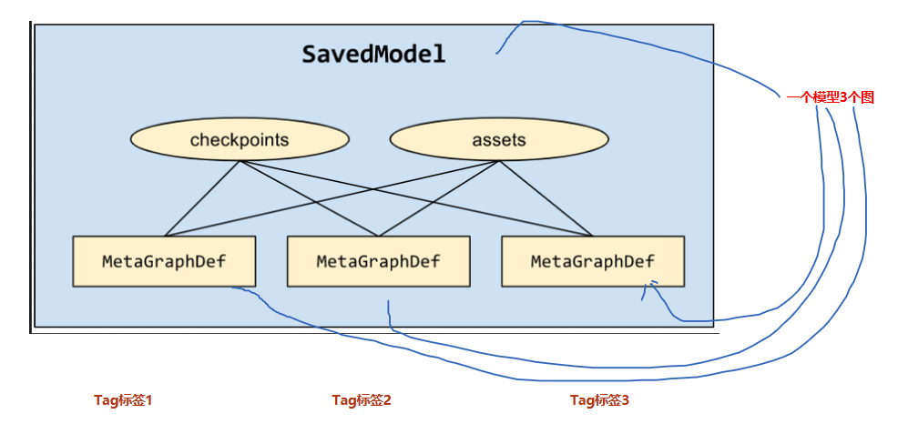
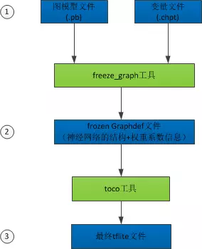

[TOC]

# 1. 模型的保存

## 1.1. 几个概念

### 1.1.1. 序列化 与 反序列化
**数据序列化**就是将对象或者数据结构转化成特定的格式，使其可在网络中传输或者可存储在内存或者文件中。

廖雪峰：变量从内存中变成可存储或传输的过程称之为序列化。

对象序列化后的数据格式可以是二进制，可以是XML，也可以是JSON等任何格式。

**反序列化**是序列化相反的操作，将对象从序列化数据中还原出来。

廖雪峰：把变量内容从序列化的对象重新读到内存里称之为反序列化。

### 1.1.2. Protobuf

Google Protocol Buffers（简称 Protobuf，协议缓存）是谷歌开放的处理结构化数据的工具。Protobuf是类似json的一种数据格式，但不同的是他是二进制格式，性能好、读写效率高。
Protobuf文件通常以`.proto`结尾。

https://tensorflow.juejin.im/extend/tool_developers/index.html


Protobuf 实际上支持两种不同的文件保存格式：（1）TextFormat 和（2）二进制格式。
1. TextFormat 是一种人眼可读的文本形式，这在调试和编辑时是很方便的，但它在存储数值数据时会变得很大。比如我们常见的权重数据，文件名为 `xxx.pbtxt`。
2. 二进制格式的文件会小得多，缺点就是它不易读。文件名为 `xxx.pb`。


Protocol Buffer 
特性：
1. 处理结构化数据的工具
2. 二进制流
3. 需要先定义数据格式（schema）,才能还原
4. 序列化数据比xml 小3~10倍，解析快20~100倍
5. 每一个message代表了一类结构体和的数据


## 1.2. 理论上需要保存什么

主要是：

| 编号 | 项目                   |
| ---- | ---------------------- |
| 1    | 图信息                 |
| 2    | 变量信息               |
| 3    | 其他信息（服务器信息） |

#### 1.2.1. 图信息
图被定义为 “一些 Operation（Node节点） 和 Tensor（Edge边缘）的集合”。

图信息的主要内容包括： 
1.Node节点信息（op）
2.边信息（Tensor）。

##### 1.2.1.1. Node节点信息--operation
   图中的节点又称为算子，它代表一个操作（operation，OP），一般用来表示施加的数学运算，也可以表示数据输入（feed in）的起点以及输出（push out）的终点，或者是读取/写入持久 变量（persistent variable）的终点。

Operation包含OpDef和NodeDef两个主要成员变量。
1. OpDef描述了op的静态属性信息，例如op入参列表，出参列表等。
2. NodeDef则描述op的动态属性信息，例如op运行的设备信息，用户给op设置的name等。包括placeholder,placeholder 是tensor 

```python
[op.values() for op in tf.get_default_graph().get_operations()]
```
##### 1.2.1.2. Edge边缘信息--Tensor
边用来表示计算的数据，它经过上游节点计算后得到，然后传递给下游节点进行运算。

Tensor中主要包含两类信息：
1. 是Graph结构信息，如边的源节点和目标节点(有向图)。
2. 它所保存的数据信息，例如数据类型，shape等（tensor.shape/tensor.dytpe）。


#### 1.2.2. 参数信息

tf.Varibel 

#### 1.2.3. 其他信息

##### 1.2.3.1. 服务器信息
##### 1.2.3.2. 集群信息
##### 1.2.3.3. Checkpoint

用于保存模型的权重，主要用于模型训练过程中参数的备份和模型训练热启动。
主要内容包括：
```txt
model_checkpoint_path= xxx;
all_model_checkpoint_path=xxx;
```
##### 1.2.3.4. 版本和其他用户信息


## 1.3. 实践中以什么形式保存


### 1.3.1. MetaGraphDef 元图信息

在实际操作中，很少单独持久化Graph信息，一般都是直接保存MetaGraph信息，MetaGraphDef 是 MetaGraph信息的序列化文件，同样是由 Protocol Buffer来定义的一个包含**更多图信息**的序列化文件。其中包括：
   
| 组成          | 内容                                                                           |                                                                              例如 |
| :------------ | :----------------------------------------------------------------------------- | --------------------------------------------------------------------------------: |
| MetaInfoDef   | 存一些元信息                                                                   |                                                                版本和其他用户信息 |
| GraphDef      | Graph的序列化信息，MetaGraph的核心内容之一 ,不包含模型权重变量信息             |                                                            Node(Placeholder + op) |
| SaverDef      | 图的Saver信息                                                                  | 最多同时保存的check-point数量；需保存的Tensor名字等，但并不保存Tensor中的实际内容 |
| CollectionDef | 任何需要特殊注意的 Python 对象，需要特殊的标注以方便import_meta_graph 后取回。 |                                                       "train_op","prediction"等等 |
``` python 

graph=tf.get_default_graph()
graph_def=graph.as_graph_def()
##
type(graph_def)
>>> tensorflow.core.framework.graph_pb2.GraphDef

##
graph_def
>>>
  node {
    name: "start"
    op: "Const"
    attr {
      key: "dtype"
      value {
        type: DT_INT64
      }
    }
    attr {
      key: "value"
      value {
        tensor {
          dtype: DT_INT64
          tensor_shape {
          }
          int64_val: 0
        }
      }
    }
  }
  library {
    function {
      signature {
        name: "_make_dataset_YADYq1MF2s4"
        output_arg {
          name: "modeldataset"
          type: DT_VARIANT
        }
        description: "Factory function for a dataset."
        is_stateful: true
      }
      node_def {
        name: "RangeDataset/start"
        op: "Const"
        attr {
          key: "dtype"
          value {
            type: DT_INT64
          }
        }
        attr {
          key: "value"
          value {
            tensor {
              dtype: DT_INT64
              tensor_shape {
              }
              int64_val: 0
            }
          }
        }
      }
      ret {
        key: "modeldataset"
        value: "ModelDataset:handle:0"
      }
    }
  }
  versions {
    producer: 27
    min_consumer: 12
  }
```

保存MetaGraph信息的文件格式主要有

1. pd 格式
形如`xxx_name.pd`

2. meta 格式
形如`xxx_name.meta`

### 1.3.2. Variables 变量数据

**范围**
主要为`tf.Variables`类的节点信息。
**内容**
主要为变量：
1. 初始值
2. 具体数值
3. shape等。
   
**持久化格式**
参数信息持久化时保存为(1)索引和(2)数据 两部分。其中：
1. 索引命名为: `xxx_name.index`
2. 数据命名为: `xxx_name.data`

| filename                          | 类型       | 内容       |
| --------------------------------- | ---------- | ---------- |
| model.ckpt-20.index               | 二进制文件 | 数据 index |
| model.ckpt-20.data-00000-of-00002 | 二进制文件 | 数据       |

### 1.3.3. Checkpoint

**范围及内容**
Checkpoint记录：
1. all_model_checkpoint_paths
2. model_checkpoint_path 

**持久化格式**

持久化格式保存为 `Checkpoint`，没有后缀格式，可以直接用记事本打开，为文本类文件。


## 1.4. 实践中怎样组织保存文件
TensorFlow提供3种模型保存模型：

1. checkpoints，这是一种依赖于创建模型的代码的格式。
2. SavedModel，这是一种独立于创建模型的代码的格式。
3. FrozenGraph，将变量信息设定为常量的模型
4. tflite ，支持安卓和ios设备的模型格式
### 1.4.1. checkpoint_model

### 1.4.2. Saved Model
在此环境中，Saved Model允许你使用不同的配置保存图形。在我们的例子中，我们有三个不同的图形和相应的标签，如“训练”、“推理”和“移动”。此外，这三个图形为了提升内存效率还**共享相同的变量集**。

就在不久前，如果我们想在移动设备上部署TF模型时，我们需要知道输入和输出张量的名称，以便向模型提供数据或从模型获取数据。这需要强制程序员在图的所有张量中搜索他们所需的张量。如果张量没有正确命名，那么任务可能非常繁琐。

为了简化操作，SavedModel提供对SignatureDefs的支持，SignatureDefs定义了TensorFlow支持的计算的签名。它确定了计算图的正确输入和输出张量，也就是说使用这些签名，你可以指定用于输入和输出的确切节点。要使用其内置的服务API，TF Serving要求模型包含一个或多个SignatureDefs。


### 1.4.3. FrozenGraph

将图中的变量变为常量，压缩模型。

### 1.4.4. Tflite

可供TensorFlow Lite 框架使用tflite文件

## 1.5. 怎么保存checkpoint_model

### 1.5.1. tf.saver

saver是一个`tensorflow.python.training.saver.Saver` 类， 
saver的建立主要通过 tf.train 子类建立，有以下方式:
1. saver = tf.train.Saver()
2. saver = tf.train.import_meta_graph()
  
返回MetaGraphDef里面的saver_def 或者None

参数
```python
class Saver()
        def __init__(
                var_list=None,
                reshape=False,
                sharded=False,
                max_to_keep=5, #即保存最近五个checkpoint模型文件
                keep_checkpoint_every_n_hours=10000.0,
                name=None,
                restore_sequentially=False,
                saver_def=None,
                builder=None,
                defer_build=False,
                allow_empty=False,
                write_version=tf.train.SaverDef.V2,
                pad_step_number=False,
                save_relative_paths=False, #为True时，checkpoint文件将不会记录完整的模型路径，而只会仅仅记录模型名字，这方便于将保存下来的模型复制到其他目录并使用的情况；
                filename=None
        )
```


方法
```python 
1. as_saver_def
         返回一个 SaverDef proto
2. build 
3. export_meta_graph  返回一个MetaGraphDef
4. from_proto   从  saver_def 返回以一个Saver built
5. recover_last_checkpoints 从错误中恢复 saver的初始状态
6. restore  --恢复先前保存的参数变量
7. save -- 保存参数变量

save(
    sess,
    save_path,
    global_step=None,
    latest_filename=None,
    meta_graph_suffix='meta',
    write_meta_graph=True,
    write_state=True,
    strip_default_attrs=False
)

8. set_last_checkpoints --
9. set_last_checkpoints_with_time
10. to_proto。将  Saver 转化成 a SaverDef protocol buffer.
```


使用tf.saver 
1. 将 MetaGraphDef图信息以.meta 格式，
2. 将参数信息保存为.index .data 格式
3. 创建一个txt 可读文件 checkpoint

|                            文件名 |   文件类型 |                             描述 |
| --------------------------------: | ---------: | -------------------------------: | ----------------------------------------------: |
|                        checkpoint |   文本文件 | 可直接记事本打开，记录检查点信息 | model_checkpoint_path;all_model_checkpoint_path |
|                 model.ckpt-0.meta | 二进制文件 |                           图结构 |
|               model.ckpt-20.index | 二进制文件 |                       数据 index |
| model.ckpt-20.data-00000-of-00002 | 二进制文件 |                             数据 |


其主要操作为`tf.saver`

```python

with tf.Session() as sess:
  ....
  saver = tf.train.Saver()
  step=0
  while is_runing:
    ...
    step+=1
    saver_path = saver.save(sess, <file_name>, global_step=step)

# saver_path: str <file_name>-<global_step>

# <file_name> 不带文件格式，仅仅是文件名
saver_path= saver.save(sess, 'my-model', global_step=0) 
>>> saver_path: 'my-model-0'
saver_path=saver.save(sess, 'my-model.ckpt', global_step=0) 
>>> saver_path: 'my-model.ckpt-0'
...
saver_path= saver.save(sess, 'my-model', global_step=1000) 
>>> saver_path: 'my-model-1000'
``` 
上述程序同时保存4 个文件 
1. `<file_name>-<global_step>.meta`, 
2. `<file_name>-<global_step>.index`,
3. `<file_name>-<global_step>.data-00000-of-00001`
4. checkpoints


## 1.6. 怎么保存Saved_model 版本

### 1.6.1. [基础模块]SavedModeBuilder
SavedModel：使用saved_model接口导出的模型文件，包含模型Graph和权限可直接用于上线Tensorflow serving，TensorFlow和Keras模型推荐使用这种模型格式。

例如，图显示了一个包含三个 MetaGraphDef 的 SavedModel，它们三个都共享同一组检查点和资源：



SavedModel 是一种独立于语言且可恢复的神秘序列化格式，使较高级别的系统和工具可以创建、使用和转换 TensorFlow 模型。


#### 1.6.1.1. 基本步骤


```python
export_dir = ...
...
# 1. 模型构建实例 builder
builder = tf.saved_model.builder.SavedModelBuilder(export_dir)
with tf.Session(graph=tf.Graph()) as sess:
  ...
  # 2. sess 中往builder 添加元图和变量信息
  builder.add_meta_graph_and_variables(sess,
                                       [tf.saved_model.tag_constants.TRAINING],
                                       signature_def_map=foo_signatures,
                                       assets_collection=foo_assets)
...
with tf.Session(graph=tf.Graph()) as sess:
  ...
  builder.add_meta_graph(["bar-tag", "baz-tag"])
...

# 3.builder 持久化保存
builder.save()
```

#### 1.6.1.2. 关键模块说明

add_meta_graph_and_variables 为关键操作
```python
add_meta_graph_and_variables(
    sess,
    tags,# tags:list; tags=["tag_string","..",...]
    signature_def_map=None, # signature_def_map:dict{"string_name":(signature_def)} :{string:tuple}
    assets_collection=None,
    legacy_init_op=None,
    clear_devices=False,
    main_op=None,
    strip_default_attrs=False, # 通过 strip_default_attrs=True 确保向前兼容性
    saver=None
)

# sess：用于执行添加元图和变量功能的会话；
# tags：用于保存元图的标签,[str,str..]；
# signature_def_map：用于保存元图的签名；
# assets_collection：使用SavedModel保存的资源集合；
# legacy_init_op：在恢复模型操作后，对Op和Ops组的遗留支持；
# clear_devices：如果默认图形上的设备信息应该被清除，则应该设置为true；
# main_op：在加载图时执行Op或Ops组的操作。请注意，当main_op被指定时，它将在加载恢复op后运行；
```

##### 1.6.1.2.1. 签名 signature_def_map
`signature_def_map` 定义签名的字典，这里的签名，并非是为了保证模型不被修改的那种电子签名。是类似于编程语言中模块的输入输出信息，比如函数名，输入参数类型，输出参数类型等等。

```python
signature_def_map={"name":(SignatureDef)}
```
  
`SignatureDef` 是一个协议缓冲区，用于定义图所支持的计算的签名。常用的输入键、输出键和方法名称定义如下[^1]
https://github.com/tensorflow/serving/blob/master/tensorflow_serving/g3doc/signature_defs.md

主要通过 `tf.saved_model.signature_def_utils.build_signature_def` 进行构建 

```python
tf.saved_model.signature_def_utils.build_signature_def(
    inputs={'images': tensor_x},
    outputs={'scores': tensor_y},
    method_name="predict"
    )


```

**实例：构建分类模型的签名**
```python 
# Build the signature_def_map.
# 构建 签名 signature_def_map 
# signature_def_map 主要有两部分组成：
# 1.predict_images 2.serving_default

# *********** 1. 构建分类签名
classification_inputs = tf.saved_model.utils.build_tensor_info(
    serialized_tf_example)
classification_outputs_classes = tf.saved_model.utils.build_tensor_info(
    prediction_classes)
classification_outputs_scores = tf.saved_model.utils.build_tensor_info(values)

classification_signature = (
    tf.saved_model.signature_def_utils.build_signature_def(
        inputs={
            tf.saved_model.signature_constants.CLASSIFY_INPUTS:
                classification_inputs
        },
        outputs={
            tf.saved_model.signature_constants.CLASSIFY_OUTPUT_CLASSES:
                classification_outputs_classes,
            tf.saved_model.signature_constants.CLASSIFY_OUTPUT_SCORES:
                classification_outputs_scores
        },
        method_name=tf.saved_model.signature_constants.CLASSIFY_METHOD_NAME)
        )
# *********** 2. 构建预测签名

tensor_info_x = tf.saved_model.utils.build_tensor_info(x)
tensor_info_y = tf.saved_model.utils.build_tensor_info(y)
prediction_signature = (
    tf.saved_model.signature_def_utils.build_signature_def(
        inputs={'images': tensor_info_x},
        outputs={'scores': tensor_info_y},
        method_name=tf.saved_model.signature_constants.PREDICT_METHOD_NAME)
        )


# 3. 合并模型的签名

model_signature_def_map={
      'predict_images':
          prediction_signature,
      "serving_default":
          classification_signature,
  }

legacy_init_op = tf.group(tf.tables_initializer(), name='legacy_init_op')

builder.add_meta_graph_and_variables(
  sess, [tf.saved_model.tag_constants.SERVING],
  signature_def_map=model_signature_def_map,
  legacy_init_op=legacy_init_op
  )

builder.save()

```

##### 1.6.1.2.2. 资源集合assets

assets_collection用于 assets 文件处理，会帮助把指定路径文件拷贝到 SavedModel 目录下，并自动更正路径。

```python
asset_path_1 = tf.constant("./any_dir/")
tf.add_to_collection(tf.GraphKeys.ASSET_FILEPATHS, asset_path_1)

with tf.Session() as sess:
    sess.run()
    builder.add_meta_graph_and_variables(sess, ["tag1"],
    signature_def_map=...,
    assets_collection=tf.get_collection(tf.GraphKeys.ASSET_FILEPATHS),
    legacy_init_op=...
  )

```


##### 1.6.1.2.3. legacy_init_op  初始化操作

恢复模型操作后的初始化操作

legacy_init_op初始化参数在较新的 api 中应改用 main_op，平时不传值的话，会自动增加 tf.global_variables_initilizer()、tf.local_variable_initilizer() 等初始化动作，

##### 1.6.1.2.4. tags 标签

```python
#Example：
tags=["serve", "serve2","serve3"]
type(tags)
>>>list 

#tags输入list,list 里面是string
```
**tag的用途**
一个模型可以包含不同的MetaGraphDef，什么时候需要多个MetaGraphDef呢？ 也许你想保存图形的CPU版本和GPU版本，或者你想区分训练和发布版本。这个时候tag就可以用来区分不同的MetaGraphDef，加载的时候能够根据tag来加载模型的不同计算图。

在simple_save方法中，系统会给一个默认的tag: “serve”，也可以用`tag_constants.SERVING`这个常量。

##### 1.6.1.2.5. 注意事项
1. `export_dir` 为空目录
值得注意的是在导出模型的时候， 必须将保存导出模型的目录`export_dir`设置为空目录， 否则会出现一个该目录巳存在的错误 ， 所以，在设置 `export_dir` 值的时候，务必要保证里面没离任何数据。


上述程序同时保存3-5 个文件
```shell
~/export_dir
|__assets/
|__assets.extra/
|__saved_model.pd
|__variables
    |__variables.index
    |__variables.data-00000-of-00001
```
### 1.6.2. [高阶模块] tf.estimator中的savedmodel
```python

estimator.export_saved_model(
    export_dir_base,
    serving_input_receiver_fn,
    assets_extra=None,
    as_text=False,
    checkpoint_path=None,
    experimental_mode=ModeKeys.PREDICT
)

type(serving_input_receiver_fn)
>>> function 
```
estimator 定义了export_savedmodel的方法进行savedmodel,需要输入的参数包括: 
1. export_dir_base :str  
2. serving_input_receiver_fn :func 

#### serving_input_receiver_fn
提供服务阶段输入数据由 serving_input_receiver_fn提供。函数返回 ServingInputReceiver，可以通过以下3种方式构建 

```python
# 1. 直接通过实例化类定义
ServingInputReceiver=tf.estimator.export.ServingInputReceiver(features, receiver_tensors)
# feature,receiver_tensors 自定义

# 2. 通过函数1定义
ServingInputReceiver=tf.estimator.export.build_raw_serving_input_receiver_fn(features)()
# feature与receiver_tensors相同


# 3. 通过函数2定义
ServingInputReceiver=tf.estimator.export.build_parsing_serving_input_receiver_fn(
    feature_spec,
    default_batch_size=None
)()
# feature 自定义,receiver_tensors定死{'examples': <tf.Tensor 'input_example_tensor_2:0' shape=(?,) dtype=string>}
```


<!-- TODO 详细解释  -->
**完整版本构建**
```python 
def serving_input_receiver_fn():
  """An input receiver that expects a serialized tf.Example."""
    # 1. 模型的输入数据 spec
    feature_spec = {
        'foo': tf.FixedLenFeature(...),
        'bar': tf.VarLenFeature(...)
                }
    
    # 2. 作为服务的模型接收的序列号 tensor
    serialized_tf_example = tf.placeholder(dtype=tf.string,
                                            shape=[default_batch_size],
                                            name='input_example_tensor')
        
    # 3. 说明数据解析的方式
    features = tf.parse_example(serialized_tf_example, feature_spec)
    # features={"foo":<tf.tensor..>}
    receiver_tensors = {'examples': serialized_tf_example}
    # receiver_tensors ={"examples":<tf.tensor..>}
    
    #4. 构建服务输入接收器
    ServingInputReceiver=tf.estimator.export.ServingInputReceiver(features, receiver_tensors)

    return ServingInputReceiver


MAX_SEQ_LEN = 128
def serving_input_receiver_fn():
    """An input receiver that expects a serialized tf.Example."""
    reciever_tensors = {
        "input_ids": tf.placeholder(dtype=tf.int64,
                                    shape=[1, MAX_SEQ_LEN])
    }
    features = {
        "input_ids": reciever_tensors['input_ids'],
        "input_mask": 1 - tf.cast(tf.equal(reciever_tensors['input_ids'], 0), dtype=tf.int64),
        "segment_ids": tf.zeros(dtype=tf.int64,
                                shape=[1, MAX_SEQ_LEN])
    }
    return tf.estimator.export.ServingInputReceiver(features, reciever_tensors)

estimator._export_to_tpu = False
estimator.export_savedmodel(dir_path, serving_input_receiver_fn)
``` 

**函数1构建**

```python 
def serving_input_fn():
  feature_spec = {
      "unique_ids": tf.FixedLenFeature([MAX_SEQ_LENGTH], tf.int64),
      "input_ids" : tf.FixedLenFeature([MAX_SEQ_LENGTH], tf.int64),
      "input_mask" : tf.FixedLenFeature([MAX_SEQ_LENGTH], tf.int64),
      "segment_ids" : tf.FixedLenFeature([MAX_SEQ_LENGTH], tf.int64),
      "label_ids" :  tf.FixedLenFeature([], tf.int64)

  }
  serialized_tf_example = tf.placeholder(dtype=tf.string,shape=[None],name='input_example_tensor')
  features = tf.parse_example(serialized_tf_example, feature_spec)
  return tf.estimator.export.build_raw_serving_input_receiver_fn(features)
```
#### assets_extra
```python

_assets_extra={'my_asset_file.txt': '/path/to/my_asset_file.txt'}
```

```shell
./export_model
|_assets
| |_ my_asset_file.txt
|_varible
| |_...data
|_model.pd
```

#### 实现多个metagraph
```python
checkpoint_str=estimator.latest_checkpoint()

saver = tf.train.import_meta_graph(checkpoint_str + '.meta', clear_devices=True)
 
with tf.Session() as sess:
  # 1.恢复图并得到数据
  saver.restore(sess, checkpoint_str) 
  # 2.build 
  builder.add_meta_graph_and_variables(sess, ["tag1"],
  signature_def_map=model_signature_def_map1,
  legacy_init_op=legacy_init_op)

with tf.Session() as sess:
  # 1.恢复图并得到数据
  saver.restore(sess, checkpoint_str) 
  # 2.build 
  builder.add_meta_graph_and_variables(sess, ["tag2"],
  signature_def_map=model_signature_def_map2,
  legacy_init_op=legacy_init_op)

builder.saver
```

### 1.6.3. [高阶模块] sess中简化版本的 saved_model
```python 
tf.saved_model.simple_save(
    sess,
    export_path,
    inputs={'input_image': model.input},
    outputs={t.name:t for t in model.outputs}
    )

# model.input: tensor 
# model.outputs:list 
# t:tensor 
```
### 1.6.4. [高阶模块] tf.keras中如何实现

```python
tf.keras.experimental.export_saved_model(
    model,
    saved_model_path,
    custom_objects=None,
    as_text=False,
    input_signature=None,
    serving_only=False
)


tf.keras.models.save_model(
    model,
    filepath,
    overwrite=True,
    include_optimizer=True,
    save_format=None, # "tf" Savedmodel
    signatures=None,
    options=None
)
```


### 1.6.5. Bazel

要使用 TensorFlow Serving 部署模型 ， 则需要一个必备工具一－Bazel 。 Bazel 是 一个类似于 Maven 相 Google 的开源构建和测试工具，
支持多种语言的项目并且可 以为多个平台构建和输出可以直接从 Bazel的官方网站上下载最新版本，并使用如下命令进行安装。

```shell 
bazel build - c opt //tensorflow serving / example: mnist_saved_model
bazel-bin / tensorflow_serving / example / mnist_saved_model/tmp/mnist_model 
```

第一行的意思是将我们的训练源码进行构建，也就是训练模型的过程；
第二行的意思则是将训练好的 TensorFlow 打包成一个模型文 件 3 打包后同样生成 saved_model.pb 文件和 variables 艾件夹。

**NOTE**
虽然使用 Bazel 打包是谷歌官方推荐的 ， 但是在实际生产过程中并不常用 


## 1.7. 怎么保存FrozenGraph


### 1.7.1. tf.gfile.GFile()

tf.gfile 是tensorflow 的文件操作库。使用 tf.gfile.GFile（）函数打包 ，将图的信息和变量信息进行保存然后写入 pb 文件中

```python

import tensorflow as tf
from tensorflow.python . framework import graph_util 
from tensorflow .python .platform import gfile 

def freeze_graph(input_checkpoint,output_graph):
    '''
    :param input_checkpoint:
    :param output_graph: PB模型保存路径
    :return:
    '''
    # checkpoint = tf.train.get_checkpoint_state(model_folder) #检查目录下ckpt文件状态是否可用
    # input_checkpoint = checkpoint.model_checkpoint_path #得ckpt文件路径
 
    # 指定输出的节点名称,该节点名称必须是原模型中存在的节点
    output_node_names = "InceptionV3/Logits/SpatialSqueeze"
    saver = tf.train.import_meta_graph(input_checkpoint + '.meta', clear_devices=True)
 
    with tf.Session() as sess:
        saver.restore(sess, input_checkpoint) #恢复图并得到数据
        output_graph_def = graph_util.convert_variables_to_constants(  # 模型持久化，将变量值固定
            sess=sess,
            input_graph_def=sess.graph_def,# 等于:sess.graph_def
            output_node_names=output_node_names.split(","))# 如果有多个输出节点，以逗号隔开
 
        with tf.gfile.GFile(output_graph, "wb") as f: #保存模型
            f.write(output_graph_def.SerializeToString()) #序列化输出
        print("%d ops in the final graph." % len(output_graph_def.node)) #得到
```


## 1.8. 怎么保存 TFlite_Model


1. FrozenGraph：使用freeze_graph.py对checkpoint和GraphDef进行整合和优化，可以直接部署到Android、iOS等移动设备上。
2. TFLite
TFLite：基于flatbuf对模型进行优化，可以直接部署到Android、iOS等移动设备上，使用接口和FrozenGraph有些差异

```python
# 1 创建转换器实例Converter
converter=tf.lite.TocoConverter.from_saved_model(export_path)
# 2. 实例设置
converter.post_training_quantize=True
# 3. 生成模型
tflite_quantized_model=converter.convert()
# 4. 模型持久化
with open("./export_model/quantized_model.tflite", "wb") as f:
    f.write(tflite_quantized_model)

converter = tf.lite.TFLiteConverter.from_keras_model_file()
tflite_model = converter.convert()
open(&quot;converted_model.tflite&quot;, &quot;wb&quot;).write(tflite_model)
```

转换器实例可以从多种形式创建
```python 
dir (tf.lite.TFLiteConverter)
>>>
 'from_frozen_graph',
 'from_keras_model_file',
 'from_saved_model',
 'from_session',
 ...
```

# 2. 模型的加载

## 2.1. checkpoint_model 加载
#### 2.1.1. tf.saver restore

```python
saver=tf.train.import_meta_graph("save/model.ckpt.meta")
with tf.Session() as sess:
  saver.restore(sess,"output/model.ckpt")
  sess.run()
```
sess 必须提前加载，同时参数没有初始化，因为restore 方法本身就是一个初始化的过程
1. 若使用了 tf.contrib
```python
tf.contrib.resampler()
saver=tf.train.import_meta_graph("save/model.ckpt.meta")
with tf.Session() as sess:
  saver.restore(sess,"save/model.ckpt")
  sess.run()
```
2. 找到最新的checkpoint
```python
model_file=tf.train.latest_checkpoint(dir_path)

model_file
>>>  str
"output/model.ckpt"
```

## 2.2. Saved mode 加载

### 加载到sess 中
```python

export_dir = ...
...
with tf.Session(graph=tf.Graph()) as sess:
  tf.saved_model.loader.load(sess, [tag_constants.TRAINING], export_dir)
  ...
```
###  加载到keras model 中

```python 
new_model = tf.keras.experimental.load_from_saved_model(path)
new_model.summary()
```


## 2.3. FrozenGraph 加载


```python
# 1. tf.io.gfile.GFile 打开pb文件
model_f = tf.io.gfile.GFile("./Test/model.pb", mode='rb')
# 2 创建一个空的graph_def 类
graph_def = tf.GraphDef()
# 3. 将 MetaGraph的二进制文件调入 空的graph_def，加载节点(Node)信息
graph_def.ParseFromString(model_f.read())  ##二进制调用实际上是 ParseFromString
# 4. 将graph_def调入到现在的graph 中 通过return_elements 确定返回的 op /tensor
tensor_c = tf.graph_util.import_graph_def(graph_def, return_elements=["add2:0"])

with tf.Session as sess:
  sess.run(tensor_c)

```


# 3. 模型转换

## 3.1. ckpt -> pd


ckpt格式转换为pd格式相当于freeze_graph操作
```python

input_checkpoint="./model/model.ckpt-0"
output_graph="./model/saved_model.pd"

def freeze_graph(input_checkpoint,output_graph):
    '''
    Args:
      param input_checkpoint:
      param output_graph: PB模型保存路径
    Returns:
      None
    '''
    # checkpoint = tf.train.get_checkpoint_state(model_folder) #检查目录下ckpt文件状态是否可用
    # input_checkpoint = checkpoint.model_checkpoint_path #得ckpt文件路径
 
    # 指定输出的节点名称,该节点名称必须是原模型中存在的节点
    output_node_names = "InceptionV3/Logits/SpatialSqueeze"
    saver = tf.train.import_meta_graph(input_checkpoint + '.meta', clear_devices=True)
 
    with tf.Session() as sess:
        saver.restore(sess, input_checkpoint) #恢复图并得到数据
        output_graph_def = graph_util.convert_variables_to_constants(  # 模型持久化，将变量值固定
            sess=sess,
            input_graph_def=sess.graph_def,# 等于:sess.graph_def
            output_node_names=output_node_names.split(","))# 如果有多个输出节点，以逗号隔开
 
        with tf.gfile.GFile(output_graph, "wb") as f: #保存模型
            f.write(output_graph_def.SerializeToString()) #序列化输出
        print("%d ops in the final graph." % len(output_graph_def.node)) #得到当前图有几个操作节点
```


## 3.2. h5 ->pd

如果想在生产环境中使用keras框架产生的hdf5格式的模型文件，也需要将其转换为pb格式，怎么做呢？
```python
def freeze_session(session, keep_var_names=None, output_names=None, clear_devices=True):
    """
    Freezes the state of a session into a prunned computation graph.
Creates a new computation graph where variable nodes are replaced by
    constants taking their current value in the session. The new graph will be
    prunned so subgraphs that are not neccesary to compute the requested
    outputs are removed.
    @param session The TensorFlow session to be frozen.
    @param keep_var_names A list of variable names that should not be frozen,
                          or None to freeze all the variables in the graph.
    @param output_names Names of the relevant graph outputs.
    @param clear_devices Remove the device directives from the graph for better portability.
    @return The frozen graph definition.
    """
    from tensorflow.python.framework.graph_util import convert_variables_to_constants
    graph = session.graph
    with graph.as_default():
        freeze_var_names = list(set(v.op.name for v in tf.global_variables()).difference(keep_var_names or []))
        output_names = output_names or []
        output_names += [v.op.name for v in tf.global_variables()]
        input_graph_def = graph.as_graph_def()
        if clear_devices:
            for node in input_graph_def.node:
                node.device = ""
        frozen_graph = convert_variables_to_constants(session, input_graph_def,
                                                      output_names, freeze_var_names)
        return frozen_graph
    
input_fld = sys.path[0]
weight_file = 'vgg16_without_dropout.h5'
output_graph_name = 'vgg16_without_dropout.pb'
output_fld = input_fld + '/tensorflow_model/'
if not os.path.isdir(output_fld):
    os.mkdir(output_fld)
weight_file_path = osp.join(input_fld, weight_file)
K.set_learning_phase(0)
net_model = load_model(weight_file_path)
print('input is :', net_model.input.name)
print ('output is:', net_model.output.name)
sess = K.get_session()
frozen_graph = freeze_session(K.get_session(), output_names=[net_model.output.op.name])
from tensorflow.python.framework import graph_io
graph_io.write_graph(frozen_graph, output_fld, output_graph_name, as_text=False)
print('saved the constant graph (ready for inference) at: ', os.join(output_fld, output_graph_name))
```


```python

full_model = tf.function(lambda x: model(x))
# full_model = tf.function(lambda Input: model(Input))
full_model = full_model.get_concrete_function(tf.TensorSpec(model.inputs[0].shape, model.inputs[0].dtype))

frozen_func = convert_variables_to_constants_v2(full_model)
frozen_func.graph.as_graph_def()

layers = [op.name for op in frozen_func.graph.get_operations()]
print("-" * 50)
print("Frozen model layers: ")
for layer in layers:
    print(layer)

print("-" * 50)
print("Frozen model inputs: ")
print(frozen_func.inputs)
print("Frozen model outputs: ")
print(frozen_func.outputs)

# Save frozen graph from frozen ConcreteFunction to hard drive
tf.io.write_graph(graph_or_graph_def=frozen_func.graph,
                  logdir="./model",
                  name="model.pb",
                  as_text=False)
```

## FrozenGraph->SavedModel

```python 
import tensorflow as tf
from tensorflow.python.saved_model import signature_constants
from tensorflow.python.saved_model import tag_constants

export_dir = './saved'
graph_pb = 'my_quant_graph.pb'

builder = tf.saved_model.builder.SavedModelBuilder(export_dir)

with tf.gfile.GFile(graph_pb, "rb") as f:
    graph_def = tf.GraphDef()
    graph_def.ParseFromString(f.read())

sigs = {}

with tf.Session(graph=tf.Graph()) as sess:
    # name="" is important to ensure we don't get spurious prefixing
    tf.import_graph_def(graph_def, name="")
    g = tf.get_default_graph()
    inp = g.get_tensor_by_name("real_A_and_B_images:0")
    out = g.get_tensor_by_name("generator/Tanh:0")

    sigs[signature_constants.DEFAULT_SERVING_SIGNATURE_DEF_KEY] = \
        tf.saved_model.signature_def_utils.predict_signature_def(
            {"in": inp}, {"out": out})

    builder.add_meta_graph_and_variables(sess,
                                         [tag_constants.SERVING],
                                         signature_def_map=sigs)

builder.save()
```


*[^1]

# 5. 参考资料
[^1]: https://www.tensorflow.org/guide/saved_model

