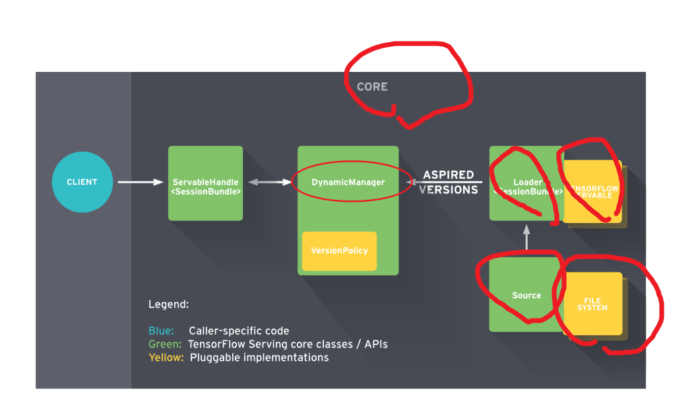

[TOC]

计算模型完成以后，需要对模型进行持久化保存，并部署在服务上。Tensorflow 为模型的部署上线提供了以**Tensorflow Service**为核心的解决方案[^1]

# 1. Tensorflow Service 简介
TensorFlow Serving 是一个用于机器学习模型Serving的高性能开源库，它可以将训练好的机器学习模型部署到线上，使用 `gRPC`/`RESTful` 作为接口接受外部调用。

## 1.1. 效果及功能类型
1. 统一管理一个模型服务器，利于让他人使用**多个模型**；
2. 可以动态更新模型（热更新）；
3. 模型也会常住在内存里面，加快结果输出，**减少模型加载时间**。

目前，TensorFlow Serving有3个服务API，每个API通过签名（SignatureDef）定义关联：

1. 分类classify 返回 label:string score:float
2. 回归regress 返回 value:float
3. 预测predictions 返回 predictions:{}

## 1.2. 架构

Client端会不断给Manager发送请求，Manager会根据版本管理策略管理模型更新，并将最新的模型计算结果返回给Client端



## 1.3. 基础概念

### 1.3.1. Core 核心
TensorFlow Serving `Core` 用于管理  Servable的生命周期和测量
### 1.3.2. Manager 管理器
`Manager` 处理TensorFlow模型的全周期过程（模型加载、服务提供、模型卸载、模型版本迭代）。

### 1.3.3. Loader 加载器

加载器`Loaders` 管理可服务类`servable`的生命周期
### 1.3.4. Sources 资源模块

`Sources`资源模块用于从多种类型的文件系统`file system`中发现和提供可服务类`Servables`。其过程可以由类似rpc等协议实现。

对于每个资源模块而言，它提供0+个可服务类流`servable streams`。对于每个可服务类流`servable streams`，资源模块为其提供1个加载器实例`Loader instance`

### 1.3.5. Models 模型
TensorFlow Serving 将一个模型`Models`通过1个或多个`Servable `可服务类表示。

1个机器学习模型包括1个或多个算法（包括学习完成的权重）和嵌入表等。


### 1.3.6. Servable 可服务类

Servable 可服务类是一个为客户端提供计算的对象。TensorFlow Serving 将一个模型通过1个或多个Servable 可服务类 表示。

一个经典的servables 包括包括以下内容:

1. a TensorFlow SavedModelBundle (tensorflow::Session)
2. a lookup table for embedding or vocabulary lookups


多个模型`Models`构成的组成模型可以以下方式表示：
1. 多个独立的servables
2. 1个组合的servables

1个 servables 同样可以只反应模型一部分

期望的版本`Aspired versions` 表示可用且准备好的可服务类 `Servable`版本

# 2. 依赖项安装与模型部署
## 2.1. 安装Tensoflow Serving

```shell
# 推荐 docker 安装 
docker pull tensorflow/serving:latest-devel

# Linux
sudo apt-get install tensorflow-model-server
```

## 2.2. 准备`~/model` 中的模型文件
部署模型必须有形如以下格式的文件夹作为模型存放地址。构建模型文件的方法参考 `tf.saver` 。
```shell
~/export_dir
|__assets/
|__assets.extra/
|__saved_model.pd
|__variables
    |__variables.index
    |__variables.data-00000-of-00001
```
主要由以下及部分组成：

1. SavedModel protocol buffe
   · 以`saved_model.pb` 或 `saved_model.pbtxt`格式的文件呈现
   · 包括以 MetaGraphDef protocol buffers 格式的图的定义。
   
2. Assets 资源
   · 一个名为 `assets` 的子文件夹
   · 包含 词汇表`vocabularies` 等辅助文件
3. 额外资源 Extra assets
   · 一个名为`Extra assets` 子文件夹
   · 包括用户需要的自己的包或高级别的库，这些需求并没有在图中加载
   · This subfolder is not managed by the SavedModel libraries.
4. 变量的值
   · 一个名为`variables` 的文件夹
   · 包含从TensorFlow Saver 得到的输出，包括以下2个文件：
```shell
      *  variables.data-?????-of-?????
      *  variables.index
```

### 2.2.1. 用于服务的模型签名 SignatureDefs
[SignatureDefs in SavedModel for TensorFlow Serving](https://www.tensorflow.org/tfx/serving/signature_defs
)

SignatureDefs 签名 的主要作用是定义输入和输出接口协议。它在构建SavedModel 时，被封装到二进制文件种中。

SignatureDefs 包含3部分内容：

1. input：封装着TensorInfo信息的字典
2. outputs ：和上面一样，封装着TensorInfo信息的字典
3. method_name：在加载的工具和系统中，对应着方法名。（我的理解是可能存在多个前面，用method_name指定一个唯一的key）


```shell


MetaGraphDef with tag-set: 'serve' contains the following SignatureDefs:

signature_def['serving_default']:
  The given SavedModel SignatureDef contains the following input(s):
    inputs['input_ids'] tensor_info:
        dtype: DT_INT64
        shape: (32, 128)
        name: ParseExample/ParseExample:0
    inputs['input_mask'] tensor_info:
        dtype: DT_INT64
        shape: (32, 128)
        name: ParseExample/ParseExample:1
    inputs['label_ids'] tensor_info:
        dtype: DT_INT64
        shape: (32)
        name: ParseExample/ParseExample:2
    inputs['segment_ids'] tensor_info:
        dtype: DT_INT64
        shape: (32, 128)
        name: ParseExample/ParseExample:3
  The given SavedModel SignatureDef contains the following output(s):
    outputs['labels'] tensor_info:
        dtype: DT_INT32
        shape: (32)
        name: loss/Squeeze:0
    outputs['probabilities'] tensor_info:
        dtype: DT_FLOAT
        shape: (32, 2)
        name: loss/LogSoftmax:0
  Method name is: tensorflow/serving/predict
```
## 2.3. [基础]运行

### 2.3.1. 基于Linux的部署与运行
使用SavedModel CLI 命令开启服务

```shell 
$ tensorflow_model_server --port=9000 --model_name='模型名称'  --model_base_path=/tmp/mnist_model/
``` 

### 2.3.2. 基于docker的部署与运行
1. 进入docker 命令行
```shell 
docker run -it -p 8500:8500 --name grpc_name tensorflow/serving:latest-devel

# 8500端口：grpc的端口
# 8501端口：restful api的端口
# 上述命令直接进入docker 的命令行
#[docker]
>>> ls 
```
2. 将模型部署到docker中

将位于 `~/model`的文件复制到名为 `grpc_name` docker 中的 `/online_model` 文件夹中 

```shell
docker cp ~/model grpc:/online_model
```
其中 `~/model` 中的文件 形如:
```shell
~/model
|__assets/
|__assets.extra/
|__variables/
    |__variables.data-?????-of-?????
    |__variables.index
|__saved_model.pb
```

3. 在服务端开启服务 
   
```docker
# on [Docker]
tensorflow_model_server --port=8500 --model_name='模型名称' --model_base_path=/online_model/builder/
```


### 2.3.3. 离线设备的部署与运行

部署到Android可参考 https://medium.com/@tobe_ml/all-tensorflow-models-can-be-embedded-into-mobile-devices-1932e80579e5

部署到iOS可参考 https://zhuanlan.zhihu.com/p/33715219

## 2.4. [进阶]配置


### 2.4.1. 多模型配置

```shell
./export_model/
|__model.config
|
└──model_1
    ├── version_1
    │   ├── assets
    │   │   └── vocab.txt
    │   ├── saved_model.pb
    │   └── variables
    │       ├── variables.data-00000-of-00001
    │       └── variables.index
    └── version_2
        ├── assets
        │   └── vocab.txt
        ├── saved_model.pb
        └── variables
            ├── variables.data-00000-of-00001
            └── variables.index
└──model_2
    ├── version_1
    │   ├── assets
    │   │   └── vocab.txt
    │   ├── saved_model.pb
    │   └── variables
    │       ├── variables.data-00000-of-00001
    │       └── variables.index
    └── version_2
        ├── assets
        │   └── vocab.txt
        ├── saved_model.pb
        └── variables
            ├── variables.data-00000-of-00001
            └── variables.index
└──model_3
    ├── version_1
    │   ├── assets
    │   │   └── vocab.txt
    │   ├── saved_model.pb
    │   └── variables
    │       ├── variables.data-00000-of-00001
    │       └── variables.index
    └── version_2
        ├── assets
        │   └── vocab.txt
        ├── saved_model.pb
        └── variables
            ├── variables.data-00000-of-00001
            └── variables.index
```
其中 `version_1` 只能是 `0~99` 的数字

在`/export_model/`文件夹下新建一个配置文件model.config，文件内容为：
```config 

model_config_list:{
    config:{
      name:"model1",
      base_path:"/models/multiModel/model1",
      model_platform:"tensorflow"
    },
    config:{
      name:"model2",
      base_path:"/models/multiModel/model2",
      model_platform:"tensorflow"
    },
    config:{
      name:"model3",
      base_path:"/models/multiModel/model3",
      model_platform:"tensorflow"
    } 
}
```

配置文件定义了模型的名称和模型在容器内的路径，现在运行tfserving容器 :
```shell
docker run -p 8501:8501 --mount type=bind,source=/home/jerry/tmp/multiModel/,target=/models/multiModel \
 -t tensorflow/serving --model_config_file=/models/multiModel/models.config
```

### 2.4.2. 模型版本策略

如果一个模型有多个版本，并在预测的时候希望指定模型的版本，可以通过以下方式实现。

修改model.config文件，增加 `model_version_policy`：
```js
model_config_list:{
    config:{
      name:"model1",
      base_path:"/models/multiModel/model1",
      model_platform:"tensorflow",
      model_version_policy:{
        all:{}
      }
    },
    config:{
      name:"model2",
      base_path:"/models/multiModel/model2",
      model_platform:"tensorflow"
    },
    config:{
      name:"model3",
      base_path:"/models/multiModel/model3",
      model_platform:"tensorflow"
    } 
}
```
### 2.4.3. 批量处理


Batching
Another typical server feature we want in a production environment is batching. Modern hardware accelerators (GPUs, etc.) used to do machine learning inference usually achieve best computation efficiency when inference requests are run in large batches.

Batching can be turned on by providing proper SessionBundleConfig when creating the SavedModelBundleSourceAdapter. In this case we set the BatchingParameters with pretty much default values. Batching can be fine-tuned by setting custom timeout, batch_size, etc. values. For details, please refer to BatchingParameters.

SessionBundleConfig session_bundle_config;
// Batching config
if (enable_batching) {
  BatchingParameters* batching_parameters =
      session_bundle_config.mutable_batching_parameters();
  batching_parameters->mutable_thread_pool_name()->set_value(
      "model_server_batch_threads");
}
*saved_model_bundle_source_adapter_config.mutable_legacy_config() =
    session_bundle_config;

Upon reaching full batch, inference requests are merged internally into a single large request (tensor), and tensorflow::Session::Run() is invoked (which is where the actual efficiency gain on GPUs comes from).


Batching Configuration
Model Server has the ability to batch requests in a variety of settings in order to realize better throughput. The scheduling for this batching is done globally for all models and model versions on the server to ensure the best possible utilization of the underlying resources no matter how many models or model versions are currently being served by the server (more details). You may enable this behavior by setting the --enable_batching flag and control it by passing a config to the --batching_parameters_file flag.

Example batching parameters file:

max_batch_size { value: 128 }
batch_timeout_micros { value: 0 }
max_enqueued_batches { value: 1000000 }
num_batch_threads { value: 8 }

Please refer to the batching guide for an in-depth discussion and refer to the section on parameters to understand how to set the parameters.


# 3. 客户端请求 RESTful API[^3]

TensorFlow ModelServer 可以运行在 `host:port` 上并接受 REST API 请求：
```
POST: http://host:port/<URI>:<VERB>
```
其中 
1. `<URI>`: 形如 `/v1/models/${MODEL_NAME}[/versions/${MODEL_VERSION}]`
`/versions/${MODEL_VERSION} `为可选部分，如果省略的话则使用最新版本的模型。

2. `<VERB>`: 为 `classify`|`regress`|`predict` 中的一种

请求 URLs 的示例如下：
```shell
http://host:port/v1/models/iris:classify
http://host:port/v1/models/模型名称/versions/模型版本号:predict
```


请求和响应均为一个 JSON 对象，其内容取决于请求的类型和 VERB.

为了处理可能的错误，APIs 返回的 JSON 对象中包含了一个以 error 为键，`error` 错误信息返回json形式
```javascript
{
  "error": <error message string>
}
```

## 3.1. 请求模型状态

**请求URL**
```
GET http://host:port/v1/models/${MODEL_NAME}[/versions/${MODEL_VERSION}]

GET http://127.0.0.1:8501/v1/models/iris/versions/1570601080
```
其中，`/versions/${MODEL_VERSION}` 为可选项，若缺失则返回所有。

**返回格式**
```json
{
 "model_version_status": [
  {
   "version": "1570601080",
   "state": "AVAILABLE",
   "status": {
    "error_code": "OK",
    "error_message": ""
   }
  }
 ]
}
```

## 3.2. 请求模型元数据Metadata

**请求URL**
```
GET http://host:port/v1/models/${MODEL_NAME}[/versions/${MODEL_VERSION}]/metadata
```
其中，`/versions/${MODEL_VERSION}` 为可选项，若缺失则返回最近模型的元数据

**返回格式**

```json

```
## 3.3. 请求模型输出值

请求模型输出值需要通过 post 方法获得模型输出值，post 需要设定的内容包括：
1. url
2. data
```python
response = requests.post(SERVER_URL, data=predict_request) 
```

TensorFlow Serving有3个服务API：

1. 分类
2. 回归
3. 预测


### 3.3.1. 分类、回归 问题

**请求格式**
分类或回归问题的请求格式相同

1. URL
```
POST http://host:port/v1/models/${MODEL_NAME}[/versions/${MODEL_VERSION}]:(classify|regress)
```

其中 `/versions/${MODEL_VERSION}` 是可选项，若缺失则使用最新版本。

2. data 

data 为 `json` 格式文件，形如以下：
```json
{
  // Optional: serving signature to use.
  // If unspecifed default serving signature is used.
  "signature_name": <string>,

  // Optional: Common context shared by all examples.
  // Features that appear here MUST NOT appear in examples (below).
  "context": {
    "<feature_name3>": <value>|<list>
    "<feature_name4>": <value>|<list>
  },

  // List of Example objects
  "examples": [
    {
      // Example 1
      "<feature_name1>": <value>|<list>,
      "<feature_name2>": <value>|<list>,
      ...
    },
    {
      // Example 2
      "<feature_name1>": <value>|<list>,
      "<feature_name2>": <value>|<list>,
      ...
    }
    ...
  ]
}
```
其中，`<value>` 是 JSON number (whole or decimal) or string, and `<list>` is a list of such values.


**返回格式**


1. 分类问题
分类问题返回的是一个 label 列表，如下
```javascript
{
  "result": [
    // List of class label/score pairs for first Example (in request)
    [ [<label1>, <score1>], [<label2>, <score2>], ... ],

    // List of class label/score pairs for next Example (in request)
    [ [<label1>, <score1>], [<label2>, <score2>], ... ],
    ...
  ]
}
```
`<label>` is a string (which can be an empty string `""` if the model does not have a label associated with the score).
 `<score>` is a decimal (floating point) number.


2. 回归问题
```javascript
{
  // One regression value for each example in the request in the same order.
  "result": [ <value1>, <value2>, <value3>, ...]
}
```

`<value>` is a decimal number.


### 3.3.2. 预测问题

**请求格式**

1. url 
```
POST http://host:port/v1/models/${MODEL_NAME}[/versions/${MODEL_VERSION}]:predict
```
其中 ，`/versions/${MODEL_VERSION}` is optional. If omitted the latest version is used.

2. data 
  
predict API 的请求data，可以说多维矩阵（n x m），这样格式的数据转换成json字符串有多种形式，这里可以选择2种形式：
1. instances
2. inputs

JSON 对象格式如下：

```json
{
  // (Optional) Serving signature to use.
  // If unspecifed default serving signature is used.
  // signature_name 为可选项
  "signature_name": <string>,

  // Input Tensors in row ("instances") or columnar ("inputs") format.
  // A request can have EITHER of them but NOT both.
  // instances|inputs 二选一
  "instances": <value>|<(nested)list>|<list-of-objects>
  
  "inputs": <value>|<(nested)list>|<object>
}
```

形如以下的数据（2个实例，3个命名空间，2行3列）输入到模型中

| tag   | signal          | sensor            |
| ----- | --------------- | ----------------- |
| "foo" | [1, 2, 3, 4, 5] | [[1, 2], [3, 4] ] |
| "bar" | [3, 4, 1, 2, 5] | [[4, 5], [6, 8] ] |


#### 3.3.2.1. 按列输入

column format

请求 `data` 格式如下

```json
{
 "inputs": {
   "tag": ["foo", "bar"],
   "signal": [[1, 2, 3, 4, 5], [3, 4, 1, 2, 5]],
   "sensor": [[[1, 2], [3, 4]], [[4, 5], [6, 8]]]
 }
}
```

`predict` 返回格式

```json
{
  "predictions": <value>|<(nested)list>|<list-of-objects>
}
```
#### 3.3.2.2. 按行输入

row format
请求 `data` 格式如下
```json
{
 "instances": [
   {
     "tag": "foo",
     "signal": [1, 2, 3, 4, 5],
     "sensor": [[1, 2], [3, 4]]
   },
   {
     "tag": "bar",
     "signal": [3, 4, 1, 2, 5]],
     "sensor": [[4, 5], [6, 8]]
   }
 ]
}

// 0维度数据 当只有一个命名 1 列输入
{
  // List of 3 scalar tensors.
  "instances": [ "foo", "bar", "baz" ]
}

{
  // List of 2 tensors each of [1, 2] shape
  "instances": [ [[1, 2]], [[3, 4]] ]
}
```

`predict` 返回格式

```json
{
  "outputs": <value>|<(nested)list>|<object>
}
```


### 3.3.3. 分类、回归、预测问题的区别


分类classify 返回 label:string score:float
回归regress 返回 value:float
预测 返回 predictions:{}


## 3.4. json 格式说明


### 3.4.1. 输出二进制值的需求

TensorFlow不区分非二进制和二进制值。所有的都是DT_STRING类型。tensor名中有_bytes后缀的表示有二进制值，每个值有着下面 编码二进制值中不同的编码。

### 3.4.2. JSON映射

RESTful APIs支持JSON的标准编码，使得不同系统间共享数据更简单。对于支持的类型，会按照下面的表进行一一对应编码。下表没列出的类型说明未支持。

| TensorFlow数据类型                                                    | JSON值      | JSON示例                     | 备注                                                                                                   |
| --------------------------------------------------------------------- | ----------- | ---------------------------- | ------------------------------------------------------------------------------------------------------ |
| DT_BOOL                                                               | true, false | true, false                  | -                                                                                                      |
| DT_STRING                                                             | string      | "Hello World!"               | 如果DT_STRING 表示的是二进制值（比如序列化的图片比特流），会以Base64编码。查看编码二进制值获取更多内容 |
| DT_INT8, DT_UINT8, DT_INT16, DT_INT32, DT_UINT32, DT_INT64, DT_UINT64 | number      | 1, -10, 0                    | JSON值为十进制整数                                                                                     |
| DT_FLOAT, DT_DOUBLE                                                   | number      | 1.1, -10.0, 0, NaN, Infinity | JSON值会是一个数字或者特殊标示值NaN和Infinity，查看JSON一致性获取更多内容。指数符号也是接受的。        |
### 3.4.3. 编码二进制值
JSON使用UTF-8编码。如果你输入了需要变成二进制的feature或者tensor值（比如图片比特流），你必须用Base64编码数据，并且将其放入有b64作为key的JSON对象，如下：
```json
{ "b64": <base64 encoded string> }
```
你可以将该值作为feature或者tensor的值，回复体也会以同样的形式编码。

一个有着image（二进制数据）和caption features 的分类请求如下：
```json
{
  "signature_name": "classify_objects",
  "examples": [
    {
      "image": { "b64": "aW1hZ2UgYnl0ZXM=" },
      "caption": "seaside"
    },
    {
      "image": { "b64": "YXdlc29tZSBpbWFnZSBieXRlcw==" },
      "caption": "mountains"
    }
  ]
}
```
### 3.4.4. JSON一致性
很多feature或者tensor都是浮点型。除了有限的值外（e.g. 3.14, 1.0 等等），可以使用NaN或者无限值（Infinity 和-Infinity）。不幸的是JSON标准（RFC 7159）不识别这些值（即使JavaScript标准识别）。

REST API允许请求和回复体包含这些值。也就是说如下的请求是有效的：
```json
{
  "example": [
    {
      "sensor_readings": [ 1.0, -3.14, Nan, Infinity ]
    }
  ]
}
```
遵循严格标准的JSON解析器会拒绝它并返回解析错误。为了准确地处理你的代码中的请求和回复，请使用支持这些标识的JSON解析器。

NaN, Infinity, -Infinity标识能被proto3、Python JSON模块和JavaScript语言识别。


## 3.5. 示例


请求预测：
```python
import requests 
import numpy as np 
SERVER_URL = 'http://localhost:8501/v1/models/model3:predict'  
#注意SERVER_URL中的‘model3’是config文件中定义的模型name,不是文件夹名称

def prediction(): 
    predict_request='{"instances":%s}' % str([[[10]*7]*7]) 
    print(predict_request) 
    response = requests.post(SERVER_URL, data=predict_request) 
    print(response)
    prediction = response.json()['predictions'][0] 
    print(prediction) 

if __name__ == "__main__": 
    prediction()
```


# 4. 客户端请求实践

1. 了解模型
2. 定义通讯手段 restful grpc?
3. 写好脚本


从上面两段代码可以知道，我们只需要约定好输入输出的别名，在保存模型的时候使用这些别名创建signature，输入输出tensor的具体名称已经完全隐藏，这就实现创建模型与使用模型的解耦。

最重要的是使用TensorInfo对象进行，训练和预测时候的解耦

```python

from __future__ import print_function
import grpc
import requests
import tensorflow as tf
import cv2
import time
import numpy as np
 
from tensorflow_serving.apis import predict_pb2
from tensorflow_serving.apis import prediction_service_pb2_grpc
 
from utils import label_map_util
from utils import visualization_utils as vis_util
 
tf.app.flags.DEFINE_string('server', '****:8500',
                           'PredictionService host:port')
tf.app.flags.DEFINE_string('image', 'test.jpg', 'path to image in JPEG format')
FLAGS = tf.app.flags.FLAGS
 
def main(_):
  # 设置grpc
  options = [('grpc.max_send_message_length', 1000 * 1024 * 1024), 
            ('grpc.max_receive_message_length', 1000 * 1024 * 1024)]   
  channel = grpc.insecure_channel(FLAGS.server, options = options)
  stub = prediction_service_pb2_grpc.PredictionServiceStub(channel)
  request = predict_pb2.PredictRequest()
  # 模型的名字
  request.model_spec.name = 'detection'
  # 模型的签名的名字
  request.model_spec.signature_name = 'serving_default'
 
  # 输入图片并进行请求
  img = cv2.imread(FLAGS.image)
  tensor = tf.contrib.util.make_tensor_proto(img, shape=[1]+list(img.shape))
  request.inputs['inputs'].CopyFrom(tensor)
  start = time.time()
 
  # 法一，速度较慢
  # result = stub.Predict(request, 10.0)  # 10 secs timeout
 
  # 法二，速度较快
  result_future = stub.Predict.future(request, 10.0)  # 10 secs timeout
  result = result_future.result()
 
  stop = time.time() 
  print('time is ', stop - start) 
 
  # 读取标签配置文件
  NUM_CLASSES = 11
  label_map = label_map_util.load_labelmap('./data/object-detection.pbtxt')
  categories = label_map_util.convert_label_map_to_categories(
    label_map, max_num_classes=NUM_CLASSES, use_display_name=True)
  category_index = label_map_util.create_category_index(categories)
 
  # 可视化检测结果
  boxes = result.outputs['detection_boxes'].float_val
  classes = result.outputs['detection_classes'].float_val
  scores = result.outputs['detection_scores'].float_val
  result = vis_util.visualize_boxes_and_labels_on_image_array(
      img,
      np.reshape(boxes,[300,4]),
      np.squeeze(classes).astype(np.int32),
      np.squeeze(scores),
      category_index,
      use_normalized_coordinates=True,
      line_thickness=8)       
 
  # 保存结果图片                    
  cv2.imwrite('result.jpg', result)
 
if __name__ == '__main__':
  tf.app.run()
```


# 5. [进阶] simple_tensorflow_serving 工具

simple_tensorflow_serving 是一个TensorFlow Serving的封装，是机器学习模型的通用且易于使用的服务，使得模型的部署变得更加容易

参考：https://github.com/tobegit3hub/simple_tensorflow_serving

# 6. SavedModel CLI [^2]
SavedModel 命令行 

SavedModel CLI 在 SavedModel 中 MetaGraphDef 上支持以下两个命令：

1. `show` ，显示在 SavedModel 中 MetaGraphDef 上的计算。
2. `run` ，在 MetaGraphDef 上运行计算。
### 6.0.1. show 查看模型文件信息
```shell 
# 查看模型中所有Metagraph的tag
saved_model_cli show --dir "/export_model"
>>>
The given SavedModel contains the following tag-sets:
train

saved_model_cli show --dir "/export_model"

# 查看指定Metagraph的签名
saved_model_cli show --dir /tmp/saved_model_dir --tag_set serve


# 查看模型的所有信息

saved_model_cli show --dir /tmp/saved_model_dir --all
```


### 6.0.2. run 运行

调用 run 命令以运行图计算、传递输入，然后显示（并可选地保存）输出。语法如下：
```shell
usage: saved_model_cli run [-h] --dir DIR --tag_set TAG_SET --signature_def
                           SIGNATURE_DEF_KEY [--inputs INPUTS]
                           [--input_exprs INPUT_EXPRS]
                           [--input_examples INPUT_EXAMPLES] [--outdir OUTDIR]
                           [--overwrite] [--tf_debug]
```

e[^4]

# 7. 参考文献

[^1]:Tensorflow官方 Serving a TensorFlow Model https://www.tensorflow.org/tfx/serving/serving_basic

[^4]:https://github.com/tensorflow/tensorflow/blob/master/tensorflow/python/saved_model/README.md

[^2]:Tensorflow官方_保存和恢复 https://www.tensorflow.org/guide/saved_model#cli_to_inspect_and_execute_savedmodel

[^3]: RESTful API : https://github.com/tensorflow/serving/blob/master/tensorflow_serving/g3doc/api_rest.md


