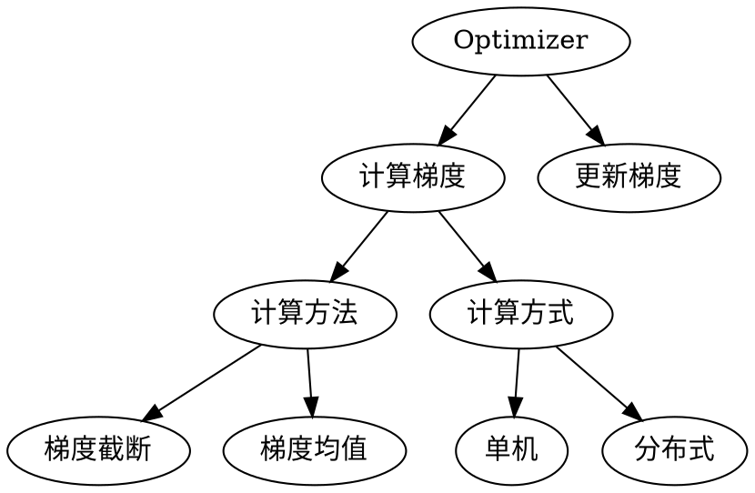

[TOC]


# 1. Tensorflow 里的优化器

## 1.1. 概述
优化器（Optimizer）。实际上代表的是一组Operation 操作，因为将Optimizer加入图之后，tensorflow会自动为图加入两类Operation，分别是
1. compute_gradients() **计算梯度**；
2. apply_gradients() **更新梯度**。

前者接收代表损失的Tensor输入, 输出梯度Tensor，后者对梯度Tensor作一些聚合并据此用tf.assign()对模型参数变量进行更新




## 1.2. tf.train.Optimizer

GradientDescentOptimizer
AdagradOptimizer
AdagradDAOptimizer
MomentumOptimizer
AdamOptimizer
FtrlOptimizer
RMSPropOptimizer


本文所讲的内容主要为以下列表中相关函数。函数training()通过**梯度下降法**为最小化损失函数增加了相关的优化操作，在训练过程中，并基于一定的学习率进行梯度优化训练：

与其他tensorflow操作类似，这些训练操作都需要在tf.session会话中进行
**基本操作**
```python
# 1. 先实例化一个优化器Optimizer
optimizer = tf.train.GradientDescentOptimizer(learning_rate)

#2. 设置 一个用于记录全局训练步骤的单值 变量
global_step = tf.Variable(0, name='global_step', trainable=False)

# 3.使用minimize()操作。
## 该操作不仅可以1. 优化更新训练的模型参数，2.也可以为全局步骤(global step)计数
train_op = optimizer.minimize(loss, global_step=global_step)

```

| 操作组   | 操作                                                                       |
| -------- | -------------------------------------------------------------------------- |
| Training | Optimizers，Gradient Computation，Gradient Clipping，Distributed execution |
| Testing  | Unit tests，Utilities，Gradient checking                                   |

**Slots**

一些optimizer的之类，比如 MomentumOptimizer 和 AdagradOptimizer 分配和管理着额外的用于训练的变量。这些变量称之为'Slots'，Slots有相应的名称，可以向optimizer访问的slots名称。有助于在log debug一个训练算法以及报告slots状态

| 操作                                   | 描述                                                   |
| -------------------------------------- | ------------------------------------------------------ |
| tf.train.Optimizer.get_slot_names()    | 返回一个由Optimizer所创建的slots的名称列表             |
| tf.train.Optimizer.get_slot(var, name) | 返回一个name所对应的slot，name是由Optimizer为var所创建 |

var为用于传入 minimize() 或 apply_gradients()的变量
### 1.2.1. tf.train.GradientDescentOptimizer
使用梯度下降算法的Optimizer

```python 
Optimizer=tf.train.GradientDescentOptimizer.__init__(learning_rate, 
use_locking=False, name='GradientDescent') 	构建一个新的梯度下降优化器(Optimizer)
```
### 1.2.2. tf.train.AdadeltaOptimizer
使用Adadelta算法的 Optimizer
```python
# 创建Adadelta优化器
Optimizer=tf.train.AdadeltaOptimizer(learning_rate=0.001,rho=0.95, epsilon=1e-08,use_locking=False, name='Adadelta')
```

### 1.2.3. tf.train.AdagradOptimizer
使用Adagrad算法的Optimizer
```python
# 创建Adagrad优化器
tf.train.AdagradOptimizer.__init__(learning_rate, 
initial_accumulator_value=0.1, 
use_locking=False, name='Adagrad') 	

```

### 1.2.4. tf.train.MomentumOptimizer
使用Momentum算法的Optimizer
```python
# 创建momentum优化器
Optimizer=tf.train.MomentumOptimizer(learning_rate, 
momentum, use_locking=False, 
name='Momentum', use_nesterov=False) 	
# momentum：动量，一个tensor或者浮点值
```


### 1.2.5. tf.train.AdamOptimizer
使用Adam 算法的Optimizer
```python
# 创建Adam优化器
Optimizer=tf.train.AdamOptimizer.__init__(learning_rate=0.001,
beta1=0.9, beta2=0.999, epsilon=1e-08,
use_locking=False, name='Adam') 
```
### 1.2.6. tf.train.FtrlOptimizer
使用FTRL 算法的Optimizer
```python
# 创建FTRL算法优化器
Optimizer=tf.train.FtrlOptimizer(learning_rate, 
learning_rate_power=-0.5, 
initial_accumulator_value=0.1, 
l1_regularization_strength=0.0, 
l2_regularization_strength=0.0,
use_locking=False, name='Ftrl') 
```
### 1.2.7. tf.train.RMSPropOptimizer
使用RMSProp算法的Optimizer

```python
# 创建RMSProp算法优化器
tf.train.RMSPropOptimizer.__init__(learning_rate, 
decay=0.9, momentum=0.0, epsilon=1e-10, 
use_locking=False, name='RMSProp')
```


Adam 的基本运行方式，首先初始化：

    m_0 <- 0 (Initialize initial 1st moment vector)
    v_0 <- 0 (Initialize initial 2nd moment vector)
    t <- 0 (Initialize timestep)

在论文中的 section2 的末尾所描述了更新规则，该规则使用梯度g来更新变量：

    t <- t + 1
    lr_t <- learning_rate * sqrt(1 - beta2^t) / (1 - beta1^t)
     
    m_t <- beta1 * m_{t-1} + (1 - beta1) * g
    v_t <- beta2 * v_{t-1} + (1 - beta2) * g * g
    variable <- variable - lr_t * m_t / (sqrt(v_t) + epsilon)

其中epsilon 的默认值1e-8可能对于大多数情况都不是一个合适的值。例如，当在ImageNet上训练一个 Inception network时比较好的选择为1.0或者0.1。 
需要注意的是，在稠密数据中即便g为0时， m_t, v_t 以及variable都将会更新。而在稀疏数据中，m_t, v_t 以及variable不被更新且值为零。


# 2. 梯度计算与截断
(Gradient Computation and Clipping)

## 2.1. 梯度计算
Gradient Computation
TensorFlow 提供了计算给定tf计算图的求导函数`tf.gradients`，并在图的基础上增加节点。优化器(optimizer )类可以自动的计算网络图的导数，但是优化器中的创建器(creators)或者专业的人员可以通过本节所述的函数调用更底层的方法。

```python
# 构建一个符计算ys关于xs中x的偏导的和，返回xs中每个x对应的sum(dy/dx)

tf.gradients(ys, xs, grad_ys=None, name='gradients', 
colocate_gradients_with_ops=False, gate_gradients=False, 
aggregation_method=None)

```
## 2.2. 梯度截断
```python
#停止计算梯度，
tf.stop_gradient(input, name=None) 
```

在EM算法、Boltzmann机等可能会使用到

```python 
tf.clip_by_value(t, clip_value_min, clip_value_max, name=None) 
```	

基于定义的min与max对tesor数据进行截断操作，
目的是为了应对梯度爆发或者梯度消失的情况
```python
# 使用L2范式标准化tensor最大值为clip_norm,返回 t * clip_norm / l2norm(t)
tf.clip_by_norm(t, clip_norm, axes=None, name=None) 

# 使用平均L2范式规范tensor数据t，并以clip_norm为最大值
tf.clip_by_average_norm(t, clip_norm, name=None)

# 返回 t * clip_norm / l2norm_avg(t)

tf.clip_by_global_norm(t_list, 
clip_norm, use_norm=None, name=None) 	返回t_list[i] * clip_norm / max(global_norm, clip_norm)

# 其中global_norm = sqrt(sum([l2norm(t)**2 for t in t_list]))
tf.global_norm(t_list, name=None) 	返回global_norm = sqrt(sum([l2norm(t)**2 for t in t_list]))
```
 	


# 3. 学习率衰减(Decaying the learning rate)

```python
# 对学习率进行指数衰退
tf.train.exponential_decay(learning_rate, global_step, 
decay_steps, decay_rate, staircase=False, name=None) 	
```
tf.train.exponential_decay

    #该函数返回以下结果
    decayed_learning_rate = learning_rate *
             decay_rate ^ (global_step / decay_steps)
    ##例： 以0.96为基数，每100000 步进行一次学习率的衰退

**基本用法**
```python
# 1. 设置global_step
global_step = tf.Variable(0, trainable=False)
# 2. 设置起始学习率
starter_learning_rate = 0.1
# 3. 设置learning_rate
learning_rate =tf.train.exponential_decay(starter_learning_rate, global_step,100000, 0.96, staircase=True)
# 4. learning_rate 输入到Optimizer，将global_step输入到minimize 操作中
learning_step = (tf.train.GradientDescentOptimizer(learning_rate).minimize(...my loss..., global_step=global_step))
```

# 4. 移动平均(Moving Averages)

一些训练优化算法，比如`GradientDescent` `和Momentum` 在优化过程中便可以使用到移动平均方法。使用移动平均常常可以较明显地改善结果。
操作 	描述

class tf.train.ExponentialMovingAverage 	将指数衰退加入到移动平均中
tf.train.ExponentialMovingAverage.apply(var_list=None) 	对var_list变量保持移动平均
tf.train.ExponentialMovingAverage.average_name(var) 	返回var均值的变量名称
tf.train.ExponentialMovingAverage.average(var) 	返回var均值变量
tf.train.ExponentialMovingAverage.variables_to_restore(moving_avg_variables=None) 	返回用于保存的变量名称的映射

▷ tf.train.ExponentialMovingAverage

    # Example usage when creating a training model:
    # Create variables.
    var0 = tf.Variable(...)
    var1 = tf.Variable(...)
    # ... use the variables to build a training model...
    ...
    # Create an op that applies the optimizer.  This is what we usually
    # would use as a training op.
    opt_op = opt.minimize(my_loss, [var0, var1])
     
    # Create an ExponentialMovingAverage object
    ema = tf.train.ExponentialMovingAverage(decay=0.9999)
     
    # Create the shadow variables, and add ops to maintain moving averages
    # of var0 and var1.
    maintain_averages_op = ema.apply([var0, var1])
     
    # Create an op that will update the moving averages after each training
    # step.  This is what we will use in place of the usual training op.
    with tf.control_dependencies([opt_op]):
        training_op = tf.group(maintain_averages_op)
     
    ...train the model by running training_op...
     
    #Example of restoring the shadow variable values:
    # Create a Saver that loads variables from their saved shadow values.
    shadow_var0_name = ema.average_name(var0)
    shadow_var1_name = ema.average_name(var1)
    saver = tf.train.Saver({shadow_var0_name: var0, shadow_var1_name: var1})
    saver.restore(...checkpoint filename...)
    # var0 and var1 now hold the moving average values

tf.train.ExponentialMovingAverage.variables_to_restore

     
```python
variables_to_restore =ema.variables_to_restore()

saver = tf.train.Saver(variables_to_restore)
```


# 5. 协调器和队列运行器(Coordinator and QueueRunner)

查看queue中，queue相关的内容，了解tensorflow中队列的运行方式。
操作 	描述

class tf.train.Coordinator 	线程的协调器
tf.train.Coordinator.clear_stop() 	清除停止标记
tf.train.Coordinator.join(threads=None, stop_grace_period_secs=120) 	等待线程终止
threads:一个threading.Threads的列表，启动的线程，将额外加入到registered的线程中
tf.train.Coordinator.register_thread(thread) 	Register一个用于join的线程
tf.train.Coordinator.request_stop(ex=None) 	请求线程结束
tf.train.Coordinator.should_stop() 	检查是否被请求停止
tf.train.Coordinator.stop_on_exception() 	上下文管理器，当一个例外出现时请求停止
tf.train.Coordinator.wait_for_stop(timeout=None) 	等待Coordinator提示停止进程
class tf.train.QueueRunner 	持有一个队列的入列操作列表，用于线程中运行
queue:一个队列
enqueue_ops: 用于线程中运行的入列操作列表
tf.train.QueueRunner.create_threads(sess, 
coord=None, daemon=False, start=False) 	创建运行入列操作的线程，返回一个线程列表
tf.train.QueueRunner.from_proto(queue_runner_def) 	返回由queue_runner_def创建的QueueRunner对象
tf.train.add_queue_runner(qr, collection='queue_runners') 	增加一个QueueRunner到graph的收集器(collection )中
tf.train.start_queue_runners(sess=None, coord=None, daemon=True, start=True, collection='queue_runners') 	启动所有graph收集到的队列运行器(queue runners)

▷ class tf.train.Coordinator

    #Coordinator的使用，用于多线程的协调
    try:
      ...
      coord = Coordinator()
      # Start a number of threads, passing the coordinator to each of them.
      ...start thread 1...(coord, ...)
      ...start thread N...(coord, ...)
      # Wait for all the threads to terminate, give them 10s grace period
      coord.join(threads, stop_grace_period_secs=10)
    except RuntimeException:
      ...one of the threads took more than 10s to stop after request_stop()
      ...was called.
    except Exception:
      ...exception that was passed to coord.request_stop()


▷ tf.train.Coordinator.stop_on_exception()

    with coord.stop_on_exception():
      # Any exception raised in the body of the with
      # clause is reported to the coordinator before terminating
      # the execution of the body.
      ...body...
    #等价于
    try:
      ...body...
    exception Exception as ex:
      coord.request_stop(ex)


# 6. 分布示执行(Distributed execution)

可以阅读TensorFlow的分布式学习框架简介 查看更多tensorflow分布式细节。

操作 	描述
class tf.train.Server 	一个进程内的tensorflow服务，用于分布式训练
tf.train.Server.init(server_or_cluster_def, 
job_name=None, task_index=None, protocol=None,
config=None, start=True) 	创建一个新的服务，其中job_name, task_index, 
和protocol为可选参数，
优先级高于server_or_cluster_def中相关信息
server_or_cluster_def : 为一个tf.train.ServerDef 
或 tf.train.ClusterDef 协议(protocol)的buffer，
或者一个tf.train.ClusterSpec对象
tf.train.Server.create_local_server(config=None, start=True) 	创建一个新的运行在本地主机的单进程集群
tf.train.Server.target 	返回tf.Session所连接的目标服务器
tf.train.Server.server_def 	返回该服务的tf.train.ServerDef
tf.train.Server.start() 	开启服务
tf.train.Server.join() 	阻塞直到服务已经关闭

class tf.train.Supervisor 	一个训练辅助器，用于checkpoints模型以及计算的summaries。该监视器只是一个小的外壳(wrapper),用于Coordinator, a Saver, 和a SessionManager周围
tf.train.Supervisor.__init__(graph=None, ready_op=0, is_chief=True, init_op=0, init_feed_dict=None, local_init_op=0, logdir=None, 
summary_op=0, saver=0, global_step=0, 
save_summaries_secs=120, save_model_secs=600, 
recovery_wait_secs=30, stop_grace_secs=120,
checkpoint_basename='model.ckpt', session_manager=None, summary_writer=0, init_fn=None) 	创建一个监视器Supervisor
tf.train.Supervisor.managed_session(master=”, config=None, start_standard_services=True, close_summary_writer=True) 	返回一个管路session的上下文管理器
tf.train.Supervisor.prepare_or_wait_for_session(master=”, config=None, wait_for_checkpoint=False, max_wait_secs=7200, start_standard_services=True) 	确保model已经准备好
tf.train.Supervisor.start_standard_services(sess) 	为sess启动一个标准的服务
tf.train.Supervisor.start_queue_runners(sess, queue_runners=None) 	为QueueRunners启动一个线程，queue_runners为一个QueueRunners列表
tf.train.Supervisor.summary_computed(sess, summary, global_step=None) 	指示计算的summary
tf.train.Supervisor.stop(threads=None, close_summary_writer=True) 	停止服务以及协调器(coordinator),并没有关闭session
tf.train.Supervisor.request_stop(ex=None) 	参考Coordinator.request_stop()
tf.train.Supervisor.should_stop() 	参考Coordinator.should_stop()
tf.train.Supervisor.stop_on_exception() 	参考 Coordinator.stop_on_exception()
tf.train.Supervisor.Loop(timer_interval_secs, target, args=None, kwargs=None) 	开启一个循环器线程用于调用一个函数
每经过timer_interval_secs秒执行，target(*args, **kwargs)
tf.train.Supervisor.coord 	返回监督器(Supervisor)使用的协调器(Coordinator )


class tf.train.SessionManager 	训练的辅助器，用于从checkpoint恢复数据以及创建一个session
tf.train.SessionManager.__init__(local_init_op=None, ready_op=None, graph=None, recovery_wait_secs=30) 	创建一个SessionManager
tf.train.SessionManager.prepare_session(master, init_op=None, saver=None, checkpoint_dir=None, wait_for_checkpoint=False, max_wait_secs=7200, config=None, init_feed_dict=None, init_fn=None) 	创建一个session，并确保model可以被使用
tf.train.SessionManager.recover_session(master, saver=None, checkpoint_dir=None, wait_for_checkpoint=False, max_wait_secs=7200, config=None) 	创建一个session，如果可以的话，使用恢复方法创建
tf.train.SessionManager.wait_for_session(master, config=None, max_wait_secs=inf) 	创建一个session，并等待model准备完成


class tf.train.ClusterSpec 	将一个集群表示为一系列“tasks”，并整合至“jobs”中
tf.train.ClusterSpec.as_cluster_def() 	返回该cluster中一个tf.train.ClusterDef协议的buffer
tf.train.ClusterSpec.as_dict() 	返回一个字典，由job名称对应于网络地址
tf.train.ClusterSpec.job_tasks(job_name) 	返回一个给定的job对应的task列表
tf.train.ClusterSpec.jobs 	返回该cluster的job名称列表
tf.train.replica_device_setter(ps_tasks=0, ps_device='/job:ps', worker_device='/job:worker', merge_devices=True, cluster=None, ps_ops=None) 	返回一个设备函数(device function)，以在建立一个副本graph的时候使用，设备函数(device function)用在with tf.device(device_function)中

▷ tf.train.Server

    server = tf.train.Server(...)
    with tf.Session(server.target):
      # ...

    1
    2
    3
    4

    1
    2
    3
    4

▷ tf.train.Supervisor 
相关参数： 
ready_op : 一维 字符串 tensor。该tensor是用过监视器在prepare_or_wait_for_session()计算，检查model是否准备好可以使用。如果准备好，将返回一个空阵列，如果为None，该model没有被检查。 
is_chief : 如果为True，创建一个主监视器用于负责初始化与模型的恢复，若为False，则依赖主监视器。 
init_op : 一个操作，用于模型不能恢复时的初始化操作。默认初始化所有操作 
local_init_op : 可被所有监视器运行的初始化操作。 
logdir : 设置log目录 
summary_op : 一个操作(Operation )，返回Summary 和事件logs，需要设置 logdir 
saver : 一个Saver对象 
save_summaries_secs : 保存summaries的间隔秒数 
save_model_secs : 保存model的间隔秒数 
checkpoint_basename : checkpoint保存的基本名称

    使用在单进程中

    with tf.Graph().as_default():
      ...add operations to the graph...
      # Create a Supervisor that will checkpoint the model in '/tmp/mydir'.
      sv = Supervisor(logdir='/tmp/mydir')
      # Get a TensorFlow session managed by the supervisor.
      with sv.managed_session(FLAGS.master) as sess:
        # Use the session to train the graph.
        while not sv.should_stop():
          sess.run(<my_train_op>)
    # 在上下文管理器with sv.managed_session()内，所有在graph的变量都被初始化。
    # 或者说，一些服务器checkpoint相应模型并增加summaries至事件log中。
    # 如果有例外发生，should_stop()将返回True
    使用在多副本运行情况中 
    要使用副本训练已经部署在集群上的相同程序，必须指定其中一个task为主要，该task处理 initialization, checkpoints, summaries, 和recovery相关事物。其他task依赖该task。

    # Choose a task as the chief. This could be based on server_def.task_index,
    # or job_def.name, or job_def.tasks. It's entirely up to the end user.
    # But there can be only one *chief*.
    is_chief = (server_def.task_index == 0)
    server = tf.train.Server(server_def)
     
    with tf.Graph().as_default():
      ...add operations to the graph...
      # Create a Supervisor that uses log directory on a shared file system.
      # Indicate if you are the 'chief'
      sv = Supervisor(logdir='/shared_directory/...', is_chief=is_chief)
      # Get a Session in a TensorFlow server on the cluster.
      with sv.managed_session(server.target) as sess:
        # Use the session to train the graph.
        while not sv.should_stop():
          sess.run(<my_train_op>)

如果有task崩溃或重启，managed_session() 将检查是否Model被初始化。如果已经初始化，它只需要创建一个session并将其返回至正在训练的正常代码中。如果model需要被初始化，主task将对它进行重新初始化，而其他task将等待模型初始化完成。 
注意：该程序方法一样适用于单进程的work，该单进程标注自己为主要的便行

▷ supervisor中master的字符串形式 
无论运行在本机或者集群上，都可以使用以下值设定master flag：

    定义为 ” ，要求一个进程内且没有使用RPC的session
    定义为 ‘local'，要求一个使用基于RPC的主服务接口(“Master interface” )的session来运行tensorflow程序。更多细节可以查看 tf.train.Server.create_local_server()相关内容。
    定义为 ‘grpc://hostname:port'，要求一个指定的RPC接口的session，同时运行内部进程的master接入远程的tensorflow workers。可用server.target返回该形式

▷ supervisor高级用法

    启动额外的服务 
    managed_session()启动了 Checkpoint 和Summary服务。如果需要运行更多的服务，可以在managed_session()控制的模块中启动他们。

    #例如： 开启一个线程用于打印loss. 设置每60秒该线程运行一次，我们使用sv.loop()
     ...
      sv = Supervisor(logdir='/tmp/mydir')
      with sv.managed_session(FLAGS.master) as sess:
        sv.loop(60, print_loss, (sess))
        while not sv.should_stop():
          sess.run(my_train_op)

    1
    2
    3
    4
    5
    6
    7
    8

    1
    2
    3
    4
    5
    6
    7
    8

    启动更少的的服务 
    managed_session() 启动了 “summary” 和 “checkpoint” 线程，这些线程通过构建器或者监督器默认自动创建了summary_op 和saver操作。如果想运行自己的 summary 和checkpointing方法，关闭这些服务，通过传递None值给summary_op 和saver参数。

    在chief中每100个step，创建summaries
      # Create a Supervisor with no automatic summaries.
      sv = Supervisor(logdir='/tmp/mydir', is_chief=is_chief, summary_op=None)
      # As summary_op was None, managed_session() does not start the
      # summary thread.
      with sv.managed_session(FLAGS.master) as sess:
        for step in xrange(1000000):
          if sv.should_stop():
            break
          if is_chief and step % 100 == 0:
            # Create the summary every 100 chief steps.
            sv.summary_computed(sess, sess.run(my_summary_op))
          else:
            # Train normally
            sess.run(my_train_op)
     

    11
    12
    13
    14
    15
    16
    17

    11
    12
    13
    14
    15
    16
    17

▷ tf.train.Supervisor.managed_session

    def train():
      sv = tf.train.Supervisor(...)
      with sv.managed_session(<master>) as sess:
        for step in xrange(..):
          if sv.should_stop():
            break
          sess.run(<my training op>)
          ...do other things needed at each training step...

    1
    2
    3
    4
    5
    6
    7
    8

    1
    2
    3
    4
    5
    6
    7
    8

▷ tf.train.SessionManager

    with tf.Graph().as_default():
       ...add operations to the graph...
      # Create a SessionManager that will checkpoint the model in '/tmp/mydir'.
      sm = SessionManager()
      sess = sm.prepare_session(master, init_op, saver, checkpoint_dir)
      # Use the session to train the graph.
      while True:
        sess.run(<my_train_op>)
    #其中prepare_session()初始化和恢复一个模型参数。 
     
    #另一个进程将等待model准备完成，代码如下
    with tf.Graph().as_default():
      ...add operations to the graph...
      # Create a SessionManager that will wait for the model to become ready.
      sm = SessionManager()
      sess = sm.wait_for_session(master)
      # Use the session to train the graph.
      while True:
        sess.run(<my_train_op>)
    #wait_for_session()等待一个model被其他进程初始化

    11
    12
    13
    14
    15
    16
    17
    18
    19
    20
    21

    11
    12
    13
    14
    15
    16
    17
    18
    19
    20
    21

▷ tf.train.ClusterSpec 
一个tf.train.ClusterSpec表示一系列的进程，这些进程都参与分布式tensorflow的计算。每一个 tf.train.Server都在一个独有的集群中构建。 
创建一个具有两个jobs及其5个tasks的集群们需要定义从job名称列表到网络地址列表之间的映射。

    cluster = tf.train.ClusterSpec({"worker": ["worker0.example.com:2222",
                                               "worker1.example.com:2222",
                                               "worker2.example.com:2222"],
                                    "ps": ["ps0.example.com:2222",
                                           "ps1.example.com:2222"]})

    1
    2
    3
    4
    5

    1
    2
    3
    4
    5

▷ tf.train.replica_device_setter

    # To build a cluster with two ps jobs on hosts ps0 and ps1, and 3 worker
    # jobs on hosts worker0, worker1 and worker2.
    cluster_spec = {
        "ps": ["ps0:2222", "ps1:2222"],
        "worker": ["worker0:2222", "worker1:2222", "worker2:2222"]}
    with tf.device(tf.replica_device_setter(cluster=cluster_spec)):
      # Build your graph
      v1 = tf.Variable(...)  # assigned to /job:ps/task:0
      v2 = tf.Variable(...)  # assigned to /job:ps/task:1
      v3 = tf.Variable(...)  # assigned to /job:ps/task:0
    # Run compute

    11
    12

    11
    12


# 7. 汇总操作(Summary Operations)

我们可以在一个session中获取summary操作的输出，并将其传输到SummaryWriter以添加至一个事件记录文件中。
操作 	描述
tf.scalar_summary(tags, values, collections=None, name=None) 	输出一个标量值的summary协议buffer
tag的shape需要与values的相同，用来做summaries的tags，为字符串
tf.image_summary(tag, tensor, max_images=3, collections=None, name=None) 	输出一个图像tensor的summary协议buffer
tf.audio_summary(tag, tensor, sample_rate, max_outputs=3, collections=None, name=None) 	输出一个音频tensor的summary协议buffer
tf.histogram_summary(tag, values, collections=None, name=None) 	输出一个直方图的summary协议buffer
tf.nn.zero_fraction(value, name=None) 	返回0在value中的小数比例
tf.merge_summary(inputs, collections=None, name=None) 	合并summary
tf.merge_all_summaries(key='summaries') 	合并在默认graph中手机的summaries

▶▶将记录汇总写入文件中(Adding Summaries to Event Files)
操作 	描述
class tf.train.SummaryWriter 	将summary协议buffer写入事件文件中
tf.train.SummaryWriter.__init__(logdir, graph=None, max_queue=10, flush_secs=120, graph_def=None) 	创建一个SummaryWriter实例以及新建一个事件文件
tf.train.SummaryWriter.add_summary(summary, global_step=None) 	将一个summary添加到事件文件中
tf.train.SummaryWriter.add_session_log(session_log, global_step=None) 	添加SessionLog到一个事件文件中
tf.train.SummaryWriter.add_event(event) 	添加一个事件到事件文件中
tf.train.SummaryWriter.add_graph(graph, global_step=None, graph_def=None) 	添加一个Graph到时间文件中
tf.train.SummaryWriter.add_run_metadata(run_metadata, tag, global_step=None) 	为一个单一的session.run()调用添加一个元数据信息
tf.train.SummaryWriter.flush() 	刷新时间文件到硬盘中
tf.train.SummaryWriter.close() 	将事件问价写入硬盘中并关闭该文件
tf.train.summary_iterator(path) 	一个用于从时间文件中读取时间协议buffer的迭代器

▷ tf.train.SummaryWriter 
创建一个SummaryWriter 和事件文件。如果我们传递一个Graph进入该构建器中，它将被添加到事件文件当中，这一点与使用add_graph()具有相同功能。 
TensorBoard 将从事件文件中提取该graph，并将其显示。所以我们能直观地看到我们建立的graph。我们通常从我们启动的session中传递graph：

     
    ...create a graph...
    # Launch the graph in a session.
    sess = tf.Session()
    # Create a summary writer, add the 'graph' to the event file.
    writer = tf.train.SummaryWriter(<some-directory>, sess.graph)


▷ tf.train.summary_iterator

    #打印时间文件中的内容
    for e in tf.train.summary_iterator(path to events file):
        print(e)
     
    #打印指定的summary值
    # This example supposes that the events file contains summaries with a
    # summary value tag 'loss'.  These could have been added by calling
    # `add_summary()`, passing the output of a scalar summary op created with
    # with: `tf.scalar_summary(['loss'], loss_tensor)`.
    for e in tf.train.summary_iterator(path to events file):
        for v in e.summary.value:
            if v.tag == 'loss':
                print(v.simple_value)

    11
    12
    13

    11
    12
    13


# 8. 训练的通用函数及其他(Training utilities)

操作 	描述
tf.train.global_step(sess, global_step_tensor) 	一个用于获取全局step的小辅助器
tf.train.write_graph(graph_def, logdir, name, as_text=True) 	将一个graph proto写入一个文件中

  	:—
class tf.train.LooperThread 	可重复地执行代码的线程
tf.train.LooperThread.init(coord, timer_interval_secs, target=None, args=None, kwargs=None) 	创建一个LooperThread
tf.train.LooperThread.is_alive() 	返回是否该线程是活跃的
tf.train.LooperThread.join(timeout=None) 	等待线程结束
tf.train.LooperThread.loop(coord, timer_interval_secs, target, args=None, kwargs=None) 	启动一个LooperThread，用于周期地调用某个函数
调用函数target(args)
tf.py_func(func, inp, Tout, stateful=True, name=None) 	将python函数包装成tf中操作节点

▷ tf.train.global_step

    # Creates a variable to hold the global_step.
    global_step_tensor = tf.Variable(10, trainable=False, name='global_step')
    # Creates a session.
    sess = tf.Session()
    # Initializes the variable.
    sess.run(global_step_tensor.initializer)
    print('global_step: %s' % tf.train.global_step(sess, global_step_tensor))
     
    global_step: 10


▷ tf.train.write_graph

    v = tf.Variable(0, name='my_variable')
    sess = tf.Session()
    tf.train.write_graph(sess.graph_def, '/tmp/my-model', 'train.pbtxt')


▷ tf.py_func

    #tf.py_func(func, inp, Tout, stateful=True, name=None)
    #func：为一个python函数
    #inp：为输入函数的参数，Tensor列表
    #Tout： 指定func返回的输出的数据类型，是一个列表
    def my_func(x):
      # x will be a numpy array with the contents of the placeholder below
      return np.sinh(x)
    inp = tf.placeholder(tf.float32, [...])
    y = py_func(my_func, [inp], [tf.float32])


2.2 测试 (Testing)

TensorFlow 提供了一个方便的继承unittest.TestCase类的方法，该类增加有关TensorFlow 测试的方法。如下例子：

    import tensorflow as tf
     
     
    class SquareTest(tf.test.TestCase):
     
      def testSquare(self):
        with self.test_session():
          x = tf.square([2, 3])
          self.assertAllEqual(x.eval(), [4, 9])
     
     
    if __name__ == '__main__':
      tf.test.main()


# 9. 共用(Utilities)
操作 	描述
tf.test.main() 	运行所有的单元测试
tf.test.assert_equal_graph_def(actual, expected) 	断言 两个GraphDefs 是否几乎一样
tf.test.get_temp_dir() 	返回测试期间使用的临时目录
tf.test.is_built_with_cuda() 	返回是否Tensorflow支持CUDA(GPU)的build


# 10. 梯度检查(Gradient checking)

可对比compute_gradient 和compute_gradient_error函数的用法
操作 	描述
tf.test.compute_gradient(x, x_shape, y, y_shape, x_init_value=None, delta=0.001, init_targets=None) 	

计算并返回理论的和数值的Jacobian矩阵

tf.test.compute_gradient_error(x, x_shape, y, y_shape, x_init_value=None, delta=0.001, init_targets=None) 	计算梯度的error。在计算所得的与数值估计的Jacobian中 为dy/dx计算最大的error
