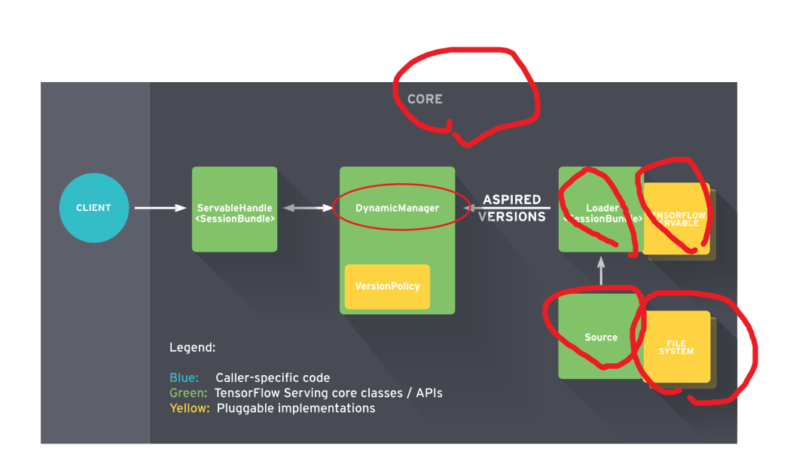

[TOC]

计算模型完成以后，需要对模型进行持久化保存，并部署在服务上。Tensorflow 为模型的部署上线提供了以tensorflow_service为核心的解决方案[^1]

# 1. tensorflow_service 简介
TensorFlow Serving 是一个用于机器学习模型Serving的高性能开源库，它可以将训练好的机器学习模型部署到线上，使用gRPC/RESTful作为接口接受外部调用。

## 1.1. 功能
1. 统一管理一个模型服务器，利于让他人使用多个模型，
2. 且可以动态更新模型（热更新）
3. 模型也会常住在内存里面，加快结果输出，减少模型加载时间。


### 提供服务 
目前有3个服务API: 分类、预测和回归。每个签名定义关联一个RPC API。分类SignatureDef用于分类RPC API，预测SignatureDef用于RPC API等等。


## 1.2. 架构
Client端会不断给Manager发送请求，Manager会根据版本管理策略管理模型更新，并将最新的模型计算结果返回给Client端



## 1.3. 概念

### 1.3.1. Core 核心
TensorFlow Serving Core 用于管理  Servable的生命周期和测量
### 1.3.2. Manager 管理器
manager 处理TensorFlow模型的全周期过程（模型加载、服务提供、模型卸载、模型版本迭代）


### 1.3.3. Loader 加载器
加载器`Loaders` 管理可服务类`servable`的生命周期
### 1.3.4. Sources 资源模块

`Sources`资源模块用于从多种类型的文件系统`file system`中发现和提供可服务类`Servables`。其过程可以由类似rpc等协议实现。


对于每个资源模块而言，它提供0+个可服务类流`servable streams`。对于每个可服务类流`servable streams`，资源模块为其提供1个加载器实例`Loader instance`

### 1.3.5. Models 模型
TensorFlow Serving 将一个模型`Models`通过1个或多个`Servable `可服务类 表示。

1个机器学习模型包括1个或多个算法（包括学习完成的权重）和嵌入表等。


### 1.3.6. Servable 可服务类

Servable 可服务类是一个为客户端提供计算的对象。TensorFlow Serving 将一个模型通过1个或多个Servable 可服务类 表示。
一个经典的servables 包括包括以下内容:

a TensorFlow SavedModelBundle (tensorflow::Session)
a lookup table for embedding or vocabulary lookups


多个模型`Models`构成的组成模型可以以下方式表示：
1. 多个独立的servables
2. 1个组合的servables

1个 servables 同样可以只反应模型一部分

期望的版本`Aspired versions` 表示可用且准备好的可服务类 `Servable`版本

# 2. tensorflow service运行前提
## 2.1. 安装 tensorflow service
```shell
# 推荐 docker 安装 
docker pull tensorflow/serving:latest-devel

# Linux
sudo apt-get install tensorflow-model-server
```

## 2.2. 准备`~/model` 中的模型文件
必须有形如以下格式的文件夹作为模型存放地址。构建模型文件的方法
参考 tf.saver 
```shell
~/export_dir
|__assets/
|__assets.extra/
|__saved_model.pd
|__variables
    |__variables.index
    |__variables.data-00000-of-00001

```
主要由以下及部分组成：

1. SavedModel protocol buffe
   ·  `saved_model.pb` or `saved_model.pbtxt`
   · 包括以 MetaGraphDef protocol buffers格式的图的定义。
   
2. Assets 资源
   · 一个名为 `assets` 的子文件夹
   · 包含 词汇表vocabularies 等辅助文件
3. 额外资源 Extra assets
   · 一个名为`Extra assets` 子文件夹
   · 包括用户需要的自己的包或高级别的库，这些需求并没有在图中加载
   · This subfolder is not managed by the SavedModel libraries.
4. 变量
   · 一个名为`variables` 的文件夹
   · 包含 从TensorFlow Saver 得到的输出 包括：
      *  variables.data-?????-of-?????
      *  variables.index
```shell


MetaGraphDef with tag-set: 'serve' contains the following SignatureDefs:

signature_def['serving_default']:
  The given SavedModel SignatureDef contains the following input(s):
    inputs['input_ids'] tensor_info:
        dtype: DT_INT64
        shape: (32, 128)
        name: ParseExample/ParseExample:0
    inputs['input_mask'] tensor_info:
        dtype: DT_INT64
        shape: (32, 128)
        name: ParseExample/ParseExample:1
    inputs['label_ids'] tensor_info:
        dtype: DT_INT64
        shape: (32)
        name: ParseExample/ParseExample:2
    inputs['segment_ids'] tensor_info:
        dtype: DT_INT64
        shape: (32, 128)
        name: ParseExample/ParseExample:3
  The given SavedModel SignatureDef contains the following output(s):
    outputs['labels'] tensor_info:
        dtype: DT_INT32
        shape: (32)
        name: loss/Squeeze:0
    outputs['probabilities'] tensor_info:
        dtype: DT_FLOAT
        shape: (32, 2)
        name: loss/LogSoftmax:0
  Method name is: tensorflow/serving/predict
```
### 2.2.1. 用于服务的模型签名 SignatureDefs
[SignatureDefs in SavedModel for TensorFlow Serving](https://www.tensorflow.org/tfx/serving/signature_defs
)


# 3. 服务器端模型上线运行

## 3.1. [基础]运行

**基于docker安装的运行**
1. 进入docker 命令行
```shell 
docker run -it -p 8500:8500 --name grpc_name tensorflow/serving:latest-devel

# 8500端口：grpc的端口
# 8501端口：restful api的端口
# 上述命令直接进入docker 的命令行
#[docker]

>>> ls 
```
2. 将模型部署到docker中

将位于 `~/model`的文件复制到 名为 `grpc_name` docker 中的 `/online_model` 文件夹中 

```shell
docker cp ~/model grpc:/online_model
```
其中 `~/model` 中的文件 形如:
```shell
~/model
|__assets/
|__assets.extra/
|__variables/
    |__variables.data-?????-of-?????
    |__variables.index
|__saved_model.pb
```

3. 在服务端开启服务 
   
```docker
# on [Docker]
tensorflow_model_server --port=8500 --model_name='模型名称' --model_base_path=/online_model/builder/
```

**基于Linux安装的运行**
使用SavedModel CLI 命令开启服务

```shell 
$ tensorflow_model_server --port=9000 --model_name='模型名称'  --model_base_path=/tmp/mnist_model/
``` 

## 3.2. [进阶]配置


### 3.2.1. 多模型配置

```shell
./export_model/
|
└──model_1
    ├── version_1
    │   ├── assets
    │   │   └── vocab.txt
    │   ├── saved_model.pb
    │   └── variables
    │       ├── variables.data-00000-of-00001
    │       └── variables.index
    └── version_2
        ├── assets
        │   └── vocab.txt
        ├── saved_model.pb
        └── variables
            ├── variables.data-00000-of-00001
            └── variables.index
└──model_2
    ├── version_1
    │   ├── assets
    │   │   └── vocab.txt
    │   ├── saved_model.pb
    │   └── variables
    │       ├── variables.data-00000-of-00001
    │       └── variables.index
    └── version_2
        ├── assets
        │   └── vocab.txt
        ├── saved_model.pb
        └── variables
            ├── variables.data-00000-of-00001
            └── variables.index
└──model_3
    ├── version_1
    │   ├── assets
    │   │   └── vocab.txt
    │   ├── saved_model.pb
    │   └── variables
    │       ├── variables.data-00000-of-00001
    │       └── variables.index
    └── version_2
        ├── assets
        │   └── vocab.txt
        ├── saved_model.pb
        └── variables
            ├── variables.data-00000-of-00001
            └── variables.index
```
在`/export_model/`文件夹下新建一个配置文件model.config，文件内容为：
```config 

model_config_list:{
    config:{
      name:"model1",
      base_path:"/models/multiModel/model1",
      model_platform:"tensorflow"
    },
    config:{
      name:"model2",
      base_path:"/models/multiModel/model2",
      model_platform:"tensorflow"
    },
    config:{
      name:"model3",
      base_path:"/models/multiModel/model3",
      model_platform:"tensorflow"
    } 
}
```

配置文件定义了模型的名称和模型在容器内的路径，现在运行tfserving容器 :
```shell
docker run -p 8501:8501 --mount type=bind,source=/home/jerry/tmp/multiModel/,target=/models/multiModel \
 -t tensorflow/serving --model_config_file=/models/multiModel/models.config
```

请求预测：
```python
import requests 
import numpy as np 
SERVER_URL = 'http://localhost:8501/v1/models/model3:predict'  
#注意SERVER_URL中的‘model3’是config文件中定义的模型name,不是文件夹名称

def prediction(): 
    predict_request='{"instances":%s}' % str([[[10]*7]*7]) 
    print(predict_request) 
    response = requests.post(SERVER_URL, data=predict_request) 
    print(response)
    prediction = response.json()['predictions'][0] 
    print(prediction) 

if __name__ == "__main__": 
    prediction()
```
### 3.2.2. 版本策略
如果一个模型有多个版本，并在预测的时候希望指定模型的版本，可以通过以下方式实现。
修改model.config文件，增加model_version_policy：
```js
model_config_list:{
    config:{
      name:"model1",
      base_path:"/models/multiModel/model1",
      model_platform:"tensorflow",
      model_version_policy:{
        all:{}
      }
    },
    config:{
      name:"model2",
      base_path:"/models/multiModel/model2",
      model_platform:"tensorflow"
    },
    config:{
      name:"model3",
      base_path:"/models/multiModel/model3",
      model_platform:"tensorflow"
    } 
}
```
### 3.2.3. 批量处理


Batching
Another typical server feature we want in a production environment is batching. Modern hardware accelerators (GPUs, etc.) used to do machine learning inference usually achieve best computation efficiency when inference requests are run in large batches.

Batching can be turned on by providing proper SessionBundleConfig when creating the SavedModelBundleSourceAdapter. In this case we set the BatchingParameters with pretty much default values. Batching can be fine-tuned by setting custom timeout, batch_size, etc. values. For details, please refer to BatchingParameters.

SessionBundleConfig session_bundle_config;
// Batching config
if (enable_batching) {
  BatchingParameters* batching_parameters =
      session_bundle_config.mutable_batching_parameters();
  batching_parameters->mutable_thread_pool_name()->set_value(
      "model_server_batch_threads");
}
*saved_model_bundle_source_adapter_config.mutable_legacy_config() =
    session_bundle_config;

Upon reaching full batch, inference requests are merged internally into a single large request (tensor), and tensorflow::Session::Run() is invoked (which is where the actual efficiency gain on GPUs comes from).


Batching Configuration
Model Server has the ability to batch requests in a variety of settings in order to realize better throughput. The scheduling for this batching is done globally for all models and model versions on the server to ensure the best possible utilization of the underlying resources no matter how many models or model versions are currently being served by the server (more details). You may enable this behavior by setting the --enable_batching flag and control it by passing a config to the --batching_parameters_file flag.

Example batching parameters file:

max_batch_size { value: 128 }
batch_timeout_micros { value: 0 }
max_enqueued_batches { value: 1000000 }
num_batch_threads { value: 8 }

Please refer to the batching guide for an in-depth discussion and refer to the section on parameters to understand how to set the parameters.


# 4. 客户端请求 RESTful API[^3]

TensorFlow ModelServer 可以运行在 host:port 上并接受 REST API 请求：
```shell 
POST http://host:port/<URI>:<VERB>
URI: /v1/models/${MODEL_NAME}[/versions/${MODEL_VERSION}]
VERB: classify|regress|predict
/versions/${MODEL_VERSION} 为可选部分，如果省略的话则使用最新版本的模型。


```
请求 URLs 的示例如下：
```shell
http://host:port/v1/models/iris:classify
http://host:port/v1/models/模型名称/versions/模型版本号:predict
```
请求和响应均为一个 JSON 对象，其内容取决于请求的类型和 VERB.

为了处理可能的错误，APIs 返回的 JSON 对象中包含了一个以 error 为键，`error` 错误信息返回json形式
```javascript
{
  "error": <error message string>
}
```

## 4.1. 模型状态 API


### 4.1.1. URL

```
GET http://host:port/v1/models/${MODEL_NAME}[/versions/${MODEL_VERSION}]
```

`/versions/${MODEL_VERSION}` is optional. If omitted status for all versions is
returned in the response.

### 4.1.2. 返回格式

```json
{
 "model_version_status": [
  {
   "version": "1570601080",
   "state": "AVAILABLE",
   "status": {
    "error_code": "OK",
    "error_message": ""
   }
  }
 ]
}
```

## 4.2. 模型元数据Metadata API


### 4.2.1. URL

```
GET http://host:port/v1/models/${MODEL_NAME}[/versions/${MODEL_VERSION}]/metadata
```

`/versions/${MODEL_VERSION}` is optional. If omitted the model metadata for
the latest version is returned in the response.

### 4.2.2. 返回格式


## 4.3. 分类及回归问题 API
分类及回归问题与预测问题 区别
分类 返回 label:string score:float
回归 返回 value:float
预测 返回 predictions:{}

### 4.3.1. URL

```
POST http://host:port/v1/models/${MODEL_NAME}[/versions/${MODEL_VERSION}]:(classify|regress)
```

`/versions/${MODEL_VERSION}` is optional. If omitted the latest version is used.

### 4.3.2. 请求格式

分类或回归问题的请求格式相同

```javascript
{
  // Optional: serving signature to use.
  // If unspecifed default serving signature is used.
  "signature_name": <string>,

  // Optional: Common context shared by all examples.
  // Features that appear here MUST NOT appear in examples (below).
  "context": {
    "<feature_name3>": <value>|<list>
    "<feature_name4>": <value>|<list>
  },

  // List of Example objects
  "examples": [
    {
      // Example 1
      "<feature_name1>": <value>|<list>,
      "<feature_name2>": <value>|<list>,
      ...
    },
    {
      // Example 2
      "<feature_name1>": <value>|<list>,
      "<feature_name2>": <value>|<list>,
      ...
    }
    ...
  ]
}
```

`<value>` is a JSON number (whole or decimal) or string, and `<list>` is a list of such values. See [Encoding binary values](#encoding-binary-values) section below for details on how to represent a binary (stream of bytes) value. 


### 4.3.3. 返回格式


**分类问题**
分类问题返回的是一个 label 列表，如下
```javascript
{
  "result": [
    // List of class label/score pairs for first Example (in request)
    [ [<label1>, <score1>], [<label2>, <score2>], ... ],

    // List of class label/score pairs for next Example (in request)
    [ [<label1>, <score1>], [<label2>, <score2>], ... ],
    ...
  ]
}
```
`<label>` is a string (which can be an empty string `""` if the model does not have a label associated with the score).
 `<score>` is a decimal (floating point) number.


**回归问题**
```javascript
{
  // One regression value for each example in the request in the same order.
  "result": [ <value1>, <value2>, <value3>, ...]
}
```

`<value>` is a decimal number.


## 4.4. 预测 Predict API


### 4.4.1. URL

```
POST http://host:port/v1/models/${MODEL_NAME}[/versions/${MODEL_VERSION}]:predict
```

`/versions/${MODEL_VERSION}` is optional. If omitted the latest version is used.

### 4.4.2. 请求格式

predict API 的请求内容必须为如下格式的 JSON 对象：

```javascript
{
  // (Optional) Serving signature to use.
  // If unspecifed default serving signature is used.
  "signature_name": <string>,

  // Input Tensors in row ("instances") or columnar ("inputs") format.
  // A request can have either of them but NOT both.
  "instances": <value>|<(nested)list>|<list-of-objects>
  "inputs": <value>|<(nested)list>|<object>
}
```

形如以下的数据（2个实例，3个命名空间）输入到模型中

| tag   | signal          | sensor            |
| ----- | --------------- | ----------------- |
| "foo" | [1, 2, 3, 4, 5] | [[1, 2], [3, 4] ] |
| "bar" | [3, 4, 1, 2, 5] | [[4, 5], [6, 8] ] |


**按列输入**
```json
{
 "inputs": {
   "tag": ["foo", "bar"],
   "signal": [[1, 2, 3, 4, 5], [3, 4, 1, 2, 5]],
   "sensor": [[[1, 2], [3, 4]], [[4, 5], [6, 8]]]
 }
}
```
**按行输入(row format)**
```json
{
 "instances": [
   {
     "tag": "foo",
     "signal": [1, 2, 3, 4, 5],
     "sensor": [[1, 2], [3, 4]]
   },
   {
     "tag": "bar",
     "signal": [3, 4, 1, 2, 5]],
     "sensor": [[4, 5], [6, 8]]
   }
 ]
}

// 0维度数据 当只有一个命名输入
{
  // List of 3 scalar tensors.
  "instances": [ "foo", "bar", "baz" ]
}

{
  // List of 2 tensors each of [1, 2] shape
  "instances": [ [[1, 2]], [[3, 4]] ]
}
```


### 4.4.3. 返回格式
**按行输入(row format)**

 `predict` 返回格式

```javascript
{
  "predictions": <value>|<(nested)list>|<list-of-objects>
}
```

**按列输入**

```javascript
{
  "outputs": <value>|<(nested)list>|<object>
}
```


## 4.5. json 格式说明


### 4.5.1. 输出二进制值的需求

TensorFlow不区分非二进制和二进制值。所有的都是DT_STRING类型。tensor名中有_bytes后缀的表示有二进制值，每个值有着下面 编码二进制值中不同的编码。

### 4.5.2. JSON映射
RESTful APIs支持JSON的标准编码，使得不同系统间共享数据更简单。对于支持的类型，会按照下面的表进行一一对应编码。下表没列出的类型说明未支持。

| TensorFlow数据类型                                                    | JSON值      | JSON示例                     | 备注                                                                                                   |
| --------------------------------------------------------------------- | ----------- | ---------------------------- | ------------------------------------------------------------------------------------------------------ |
| DT_BOOL                                                               | true, false | true, false                  | -                                                                                                      |
| DT_STRING                                                             | string      | "Hello World!"               | 如果DT_STRING 表示的是二进制值（比如序列化的图片比特流），会以Base64编码。查看编码二进制值获取更多内容 |
| DT_INT8, DT_UINT8, DT_INT16, DT_INT32, DT_UINT32, DT_INT64, DT_UINT64 | number      | 1, -10, 0                    | JSON值为十进制整数                                                                                     |
| DT_FLOAT, DT_DOUBLE                                                   | number      | 1.1, -10.0, 0, NaN, Infinity | JSON值会是一个数字或者特殊标示值NaN和Infinity，查看JSON一致性获取更多内容。指数符号也是接受的。        |
### 4.5.3. 编码二进制值
JSON使用UTF-8编码。如果你输入了需要变成二进制的feature或者tensor值（比如图片比特流），你必须用Base64编码数据，并且将其放入有b64作为key的JSON对象，如下：
```json
{ "b64": <base64 encoded string> }
```
你可以将该值作为feature或者tensor的值，回复体也会以同样的形式编码。

一个有着image（二进制数据）和caption features 的分类请求如下：
```json
{
  "signature_name": "classify_objects",
  "examples": [
    {
      "image": { "b64": "aW1hZ2UgYnl0ZXM=" },
      "caption": "seaside"
    },
    {
      "image": { "b64": "YXdlc29tZSBpbWFnZSBieXRlcw==" },
      "caption": "mountains"
    }
  ]
}
```
### 4.5.4. JSON一致性
很多feature或者tensor都是浮点型。除了有限的值外（e.g. 3.14, 1.0 等等），可以使用NaN或者无限值（Infinity 和-Infinity）。不幸的是JSON标准（RFC 7159）不识别这些值（即使JavaScript标准识别）。

REST API允许请求和回复体包含这些值。也就是说如下的请求是有效的：
```json
{
  "example": [
    {
      "sensor_readings": [ 1.0, -3.14, Nan, Infinity ]
    }
  ]
}
```
遵循严格标准的JSON解析器会拒绝它并返回解析错误。为了准确地处理你的代码中的请求和回复，请使用支持这些标识的JSON解析器。

NaN, Infinity, -Infinity标识能被proto3、Python JSON模块和JavaScript语言识别。

略


# 5. 部署离线设备

部署到Android可参考 https://medium.com/@tobe_ml/all-tensorflow-models-can-be-embedded-into-mobile-devices-1932e80579e5

部署到iOS可参考 https://zhuanlan.zhihu.com/p/33715219


# 7. [进阶] simple_tensorflow_serving 工具

simple_tensorflow_serving 是一个TensorFlow Serving的封装，是机器学习模型的通用且易于使用的服务，使得模型的部署变得更加容易

参考：https://github.com/tobegit3hub/simple_tensorflow_serving

# 8. SavedModel CLI 命令概述[^2]
SavedModel CLI 在 SavedModel 中 MetaGraphDef 上支持以下两个命令：

show，显示在 SavedModel 中 MetaGraphDef 上的计算。
run，在 MetaGraphDef 上运行计算。
### 8.1. show 查看模型文件信息
```shell 
# 查看模型中所有Metagraph的tag
saved_model_cli show --dir "/export_model"
>>>
The given SavedModel contains the following tag-sets:
train

saved_model_cli show --dir "/export_model"

# 查看指定Metagraph的签名
saved_model_cli show --dir /tmp/saved_model_dir --tag_set serve


# 查看模型的所有信息

saved_model_cli show --dir /tmp/saved_model_dir --all
```


### 8.2. run 运行

调用 run 命令以运行图计算、传递输入，然后显示（并可选地保存）输出。语法如下：
```shell
usage: saved_model_cli run [-h] --dir DIR --tag_set TAG_SET --signature_def
                           SIGNATURE_DEF_KEY [--inputs INPUTS]
                           [--input_exprs INPUT_EXPRS]
                           [--input_examples INPUT_EXAMPLES] [--outdir OUTDIR]
                           [--overwrite] [--tf_debug]
```

e[^4]

# 9. 参考文献

[^1]:Tensorflow官方 Serving a TensorFlow Model https://www.tensorflow.org/tfx/serving/serving_basic

[^4]:https://github.com/tensorflow/tensorflow/blob/master/tensorflow/python/saved_model/README.md

[^2]:Tensorflow官方_保存和恢复 https://www.tensorflow.org/guide/saved_model#cli_to_inspect_and_execute_savedmodel

[^3]: RESTful API : https://github.com/tensorflow/serving/blob/master/tensorflow_serving/g3doc/api_rest.md


