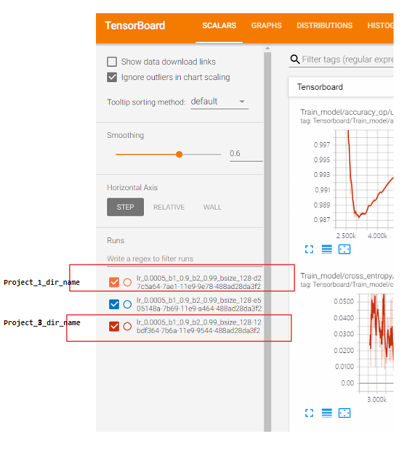
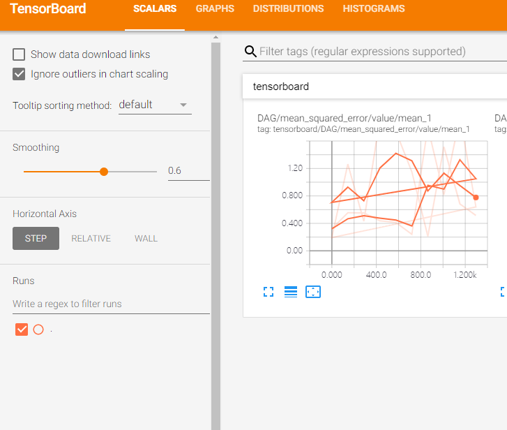

[TOC]


# 1. 基础概念

TensorBoard 是Tensorflow的可视化结构管理工具，但是 Tensorflow 2.x 中使用 TensorBoard与  Tensorflow 1.x 使用有很大不同


# Tensorflow 2.0 中使用 TensorBoard


我们知道，在TensorFlow2.0中，训练一个神经网络模型主要有两种方式：

1. 使用tf.keras模块的Model.fit()；
2. 使用tf.GradientTape()求解梯度，这样可以自定义训练过程。

## 使用Model.fit()训练

直接使用tf.keras中的callbacks就可以在训练时写入训练信息，训练结束后在命令行调用TensorBoard就可以了。

代码：
```python
import tensorflow as tf

mnist = tf.keras.datasets.mnist

(x_train, y_train),(x_test, y_test) = mnist.load_data()
x_train, x_test = x_train / 255.0, x_test / 255.0


def create_model():
    return tf.keras.models.Sequential([
        tf.keras.layers.Flatten(input_shape=(28, 28)),
        tf.keras.layers.Dense(512, activation='relu'),
        tf.keras.layers.Dropout(0.2),
        tf.keras.layers.Dense(10, activation='softmax')
    ])


model = create_model()
model.compile(optimizer='adam',
              loss='sparse_categorical_crossentropy',
              metrics=['accuracy'])

tensorboard_callback = tf.keras.callbacks.TensorBoard(log_dir="fit_logs/", histogram_freq=1)

model.fit(x=x_train,
          y=y_train,
          epochs=5,
          validation_data=(x_test, y_test),
          callbacks=[tensorboard_callback])
```


## 使用tf.GradientTape()训练

使用tf.summary在训练过程中记录所需的信息，训练结束后在命令行调用TensorBoard即可。

```python
import tensorflow as tf
import datetime

mnist = tf.keras.datasets.mnist

(x_train, y_train),(x_test, y_test) = mnist.load_data()
x_train, x_test = x_train / 255.0, x_test / 255.0


def create_model():
    return tf.keras.models.Sequential([
        tf.keras.layers.Flatten(input_shape=(28, 28)),
        tf.keras.layers.Dense(512, activation='relu'),
        tf.keras.layers.Dropout(0.2),
        tf.keras.layers.Dense(10, activation='softmax')
    ])


model = create_model()

train_dataset = tf.data.Dataset.from_tensor_slices((x_train, y_train))
test_dataset = tf.data.Dataset.from_tensor_slices((x_test, y_test))

train_dataset = train_dataset.shuffle(60000).batch(64)
test_dataset = test_dataset.batch(64)

loss_object = tf.keras.losses.SparseCategoricalCrossentropy()
optimizer = tf.keras.optimizers.Adam()


train_loss = tf.keras.metrics.Mean('train_loss', dtype=tf.float32)
train_accuracy = tf.keras.metrics.SparseCategoricalAccuracy('train_accuracy')
test_loss = tf.keras.metrics.Mean('test_loss', dtype=tf.float32)
test_accuracy = tf.keras.metrics.SparseCategoricalAccuracy('test_accuracy')


def train_step(x_train, y_train):
    with tf.GradientTape() as tape:
        predictions = model(x_train, training=True)
        loss = loss_object(y_train, predictions)
    grads = tape.gradient(loss, model.trainable_variables)
    optimizer.apply_gradients(zip(grads, model.trainable_variables))

    train_loss(loss)
    train_accuracy(y_train, predictions)


def test_step(x_test, y_test):
    predictions = model(x_test)
    loss = loss_object(y_test, predictions)

    test_loss(loss)
    test_accuracy(y_test, predictions)


current_time = datetime.datetime.now().strftime("%Y%m%d-%H%M%S")
train_log_dir = 'logs/gradient_tape/' + current_time + '/train'
test_log_dir = 'logs/gradient_tape/' + current_time + '/test'
train_summary_writer = tf.summary.create_file_writer(train_log_dir)
test_summary_writer = tf.summary.create_file_writer(test_log_dir)

EPOCHS = 5

for epoch in range(EPOCHS):
    for (x_train, y_train) in train_dataset:
        train_step(x_train, y_train)
    with train_summary_writer.as_default():
        tf.summary.scalar('loss', train_loss.result(), step=epoch)
        tf.summary.scalar('accuracy', train_accuracy.result(), step=epoch)

    for (x_test, y_test) in test_dataset:
        test_step(x_test, y_test)
    with test_summary_writer.as_default():
        tf.summary.scalar('loss', test_loss.result(), step=epoch)
        tf.summary.scalar('accuracy', test_accuracy.result(), step=epoch)

    template = 'Epoch {}, Loss: {}, Accuracy: {}, Test Loss: {}, Test Accuracy: {}'
    print(template.format(epoch + 1,
                          train_loss.result(),
                          train_accuracy.result() * 100,
                          test_loss.result(),
                          test_accuracy.result() * 100))

    # Reset metrics every epoch
    train_loss.reset_states()
    test_loss.reset_states()
    train_accuracy.reset_states()
    test_accuracy.reset_states()
```
训练结束后，在命令行输入：

tensorboard --logdir logs/gradient_tape
然后点击显示的http地址，在浏览器打开，这样就能看到训练过程中的loss、accuracy信息了。


# 2. 可视化基础（tf.summary）

### 2.1. 得到需要可视化的数据

使用tf.summary类下的子类机以实现如下功能：
1. 将输入的Tensor信息 生成Tensor.proto格式的二进制文件
2. 返回dtype=tf.string,shape=() ,内容为Tensor.proto格式的二进制文件信息（Summary protobuf）的Tensor

#### 2.1.1. 标量
```python
# 1. 记录 标量
scalar_summary=tf.summary.scalar(name, tensor, collections=None)
# tensor: 标量 /一个数 A real numeric Tensor containing a single value
type(scalar_summary)
>>> tensorflow.python.framework.ops.Tensor
scalar_summary.dtype
>>> tf.string
scalar_summary.shape
>>>()
```
#### 2.1.2. 图片
```python 
# 2. 记录 图片
image_summary=tf.summary.image(name, tensor, max_outputs=3, collections=None, family=None)
# tensor：tensor dtype=`uint8` or `float32`;shape=[batch_size, height, width, channels],其中`channels` 只能是 1, 3, or 4.
```


#### 2.1.3. 音频
```python
audio_summary=tf.summary.audio(name, tensor, collections=None) 
# tensor: A 3-D `float32` `Tensor` of shape `[batch_size, frames, channels]`or a 2-D `float32` `Tensor` of shape `[batch_size, frames]`
```

#### 2.1.4. 文本

```python
text_summary=tf.summary.text(name, tensor, collections=None)
# tensor: a string-type Tensor to summarize.
```
#### 2.1.5. 直方图数据
```python
histogram_summary=tf.summary.histogram(name, values, collections=None, family=None)
#values: 数字类型的Tensor 
# A real numeric `Tensor`. Any shape. Values to use to build the histogram.
```
#### 2.1.6. 分布图数据
(未确定)
```python
distribution_summary=tf.summary.distribution (记录 数据的分布图)
```

### 2.2. 语法糖--快捷操作所有可视化数据

上面的每一个op 都是 构建图的一部分，没有会话的执行sess.run 都不会计算

为了会话计算方便，可以把上面所有在默认图中的 summaries op 合并为一个


```python
summary_op=tf.summary.merge_all(name=None)

type(summary_op)
>>>tensorflow.python.framework.ops.Tensor
```

### 2.3. 将输出的数据都保存到本地磁盘中
这是一个命令，不是op， 不需要 sess run 

```python
filewriter=tf.summary.FileWriter(file_save_dir_path, graph=None, max_queue=10, flush_secs=120, graph_def=None, filename_suffix=None, session=None)

>>>type(filewriter)
tensorflow.python.summary.writer.writer.FileWriter
```
执行filewriter命令,会在 file_save_dir_path 目录下 下保存一个 events.out.tfevents文件，文件名称为<code> events.out.tfevents.{time}.{machine-name}</code>


# 3. 使用Tensorboard

## 3.1. 安装


## 3.2. 运行

### 3.2.1. 命令行运行
```shell

tensorboard --logdir=<dir_path> --host=<ip>

tensorboard --logdir=g:\code\Projects\AI\Competation\Kaggle\003_MNIST_3\log\train --host=127.0.0.1 
```
### 3.2.2. jupyter 运行

## 3.3. 注意事项
### 3.3.1. <dir_path> 字符串的书写

注意 <dir_path> 不要以<code>\ </code> 结尾，<dir_path>可以不用加双引号<code>" "</code> /单引号 <code>''</code> 


windows 下 磁盘名称小写 

### 3.3.2. 多项目同时在tensorboard显示

多项目同时在tensorboard显示需要合理设置文件目类结构，正确的文件目录结构`<dir_path> `如下说明：

```shell 
--<dir_path>
    |__Project_1_dir_name
    |    |___events.out.tfevents.{time1}.{machine-name}
    |__Project_2_dir_name
        |___events.out.tfevents.{time2}.{machine-name}
```


若 <dir_path> 结构不正确，则出现warning 
```shell 
--<dir_path>
    |__Project_1_dir_name
         |___events.out.tfevents.{time1}.{machine-name}
         |___events.out.tfevents.{time2}.{machine-name}
# 若 <dir_path> 结构不正确，则 出现warning 
>>>
Found more than one metagraph event per run. Overwriting the metagraph with the newest event.
```



# 4. 可视化进阶

## 4.1. 同时可视化 Val Train data 数据

```python 
summary_writer1 = tf.summary.FileWriter('./log/train', sess.graph)
summary_writer2 = tf.summary.FileWriter('./log/test')
```

