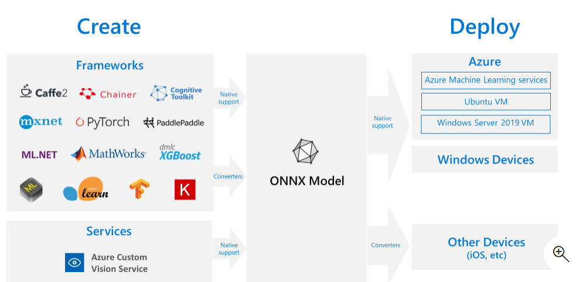
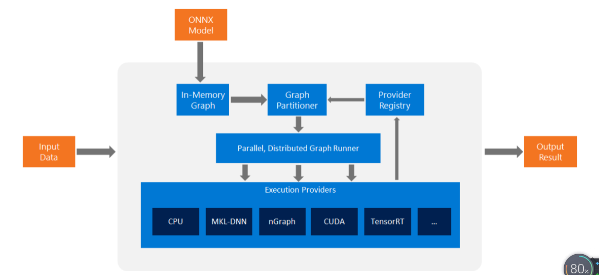

[TOC]


# 1. 什么是ONNX

ONNX（英语：Open Neural Network Exchange）是一种针对机器学习所设计的开放式的文件格式，用于存储训练好的模型。它使得不同的人工智能框架（如Pytorch、MXNet）可以采用相同格式存储模型数据并交互。 ONNX的规范及代码主要由微软，亚马逊，Facebook和IBM等公司共同开发，以开放源代码的方式托管在[Github](https://github.com/onnx/onnx)上[^1] 目前官方支持加载ONNX模型并进行推理的深度学习框架有： Caffe2, PyTorch, MXNet，ML.NET，TensorRT 和 Microsoft CNTK，并且 TensorFlow 也非官方的支持ONNX。




# 2. 获取 ONNX 模型


可通过以下几种方式获取 ONNX 模型：
1. 训练新的 ONNX 模型
2. 将现有模型从其他格式转换为 ONNX（请参阅 教程）
3. 从 ONNX 模型 Zoo 获取预先定型的 ONNX 模型


参考https://github.com/onnx/tutorials

## 2.1. 通用转换--基于winmltools

[^4]

```shell
pip install -U winmltools
```


```python
from coremltools.models.utils import load_spec
# Load model file
model_coreml = load_spec('example.mlmodel')
from winmltools import convert_coreml
# Convert it!
# The automatic code generator (mlgen) uses the name parameter to generate class names.
model_onnx = convert_coreml(model_coreml, 7, name='ExampleModel')
```

## 2.2. tf_pd->onnx

## 2.3. torch_pt->onnx


```python
# Input to the model
x = torch.randn(batch_size, 1, 224, 224, requires_grad=True)

# Export the model
torch.onnx.export(torch_model,               # model being run
                  x,                         # model input (or a tuple for multiple inputs)
                  "super_resolution.onnx",   # where to save the model (can be a file or file-like object)
                  export_params=True,        # store the trained parameter weights inside the model file
                  opset_version=10,          # the ONNX version to export the model to
                  do_constant_folding=True,  # whether to execute constant folding for optimization
                  input_names = ['input'],   # the model's input names
                  output_names = ['output'], # the model's output names
                  dynamic_axes={'input' : {0 : 'batch_size'},    # variable lenght axes
                                'output' : {0 : 'batch_size'}})
```


# 3. onnxruntime

onnxruntime 是一种用于将 ONNX 模型部署到生产环境的高性能推理引擎。 它针对云和 Edge 进行了优化，适用于 Linux、Windows 和 Mac。 它使用 C++ 编写，还包含 C、Python、C#、Java 和 Javascript (Node.js) API，可在各种环境中使用。 ONNX 运行时同时支持 DNN 和传统 ML 模型，并与不同硬件上的加速器（例如，NVidia GPU 上的 TensorRT、Intel 处理器上的 OpenVINO、Windows 上的 DirectML 等）集成。 通过使用 ONNX 运行时，可以从大量的生产级优化、测试和不断改进中受益。[^3]



## 3.1. 安装


```shell
pip install onnxruntime       # CPU build
pip install onnxruntime-gpu   # GPU build
```
## 3.2. 快速上手

```python
import onnxruntime
session = onnxruntime.InferenceSession("path to model")
results = session.run([], {"input1": indata1, "input2": indata2})
```

```python
session.get_modelmeta()
first_input_name = session.get_inputs()[0].name
first_output_name = session.get_outputs()[0].name
```

# 4. 参考资料

[^1]:项目官方仓库[https://github.com/onnx/onnx](https://github.com/onnx/onnx)

[^2]:[机器之心：开源一年多的模型交换格式ONNX，已经一统框架江湖了？](https://www.jiqizhixin.com/articles/2018-11-30-6)


[^3]:[微软Azure：ONNX 和 Azure 机器学习：创建和加速 ML 模型](https://docs.microsoft.com/zh-cn/azure/machine-learning/concept-onnx)

[^4]:[使用 WinMLTools 将 ML 模型转换为 ONNX](https://docs.microsoft.com/zh-cn/windows/ai/windows-ml/convert-model-winmltools)
