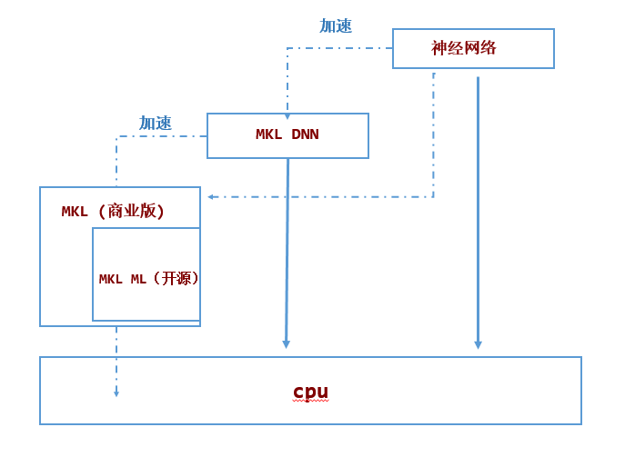

[TOC]
# 什么是DNNL

Intel® Math Kernel Library for Deep Neural Networks (Intel® DNNL) is an open-source performance library for deep-learning applications. 

The library accelerates deep-learning applications and frameworks on Intel® architecture and Intel® Processor Graphics Architecture. 

Intel DNNL contains vectorized and threaded building blocks that you can use to implement deep neural networks (DNN) with C and C++ interfaces. For more, please see the DNNL documentation on (https://intel.github.io/mkl-dnn/).

Intel and Microsoft have developed DNNL Execution Provider (EP) for ONNX Runtime to accelerate performance of ONNX Runtime using Intel® Math Kernel Library for Deep Neural Networks (Intel® DNNL) optimized primitives.

For information on how DNNL optimizes subgraphs, see Subgraph Optimization
# DNNL与 MKL、MKL-ML、MKL DNN 的关系

Yes. MKLML is a subset of MKL. As of version 1.1, DNNL is intended to be used standalone and does not require MKLML.[^1]

## MKL
MKL是基础线性代数程序集
MKL is a BLAS library, containing all the BLAS level 1, 2 and 3 functionality. It is free for use under community support licensing but it is a closed sourced software.
非开源软件

###  MKL ML
MKLML 是MKL 中开源软件的那部分，是他的子集关系。

MKLML is a open source BLAS library and is a subset of MKL and it is built by the MKL release team using standard MKL custom dynamic library builder. It contains smaller number of functions to reduce the size of the download and reduce the number of dynamic libraries user needs.

## MKL DNN
MKLDNN是MKL团队开发的用于优化深度神经网络的开源软件。它与MKL/MKL ML 独立无关。

MKLDNN is an open-source library developed to optimize operations in Deep Neural Networks. It has been developed by one of the MKL teams and that can be built completely standalone.

MKL DNN可以通过链接MKL/MKL ML获得额外的性能提升
MKL DNN uses a BLAS library internally and hence, it does support linking with MKLML or MKL for additional performance. Other BLAS libraries such as OpenBLAS can be used as well.[^2]

# 参考资料
[^1]:https://github.com/oneapi-src/oneDNN/issues/579
[^2]:[Difference between MKL, MKL ML and MKL DNN](https://iq.opengenus.org/difference-between-mkl-mkl-ml-and-mkl-dnn/)