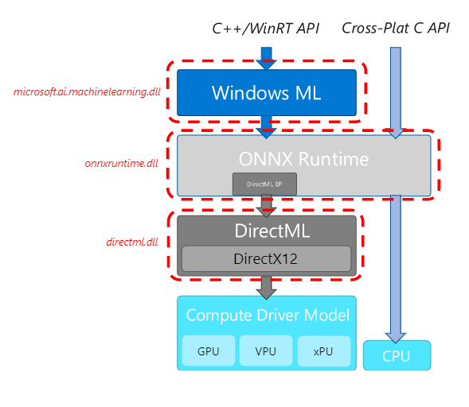

[TOC]

# 什么是DirectML
DirectML is a high-performance, hardware-accelerated DirectX 12 library for machine learning on Windows. DirectML provides GPU acceleration for common machine learning tasks across a broad range of supported hardware and drivers.

# 参考文献

1. DirectML
2. https://github.com/microsoft/onnxruntime/blob/master/docs/execution_providers/DirectML-ExecutionProvider.md