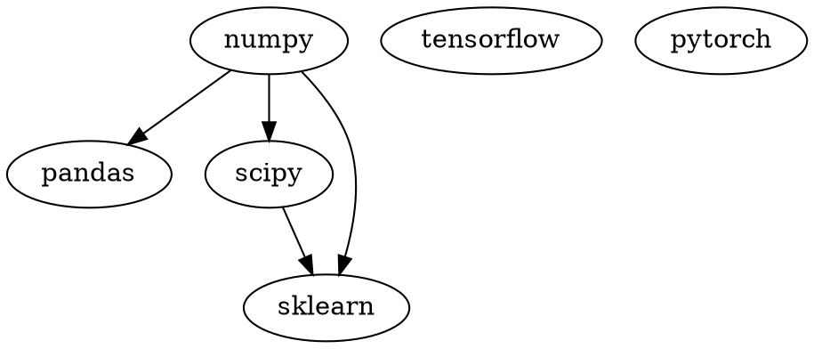

[TOC]

# 常见数据科学库的关系

许多二进制的包依赖于：
1. numpy-1.16+mkl and the `Microsoft Visual C++ Redistributable for Visual Studio 2015`, 2017 and 2019 for Python 3, 
2. numpy-1.16+mkl and  Microsoft Visual C++ 2008 Redistributable Package x64, x86, and SP1 for Python 2.7.

一个更加棒的 `numpy+mkl`包将加速其他包的计算。
