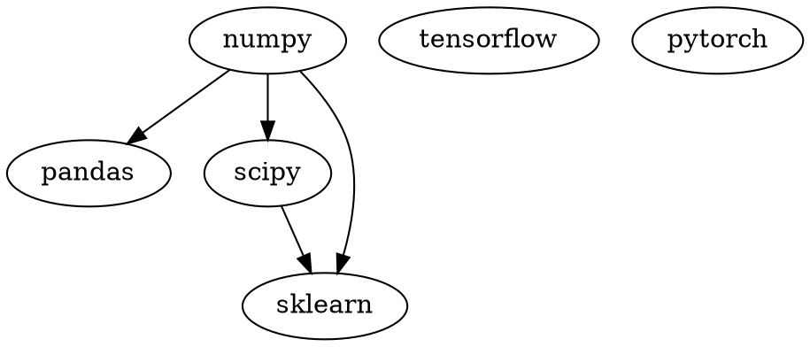

[TOC]
# 数据科学库的关系

Many binaries depend on numpy-1.16+mkl and the `Microsoft Visual C++ Redistributable for Visual Studio 2015`, 2017 and 2019 for Python 3, or the Microsoft Visual C++ 2008 Redistributable Package x64, x86, and SP1 for Python 2.7.
Install `numpy+mkl` before other packages that depend on it.
