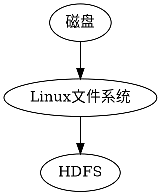
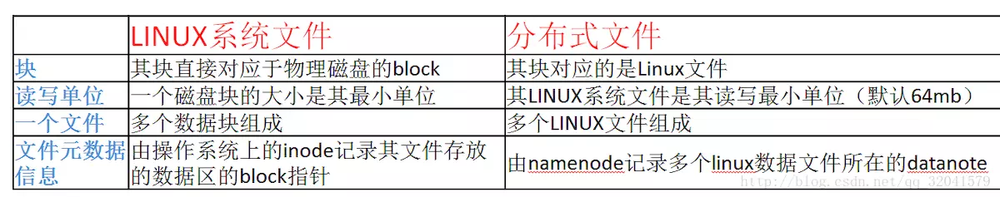
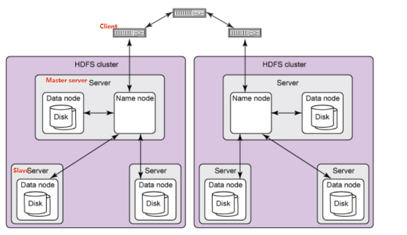
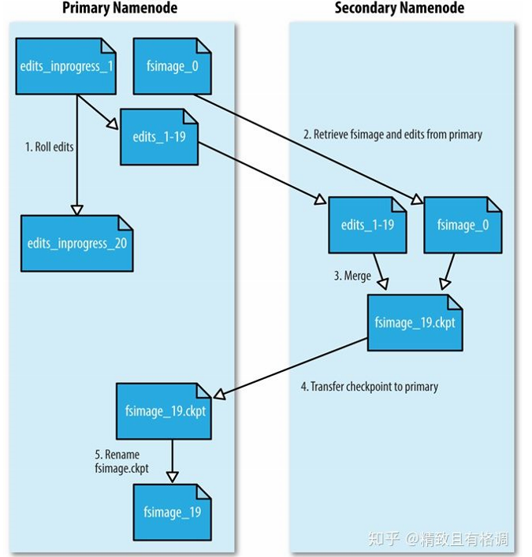
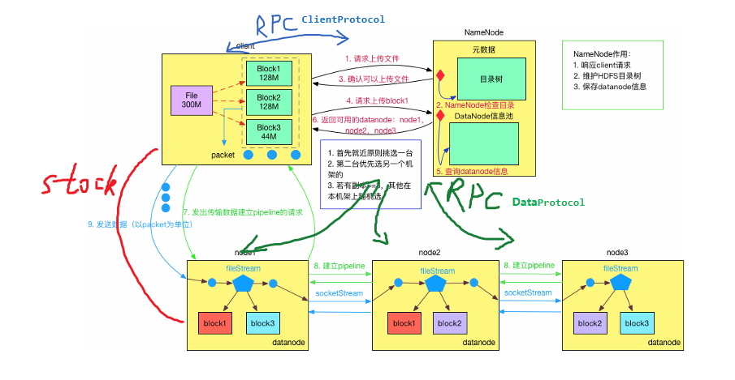
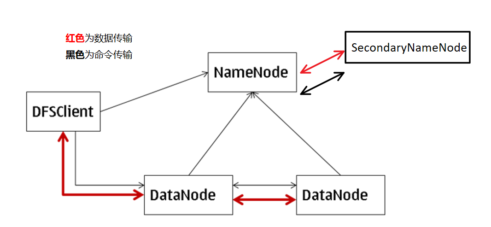
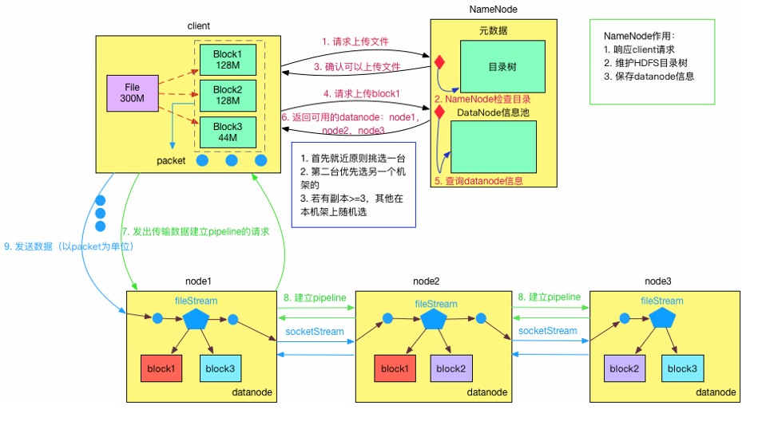
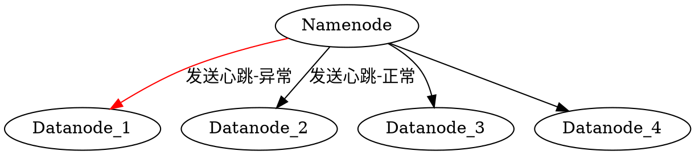
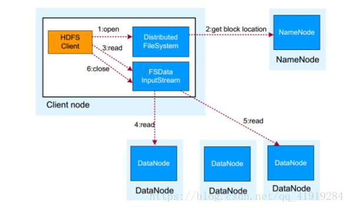

[TOC]

# 1. HDFS基础概念

HDFS，是Hadoop Distributed File System的简称。Hadoop 分布式文件系统是Hadoop抽象文件系统的一种实现。Hadoop抽象文件系统可以与本地系统、Amazon S3等集成，甚至可以通过Web协议（webhsfs）来操作。HDFS的文件分布在集群机器上，同时提供副本进行容错及可靠性保证。**例如客户端写入读取文件的直接操作都是分布在集群各个机器上的，没有单点性能压力。**

## 1.1. 块

**物理磁盘的块**，磁盘的物理Block是磁盘操作最小的单元，读写操作均以Block为最小单元，一般为512 Byte。

**文件系统的块**。文件系统在物理Block之上抽象了另一层概念，文件系统Block物理磁盘Block的整数倍。通常为几KB。Hadoop提供的df、fsck这类运维工具都是在文件系统的Block级别上进行操作。

**HDFS的Block** 块比一般单机文件系统大得多，默认为128M。

HDFS的文件被拆分成block-sized的chunk，chunk作为独立单元存储。

比Block小的文件不会占用整个Block，只会占据实际大小。例如， 如果一个文件大小为1M，则在HDFS中只会占用1M的空间，而不是128M。

### 1.1.1. 文件为什么要按照块来存储呢？

答：首先**屏蔽了文件的概念**，简化存储系统的设计，比如100T的文件大于磁盘的存储，需要把文件分成多个数据块进而存储到多个磁盘；为了保证数据的安全，需要备份的，而数据块非常适用于数据的备份，进而提升数据的容错能力和可用性。

### 1.1.2. HDFS的Block为什么这么大？
是为了最小化查找（seek）时间，控制定位文件与传输文件所用的时间比例。假设定位到Block所需的时间为10ms，磁盘传输速度为100M/s。如果要将定位到Block所用时间占传输时间的比例控制1%，则Block大小需要约100M。

$$传输时间=定位时间/0.01=1s$$

$$Block大小=100M/s *1s=100M$$

如果Block设置过大，在MapReduce任务中，Map或者Reduce任务的个数 如果小于集群机器数量，会使得作业运行效率很低。对并行的支持就不太好了，同时系统如果重启需要加载数据，数据块越大，系统恢复就会越长。

文件数据块大小如果太小，一般的文件也就会被分成多个数据块，那么在访问的时候也就要访问多个数据块地址，这样效率不高，同时也会对Namenode的内存消耗比较严重

### 1.1.3. Block抽象的好处

block的拆分使得**单个文件大小可以大于整个磁盘的容量**，构成文件的Block可以分布在整个集群， 理论上，单个文件可以占据集群中所有机器的磁盘。 
Block的抽象也简化了存储系统，对于Block，无需关注其权限，所有者等内容（这些内容都在文件级别上进行控制）。
Block作为容错和高可用机制中的副本单元，即以Block为单位进行复制。

## 1.2. 通讯

### 1.2.1. 通信的拓扑结构

通信的拓扑结构，也就是通信过程中哪些作节点之间需要进行行通信
1. DFSClient 客户端
2. Master 服务器
3. Slave 服务器

#### 1.2.1.1. Namenode
1. 是什么
    Namenode是在 **Master服务器** 上运行的守护进程。
2. 功能 
    Namenode**存储元数据**。
    注释：
    1. 元数据是"数据的数据"，如文件名，块数，副本数，块的位置，块ID等。
    2. 元数据存储在Master 服务器的内存中，以便更快地检索数据。因此，拥有Namenode名的Master服务器内存应根据要求高。
    3. 在本地磁盘中，可以使用元数据副本进行持久化。

#### 1.2.1.2. SecondaryNameNode
1. 是什么
    SecondaryNameNode 是在Hadoop集群中某一服务器（检查点服务器）上运行的守护进程。
2. 功能：
   获取**Master服务器** 上由NameNode进程持久化生成的edit logs文件，更新到检查点服务器上的fsimage文件上。一旦它有了新的fsimage文件，它将其拷贝回NameNode中。

   注释：
   1. EditLogs文件。包含最近对最新FsImage文件系统所做的所有修改。NameNodes从客户端接收创建/更新/删除请求。之后，首先记录此请求以编辑文件。
   2. FsImage文件：代表文件系统映像。它包含自NameNode创建以来的完整文件系统命名空间。文件和目录由NameInode在inode中表示。Inode记录属性，如权限，修改和访问时间，或命名空间和磁盘空间配额。

   
#### 1.2.1.3. Datanode
1. 是什么
    这是在slave服务器上运行的守护进程
2. 功能
    这些是存储数据的实际工作节点。

#### 1.2.1.3.1. 物理拓扑结构
通常，大型 HDFS 集群跨多个安装点（机柜）排列。一个安装点（机柜）中的不同节点之间的网络流量通常比跨安装点（机柜）的网络流量更高效。一个 Name node 尽量将一个块的多个副本放置到多个安装点（机柜）上以提高容错能力。但是，HDFS 允许管理员决定一个节点属于哪个安装点。因此，每个节点都知道它的机柜 ID，也就是说，它具有机柜意识。

来自 <https://www.ibm.com/developerworks/cn/web/wa-introhdfs/> 
### 1.2.2. 通讯协议

所有的HDFS通讯协议都是建立在**TCP/IP协议**之上。

#### 1.2.2.1. 控制命令的通讯传输
1. client和Namenode之间是通过rpc通信，配置配置的TCP端口
rpc分装ClientProtocol协议
2. datanode和Namenode之间是通过rpc通信
rpc封装DatanodeProtocol协议

在设计上，Namenode不会主动发起RPC，而是被动响应来自客户端或 Datanode的RPC请求。

#### 1.2.2.2. 数据的通讯传输
1. client和datanode之间是通过简单的socket通信
2. Namenode与SecondaryNameNode 的通讯协议为http

### 1.2.3. 通讯内容

1. 命令
2. 数据
3. 心跳机制的空包
   

### 1.2.4. 通讯频率

### 1.2.5. 异常处理
节点间通信异常--HDFS 心跳机制

每个 Data node 定期通过TCP协议向它的 Name node 发送心跳消息，以判定连通性。 Namenode 将不能响应心跳消息的 Datanode 标记为 “dead Data node ”，并不再向它们发送请求。存储在一个死节点上的数据不再对那个节点的 HDFS 客户端可用，该节点将被从系统有效地移除。如果一个节点的死亡导致数据块的复制因子降至最小值之下， Name node 将启动附加复制，将复制因子带回正常状态。

1. 心跳内容

有什么特别规定的，不过一般都是很小的包，或者只包含包头的一个空包。

2. 心跳频率
心跳包主要也就是用于长连接的保活和断线处理。一般的应用下，判定时间在30-40秒比较不错。如果实在要求高，那就在6-9秒。

两个守护进程运行HDFS进行数据存储：

从NFS的协议栈可以看到，它事实上是一种VFS（操作系统对文件的一种抽象）实现。

## 1.3. Rebalancer
HDFS的数据也许并不是非常均匀的分布在各个DataNode中。一个常见的原因是在现有的集群上经常会增添新的DataNode节点。当新增一个数据块（一个文件的数据被保存在一系列的块中）时，NameNode在选择DataNode接收这个数据块之前，会考虑到很多因素。其中的一些考虑的是：

将数据块的一个副本放在正在写这个数据块的节点上。
尽量将数据块的不同副本分布在不同的机架上，这样集群可在完全失去某一机架的情况下还能存活。
一个副本通常被放置在和写文件的节点同一机架的某个节点上，这样可以减少跨越机架的网络I/O。
尽量均匀地将HDFS数据分布在集群的DataNode中。
由于上述多种考虑需要取舍，数据可能并不会均匀分布在DataNode中。HDFS为管理员提供了一个工具，用于分析数据块分布和重新平衡DataNode上的数据分布。HADOOP-1652的附件中的一个PDF是一个简要的rebalancer管理员指南。

使用方法请参考balancer 命令.

机架感知（Rack awareness）
通常，大型Hadoop集群是以机架的形式来组织的，同一个机架上不同节点间的网络状况比不同机架之间的更为理想。另外，NameNode设法将数据块副本保存在不同的机架上以提高容错性。Hadoop允许集群的管理员通过配置dfs.network.script参数来确定节点所处的机架。当这个脚本配置完毕，每个节点都会运行这个脚本来获取它的机架ID。默认的安装假定所有的节点属于同一个机架。这个特性及其配置参数在HADOOP-692所附的PDF上有更详细的描述。

Secondary NameNode的检查点进程启动，是由两个配置参数控制的：

fs.checkpoint.period，指定连续两次检查点的最大时间间隔， 默认值是1小时。
fs.checkpoint.size定义了edits日志文件的最大值，一旦超过这个值会导致强制执行检查点（即使没到检查点的最大时间间隔）。默认值是64MB。
Secondary NameNode保存最新检查点的目录与NameNode的目录结构相同。 所以NameNode可以在需要的时候读取Secondary NameNode上的检查点镜像

## 1.4. 文件权限和安全性
这里的文件权限和其他常见平台如Linux的文件权限类似。目前，安全性仅限于简单的文件权限。启动NameNode的用户被视为HDFS的超级用户。HDFS以后的版本将会支持网络验证协议（比如Kerberos）来对用户身份进行验证和对数据进行加密传输。具体的细节请参考权限使用管理指南。

## 1.5. 可扩展性
现在，Hadoop已经运行在上千个节点的集群上。Powered By Hadoop页面列出了一些已将Hadoop部署在他们的大型集群上的组织。HDFS集群只有一个NameNode节点。目前，NameNode上可用内存大小是一个主要的扩展限制。在超大型的集群中，增大HDFS存储文件的平均大小能够增大集群的规模，而不需要增加NameNode的内存。默认配置也许并不适合超大规模的集群。Hadoop FAQ页面列举了针对大型Hadoop集群的配置改进。

# 2. Hadoop的HA方案

采用HA的HDFS集群配置两个Namenode，分别处于Active和Standby状态。当Active Namenode故障之后，Standby接过责任继续提供服务，用户没有明显的中断感觉。一般耗时在几十秒到数分钟。 

HA涉及到的主要实现逻辑有

1. 主备需共享edit log存储。 
主Namenode和待命的Namenode共享一份edit log，当主备切换时，Standby通过回放edit log同步数据。

共享存储通常有2种选择

NFS：传统的网络文件系统
QJM：quorum journal manager

QJM是专门为HDFS的HA实现而设计的，用来提供高可用的edit log。QJM运行一组journal node，edit log必须写到大部分的journal nodes。通常使用3个节点，因此允许一个节点失败，类似ZooKeeper。注意QJM没有使用ZK，虽然HDFS HA的确使用了ZK来选举主Namenode。一般推荐使用QJM。

2. DataNode需要同时往主备发送Block Report 
因为Block映射数据存储在内存中（不是在磁盘上），为了在Active Namenode挂掉之后，新的Namenode能够快速启动，不需要等待来自Datanode的Block Report，DataNode需要同时向主备两个Namenode发送Block Report。

## 2.1. HDFS设计原则
HDFS设计之初就非常明确其应用场景，适用与什么类型的应用，不适用什么应用，有一个相对明确的指导原则。

### 2.1.1. 1 设计目标
存储非常大的文件：这里非常大指的是几百M、G、或者TB级别。实际应用中已有很多集群存储的数据达到PB级别。根据Hadoop官网，Yahoo！的Hadoop集群约有10万颗CPU，运行在4万个机器节点上。更多世界上的Hadoop集群使用情况，参考Hadoop官网.

采用流式的数据访问方式: HDFS基于这样的一个假设：最有效的数据处理模式是一次写入、多次读取数据集经常从数据源生成或者拷贝一次，然后在其上做很多分析工作 
分析工作经常读取其中的大部分数据，即使不是全部。 因此读取整个数据集所需时间比读取第一条记录的延时更重要。

运行于商业硬件上: Hadoop不需要特别贵的、reliable的（可靠的）机器，可运行于普通商用机器（可以从多家供应商采购） ，商用机器不代表低端机器。在集群中（尤其是大的集群），节点失败率是比较高的HDFS的目标是确保集群在节点失败的时候不会让用户感觉到明显的中断。
### 2.1.2. 2 HDFS不适合的应用类型
有些场景不适合使用HDFS来存储数据。下面列举几个：

1） 低延时的数据访问

对延时要求在毫秒级别的应用，不适合采用HDFS。HDFS是为高吞吐数据传输设计的,因此可能牺牲延时HBase更适合低延时的数据访问。

2）大量小文件

文件的元数据（如目录结构，文件block的节点列表，block-node mapping）保存在Namenode的内存中， 整个文件系统的文件数量会受限于Namenode的内存大小。 
经验而言，一个文件/目录/文件块一般占有150字节的元数据内存空间。如果有100万个文件，每个文件占用1个文件块，则需要大约300M的内存。因此十亿级别的文件数量在现有商用机器上难以支持。

3）多方读写，需要任意的文件修改 
HDFS采用追加（append-only）的方式写入数据。不支持文件任意offset的修改。不支持多个写入器（writer）。

# 3. 参考资料

[^1]：https://data-flair.training/blogs/data-block/