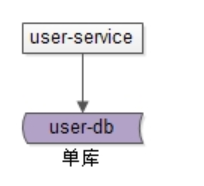
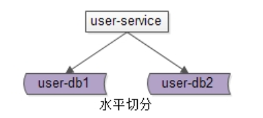
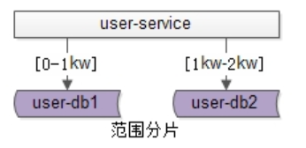
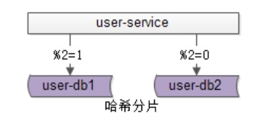
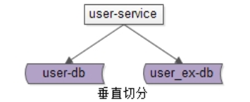
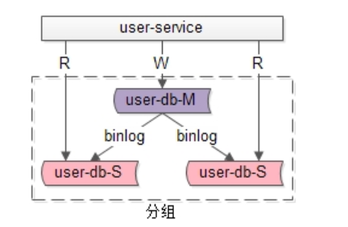
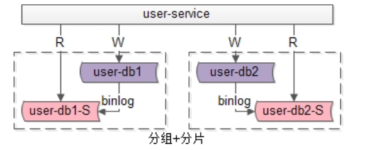

[TOC]

# 分布式存储系统--从数据库扩容开始

场景再现
问题一、当mysql单表数据量爆炸时，你怎么办？ 
问题二、当你的数据库无法承受高强度io时你怎么办？
## 概念 

### 单库
单库就是一个库。最常见的架构设计如上：

· user-service：用户中心服务，对调用者提供友好的RPC接口
· user-db：一个库进行数据存储

### 分片
#### 水平切
sharding

答：分片架构是大伙常说的水平切分(sharding)数据库架构：
•user-service：依旧是用户中心服务
•user-db1：水平切分成2份中的第一份
•user-db2：水平切分成2份中的第二份
分片后，多个数据库实例也会构成一个数据库集群。

常见的水平切分算法有“范围法”和“哈希法”：
范围分片

范围法如上图：以用户中心的业务主键uid为划分依据，将数据水平切分到两个数据库实例上去：
•user-db1：存储0到1千万的uid数据
•user-db2：存储0到2千万的uid数据

哈希分片

哈希法如上图：也是以用户中心的业务主键uid为划分依据，将数据水平切分到两个数据库实例上去：
•user-db1：存储uid取模得1的uid数据
•user-db2：存储uid取模得0的uid数据
这两种方法在互联网都有使用，其中哈希法使用较为广泛。

**分片有什么特点？**
答：同一个分片里的数据库集群：
•多个实例之间本身不直接产生联系，不像主从间有binlog同步
•多个实例数据库结构，也完全相同
•多个实例存储的数据之间没有交集，所有实例间数据并集构成全局数据

**分片架构究竟解决什么问题？**
答：大部分互联网业务数据量很大，单库容量容易成为瓶颈，此时通过分片可以：
•线性提升数据库写性能，需要注意的是，分组架构是不能线性提升数据库写性能的
•降低单库数据容量

#### 垂直切 

除了水平切分，垂直切分也是一类常见的数据库架构设计，垂直切分一般和业务结合比较紧密。
垂直切分

还是以用户中心为例，可以这么进行垂直切分：
User(uid, uname, passwd, sex, age, …)
User_EX(uid, intro, sign, …)
•垂直切分开的表，主键都是uid
•登录名，密码，性别，年龄等属性放在一个垂直表（库）里
•自我介绍，个人签名等属性放在另一个垂直表（库）里

如何进行垂直切分？
答：根据业务对数据进行垂直切分时，一般要考虑属性的“长度”和“访问频度”两个因素：
•长度较短，访问频率较高的放在一起
•长度较长，访问频度较低的放在一起
这是因为，数据库会以行(row)为单位，将数load到内存(buffer)里，在内存容量有限的情况下，长度短且访问频度高的属性，内存能够load更多的数据，命中率会更高，磁盘IO会减少，数据库的性能会提升。

垂直切分有什么特点？
答：垂直切分和水平切有相似的地方，又不太相同：
•多个实例之间也不直接产生联系，即没有binlog同步
•多个实例数据库结构，都不一样
•多个实例存储的数据之间至少有一列交集，一般来说是业务主键，所有实例间数据并集构成全局数据

垂直切分解决什么问题？
答：垂直切分即可以降低单库的数据量，还可以降低磁盘IO从而提升吞吐量，但它与业务结合比较紧密，并不是所有业务都能够进行垂直切分的。

### 分组

​

分组架构是最常见的一主多从，主从同步（replication），读写分离数据库架构：
•user-service：依旧是用户中心服务
•user-db-M(master)：主库，提供数据库写服务
•user-db-S(slave)：从库，提供数据库读服务
主和从构成的数据库集群称为“组”。

1. **分组有什么特点？**
答：同一个组里的数据库集群：
•主从之间通过binlog进行数据同步
•多个实例数据库结构完全相同
•多个实例存储的数据也完全相同，本质上是将数据进行复制

2. **分组架构究竟解决什么问题？**
答：大部分互联网业务**读多写少**，数据库的读往往最先成为性能瓶颈，如果希望：
•线性提升数据库读性能
•通过消除读写锁冲突提升数据库写性能
•通过冗余从库实现数据的“读高可用”
此时可以使用分组架构，需要注意的是，分组架构中，**数据库的主库依然是写单点**。

一句话总结，分组解决的是“数据库读写高并发量高”问题，所实施的架构设计。

### 分组+分片

如果业务读写并发量很高，数据量也很大，通常需要实施分组+分片的数据库架构：
•通过分片来降低单库的数据量，线性提升数据库的写性能
•通过分组来线性提升数据库的读性能，保证读库的高可用

# 扩容实践

案例

小明现在负责一个站点，用户数据库有2个，网站用户数据通过ID取模，分别存在两台用户数据库中，现在数据增大，两台数据库已经不够用了，现在需要增加数据库进行扩容，小明应该如何进行扩容？

 
方案

    停机扩容
    平滑扩容

 
## 停机扩容

我们先来了解下停机扩容方案，这是一种很多人初期都会使用的方案（几台数据库的时候），具体步骤：

    小明先挂公告，告诉大家明天的凌晨02：00 - 06：00，站点将停机升级；
    时间到了，小明停止了所有对外服务；
    小明新增了2个数据库，然后写了一个程序，将原先的2个库的数据迁移到现有的4个库（2+2）上；
    数据迁移完成，修改数据库服务配置；
    重启服务，并重新开启对外服务。

 
回滚方案：

数据迁移失败，或者迁移后测试失败，则将服务配置修改回原先的两个库，改天再升级。

 
优点：

    简单

 
缺点：

    不高可用
    开启升级到升级完成，时间短，项目组压力大，易出错
    升级时间基本是半夜人流量最少的时候，项目组疲累，容易出错
    运行一段时间后，发现问题，难以回滚，只能回到扩容前，会丢失部分数据

 
适用：

    小型网站；
    大部分游戏；
    对高可用要求不高的服务。

 
## 平滑扩容

现在我们来聊一下本文的重点：平滑扩容中最好的方案就是扩容的数据库是原先数据库的倍数，如：2个数据库扩容到4个数据库，是原先的2倍。步骤：

（1）新增2个数据库

（2）配置双主进行数据同步（先测试，后线上，重启服务时间是秒级）

 

（3）数据同步完成之后，配置主主双写（因为同步有延迟，如果每时每刻都有数据写入/更新的话，就不能准确的保证数据已经同步完成）

 

（4）数据同步完成后（时间比较长），删除双主同步，修改数据库配置，并重启（秒级）；

 

（5）此时已经扩容完成，但此时的数据并没有减少，新增的数据库跟旧的数据库一样多的数据，此时还需要写一个程序，清空数据库中多余的数据，如：

    User1去除 uid % 4 = 2的数据；
    User3去除 uid % 4 = 0的数据；
    User2去除 uid % 4 = 3的数据；
    User4去除 uid % 4 = 1的数据。

现在，我们就已经完成了数据库的平滑扩容了。

 
优点

    扩容期间，服务照常进行，保证高可用；
    时间长，项目组压力没有这么大，出错率低；
    扩容期间，遇到什么问题，都可以随时调试，不怕影响线上服务；
    每个数据库少了一半的数据量。

 
缺点

    程序复杂，需要配置双主、主主双写、检测数据同步等额外技术；
    但后期数据库成千上万台的时候，扩容复杂（情况非常少，除非将很多业务数据放在同一个数据库）。

 
适用：

    大型网站；
    对高可用要求高的服务。

 
总结

本文主要简单讲解了数据库扩容的两种方案，并对这两种方案的优缺点、适用场景进行了说明：

    停机扩容：简单，不高可用，易出错，扩容后不能回滚，只能回档，会丢失一部分数据。
    平滑扩容：复杂，高可用，出错调试容易，易回滚，不会造成数据丢失，

 
结语

    每一种方案都有适合它的场景，适合自己的，才是最好的；
    小编经验有限，希望此文章对大家有帮助；
    每天进步一点点。

[^1]
#参考资料
[^1]:典型数据库架构设计与实践https://www.w3cschool.cn/architectroad/architectroad-typical-database-architecture.html

