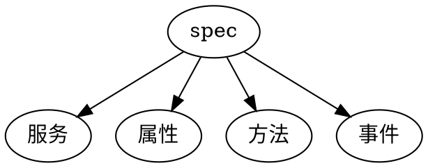

[TOC]

# 1. 什么是物模型
物模型（Thing Specification Language,TSL）是产品数字化的**描述**。

物模型由若干条`参数`组成，参数按描述的功能类型不同，又分为属性、方法和事件。

##  1.1. 物模型的别名
不同的公司对物模型由不同的名字说法，其本质是一样的，依然是对物体的数字化描述。其中常见的包括：`信息模型`、`物联模型`、`数据profile`、`数据 schema`、`设备模板`

梯队|厂商|名称
--|--|--
1|微软Azure|Device Twin 设备孪生|
1|Google cloud Iot Core| Device Data（Device metadata）|
1|亚马逊 AWS IoT Core|Thing types 物体类型+ Device Shadow 设备影子|
1|小米IoT |spec定义|
1|阿里云|Thing Specification Language 物模型+设备影子|
2|腾讯云|设备影子|
2|中国移动OneNet|物模型|
2|华为云|产品模型|
2|IBM Waston|deviceInfo|
3|百度云|物模型（未上线）|
3|京东|物模型（简单）|


##  1.2. 物模型的技术实现

物模型语法层定义了IoT物模型描述语言的种类，如XML、JSON等。

目前JSON较为通用的 

##  1.3. 定义范围


物模型定义了物，物模型将不同品牌不同品类的产品功能抽象归纳，形成“标准物模型”，便于各方用统一的语言描述、控制、理解产品功能。

为了实现设备功能的统一理解，对于每个品类会定义一套“标准参数”，标准参数包含了某个品类可能用到的所有参数，开发者在定义产品物模型时优先从标准参数中选择，如果标准参数未包含的功能，可以定义“自定义参数”。


# 2. 物模型的行业标准发展现状


没有统一标准，各自为战。ICA物模型和OneDataModel物模型最为先进[^1]

## 2.1. ICA物模型

工业互联网产业联盟（Alliance of Industrial Internet, AII）是由**阿里巴巴**发起，是一个研究物联网接入协议、设备管理等业务标准的行业联盟，是国内物模型研发的领军者。

目前ICA已发布了自定义的物模型标准，包括设备抽象模型及TSL（Things Specification Language）描述语言


### 2.1.1. 阿里云 

[阿里云](https://help.aliyun.com/document_detail/73727.html)产品功能类型分为三类：属性、服务和事件。
功能类型|说明
--|--
属性（Property）|一般用于描述设备运行时的状态，如环境监测设备所读取的当前环境温度等。属性支持GET和SET请求方式。应用系统可发起对属性的读取和设置请求。
服务（Service）|设备可被外部调用的能力或方法，可设置输入参数和输出参数。相比于属性，服务可通过一条指令实现更复杂的业务逻辑，如执行某项特定的任务。
事件（Event）|设备运行时的事件。事件一般包含需要被外部感知和处理的通知信息，可包含多个输出参数。如，某项任务完成的信息，或者设备发生故障或告警时的温度等，事件可以被订阅和推送。


```json
///阿里云的物模型案例
{
    "schema": "物模型结构定义的访问URL",
    "profile": {
        "productKey": "产品ProductKey"
    },
    "properties": [
        {
            "identifier": "属性唯一标识符（产品下唯一）",
            "name": "属性名称",
            "accessMode": "属性读写类型：只读（r）或读写（rw）。",
            "required": "是否是标准功能的必选属性",
            "dataType": {
                "type": "属性类型: int（原生）、float（原生）、double（原生）、text（原生）、date（String类型UTC毫秒）、bool（0或1的int类型）、enum（int类型，枚举项定义方法与bool类型定义0和1的值方法相同）、struct（结构体类型，可包含前面7种类型，下面使用"specs":[{}]描述包含的对象）、array（数组类型，支持int、double、float、text、struct）",
                "specs": {
                    "min": "参数最小值（int、float、double类型特有）",
                    "max": "参数最大值（int、float、double类型特有）",
                    "unit": "属性单位（int、float、double类型特有，非必填）",
                    "unitName": "单位名称（int、float、double类型特有，非必填）",
                    "size": "数组元素的个数，最大512（array类型特有）。",
                    "step": "步长（text、enum类型无此参数）",
                    "length": "数据长度，最大10240（text类型特有）。",
                    "0": "0的值（bool类型特有）",
                    "1": "1的值（bool类型特有）",
                    "item": {
                        "type": "数组元素的类型（array类型特有）"
                    }
                }
            }
        }
    ],
    "events": [
        {
            "identifier": "事件唯一标识符（产品下唯一，其中post是默认生成的属性上报事件。）",
            "name": "事件名称",
            "desc": "事件描述",
            "type": "事件类型（info、alert、error）",
            "required": "是否是标准功能的必选事件",
            "outputData": [
                {
                    "identifier": "参数唯一标识符",
                    "name": "参数名称",
                    "dataType": {
                        "type": "属性类型: int（原生）、float（原生）、double（原生）、text（原生）、date（String类型UTC毫秒）、bool（0或1的int类型）、enum（int类型，枚举项定义方法与bool类型定义0和1的值方法相同）、struct（结构体类型，可包含前面7种类型，下面使用"specs":[{}]描述包含的对象）、array（数组类型，支持int、double、float、text、struct）",
                        "specs": {
                            "min": "参数最小值（int、float、double类型特有）",
                            "max": "参数最大值（int、float、double类型特有）",
                            "unit": "属性单位（int、float、double类型特有，非必填）",
                            "unitName": "单位名称（int、float、double类型特有，非必填）",
                            "size": "数组元素的个数，最大512（array类型特有）。",
                            "step": "步长（text、enum类型无此参数）",
                            "length": "数据长度，最大10240（text类型特有）。",
                            "0": "0的值（bool类型特有）",
                            "1": "1的值（bool类型特有）",
                            "item": {
                                "type": "数组元素的类型（array类型特有）"
                            }
                        }
                    }
                }
            ],
            "method": "事件对应的方法名称（根据identifier生成）"
        }
    ],
    "services": [
        {
            "identifier": "服务唯一标识符（产品下唯一，其中set/get是根据属性的accessMode默认生成的服务。）",
            "name": "服务名称",
            "desc": "服务描述",
            "required": "是否是标准功能的必选服务",
            "callType": "async（异步调用）或sync（同步调用）",
            "inputData": [
                {
                    "identifier": "入参唯一标识符",
                    "name": "入参名称",
                    "dataType": {
                        "type": "属性类型: int（原生）、float（原生）、double（原生）、text（原生）、date（String类型UTC毫秒）、bool（0或1的int类型）、enum（int类型，枚举项定义方法与bool类型定义0和1的值方法相同）、struct（结构体类型，可包含前面7种类型，下面使用"specs":[{}]描述包含的对象）、array（数组类型，支持int、double、float、text、struct）",
                        "specs": {
                            "min": "参数最小值（int、float、double类型特有）",
                            "max": "参数最大值（int、float、double类型特有）",
                            "unit": "属性单位（int、float、double类型特有，非必填）",
                            "unitName": "单位名称（int、float、double类型特有，非必填）",
                            "size": "数组元素的个数，最大512（array类型特有）。",
                            "step": "步长（text、enum类型无此参数）",
                            "length": "数据长度，最大10240（text类型特有）。",
                            "0": "0的值（bool类型特有）",
                            "1": "1的值（bool类型特有）",
                            "item": {
                                "type": "数组元素的类型（array类型特有）"
                                }
                            }
                        }
                    }
                }
            ],
            "outputData": [
                {
                    "identifier": "出参唯一标识符",
                    "name": "出参名称",
                    "dataType": {
                        "type": "属性类型: int（原生）、float（原生）、double（原生）、text（原生）、date（String类型UTC毫秒）、bool（0或1的int类型）、enum（int类型，枚举项定义方法与bool类型定义0和1的方法相同）、struct（结构体类型，可包含前面7种类型，下面使用"specs":[{}]描述包含的对象）、array（数组类型，支持int、double、float、text、struct）",
                        "specs": {
                            "min": "参数最小值（int、float、double类型特有）",
                            "max": "参数最大值（int、float、double类型特有）",
                            "unit": "属性单位（int、float、double类型特有，非必填）",
                            "unitName": "单位名称（int、float、double类型特有，非必填）",
                            "size": "数组元素的个数，最大512（array类型特有）。",
                            "step": "步长（text、enum类型无此参数）",
                            "length": "数据长度，最大10240（text类型特有）。",
                            "0": "0的值（bool类型特有）",
                            "1": "1的值（bool类型特有）",
                            "item": {
                                "type": "数组元素的类型（array类型特有）"
                            }
                        }
                    }
                }
            ],
            "method": "服务对应的方法名称（根据identifier生成）"
        }
    ],
    //仅自定义模块的TSL中有以下参数。
    "functionBlockId": "自定义模块的唯一标识符，模块ID",
    "functionBlockName": "自定义模块名称"

    //当产品下添加了自定义模块，默认模块TSL中才有functionBlocks，表示自定义模块列表。
    "functionBlocks": [
    {
      "functionBlockId": "自定义模块的唯一标识符，模块ID",
      "functionBlockName": "自定义模块名称",
      "productKey": "产品ProductKey"
    }
  ]
}
```

## 2.2. OneDataModel物模型

OneDataModel：该组织是由多个标准化组织、设备商、平台运营商、IoT专家等参与组成的联络工作组（Liaison Group），专注于物模型标准的研究。目前该组织已发布了第一版物模型标准，包含ODM（Object Definition Model）抽象模型和SDF（Simple Definition Format）描述语言。


Github:[https://github.com/one-data-model](https://github.com/one-data-model)


OneDataModel的主要参与者包括Zigbee 联盟、OCF、 OMA (LWM2M)、BLE Mesh、OneM2M、Google (Weave)、Comcast、Intel、
Silicon Labs等，其中**Google、Intel**等厂家推动积极。OneDataModel的愿景是将目前的物模型通用化并扩展到所有的物联网设备，在智能
家居领域进行实践，助力行业应用开发，降低制造商成本，增加客户易用性。ODM抽象模型的特点是发展迅速，有成为物模型主流标准的趋势。

```json
{
  "title": "SDF Schema",
  "description": "old, pre-1.0 JSON-schema.org definitions for validating SDF instances against the SDF model.",
  "$schema": "http://json-schema.org/draft-07/schema#",
  "type": "object",
  "properties": {
    "info": {
      "type": "object",
      "properties": {
        "title": {
          "type": "string"
        },
        "version": {
          "type": "string"
        },
        "copyright": {
          "type": "string"
        },
        "license": {
          "type": "string"
        }
      },
      "required": ["title", "version", "copyright", "license"],
      "additionalProperties": false
    },
    "namespace": {
      "type": "object",
      "additionalProperties": {
        "type": "string"
      }
    },
    "defaultnamespace": {
      "type": "string"
    },
    
    "odmThing": {
      "description": "Thing is a composition of objects that work together in some way",
      "type": "object",
      "additionalProperties": {
        "$ref": "#/definitions/thingqualities"
      }
    },
    "odmProduct": {
      "description": "Product is a composition of things and objects that can model a SKU-level instance of a product",
      "type": "object",
      "additionalProperties": {
        "$ref": "#/definitions/productqualities"
      }
    },
    "odmObject": {
      "description": "Object is a set of Properties, Actions, and Events that together perform a particular function",
      "type": "object",
      "additionalProperties": {
        "$ref": "#/definitions/objectqualities"
      }
    },
    "odmProperty": {
      "description": "Property represents the state of an instance of an object",
      "type": "object",
      "additionalProperties": {
        "$ref": "#/definitions/propertyqualities"
      }
    },
    "odmAction": {
      "description": "Action is a directive to invoke an application layer verb associated with an object",
      "type": "object",
      "additionalProperties": {
        "$ref": "#/definitions/actionqualities"
      }
    },
    "odmEvent": {
      "description": "Event represents an occurence of something associated with an object",
      "type": "object",
      "additionalProperties": {
        "$ref": "#/definitions/eventqualities"
      }
    },
    "odmData": {
      "description": "Data represents a piece of information that can be the state of a property or a parameter to an action or a signal in an event",
      "type": "object",
      "additionalProperties": {
        "$ref": "#/definitions/dataqualities"
      }
    }
  },

  "definitions": {
    "sdf-pointer": {
          "type": "string",
          "format": "uri-reference"
    },
    "pointer-list": {
      "type": "array",
      "items": {
        "$ref": "#/definitions/sdf-pointer"
      }
    },
    "commonqualities": {
      "type": "object",
      "properties": {
        "description": {
          "type": "string"
        },
        "$comment": {
          "type": "string"
        },
        "title": {
          "type": "string"
        },
        "name": {
          "type": "string"
        },
        "odmRef": {
          "$ref": "#/definitions/sdf-pointer"
        },
        "odmType": {
          "type": "object",
          "properties": {
            "$ref": {
              "type": "string"
            },
          "additionalProperties": false        
          }
        },
        "odmRequired": {
          "$ref": "#/definitions/pointer-list"
        }
      },
      "required": []
    },

    "thingqualities": {
      "allOf": [
        {
          "$ref": "#/definitions/commonqualities"
        },
        {
          "type": "object",
          "properties": {
            "odmObject": {"$ref": "#/properties/odmObject"},
            "odmThing": {"$ref": "#/properties/odmThing"}
          }
        }
      ]
    },

    "productqualities": {
      "allOf": [
        {
          "$ref": "#/definitions/commonqualities"
        },
        {
          "type": "object",
          "properties": {
            "odmObject": {"$ref": "#/properties/odmObject"},
            "odmThing": {"$ref": "#/properties/odmThing"}
          }
        }
      ]
    },

    "objectqualities": {
      "allOf": [
        {
          "$ref": "#/definitions/commonqualities"
        },
        {
          "type": "object",
          "properties": {
            "odmObject": {"$ref": "#/properties/odmObject"},
            "odmProperty": {"$ref": "#/properties/odmProperty"},
            "odmAction": {"$ref": "#/properties/odmAction"},
            "odmEvent": {"$ref": "#/properties/odmEvent"},
            "odmData": {"$ref": "#/properties/odmData"}
          }
        }
      ]
    },

    "propertyqualities": {
      "allOf": [
        {
          "$ref": "#/definitions/dataqualities"
        }
      ]
    },

    "actionqualities": {
      "allOf":[
        {
          "$ref": "#/definitions/commonqualities"
        },
        {
          "type": "object",
          "properties": {
            "odmInputData": {
              "$ref": "#/definitions/pointer-list"
            },
            "odmRequiredInputData": {
              "$ref": "#/definitions/pointer-list"
            },
            "odmOutputData": {
              "$ref": "#/definitions/pointer-list"
            }          
          }
        }
      ]   
    },

    "eventqualities": {
      "allOf":[
        {
          "$ref": "#/definitions/commonqualities"
        },
        {
          "type": "object",
          "properties": {
            "odmOutputData": {
              "$ref": "#/definitions/pointer-list"
            }          
          }
        }
      ]    
    },

    "dataqualities": {
      "allOf": [
        {
          "$ref":"#/definitions/commonqualities"
        },
        {
          "$ref":"#/definitions/jsonschema"
        },
        {
          "type": "object",
          "properties": {
            "units": {
              "type": "string"
            },
            "scaleMinimum": {
              "type": "number"
            },
            "scaleMaximum": {
              "type": "number"
            },
            "observable": {
              "type": "boolean"
            },
            "readable": {
              "type": "boolean"
            },
            "writable": {
              "type": "boolean"
            },
            "nullable": {
              "type": "boolean"
            },
            "widthInBits": {
              "type": "number"
            },
            "subtype":{
              "type": "string",
              "enum": ["bytestring", "unixtime"]
            },
            "contentFormat": {
              "type": "string"
            }
          }
        }
      ]
    },

    "jsonschema": {
      "type": "object",
      "properties": {
        "$comment": {
          "type": "string"
        },
        "$ref": {
          "$ref": "#/definitions/sdf-pointer"
        },
        "type": {
          "type": "string",
          "enum": [
            "number",
            "string",
            "boolean",
            "integer",
            "array",
            "object"
          ]
        },
        "enum": {
          "type": "array",
          "minItems": 1
        },
        "const": {
          "oneOf": [
            { "type": "number"},
            { "type": "string"},
            { "type": "boolean"},
            { "type": "array"},
            { "type": "object"},
            { "type": "null"}
          ]
        },
        "default": {
          "oneOf": [
            { "type": "number"},
            { "type": "string"},
            { "type": "boolean"},
            { "type": "array"},
            { "type": "object"},
            { "type": "null"}
          ]
        },
        "pattern": {
          "type": "string"
        },
        "format": {
          "type": "string",
          "enum": [
            "date-time",
            "date",
            "time",
            "duration",
            "email",
            "idn-email",
            "hostname",
            "idn-hostname",
            "ipv4",
            "ipv6",
            "uri",
            "uri-reference",
            "iri",
            "iri-reference",
            "uuid",
            "uri-template",
            "json-pointer",
            "relative-json-pointer",
            "regex"
          ]
        },
        "minimum": {
          "type": "number"
        },
        "maximum": {
          "type": "number"
        },
        "exclusiveMinimum": {
          "type": "boolean"
        },
        "exclusiveMaximum": {
          "type": "boolean"
        },
        "multipleOf": {
          "type": "number"
        },
        "maxLength": {
          "type": "number"
        },
        "minLength": {
          "type": "number"
        },
        "oneOf": {
          "type": "array",
          "minItems": 1
        },
        "anyOf": {
          "type": "array",
          "minItems": 1
        },
        "allOf": {
          "type": "array",
          "minItems": 1
        },
        "items": {
          "oneOf": [
            {
              "type": "array"
            },
            {
              "type": "object"
            }
          ]
        },
        "contains": {
          "oneOf": [
            {
              "type": "array"
            },
            {
              "type": "object"
            }
          ]
        },
        "minItems": {
          "type": "number"
        },
        "maxItems": {
          "type": "number"
        },
        "uniqueItems": {
          "type": "boolean"
        },
        "properties": {
          "type": "object"
        }
      }
    }
  }
}
```

### 2.2.1. 中国移动OneNET


```json
{
"tmThings":{
    "tmInfo":{

        },
    "tmProperty":{

        },
    "tmAction":{

        },
    "tmEvent":{

        },
    }
}

参考 《中国移动物模型标准白皮书》

```

### 2.2.2. 小米
[小米](https://iot.mi.com/new/doc/standard/miot-spec/spec) 基于自身丰富的生态产品和ICA物模型进行了模型的修改。这样的架构更加灵活，它将具有某些功能组合的部件抽象成服务，例如空调就是由风扇服务、空气调节服务、指示灯服务组成，增加“服务”层级的意义在于，只要定义了少量的服务，就可以通过不同组合描述不同产品的功能。


```json
//小米对于摄像头的定义

{
    "type": "urn:miot-spec-v2:service:camera:00000007",
    "description": "Camera",
    "required-properties": [
        "urn:miot-spec-v2:property-v2:streaming-status:00000004",
        "urn:miot-spec-v2:property-v2:support-video-stream-configuration:00000002",
        "urn:miot-spec-v2:property-v2:support-audio-stream-configuration:00000002",
        "urn:miot-spec-v2:property-v2:support-rtp-stream-configuration:00000003",
        "urn:miot-spec-v2:property-v2:session-id:00000102",
        "urn:miot-spec-v2:property-v2:conroller-ip-version:00000103",
        "urn:miot-spec-v2:property-v2:conroller-ip-address:00000104",
        "urn:miot-spec-v2:property-v2:conroller-video-rtp-port:00000105",
        "urn:miot-spec-v2:property-v2:conroller-audio-rtp-port:00000106",
        "urn:miot-spec-v2:property-v2:selected-video-parameters:00000107",
        "urn:miot-spec-v2:property-v2:selected-audio-parameters:00000108",
        "urn:miot-spec-v2:property-v2:device-status:00000109",
        "urn:miot-spec-v2:property-v2:device-ip-version:00000110",
        "urn:miot-spec-v2:property-v2:device-ip-address:00000111",
        "urn:miot-spec-v2:property-v2:synchronization-source-for-video:00000112",
        "urn:miot-spec-v2:property-v2:synchronization-source-for-audio:00000113",
        "urn:miot-spec-v2:property-v2:session-control:00000119"
    ],
    "required-actions": [
        "urn:miot-spec-v2:action-v2:get-stream-configuration:00000001",
        "urn:miot-spec-v2:action-v2:start-stream:00000101",
        "urn:miot-spec-v2:action-v2:stop-stream:00000201"
    ],
    "optional-actions": [
        "urn:miot-spec-v2:action:set-stream-configuration:00000009",
    ],
    "required-events": [
        "urn:miot-spec-v2:event:alert:00000007"
    ],
    "optional-events": [
        "urn:miot-spec-v2:event:warrning:00000008"
    ]
}

```


## 2.3. 工业互联网信息模型3IM
AII：该联盟由工业、信息通信业、互联网等领域百余家单位共同发起，面向工业互联网研究和制定相关的技术标准。近期该联盟正在开展工业互联网信息模型（3IM）研究。工业互联网信息模型将设备、产品或过程等看作对象，由标识、类和属性构成，是对物模型概念的延伸。


## 2.4. 云平台尝试更加通用性的设计

### 2.4.1. Azure/ 腾讯云

#### 2.4.1.1. Azure
参考 [微软文档: 了解并在 IoT 中心内使用设备孪生
](https://docs.microsoft.com/zh-cn/azure/iot-hub/iot-hub-devguide-device-twins)

```json
{
	"deviceId": "webcam_68",
	"etag": "AAAAAAAAAAI=",
	"deviceEtag": "ODYwMzQ3NDEx",
	"status": "enabled",
	"statusUpdateTime": "0001-01-01T00:00:00Z",
	"connectionState": "Disconnected",
	"lastActivityTime": "0001-01-01T00:00:00Z",
	"cloudToDeviceMessageCount": 0,
	"authenticationType": "certificateAuthority",
	"x509Thumbprint": {
		"primaryThumbprint": null,
		"secondaryThumbprint": null
	},
	"modelId": "",
	"version": 3,
	"properties": {
		"desired": {
			"location": {
				"country": "",
				"state": "",
				"city": "",
				"project_id": "44030175",
				"project_name": "",
				"address": "彩虹阁1F大堂",
				"direction": {
					"angel": 0,
					"top": "",
					"left": "",
					"riht": "",
					"buttom": "",
					"others": ""
				}
			},
			"network": {
				"pipes": [
					"192.168.1.87"
				],
				"mac": ""
			},
			"hardware": {
				"brand": "",
				"cpu": "",
				"gpu": ""
			},
			"jobs": {
				"online_time": ""
			},
			"部署运维人员": "",
			"责任人": "",
			"$metadata": {
				"$lastUpdated": "2020-12-15T03:48:40.1898182Z",
				"$lastUpdatedVersion": 2,
				"location": {
					"$lastUpdated": "2020-12-15T03:48:40.1898182Z",
					"$lastUpdatedVersion": 2,
					"country": {
						"$lastUpdated": "2020-12-15T03:48:40.1898182Z",
						"$lastUpdatedVersion": 2
					},
					"state": {
						"$lastUpdated": "2020-12-15T03:48:40.1898182Z",
						"$lastUpdatedVersion": 2
					},
					"city": {
						"$lastUpdated": "2020-12-15T03:48:40.1898182Z",
						"$lastUpdatedVersion": 2
					},
					"project_id": {
						"$lastUpdated": "2020-12-15T03:48:40.1898182Z",
						"$lastUpdatedVersion": 2
					},
					"project_name": {
						"$lastUpdated": "2020-12-15T03:48:40.1898182Z",
						"$lastUpdatedVersion": 2
					},
					"address": {
						"$lastUpdated": "2020-12-15T03:48:40.1898182Z",
						"$lastUpdatedVersion": 2
					},
					"direction": {
						"$lastUpdated": "2020-12-15T03:48:40.1898182Z",
						"$lastUpdatedVersion": 2,
						"angel": {
							"$lastUpdated": "2020-12-15T03:48:40.1898182Z",
							"$lastUpdatedVersion": 2
						},
						"top": {
							"$lastUpdated": "2020-12-15T03:48:40.1898182Z",
							"$lastUpdatedVersion": 2
						},
						"left": {
							"$lastUpdated": "2020-12-15T03:48:40.1898182Z",
							"$lastUpdatedVersion": 2
						},
						"riht": {
							"$lastUpdated": "2020-12-15T03:48:40.1898182Z",
							"$lastUpdatedVersion": 2
						},
						"buttom": {
							"$lastUpdated": "2020-12-15T03:48:40.1898182Z",
							"$lastUpdatedVersion": 2
						},
						"others": {
							"$lastUpdated": "2020-12-15T03:48:40.1898182Z",
							"$lastUpdatedVersion": 2
						}
					}
				},
				"network": {
					"$lastUpdated": "2020-12-15T03:48:40.1898182Z",
					"$lastUpdatedVersion": 2,
					"pipes": {
						"$lastUpdated": "2020-12-15T03:48:40.1898182Z",
						"$lastUpdatedVersion": 2
					},
					"mac": {
						"$lastUpdated": "2020-12-15T03:48:40.1898182Z",
						"$lastUpdatedVersion": 2
					}
				},
				"hardware": {
					"$lastUpdated": "2020-12-15T03:48:40.1898182Z",
					"$lastUpdatedVersion": 2,
					"brand": {
						"$lastUpdated": "2020-12-15T03:48:40.1898182Z",
						"$lastUpdatedVersion": 2
					},
					"cpu": {
						"$lastUpdated": "2020-12-15T03:48:40.1898182Z",
						"$lastUpdatedVersion": 2
					},
					"gpu": {
						"$lastUpdated": "2020-12-15T03:48:40.1898182Z",
						"$lastUpdatedVersion": 2
					}
				},
				"jobs": {
					"$lastUpdated": "2020-12-15T03:48:40.1898182Z",
					"$lastUpdatedVersion": 2,
					"online_time": {
						"$lastUpdated": "2020-12-15T03:48:40.1898182Z",
						"$lastUpdatedVersion": 2
					}
				},
				"部署运维人员": {
					"$lastUpdated": "2020-12-15T03:48:40.1898182Z",
					"$lastUpdatedVersion": 2
				},
				"责任人": {
					"$lastUpdated": "2020-12-15T03:48:40.1898182Z",
					"$lastUpdatedVersion": 2
				}
			},
			"$version": 2
		},
		"reported": {
			"$metadata": {
				"$lastUpdated": "2020-12-15T03:48:39.733254Z"
			},
			"$version": 1
		}
	},
	"capabilities": {
		"iotEdge": false
	}
}

```
#### 2.4.1.2. 腾讯云

参考[腾讯云文档：设备影子详情](https://cloud.tencent.com/document/product/634/11918)
```json
{
 "state": {
  "reported": {
   "attr_name1": "value1"
  },
  "desired": {
   "attr_name2": "value2"
  }
 },
 "metadata": {
  "reported": {
   "attr_name1": {
    "timestamp": 123456789
   }
  },
  "desired": {
   "attr_name2": {
    "timestamp": 123456789
   }
  }
 },
 "version": 1,
 "timestamp": 123456789
}

```


### 2.4.2. AWS

AWS 通过`thingTypeProperties`+ `Device Shadow` 两部分进行设备管理

参考 ：
1. [AWS IoT Device Shadow service](https://docs.aws.amazon.com/iot/latest/developerguide/iot-device-shadows.html)
2. [AWS Documentation:AWS IoT Core Developer Guide--Thing types](https://docs.aws.amazon.com/iot/latest/developerguide/thing-types.html)

```json
{
    "thingTypes": [
        {
            "thingTypeName": "LightBulb",
            "thingTypeProperties": {
                "searchableAttributes": [
                    "wattage",
                    "model"
                ],
                "thingTypeDescription": "light bulb type"
            },
            "thingTypeMetadata": {
                "deprecated": false,
                "creationDate": 1468423800950
            }
        }
    ]
}
```


```json
//reported
{
  "state": {
    "reported": {
      "color": "GREEN"
    }
  },
  "version": 12,
  "timestamp": 123456779
}
//desired
{
  "state": {
    "desired": {
      "color": "GREEN"
    }
  },
  "version": 11,
  "timestamp": 123456778
}
```

### 2.4.3. Google Could

1. DeviceConfig
2. DeviceState
3. DeviceCredential


参考[Google Cloud IoT Core Documentation 参考文档](https://cloud.google.com/iot/docs/reference/cloudiot/rest/v1/projects.locations.registries.devices)
```json
{
  "id": string,
  "name": string,
  "numId": string,
  "credentials": [
    {
      object(DeviceCredential)
    }
  ],
  "lastHeartbeatTime": string,
  "lastEventTime": string,
  "lastStateTime": string,
  "lastConfigAckTime": string,
  "lastConfigSendTime": string,
  "blocked": boolean,
  "lastErrorTime": string,
  "lastErrorStatus": {
    object(Status)
  },
  "config": {
    object(DeviceConfig)
  },
  "state": {
    object(DeviceState)
  },
  "logLevel": enum(LogLevel),
  "metadata": {
    string: string,
    ...
  },
  "gatewayConfig": {
    object(GatewayConfig)
  }
}


```
### 2.4.4. 华为云
```json

{
    "device_info":{},
    "device_server":{}
}
```
[华为云：什么是产品模型](https://support.huaweicloud.com/devg-iothub/iot_01_0017.html)

### 2.4.5. IBM Watson IoT Platform
参考 [IBM Watson IoT Platform 文档](https://docs.internetofthings.ibmcloud.com/apis/swagger/v0002/org-admin.html#/Device%20Configuration/get_device_types__typeId__devices> )
```json
{
      "id": "d:abc123:myType:myDevice",
      "typeId": "myType",
      "deviceId": "myDevice",
      "deviceInfo": {
        "serialNumber": "100087",
        "manufacturer": "ACME Co.",
        "model": "7865",
        "deviceClass": "A",
        "description": "My shiny device",
        "fwVersion": "1.0.0",
        "hwVersion": "1.0",
        "descriptiveLocation": "Office 5, D Block"
      },
      "metadata": {
        "customField1": "customValue1",
        "customField2": "customValue2"
      },
      "registration": {
        "auth": {
          "id": "ibmer@uk.ibm.com",
          "type": "person"
        },
        "date": "2015-04-08T11:23:23+00:00"
      },
      "status": {
        "alert": {
          "enabled": false,
          "timestamp": "2015-04-08T11:23:24+00:00"
        }
      },
}
```

### 2.4.6. 百度云 

设备影子

参考 https://cloud.baidu.com/doc/IoTCore/s/Nkdildw8v
暂未开放

# 4. 参考资料
[^1]: [中国信通院：物联网白皮书（2020年）](http://www.caict.ac.cn/kxyj/qwfb/bps/202012/P020201215379753410419.pdf)

[^2]:[中国移动:物模型标准白皮书 1.0.0]