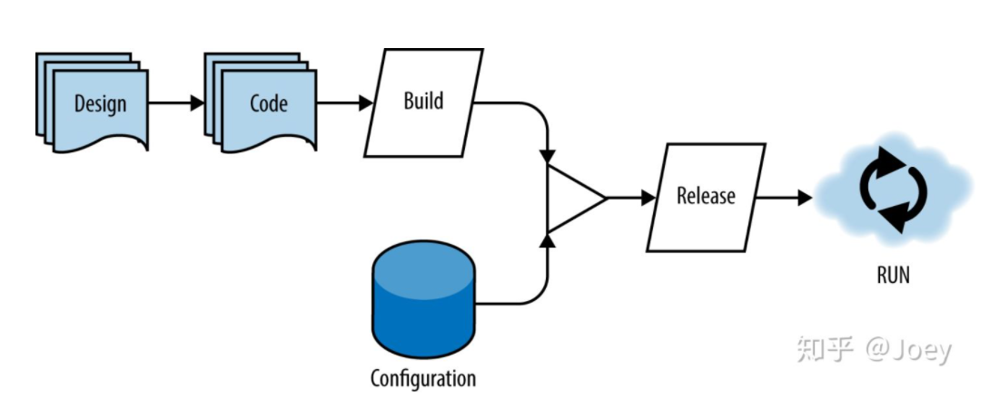

[TOC]


# 1. 十二要素应用的优势
十二要素设计还有助于您分离应用的各个组件，以便轻松地替换每个组件，或者无缝扩容或缩容。由于这些要素与任何编程语言或软件栈无关，因此可将十二要素设计运用于各种应用。

# 2. 十二要素
## 2.1. 代码库 Codebase

### 2.1.1. 关键
> One codebase tracked in **revision control**, many deploys

代码仓库（code repository）和代码的版本管理（revision control）

### 2.1.2. 最佳实践

您应该在 **Git** 或 Mercurial 等版本控制系统中跟踪应用的代码。

您可以通过将代码签出到本地开发环境来处理该应用。通过将代码存储在版本控制系统中，您的团队可以通过提供代码更改的审核跟踪、解决合并冲突的系统方法以及将代码回滚到先前版本的功能进行协作。它还提供了可进行持续集成 (CI) 和持续部署 (CD) 的位置。

虽然开发者可在开发环境中处理不同版本的代码，但在任何给定时间，最可靠来源都是版本控制系统中的代码。代码库中的代码是构建、测试和部署的内容，而代码库的数量与环境的数量无关。代码库中的代码用于生成单个构建，该构建结合环境专用配置来生成随后可以部署到环境中的不可变版本，此版本无法更改，配置也无法更改。（对此版本进行的任何需要的变更都会生成新的版本。）


## 2.2. 依赖项 Dependencies

### 2.2.1. 关键
对于十二要素应用的依赖项，有两个注意事项：
1. 依赖项声明
2. 依赖项隔离。

> Explicitly declare and isolate dependencies


十二要素应用绝不应该具有隐式依赖项。您应明确声明所有依赖项，并将这些依赖项签入到版本控制中。

**显式声明依赖关系**

### 2.2.2. 最佳实践

这样，您就可以通过可重复的方式快速开始使用代码，并且可以轻松跟踪依赖项的更改。许多编程语言都提供了一种明确声明依赖项的方法，例如 pip for Python 和 Bundler for Ruby。

您还应将应用及其依赖项打包到容器中，以隔离应用及其依赖项。容器允许您将应用及其依赖项与应用的环境隔离开来，并确保尽管开发环境和暂存环境之间有任何差异，应用也可以在开发环境和暂存环境之间一致地工作。

借助 Container Registry，您的团队可以在同一个位置管理容器映像和执行漏洞分析。此外，您还可以使用容器映像的精细访问权限控制来决定谁可以访问哪些内容。由于 Container Registry 使用 Cloud Storage 存储分区作为提供容器映像的后端，因此您可以通过调整此 Cloud Storage 存储分区的权限来控制哪些用户可以访问 Container Registry 映像。

现有的 CI/CD 集成还可让您设置全自动流水线以获取快速反馈。您可以将映像推送到其注册表，然后使用 HTTP 端点从任意机器（无论是 Compute Engine 实例还是您自己的硬件）拉取映像。 Container Analysis 随后可以为 Container Registry 中的映像提供漏洞信息。

## 2.3. 配置 Config

> Store config in the environment

每个现代化应用都需要某种形式的配置。对于每种环境（例如开发、测试和生产），您通常都有不同的配置。这些配置通常包括支持性服务（如数据库）的服务帐号凭据和资源句柄。

>《Beyond the Twelve-Factor App》[2]中有一个比喻：**代码制品、生产环境配置是2个危险的化学物质，混合到一起就可能随时爆炸**。因此，我们需要把配置（尤其是密钥类、功能开关、策略类配置）的重要性提升到很高的级别，小心翼翼地管理。


每种环境的配置应位于代码外部，不应签入到版本控制中。每个人都仅处理代码的一个版本，但您有多个配置。部署环境决定了要使用的配置。这可让您将二进制文件的一个版本部署到每个环境，唯一的区别是运行时配置。为了检查配置是否已正确外部化，一种简单的方法是查看代码是否可以在不显示任何凭据的情况下公开。

外部化配置的一种方法是创建配置文件。 但是，配置文件通常特定于语言或开发框架。

更好的方法是**将配置存储在环境变量**中。这些环境变量可在运行时针对每个环境轻松更改，不太可能签入到版本控制中，而且与编程语言和开发框架无关。在 Google Kubernetes Engine (GKE) 中，您可以使用 ConfigMap。这样，您可以在运行时将环境变量、端口号、配置文件、命令行参数和其他配置工件绑定到 pod 的容器和系统组件中。

在不同环境使用不同的配置；

妥善保管凭证信息，不允许将凭证信息保存到代码中；

使用服务配置中心来管理配置。

工具：服务配置中心，比如Etcd、Nacos、Appolo等；

## 2.4. 支持性服务 Backing services

> Treat backing services as attached resources

any services that don’t support the core app must be accessed as a service

应用在其正常运行过程中使用的每项服务（例如文件系统、数据库、缓存系统和消息队列）都应作为服务进行访问，并在配置中进行外部化。

> 用面向对象的术语类比，就是视别的服务为“关联”的而非“组合的”。“关联”意味着更弱的耦合，仅通过**网络端口**与这些依赖的服务交互，而**非进程间通信**。

您应将这些支持性服务视为底层资源的抽象。例如，当应用将数据写入存储时，将存储作为支持性服务可让您无缝更改底层存储类型，因为存储与应用分离。然后，您可以在不更改应用代码的情况下执行更改，例如从本地 PostgreSQL 数据库切换至 Cloud SQL for PostgreSQL。

把后端用到的中间件和资源都当成服务，而不是实体，比如常见的：
1. **数据库服务**：可能是MySQL数据库服务实例，或者其它关系型数据库服务实例
2. **缓存服务**：可能是Redis服务实例；
3. **消息队列服务**：可能是Kafka服务实例；
4. **对象存储服务**：可能是阿里云的OSS对象存储，也可能是AWS的S3；
5. **邮件服务**：可能是Mailgun的SMTP服务；
6. **认证授权服务**：可能是第三方的OAuth认证授权服务

## 2.5. 构建、发布和运行  Build, Release, Run
> Strictly separate build and run stages

将软件部署过程分为三个不同阶段非常重要：构建、发布和运行。



为什么要强调 **构建**、**发布**、**运行** 三个阶段一定要分离开来呢？

有两个好处：
1. 职责和关注点的分离。
   1. 构建是开发测试人员更关注的、
   2. 发布是产品经理更关注的、
   3. 运行是运维更关注的；
2. 流水线模式带来的效率提升，以及各阶段之间的缓冲空间，每个阶段有专门的工具和方法论。

怎么做到这三个阶段的分离呢？流水线的运行不是靠人力保障的，自动化系统很重要。

用好

1. CI/CD系统
2. 项目管理系统，
3. **制定**好规则和流程并**自动运转**起来，足矣。

反模式的例子：开发改完代码，本地打个Patch发给运维，也不告知产品经理改了什么，直接口头告诉运维批量更换某些文件。

每个阶段都应生成一个可唯一识别的工件。每个部署都应与特定版本相关联，而版本就是将环境配置与构建相结合的结果。这可以实现轻松回滚每个生产部署，以及查看每个生产部署历史记录的审计跟踪。

您可以手动触发构建阶段，但如果您提交已通过所有必需测试的代码时，构建阶段通常会自动触发。构建阶段获取代码，提取所需的库和资源，然后将这些内容打包到自包含的二进制文件或容器中。构建阶段的结果是构建工件。

构建阶段完成后，发布阶段会将构建工件与特定环境的配置相结合。这会生成一个版本。该版本可以由持续部署应用自动部署到环境中。或者，您也可以通过同一持续部署应用触发发布。

最后，运行阶段会启动版本并开始运行版本。例如，如果您要部署到 GKE，则 Cloud Build 可以调用 gke-deploy 构建步骤以部署到您的 GKE 集群。Cloud Build 可以使用 YAML 或 JSON 格式的构建配置文件，跨多个语言和环境，管理和自动化构建、发布和运行阶段。

## 2.6. 进程 Processes
### 2.6.1. 关键
> Execute the app as one or more stateless processes


无状态是水平扩展的前提，对于Serverless应用更是必要条件。

### 2.6.2. 最佳实践

1. 应用分离
2. Azure Function
您可以在环境中，将十二要素应用作为一个或多个进程运行。这些进程应该是无状态的，不应彼此共享数据。这样，应用就可以通过复制其进程来扩容。构造无状态应用还让进程可在不同的计算基础架构之间移植。

如果您习惯了“粘性”会话的概念，则需要换一换关于处理和持久保留数据的思维方式。由于进程可能会随时取消，因此您不能依赖于本地存储空间提供的内容，也不能依赖于将由同一进程处理任何后续请求这一情况。因此，您必须明确持久保留需要在数据库等外部支持性服务中重复使用的任何数据。

如果您需要持久保留数据，则可以使用 Memorystore 作为支持性服务来缓存应用的状态，并在两个进程之间共享通用数据以促成松散耦合。


## 2.7. 端口绑定 Port binding


在非云环境中，通常将 Web 应用编写为在应用容器（如 GlassFish、Apache Tomcat 和 Apache HTTP Server）中运行。相比之下，十二要素应用不依赖于外部应用容器。相反，它们会将 Web 服务器库打包为应用本身的一部分。

让服务公开由 PORT 环境变量指定的端口号是架构的最佳做法。

使用平台即服务模型时，用于导出端口绑定的应用可以在外部使用端口绑定信息（作为环境变量）。在 Google Cloud 中，您可以在 Compute Engine、GKE、App Engine 或 Cloud Run 等平台服务上部署应用。

在这些服务中，路由层会将来自面向公众的主机名的请求路由到您的端口绑定 Web 过程。例如，将应用部署到 App Engine 时，您可以声明依赖项以将 Web 服务器库添加到应用，例如 Express (Node.js)、Flask 和 Gunicorn (Python) 或 Jetty (Java)。

您不应在代码中对端口号进行硬编码。而是应该在环境中提供端口号，例如通过环境变量提供端口号。这样，当您在 Google Cloud 上运行应用时，这些应用便可以进行移植。

由于 Kubernetes 具有内置的服务发现功能，因此您可以在 Kubernetes 中将服务端口映射到容器以抽象端口绑定。使用内部 DNS 名称实现服务发现。

该配置使用环境变量，而不是对 Web 服务器侦听的端口进行硬编码。以下来自 App Engine 应用的代码段显示了如何接受环境变量中传递的端口值。

```java

const express = require('express')
const request = require('got')

const app = express()
app.enable('trust proxy')

const PORT = process.env.PORT || 8080
app.listen(PORT, () => {
  console.log('App listening on port ${PORT}')
  console.log('Press Ctrl+C to quit.')
})
```
## 2.8. 并发 Concurrency

### 2.8.1. 理解
> Scale out via the process model

横向扩展（简单地增加服务实例和计算节点）就可以提升系统的并发处理能力
### 2.8.2. 最佳实践
您应该根据进程类型（例如后台、Web 和工作器进程）将应用分解为独立的进程。这样，您的应用就可以根据各项工作负载要求进行扩缩。大多数云原生应用可让您根据需要进行扩缩。您应将应用设计为多个分布式进程，这些进程能够独立执行工作块并通过添加更多进程进行横向扩容。

以下部分介绍了使应用能够扩缩的一些构造。在核心层面按照可释放性和无状态原则构建的应用有着良好的定位，可以从这些横向扩缩结构中获益。

使用 App Engine
您可以使用 App Engine 在 Google Cloud 的代管式基础架构上托管您的应用。实例是 App Engine 用于自动扩缩应用的计算单元。在任意时间点，您的应用都可能在一个或多个实例上运行，而请求将分散到正在运行的所有实例。

App Engine 调度器可决定如何处理每个新请求。调度器可使用现有实例（空闲实例或接受并发请求的实例），将请求放入待处理请求队列中，或为请求启动新实例。这项决定会考虑可用实例的数量、应用处理请求的速度（其延迟时间）以及启动新实例所需的时间。

如果您使用自动扩缩，则可以通过设置目标 CPU 利用率、目标吞吐量和最大并发请求数来平衡性能和费用。

您可以在 app.yaml 文件中指定扩缩类型，而您会为服务版本上传该文件。根据此配置输入，App Engine 基础架构可使用动态实例或常驻实例。如需详细了解扩缩类型，请参阅 App Engine 文档。

使用 Compute Engine
或者，您也可以在 Compute Engine 上部署和管理应用。 在这种情况下，您可以使用代管式实例组 (MIG)，根据 CPU 利用率、正在处理的请求或来自应用的其他遥测信号，扩缩应用以响应可变负载。

下图说明了代管式实例组提供的关键功能。

MIG 功能和常见工作负载概览

使用代管式实例组，您的应用可以根据传入的需求进行扩缩，实现高可用性。此概念本质上适用于无状态应用（例如 Web 前端）和基于批处理的高性能工作负载。

使用 Cloud Functions
Cloud Functions 是在 Google Cloud 上运行的无状态单用途函数，运行这些函数的底层架构是由 Google 为您管理。Cloud Functions 函数会响应事件触发器（例如向 Cloud Storage 存储分区的上传或 Pub/Sub 消息）。每个函数调用都会响应单个事件或请求。

Cloud Functions 通过将传入请求分配给函数实例来处理这些请求。如果入站请求数量超过现有实例数，则 Cloud Functions 可能会启动新实例来处理请求。通过这种自动的全代管式扩缩行为，Cloud Functions 函数可以分别使用不同的函数实例并行处理多个请求。

使用 GKE 自动扩缩
以下是一些适用于扩缩过程的关键 Kubernetes 构造：

横向 Pod 自动扩缩 (HPA)。 Kubernetes 可以配置为根据标准或自定义指标来按比例增加或减少集群中运行的 pod 数量。这在您需要响应 GKE 集群上的可变负载时可派上用场。以下 HPA YAML 文件示例展示了如何根据平均 CPU 利用率设置多达 10 个 pod，针对部署进行扩缩配置。


apiVersion: autoscaling/v2beta2
kind: HorizontalPodAutoscaler
metadata:
  name: my-sample-web-app-hpa
  namespace: dev
spec:
  scaleTargetRef:
    apiVersion: apps/v1
    kind: Deployment
    name: my-sample-web-app
  minReplicas: 1
  maxReplicas: 10
  metrics:
  - type: Resource
    resource:
      name: cpu
      target:
        type: Utilization
        averageUtilization: 60
节点自动扩缩。 在需求增加时，您可能需要进行集群扩容以容纳更多的 pod。利用 GKE，您可以通过声明方式将集群配置为可扩缩。启用自动扩缩后，如果需要调度其他 pod，但现有节点无法容纳这些 pod，则 GKE 会自动按比例增加节点数量。如果集群上的负载减少，则 GKE 也会根据您配置的阈值按比例减少节点数量。

作业。 GKE 支持 Kubernetes 作业。 作业可以广泛地定义为需要运行一个或多个 pod 才能执行的任务。作业可能会运行一次或按计划运行。 作业在 pod 中完成运行后，系统便会释放这些 pod。用于配置作业的 YAML 文件会指定有关错误处理、并行性、重启处理方式等的详细信息。

## 2.9. 可释放性 Disposability

### 2.9.1. 关键
1. 快速地部署启动
2. 关键时候有反馈
3. 优雅地退出

### 2.9.2. 最佳实践
对于在云基础架构上运行的应用，您应该将它们和底层基础架构视为一次性资源。您的应用应该能够处理底层基础架构的暂时丢失，并且应该能够正常关停和重启。

需要考虑的关键原则包括：

1. 分离功能，例如使用支持性服务来管理事务数据的状态以及存储事务数据。
2. 管理应用以外的环境变量，以便在运行时可以使用它们。
3. 请确保启动时间最短。这意味着，当您使用虚拟机时，必须决定要在映像（例如公共映像与自定义映像）中构建多少层。此决策特定于每个应用，而且应基于启动脚本所执行的任务。例如，如果您要下载多个软件包或二进制文件并在启动期间对其进行初始化，则启动时间中将有相当一部分时间专门用于完成这些任务。

使用 Google Cloud 的原生功能执行基础架构任务。例如，您可以在 GKE 中使用滚动更新，并使用 Cloud Key Management Service (Cloud KMS) 管理安全密钥。
使用 SIGTERM 信号（如果有）来启动彻底的关停操作。 例如，如果 App Engine Flex 关停实例，则通常会向应用容器发送 STOP (SIGTERM) 信号。您的应用可以在容器关停之前使用此信号执行任何清理操作。（您的应用无需响应 SIGTERM 事件。）在正常情况下，系统会等待长达 30 秒以使应用停止运行，然后发送 KILL (SIGKILL) 信号。

App Engine 应用中的以下代码段向您展示了如何拦截 SIGTERM 信号以关闭打开的数据库连接。

```java
const express = require('express')
const dbConnection = require('./db')

// Other business logic related code

app.listen(PORT, () => {
  console.log('App listening on port ${PORT}')
  console.log('Press Ctrl+C to quit.')
})

process.on('SIGTERM', () => {
  console.log('App Shutting down')
  dbConnection.close()  // Other closing of database connection
})
```
## 2.10. 环境对等 Dev/prod parity

企业应用会在其开发生命周期内跨不同环境移动。通常，这些环境是开发、测试、预演和生产环境。一种好的做法是保持这些环境类似。

大多数开发者都认为环境对等是必备功能。 不过，随着企业的发展和 IT 生态系统的不断演变，环境对等会变得越来越难以维护。

在过去几年，维护环境对等变得越来越容易，因为开发者已经运用数据源控制、配置管理和模板化配置文件。这样，将应用一致地部署到多个环境中就更加轻松。例如，使用 Docker 和 Docker Compose，您可以确保应用栈在各种环境中保持其形状和插桩设置。

下表列出了您在设计要在 Google Cloud 上运行的应用时可以使用的 Google Cloud 服务和工具。这些组件有不同的用途，可共同帮助您构建工作流，使您的环境更加一致。


GCP 组件	用途
Cloud Source Repositories	让您的团队在同一位置集中完成代码的存储、管理和跟踪。
Cloud Storage 和 Cloud Source Repositories	存储构建工件。
Cloud KMS	将加密密钥存储在一个中央云服务中，供其他云资源和应用直接使用。
Cloud Storage	存储您根据来源磁盘、映像、快照或存储在 Cloud Storage 中的映像创建的自定义映像。您可以使用这些映像创建针对您的应用定制的虚拟机 (VM) 实例。
Container Registry	存储、管理和保护您的 Docker 容器映像。
Deployment Manager	编写灵活的模板和配置文件，并利用它们创建使用各种 Google Cloud 产品的部署。
## 2.11. 日志 Logs
### 2.11.1. 关键
>Treat logs as event streams

日志可让您了解应用的运行状况。请务必将日志的收集、处理和分析与应用的核心逻辑相分离。如果您的应用需要动态扩缩且正在公有云上运行，则分离日志记录特别有用，因为它消除了为分布式（通常是临时）虚拟机管理日志的存储位置和聚合的开销。


### 2.11.2. 最佳实践
Google Cloud 提供了一套工具来帮助进行日志收集、处理和结构化分析。一种好的做法是在您的 Compute Engine 虚拟机中安装 Cloud Logging Agent。（默认情况下，该代理会预安装在 App Engine 和 GKE 虚拟机映像中。）该代理会监控一组预配置的日志记录位置。系统会收集由虚拟机上运行的应用所生成的日志，并将这些日志流式传输到 Cloud Logging。

为 GKE 集群启用日志记录功能后，日志记录代理会部署到属于集群的每个节点上。代理会收集日志，利用相关元数据丰富日志，并将其持久保留在数据存储区中。您可以使用 Cloud Logging 查看这些日志。如果您需要更好地控制所记录的内容，则可以使用 Fluentd DaemonSet。如需了解详情，请参阅使用 Fluentd 为 Google Kubernetes Engine 自定义 Logging 日志。

很多人不相信日志打印到stdout/stderr就完事了，是因为不够了解云原生世界中，各类日志收集和处理组件的强大。我们对传统的做法习以为常，却忘记了“单一职责原则”。


## 2.12. 管理流程 Adminstrative Process


### 2.12.1. 关键

管理流程通常包含一次性任务，或者生成报告、执行批处理脚本、启动数据库备份和迁移架构等定时可重复任务。

十二要素清单中的管理流程要素在编写时考虑到了一次性任务。对于云原生应用，如果您要创建可重复的任务，则此要素的相关性会更高，而且本部分中的指南面向此类任务。

定时触发器通常作为 Cron 作业构建，并由应用本身进行处理。此模型可以正常运行，但引入的逻辑与应用紧密相关，需要维护和协调，尤其是当您的应用分布在不同时区时。

因此，在针对管理流程进行设计时，您应该将这些任务的管理与应用本身分离。根据应用运行的工具和基础架构，采用以下建议：

如果在 GKE 上运行应用，请为管理任务启动单独的容器。您可以利用 GKE 中的 CronJob。CronJob 在临时容器中运行，可让您控制作业的耗时、执行频率以及重试次数（如果作业失败或者作业需要的时间太长而无法完成）。
如果在 App Engine 或 Compute Engine 上托管应用，您可以外部化触发机制并创建供触发器调用的端点。与端点的单一用途焦点相比，此方法有助于定义应用所负责的边界。 Cloud Tasks 是一种全代管式异步任务执行服务，可用于通过 App Engine 来实现此模式。您还可以使用 Cloud Scheduler（Google Cloud 上的企业级全代管式调度器）来触发定时操作。


反模式的例子：在应用服务运行环境中安装一个数据库客户端，运维人员手动跑一堆修改数据库的SQL；或者安装一些运维脚本，放到机器的cron table定期执行一些脚本。

这一条“要素”看似晦涩难懂，看反例就很清楚了。上述反例的做法是传统模式经常干的事情，但这种模式显然不“Scalable”。

用自动化流水线和统一的任务调度平台，而不是手动SSH到机器上靠人做。《Beyond the Twelve-Factor App》中传达了更激进的观念：压根不要出现这类一次性的（“One-Off”）任务，这类业务也视为后端服务，调度中心仅触发一个HTTP/RPC请求，调用服务的接口做这类业务。

再举个正例帮助理解：如果要实现每天跑一次的数据分析脚本，除了到机器上加crontab这个最坏的办法，还有什么其他办法呢？

《The Twelve-Factor App》告诉我们，可以用一次性的容器，每天创建一个容器执行脚本，确认执行成功后随即销毁，不成功可以自动重试，比如Kuernetes提供的CronJob机制。
《Beyond the Twelve-Factor App》告诉我们，可以在应用内或应用外单独做一个服务，提供一个HTTP/RPC接口做这件事，调度平台每天触发的仅仅是HTTP调用，根据调用返回结果决定重试。彻底去除Admin Processes，所有的东西都是可伸缩的Backing Service。
# 3. 远不止于十二要素
本文档中介绍的十二要素提供了有关如何采用构建云原生应用的指导。这些应用是企业的基本组成部分。

一家典型的企业拥有许多这样的应用，这些应用通常由多个团队协作开发，以提供企业功能。请务必在应用开发生命周期中建立一些额外的原则，而且未雨绸缪，解决应用之间的通信方式以及应用的保护和访问控制方式。

以下部分概述了在应用设计和开发过程中应注意的一些其他事项。

## 3.1. 以 API 为先


### 3.1.1. 关键

基于API来在系统的不同层次进行解耦；
前后端分离，前后端通过API来交互，通常是基于HTTP(S) 的REST API，数据格式一般为JSON；
系统的服务之间也通过API来交互，通常是基于TCP的RPC调用；
服务内部不同层级也通过API来交互，通常是代码级别的方法或函数调用；
工具：API测试工具（Postman，SwaggerUI等）、API性能测试工具（JMeter等）、API文档管理（Yapi等）。


应用使用 API 进行通信。在构建应用时，请考虑应用在其生态系统中的使用方式，并从设计 API 策略入手。良好的 API 设计可让应用开发者和外部利益相关方轻松使用该 API。一种好的做法是在实现任何代码之前，先使用 OpenAPI 规范来提供 API 文档。

API 会将底层应用功能抽象化。精心设计的 API 端点应将使用方应用与提供服务的应用基础架构相分离。通过这种分离，您可以独立更改底层服务及其基础架构，而不会影响应用的使用方。

请务必针对您开发的 API 进行编目、提供文档和发布，以便 API 的使用方能够发现和使用这些 API。理想情况下，您希望 API 使用方自行提供服务。您可以通过设置开发者门户来实现此目的。开发者门户用作所有 API 使用方的入口点 - 对于企业而言是内部；对于合作伙伴生态系统中的开发者等使用方而言为外部。

Apigee 是 Google 的 API 管理产品套件，有助于管理 API 的整个生命周期（从设计到构建，再到发布）。

## 3.2. 安全
安全的领域非常广泛，包括操作系统、网络和防火墙、数据和数据库安全、应用安全以及身份和访问权限管理。解决企业生态系统中方方面面的安全问题至关重要。

从应用的角度来看，API 可让您访问企业生态系统中的应用。因此，您应确保这些基础组件可解决应用设计和构建过程中的安全相关问题。以下是有助于保护对应用的访问权限的注意事项：

传输层安全协议 (TLS)。使用 TLS 来帮助保护传输中的数据。 您可能希望将双向 TLS 用于您的企业应用；如果您使用 Google Kubernetes Engine 上的 Istio 等服务网格，则可以更轻松地将双向 TLS 用于您的企业应用。对于某些使用场景，根据 IP 地址创建允许列表和拒绝列表作为额外的安全层，也很常见。传输安全还涉及保护您的服务免受 DDoS 和漫游器攻击。
应用和最终用户安全。传输安全有助于为传输中的数据提供安全保障并建立信任。但最佳做法是添加应用级安全，以根据应用的使用方控制对应用的访问权限。这些使用方可以是其他应用、员工、合作伙伴或您企业的最终客户。您可以使用 API 密钥（用于使用方应用）、基于认证的身份验证和授权、JSON Web 令牌 (JWT) 交换或者安全断言标记语言 (SAML) 来强制实施安全措施。
安全状况在企业内不断演变，这使得在应用中编写安全构造代码更为困难。Apigee 等 API 管理产品有助于在本部分提及的所有层面保护 API。

## 3.3. 遥测（Telemetry)

[^1][^2][^3][^4]
# 4. 参考资料

[^1]:英文版 https://12factor.net/
[^2]:中文版 https://12factor.net/zh_cn/
[^3]:[知乎：浅析云原生12要素](https://zhuanlan.zhihu.com/p/243404169)
[^4]:[Azure:What about Cloud-Native applications?](https://docs.microsoft.com/en-us/dotnet/architecture/modernize-with-azure-containers/modernize-existing-apps-to-cloud-optimized/what-about-cloud-native-applications)