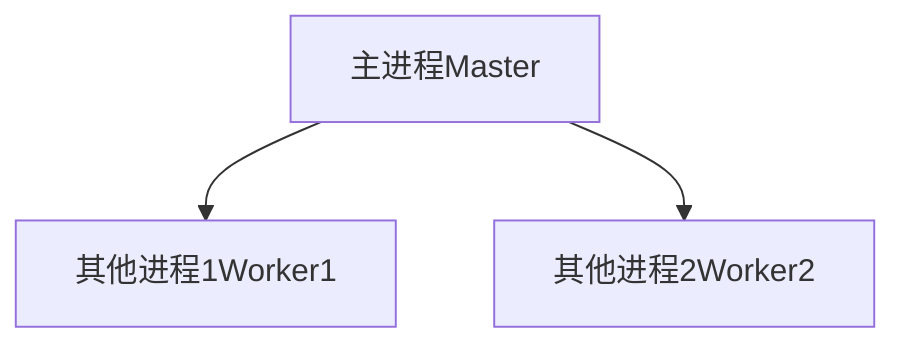

# 多任务编程  

东西不够，生命有限，互相依赖，需要协调

[TOC]

**问题：** 有多任务怎么办？
## 1. 任务在计算机上的完成（进程、线程）

**进程Process** 是计算机中的程序关于某数据集合上的一次运行活动，是系统进行资源分配和调度的基本单位，是操作系统结构的基础。操作系统将物理CPU 虚拟称为多个CPU，每个虚拟CPU运行一个进程

**线程thread** 是操作系统能够进行运算调度的最小单位。它被包含在进程之中，是进程中的实际运作单位

进程=[线程1+线程2+...+线程n]

|         项目 |             进程 |                                                                                                     线程 |
| -----------: | ---------------: | -------------------------------------------------------------------------------------------------------: |
|     地址空间 | 进程之间相互独立 |                                                                       同一进程下个线程共享，无法分配资源 |
|         通信 |    进程间通信IPC | 线程间可以直接读写进程数据段（如全局变量）来进行通信——需要进程同步和互斥手段的辅助，以保证数据的一致性。 |
|   调度和切换 |               慢 |                                                                                                       快 |
| 多线程系统中 |     是可执行实体 |                                                                                 线程不是一个可执行的实体 |


### 1.1 进程

#### 1.1.1 多进程(multiprocessing)

参考 https://www.liaoxuefeng.com/wiki/1016959663602400/1017628290184064

父进程：当前进程（python解释器）
子进程：将父进程复制一份

如果用多进程实现Master-Worker，主进程就是Master，其他进程就是Worker。



进程创建需要占用系统内存来存放PCB的数据结构，所以，一个系统能够创建的进程总数是有限的，进程的最大数目取决于系统内存的大小，由系统安装时已经确定(若后期内存增加了，系统能够创建的进程总数也应增加，但是一般需要重新启动)。而用户数目、外设数量和文件等均与此无关。


    from multiprocessing import Process
    import os

    # 子进程要执行的代码
    def run_proc(name):
        print('Run child process %s (%s)...' % (name, os.getpid()))

    if __name__=='__main__':
        print('Parent process %s.' % os.getpid())
        p = Process(target=run_proc, args=('test',))
        print('Child process will start.')
        p.start()
        p.join()
        print('Child process end.')

执行结果如下：

    Parent process 928.
    Process will start.
    Run child process test (929)...
    Process end.

#### 1.1.2 进程管理
进程管理指的是操作系统调整多个进程的功能

##### 1.1.2.1  进程锁
**进程锁**:也是为了控制同一操作系统中多个进程访问一个共享资源，只是因为程序的独立性，各个进程是无法控制其他进程对资源的访问的，但是可以使用本地系统的信号量控制（操作系统基本知识）。

##### 1.1.2.2 进程间通信（IPC）
IPC方法包括管道（PIPE）、消息排队、旗语、共用内存以及套接字（Socket）

#### 1.1.3 守护进程(daemon)
守护进程(daemon)是一类在后台运行的特殊进程，用于执行特定的系统任务。

### 1.2 线程
**线程thread** 是操作系统能够进行运算调度的最小单位。它被包含在进程之中，是进程中的实际运作单位。


#### 1.2.1 多线程（multi_Thread）


一个进程可以开启多个线程，**开启线程的数量受可用内存限制**。
如果是32位的机器，那么默认一个进程有2G的可用内存，而每个线程默认分析1M的栈空间，所以这种情况下理论最线程数在2000多个。一个解决办法是创建线程时减少线程栈的大小或是使用64位的系统。64位系统应该可以忽略这个问题了。
当然受cpu及磁盘速度及物理内存的限制。不用到达上限值，你的机器应该已经是慢如牛车了。

32位系统一个进程用户空间为2G，一个线程默认需要1M堆栈(最少128K)，可以算一算极限。

如果用多线程实现Master-Worker，主线程就是Master，其他线程就是Worker。

```python
    import time, threading

    # 新线程执行的代码:

    def loop():
        print('thread %s is running...' % threading.current_thread().name)
        n = 0
        while n < 5:
            n = n + 1
            print('thread %s >>> %s' % (threading.current_thread().name, n))
            time.sleep(1)
        print('thread %s ended.' % threading.current_thread().name)

    print('thread %s is running...' % threading.current_thread().name)
    t = threading.Thread(target=loop, name='LoopThread')
    t.start()
    t.join()
    print('thread %s ended.' % threading.current_thread().name)

执行结果如下：

    thread MainThread is running...
    thread LoopThread is running...
    thread LoopThread >>> 1
    thread LoopThread >>> 2
    thread LoopThread >>> 3
    thread LoopThread >>> 4
    thread LoopThread >>> 5
    thread LoopThread ended.
    thread MainThread ended.
```
#### 1.2.2  线程管理
##### 1.2.2  线程锁 ThreadLocal


二者的区别还是很明显的：请求发出后，是否需要等待请求结果，才能继续执行其他操作。


进程（Process）、线程（Thread）、协程（）

总结一下就是，多任务的实现有3种方式：
1. 多进程模式；
2. 多线程模式；
3. 多进程+多线程模式。
4. 单进程单线程的异步编程模型

|                    模式 |                                                                                             优点 |                                       缺点 |
| ----------------------: | -----------------------------------------------------------------------------------------------: | -----------------------------------------: |
|                  多进程 | **稳定性高**，因为一个子进程崩溃了，不会影响主进程和其他子进程。（当然主进程挂了所有进程就全挂了 |                       **创建进程的代价大** |
|                  多线程 |                                                                         快一点，但是也快不到哪去 | 任何一个线程挂掉都可能直接造成整个进程崩溃 |
| 多进程+多线程的混合模式 |                                                                      理论上解决 稳定性和效率问题 |                                            |  |
|                    协程 |                                               单线程的异步编程模型，解决系统总的进程数量十分有限 |                                            |


**对应到Python语言，单线程的异步编程模型称为`协程`，有了协程的支持，就可以基于事件驱动编写高效的多任务程序。我们会在后面讨论如何编写协程。**


## 2. Python概念：可迭代、迭代器、生成器-->协程


|              名称 |                                                                        例子 |                                                特征内置函数 |       适用 |
| ----------------: | --------------------------------------------------------------------------: | ----------------------------------------------------------: | ---------: |
|        可迭代对象 |                          字符串，list，dict，tuple，deque等都是**可迭代的** |                                                  `__iter__` |        for |
|            迭代器 |                                                              特定的数据结构 |                                       `__iter__` `__next__` | for next() |
| 生成器(generator) | 生成器是种特殊的迭代器，这种一边循环一边计算的机制，称为生成器：generator。 | `__iter__` `__next__` `close`,`gi_yieldfrom`,`send`,`throw` |    `yield` |
|                   |


### 1.1 可迭代 

**关键：** `__iter__`

字符串、列表、字典等 是 **可迭代对象** 但不是迭代器，也不是生成器。
>**扩展知识**:
可迭代对象，是其内部实现了，`__iter__` 这个方法，这个方法可使用for来循环。
### 1.2 迭代器

**关键：** `__iter__`+`__next__`

所以Iterator的计算是惰性的，只有在需要返回下一个数据时它才会计算。我们不能提前知道序列的长度

`__init__` 函数内包括：

    `__iter__`:可以直接使用for来实现循环
    `__next__`:可以直接使用next()方法来实现
**示例**


    class Fib:
        def __init__(self):
            self.prev = 0
            self.curr = 1

        def __iter__(self):
            return self

        def __next__(self):
            self.curr, self.prev = self.prev + self.curr, self.curr
            return self.curr

    fib = Fib()
    for i in range(10):
        print(next(fib))
输出：

    1
    2
    3
    5
    8
    13
    21
    34
    55

### 1.3 生成器

**关键：** yield


生成器，是在迭代器的基础上（可以用for循环，可以使用next()），再实现了yield。

yield 是什么东西呢，它相当于我们函数里的return。在每次next()，或者for遍历的时候，都会yield这里将新的值返回回去，并在这里阻塞，等待下一次的调用。正是由于这个机制，才使用生成器在Python编程中大放异彩。实现节省内存，实现异步编程。
这种一边循环一边计算的机制，称为生成器：generator。

但是不需要像迭代器一样实现__iter__和__next__方法，只需要使用关键字yield就可以。

    def fib():
        prev, curr = 0, 1
        while True:
            yield curr
            curr, prev = prev + curr, curr

    f = fib()
    for i in range(10):
        print(next(f))
输出：

    1
    2
    3
    5
    8
    13
    21
    34
    55


#### 1.3.1 如何创建一个生成器
主要有如下两种方法
##### 1. 使用列表生成式
   
        L = (x * x for x in range(10))
        print(isinstance(L, Generator))  # True

> 使用列表生成式，注意不是[]，而是()


##### 2. 实现了yield的函数(生成器函数)


        def mygen(n):
            now = 0
            while now < n:
                yield now
                now += 1
        if __name__ == '__main__':
            gen = mygen(10)
            print(isinstance(gen, Generator))  # True

#### 1.3.2 如何运行/激活生成器
由于生成器并不是一次生成所有元素，而是一次一次的执行返回，那么如何刺激生成器执行(或者说激活)呢？
激活主要有两个方法:
1. 使用next()
2. 使用generator.send(None)

示例：

        def mygen(n):
            now = 0
            while now < n:
                yield now
                now += 1

        if __name__ == '__main__':
            gen = mygen(4)

            # 通过交替执行，来说明这两种方法是等价的。
            print(gen.send(None))
            print(next(gen))
            print(gen.send(None))
            print(next(gen))
输出

        0
        1
        2
        3

#### 1.3.3 生成器的执行状态

生成器在其生命周期中，会有如下四个状态

1. GEN_CREATED   # 等待开始执行
2. GEN_RUNNING    # 解释器正在执行（只有在多线程应用中才能看到这个状态）
3. GEN_SUSPENDED  # 在yield表达式处暂停
4. GEN_CLOSED     # 执行结束


#### 1.3.4  生成器的异常处理
在生成器工作过程中，若生成器不满足生成元素的条件，就会/应该 抛出异常（StopIteration）。

通过列表生成式构建的生成器，其内部已经自动帮我们实现了抛出异常这一步。
所以我们在自己定义一个生成器的时候，我们也应该在不满足生成元素条件的时候，抛出异常。

    def mygen(n):
        now = 0
        while now < n:
            yield now
            now += 1
        raise StopIteration

    if __name__ == '__main__':
        gen = mygen(2)
        next(gen)
        next(gen)
        next(gen)

#### 1.3.5 从生成器过渡到协程：yield

1. 生成器暂停
2. 生成器发送

**1+2 实现协程**

通过上面的介绍，我们知道生成器为我们引入了**暂停函数**执行（yield）的功能。当有了暂停的功能之后，人们就想能不能在生成器暂停的时候向其**发送一点东西**（其实上面也有提及：send(None)）。这种向暂停的生成器发送信息的功能通过 PEP 342 进入 Python 2.5 中，并催生了 Python 中协程的诞生。根据 wikipedia 中的定义

  协程是为非抢占式多任务产生子程序的计算机程序组件，协程允许不同入口点在不同位置暂停或开始执行程序。

注意从本质上而言，**协程并不属于语言中的概念，而是编程模型上的概念**。
协程和线程，有相似点，多个协程之间和线程一样，只会交叉串行执行；也有不同点，**线程之间要频繁进行切换，加锁，解锁**，从复杂度和效率来看，和协程相比，这确是一个痛点。协程通过使用 yield 暂停生成器，可以将程序的执行流程交给其他的子程序，从而实现不同子程序的之间的交替执行。
下面通过一个简明的演示来看看，如何向生成器中发送消息。

    def jumping_range(N):
        index = 0
        while index < N:
            # 通过send()发送的信息将赋值给jump
            jump = yield index
            if jump is None:
                jump = 1
            index += jump

    if __name__ == '__main__':
        itr = jumping_range(5)
        print(next(itr))
        print(itr.send(2))
        print(next(itr))
        print(itr.send(-1))

输出：

        0
        2
        3
        2

这里解释下为什么这么输出。重点是`jump = yield index`这个语句。
分成两部分：

    yield index 是将index return给外部调用程序。
    jump = yield 可以接收外部程序通过send()发送的信息，并赋值给jump

以上这些，都是讲协程并发的基础必备知识，请一定要亲自去实践并理解它，不然后面的内容，将会变得枯燥无味，晦涩难懂。

下一章，我将讲一个Python3.5新引入的语法：yield from。篇幅也比较多，所以就单独拿出来讲。

协程是在单线程里实现任务的切换的
利用同步的方式去实现异步
不再需要锁，提高了并发性能
## 3. 异步IO框架--协程

单线程的异步编程模型称为协程（Coroutine），协程是一种程序组件，也称为微线程。


1 线程（Thread）=协程（Coroutine）+协程（Coroutine）+协程（Coroutine）

### yield
Python通过yield提供了对协程的基本支持
### gevent --第三方库

Python通过yield提供了对协程的基本支持，但是不完全。而第三方的gevent为Python提供了比较完善的协程支持。

gevent是第三方库，通过greenlet实现协程，其基本思想是：

当一个greenlet遇到IO操作时，比如访问网络，就自动切换到其他的greenlet，等到IO操作完成，再在适当的时候切换回来继续执行。由于IO操作非常耗时，经常使程序处于等待状态，有了gevent为我们自动切换协程，就保证总有greenlet在运行，而不是等待IO。

由于切换是在IO操作时自动完成，所以gevent需要修改Python自带的一些标准库，这一过程在启动时通过monkey patch完成：
```python
# bin/bash/python2.6
from gevent import monkey; monkey.patch_socket()
import gevent

def f(n):
    for i in range(n):
        print gevent.getcurrent(), i

g1 = gevent.spawn(f, 5)
g2 = gevent.spawn(f, 5)
g3 = gevent.spawn(f, 5)
g1.join()
g2.join()
g3.join()

运行结果：
<Greenlet at 0x10e49f550: f(5)> 0
<Greenlet at 0x10e49f550: f(5)> 1
<Greenlet at 0x10e49f550: f(5)> 2
<Greenlet at 0x10e49f550: f(5)> 3
<Greenlet at 0x10e49f550: f(5)> 4
<Greenlet at 0x10e49f910: f(5)> 0
<Greenlet at 0x10e49f910: f(5)> 1
<Greenlet at 0x10e49f910: f(5)> 2
<Greenlet at 0x10e49f910: f(5)> 3
<Greenlet at 0x10e49f910: f(5)> 4
<Greenlet at 0x10e49f4b0: f(5)> 0
<Greenlet at 0x10e49f4b0: f(5)> 1
<Greenlet at 0x10e49f4b0: f(5)> 2
<Greenlet at 0x10e49f4b0: f(5)> 3
<Greenlet at 0x10e49f4b0: f(5)> 4
可以看到，3个greenlet是依次运行而不是交替运行。
```

要让greenlet交替运行，可以通过gevent.sleep()交出控制权：
```python
def f(n):
    for i in range(n):
        print gevent.getcurrent(), i
        gevent.sleep(0)
执行结果：

<Greenlet at 0x10cd58550: f(5)> 0
<Greenlet at 0x10cd58910: f(5)> 0
<Greenlet at 0x10cd584b0: f(5)> 0
<Greenlet at 0x10cd58550: f(5)> 1
<Greenlet at 0x10cd584b0: f(5)> 1
<Greenlet at 0x10cd58910: f(5)> 1
<Greenlet at 0x10cd58550: f(5)> 2
<Greenlet at 0x10cd58910: f(5)> 2
<Greenlet at 0x10cd584b0: f(5)> 2
<Greenlet at 0x10cd58550: f(5)> 3
<Greenlet at 0x10cd584b0: f(5)> 3
<Greenlet at 0x10cd58910: f(5)> 3
<Greenlet at 0x10cd58550: f(5)> 4
<Greenlet at 0x10cd58910: f(5)> 4
<Greenlet at 0x10cd584b0: f(5)> 4
3个greenlet交替运行，
```
把循环次数改为500000，让它们的运行时间长一点，然后在操作系统的进程管理器中看，线程数只有1个。

当然，实际代码里，我们不会用gevent.sleep()去切换协程，而是在执行到IO操作时，gevent自动切换，代码如下：
```python
from gevent import monkey; monkey.patch_all()
import gevent
import urllib2

def f(url):
    print('GET: %s' % url)
    resp = urllib2.urlopen(url)
    data = resp.read()
    print('%d bytes received from %s.' % (len(data), url))

gevent.joinall([
        gevent.spawn(f, 'https://www.python.org/'),
        gevent.spawn(f, 'https://www.yahoo.com/'),
        gevent.spawn(f, 'https://github.com/'),
])


>>>运行结果：
GET: https://www.python.org/
GET: https://www.yahoo.com/
GET: https://github.com/
45661 bytes received from https://www.python.org/.
14823 bytes received from https://github.com/.
304034 bytes received from https://www.yahoo.com/.
从结果看，3个网络操作是并发执行的，而且结束顺序不同，但只有一个线程。

```

#  示例

## 将for 循环使用多线程处理

```python

results = list()
for item in item_list:
    result = process(item)
    results.append(result)
return results


from multiprocessing.dummy import Pool as ThreadPool
pool = ThreadPool()
results = pool.map(process, item_list)
pool.close()
pool.join()
```