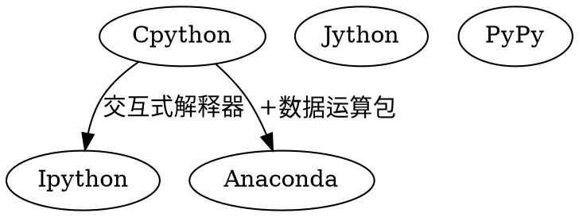

[TOC]

# 1. Python解释器种类与选择


## 1.1. Cpython

当我们从Python [官方网站](https://www.python.org/)下载并安装好Python 3后，我们就直接获得了一个官方版本的解释器：`CPython`。这个解释器是用**C语言**开发的，所以叫CPython。在命令行下运行python就是启动CPython解释器。
CPython是使用最广的Python解释器。

### 1.1.1. Anaconda


Anaconda是一个免费开源的Python和R语言的发行版本，用于计算科学（数据科学、机器学习、大数据处理和预测分析），Anaconda致力于简化包管理和部署。

安装地址 https://repo.continuum.io/archive/

#### 1.1.1.1. Miniconda
Miniconda 是一个 Anaconda 的轻量级替代，默认只包含了 python 和 conda，但是可以通过 pip 和 conda 来安装所需要的包。

Miniconda 安装包可以到 https://mirrors.tuna.tsinghua.edu.cn/anaconda/miniconda/ 下载。


### 1.1.2. IPython
IPython是基于CPython之上的一个交互式解释器，也就是说，IPython只是在交互方式上有所增强，但是执行Python代码的功能和CPython是完全一样的。好比很多国产浏览器虽然外观不同，但内核其实都是调用了IE。

CPython用>>>作为提示符，而IPython用In [序号]:作为提示符。

## 1.2. PyPy
PyPy是另一个Python解释器，它的目标是执行速度。PyPy采用JIT技术，对Python代码进行动态编译（注意不是解释），所以可以显著提高Python代码的执行速度。
绝大部分Python代码都可以在PyPy下运行，但是PyPy和CPython有一些是不同的，这就导致相同的Python代码在两种解释器下执行可能会有不同的结果。如果你的代码要放到PyPy下执行，就需要了解PyPy和CPython的不同点。
## 1.3. Jython
Jython是运行在Java平台上的Python解释器，可以直接把Python代码编译成**Java**字节码执行。

## 1.4. IronPython

IronPython和Jython类似，只不过IronPython是运行在微软.Net平台上的Python解释器，可以直接把Python代码编译成**.Net**的字节码。


# 2. Python 多版本管理

## 2.1. 虚拟环境virtualenv
virtualenv就是一个搭建虚拟化的python环境，便于不同的项目在同一台机器上开发运行。

virtualenv更多的还是适用于本地开发不同的项目，但是在生产环境中还是使用docker给不同的项目创建不同的容器，各自分开运行为好，不宜放在一个单独的物理机中运行。

```shell
pip3 install virtualenv
```


## 2.2. conda创建环境

Conda是一个开源[1]跨平台[2]语言无关[3]的包管理与环境管理系统。Conda是用Python语言开发。

conda创建环境：
```shell
conda create -n py36 python=3.6 
```
 
删除环境（不要乱删啊啊啊）

```shell
conda remove -n py36 --all
```
 
激活环境
```shell
//下面这个py36是个环境名
source activate py36  (conda4的是：conda activate py36)
```
 

退出环境

```shell
source deactivate (conda4的是：conda deactivate)
```


查看所有环境列表

```shell
conda info -e 
```

管理 python版本
```shell
# 安装python
conda install python=x.x
# 更新python
conda update python *
```


# 3. 第三方包管理


`conda` and `pip` 的对比


| 项目                  | conda                   | pip                             |
| --------------------- | ----------------------- | ------------------------------- |
| manages               | binaries                | wheel or source                 |
| can require compilers | no                      | yes                             |
| package types         | any                     | Python-only                     |
| create environment    | yes, built-in           | no, requires virtualenv or venv |
| dependency checks     | yes                     | no                              |
| package sources       | Anaconda repo and cloud | PyPI                            |


- conda 安装包路径是 `xxxxx\Anaconda3\pkgs`
- pip 安装包路径在虚拟环境下是 `xxxx\Anaconda3\envs\a_conda_env\Lib\site-packages`

**注意：**
1. 使用conda 安装多个环境时，对于同一个包只需要安装一次。有conda集中管理。
2. 使用pip因为每个环境安装使用的pip在不同的路径下，故会重复安装，而包会从缓存中取。

## 3.1. Conda

Conda is an open source package management system and environment management system that runs on Windows, macOS and Linux.

### 3.1.1. 基本使用
```shell
# 使用远程镜像
conda install  <包名> 
conda update  <包名>   # 更新指定包
conda remove <包名>

# 使用本地文件
conda install --use-local   D:\XXX.tar.bz2
```
### 3.1.2. 加速

```shell
# 查看当前配置 方法1
conda config --show
# 查看当前配置 方法2
conda info
```
目前（2020/02/25）个人测试过的国内可用的加速镜像有：

1. 清华大学镜像： https://mirrors.tuna.tsinghua.edu.cn/anaconda
2. 上海交大镜像：https://mirrors.sjtug.sjtu.edu.cn/anaconda

- 命令行
```shell
# 添加镜像
conda config --add channels https://mirrors.tuna.tsinghua.edu.cn/anaconda/pkgs/free/ 
conda config --add channels https://mirrors.tuna.tsinghua.edu.cn/anaconda/pkgs/main/ 
conda config --set show_channel_urls yes


conda config --add channels https://mirrors.sjtug.sjtu.edu.cn/anaconda/pkgs/free/ 
conda config --add channels https://mirrors.sjtug.sjtu.edu.cn/anaconda/pkgs/main/ 
conda config --set show_channel_urls yes

# 移除镜像
conda config --remove channels https://mirrors.tuna.tsinghua.edu.cn/anaconda/cloud/conda-forge/

# 移除默认配置
conda config --remove-key channels
```


Windows 用户无法直接创建名为 `.condarc` 的文件，可先执行以下命令生成`.condarc`文件之后再修改。
```shell
conda config --set show_channel_urls yes
```


## 3.2. pip--pypi

pip is the package installer for Python
pip 是python的包安装器
### 3.2.1. 基本操作
```shell
pip install SomePackage              # 最新版本
pip install SomePackage==1.0.4       # 指定版本
pip install 'SomePackage>=1.0.4'     # 最小版本

pip install --upgrade xxx            # 更新
pip uninstall SomePackage               # 卸载
pip show SomePackage                 # 查看
pip search SomePackage   # 查找
pip list   # 查看已安装包

pip --version # 查看已安装包
pip install --upgrade pip # 升级pip
```


### 3.2.2. 加速
在境内地区的国际站点的网络连接速度通常较慢，pip可通过国内镜像加速

清华：https://pypi.tuna.tsinghua.edu.cn/simple
阿里云：https://mirrors.aliyun.com/pypi/simple/
中国科技大学 https://pypi.mirrors.ustc.edu.cn/simple/
华中理工大学：http://pypi.hustunique.com/
山东理工大学：http://pypi.sdutlinux.org/ 
豆瓣：http://pypi.douban.com/simple/

#### 3.2.2.1. 修改单一镜像地址
```shell
pip install XXX -i  [镜像地址]

pip install XXX -i  https://pypi.tuna.tsinghua.edu.cn/simple
```

#### 3.2.2.2. 修改全局镜像地址
- 命令行修改
```shell 
pip config set global.index-url https://pypi.tuna.tsinghua.edu.cn/simple
```
- 修改文件
  
**linux**: 
修改 ~/.pip/pip.conf (没有就创建一个)， 内容如下：
```conf
[global]
index-url = https://pypi.tuna.tsinghua.edu.cn/simple
```
**windows**: 
直接在user目录中创建一个pip目录，如：C:\Users\xx\pip，新建文件`pip.ini`，内容如下
```ini
[global]
index-url = https://pypi.tuna.tsinghua.edu.cn/simple
```

## 3.3. 第三方whl 文件库
Unofficial Windows Binaries for Python Extension Packages
by Christoph Gohlke, Laboratory for Fluorescence Dynamics, University of California, Irvine.

<https://www.lfd.uci.edu/~gohlke/pythonlibs/> 

# 4. 按部署环境配置应用的行为
应用在不同的环境（开发、测试、生产）中应该允许加载不同的配置，配置不同的行为。

当前应用处于什么环境，可以通过环境变量来配置，应用初始化时最先检测当前处于什么环境，之后的初始化流程就可以依据环境配置来加载配置，定制应用行为。
```python
# conf/__init__.py
class AppConfig(object):
    app_env = os.getenv('APP_ENV', 'development')
    is_prod = app_env == 'production'
    is_dev = app_env == 'development'
    is_testing = app_env == 'testing'

    # 其余应用配置项
    ...

conf = AppConfig()


def _load_config_by_env(env: str):
    '''
    不同环境加载不同的配置文件
    配置目录结构：
    conf/
        __init__.py
        development.py
        production.py
        testing.py
    '''
    module = importlib.import_module('conf.{}'.format(env))
    if not hasattr(module, 'Config'):
        logging.warning('Not find {} config'.format(env))
        return
    for name, value in getattr(module, 'Config').__dict__.items():
        if name.startswith('__'):
            continue
        conf.__dict__[name] = value
```
# 5. 根据环境配置日志级别
```python
log_level = logging.INFO if conf.is_prod else logging.DEBUG
logging.basicConfig(format=consts.LOG_FORMAT, level=log_level)

```


