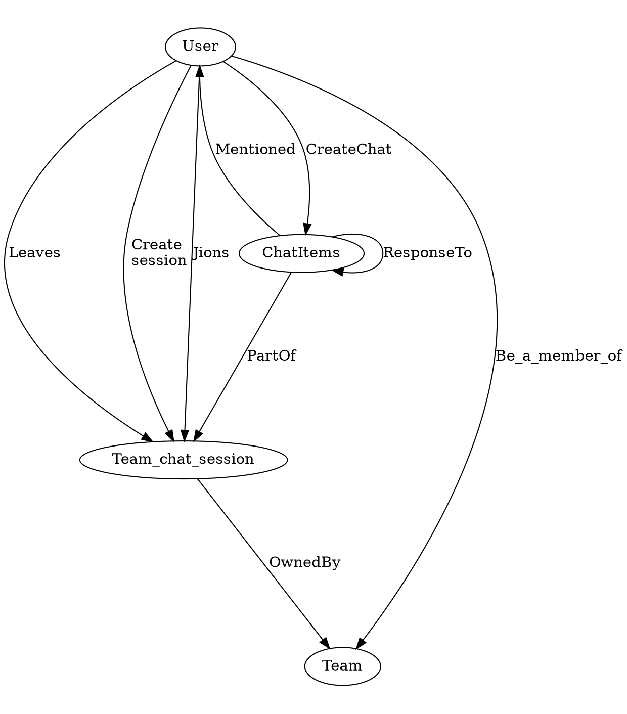
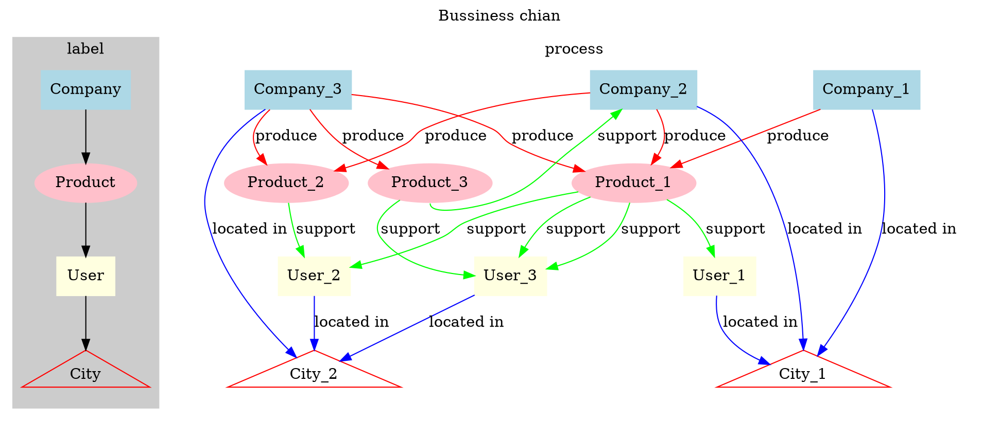

[TOC]
# DOT 画图


示例：
```shell
digraph a{
    size="41,42";
    edge [color="black"]
    center=true
 
    rankdir = TB;
    size="50,20"
    ratio=1.8
     
    User->Team_chat_session [label="Jions"]
    User->Team_chat_session [label="Leaves"]
    User->Team_chat_session [label="Create\n session"]
    
    User->Team [label="Be_a_member_of"]
    User->ChatItems [label="CreateChat"]


    Team_chat_session->Team [label="OwnedBy"] 
    ChatItems->Team_chat_session [label="PartOf"]
    ChatItems ->User[label="Mentioned"]
     


    ChatItems ->ChatItems [label="ResponseTo"]
}
```




```shell
digraph g{
    label = "Bussiness chian";
    labelloc = "t";

subgraph cluster_2{
    label = "label";
    labelloc = "t";
    style=filled;
    color=gray80
    {
    Company[shape=box,color=lightblue,style=filled]
    Product [color=pink,style=filled]
    User[shape=box,color=lightyellow,style=filled]
    City [shape=triangle,color=red]
    Company ->Product->User->City
    };

    
}

subgraph cluster_3{
    style=filled;
    color=white;
    label = "process ";
    Company_1 [shape=box,color=lightblue,style=filled]
    Company_2 [shape=box,color=lightblue,style=filled]
    Company_3 [shape=box,color=lightblue,style=filled]

    Product_1 [color=pink,style=filled]
    Product_2 [color=pink,style=filled]
    Product_3 [color=pink,style=filled]

    User_1 [shape=box,color=lightyellow,style=filled]
    User_2 [shape=box,color=lightyellow,style=filled]
    User_3 [shape=box,color=lightyellow,style=filled]

    City_1 [shape=triangle,color=red]
    City_2 [shape=triangle,color=red]

    Company_1->Product_1 [label="produce",color="red"]
    Company_2->Product_1 [label="produce",color="red"]
    Company_3->Product_1 [label="produce",color="red"]
    Company_2->Product_2 [label="produce",color="red"]
    Company_3->Product_3 [label="produce",color="red"]
    Company_3->Product_2 [label="produce",color="red"]


    Company_1->City_1 [label="located in",color="blue"]
    Company_2->City_1 [label="located in",color="blue"]
    Company_3->City_2 [label="located in",color="blue"]
    User_2->City_2 [label="located in",color="blue"]
    User_3->City_2 [label="located in",color="blue"]
    User_1->City_1 [label="located in",color="blue"]

    Product_1->User_1 [label="support",color="green"]
    Product_1->User_2 [label="support",color="green"]
    Product_1->User_3 [label="support",color="green"]
    Product_3:s->Company_2 [label="support",color="green"]
    Product_3->User_3 [label="support",color="green"]
    Product_1->User_3 [label="support",color="green"]
    Product_2->User_2 [label="support",color="green"]


    {rank=same;Company;Company_1,Company_2,Company_3}

}

}
```


[^1]
# 参考资料
[^1]:使用 Graphviz 生成自动化系统图
https://www.ibm.com/developerworks/cn/aix/library/au-aix-graphviz/index.html
