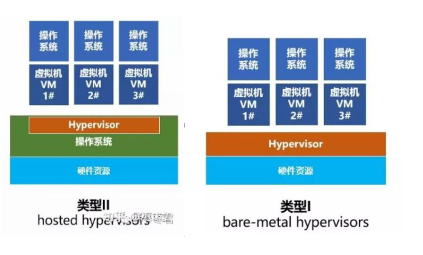
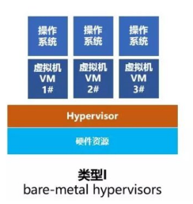

[TOC]


# 1. 概况

## 1.1. 定义
### 1.1.1. 虚拟化
`虚拟化` 是扩展或替换现有接口以模拟另一个系统的行为。
`Virtualization`: extend or replace an existing interface to mimic the behavior of another system. 

### 1.1.2. VMM 虚拟机监控系统

`VMM` 全称是 Virtual Machine Monitor，虚拟机监控系统，也叫 `Hypervisor`，是虚拟化层的具体实现。主要是`以软件的方式，实现一套和物理主机环境完全一样的虚拟环境`，物理主机有的所有资源，包括 CPU、内存、网络IO、设备IO等。

VMM 可以运行在寄主系统上，也可以运行在`裸金属硬件` 上




## 1.2. 分类

按照接口类型:

1. 仿真系统
2. 完整/初级虚拟化
3. 准虚拟化
4. 操作系统级虚拟化
5. 应用系统虚拟化


虚拟化技术大致分为4类：
1. 内存虚拟化
2. 网络虚拟化
3. 存储虚拟化
4. 服务器虚拟化


### 1.2.1. 仿真系统
- 虚拟机完全模拟硬件
- 虚拟机运行完全未修改的操作系统
**案例**: Bochs, VirtualPC for Mac, QEMU 

#### 1.2.1.1. QEMU
QEMU （quick emulator）是一款由Fabrice Bellard等人编写的免费的可执行硬件虚拟化的（hardware virtualization）开源托管虚拟机（VMM）


### 1.2.2. 完整/初级虚拟化

- 虚拟机模拟"足够"的硬件运行未修改的操作系统OS
- 运行在独立的虚拟硬件上
- 硬件辅助全虚拟化 HVM 技术 使得虚拟机可以运行在裸金属硬件上，并可以直接使用Ring 0而不需要修改

- AVM simulates “enough” hardware to allow an unmodified guest OS to be run in isolation Same hardware CPU

**案例产品**：IBM VM 系列, VMWare Workstation, Parallels, VirtualBox

#### 1.2.2.1. 硬件辅助全虚拟化 HVM 技术
 
主要是CPU 虚拟化，详见其他篇章。


#### 1.2.2.2. VMWare Workstation

VMware Workstation（中文名“威睿工作站”）是一款功能强大的桌面虚拟计算机软件，提供用户可在单一的桌面上同时运行不同的操作系统，和进行开发、测试 、部署新的应用程序的最佳解决方案。

#### 1.2.2.3. VirtualBox

VirtualBox 是一款开源虚拟机软件


### 1.2.3. 准虚拟化  para virtualization（PV）
- 虚拟机不模拟硬件
- 使用修改后的Guster操作系统，必须使用的特殊API
- 虚拟机监控程序捕获并提供服务的虚拟化调用

**案例**：Xen, VMware, esx服务器

### 1.2.4. 操作系统级虚拟化

- 操作系统允许运行多个安全的虚拟服务器
- 操作系统与主机操作系统相同，但似乎是孤立的
- 应用程序看到独立的操作系统
- 基于linux内核中的命名空间（Namespaces）、chroot、Union 文件系统（Union file systems）、控制组（Control groups）、 容器格式（Container format）实现

**案例** ：Solaris容器, BSD监狱, Linux Vserver,Linux Containers (Linux 容器, LXC) , Docker

每个容器都属于host OS 的一个进程


#### 1.2.4.1. KVM虚拟化

KVM （基于内核的虚拟机）是一种硬件辅助的虚拟化技术，支持 Intel VT-x 和 AMD-v 技术，是FreeBSD和Linux的内核模块，它允许用户空间程序访问各种处理器的虚拟化硬件特性。

kvm自从Linux2.6.20版本后就直接整合到了Linux内核中，它依托CPU虚拟化指令集（如Intel-VT、AMD-V）实现高性能的虚拟化支持。由于与Linux内核高度融合，因此在性能、安全性、兼容性、稳定性上都有良好的表现。

`KVM kernel modules` 是Linux内核的一部分 
`Linux guest drivers` 是Linux内核的一部分 
`Userspace tools` 用户层的虚拟化工具通常称为 "`qemu-kvm`" 或者 `kvm` ，可通过第三方库安装

##### 1.2.4.1.1. 安装

```shell
sudo apt-get install qemu-kvm qemu-system libvirt-bin  bridge-utils
```
 

### 1.2.5. 应用程序级虚拟化
- 应用程序提供自己的未共享组件的副本（例如，自己的注册表文件、全局对象）
- ve防止冲突
**案例**:  JVM, Mac上的Rosetta（也是模拟）, Wine(在Unix系统下运行Windows的软件)

# 2. CPU的虚拟化是如何实现的

计算虚拟化的本质就是在`虚拟系统`和·之间抽象出CPU和内存等，以供虚拟机使用。
对于CPU的虚拟化，我们要了解CPU的几种运行模式。

对于用户态程序和内核态程序分别运行在哪个特权级，下面一张图也给出了说明。

• 虚拟机的内核运行在宿主机的**用户态**，CPU虚拟化的本质就是实现虚拟机的内核在调用时从用户态切换到内核态。
I/O、更改MMU设置等敏感指令只能在内核模式下执行，在用户模式下执行时导致错误。在硬件辅助全虚拟化条件下，可以执行敏感指令

- Intel 386：忽略用户模式下的敏感指令，不支持硬件辅助全虚拟化
- 英特尔VT, AMD-SVM 支持硬件辅助全虚拟化

CPU 虚拟化主要指硬件辅助的 CPU 虚拟化技术，主流技术包括：
1. Intel 公司的 Intel VT
2. AMD 公司的 AMD-V


## 2.1. Intel VT 技术

Intel VT 全称为 Intel Virtualization Technology。 包括： VT-x （支持 CPU 虚拟化）、EPT（支持内存虚拟化）和 VT-d（支持 I/O 虚拟化）。

### 2.1.1. Intel VT-x

VT-x 是 Intel CPU 的硬件虚拟化技术，提供内存以及虚拟机的硬件隔离，这也是平常我们想在 intel 平台上做虚拟化最基本需要支持的技术。

> VT-x 其实就是 Intel Virtualization Technology,至于为什么后边有个 x 呢？是因为英特尔在起名字的时候，将x86平台上的VT技术，称之为VT-x；

VT-x不仅需要处理器的支持，也需要主板、BOIS的支持

VT-x  运行ESXI上的64bit Guest OS基本指令

VT-x有助于提高基于软件的虚拟化解决方案的灵活性与稳定性。通过按照纯软件虚拟化的要求消除虚拟机监视器(VMM）代表客户操作系统来听取、中断与执行特定指令的需要，不仅能够有效减少 VMM 干预，还为 VMM 与客户操作系统之间的传输平台控制提供了有力的硬件支持，这样在需要 VMM干预时，将实现更加快速、可靠和安全的切换。
### 2.1.2. Intel VT-i

在 intel Itanium(安腾) 平台上的VT技术，称之为VT-i。

`Intel VT-i` (Intel Virtualization Technology for Itanium Processors) is the implementation of an Intel Secure Virtual Machine for the IA-64 architecture (Itanium).
### 2.1.3. Intel VT-d
VT-d 英文全程为 Virtualization Technology for Directed I/O，VT-d 的 Intel 官方中文名称是 `定向 I/O 虚拟化技术` ，这个技术就是俗称的**虚拟化直通技术**，就是允许宿主机将某些硬件资源（比如硬盘、显卡、网卡）的管辖权直接移交给虚拟机，此时宿主机将不能再使用此硬件，虚拟机会以直通独占的方式使用它们，这种直通的技术带来的好处就是，虚拟机中使用该硬件的性能损耗是极小的, 改善了 I/O 设备在虚拟化环境中的性能并且隔离更加彻底提高了系统的安全性。

虚拟机可以直接针对周边硬体做存取,由北桥晶片来支援及BIOS来开启。

事实上在虚拟环境中，还是有许多直接硬体存取的机会，如备份伺服器,常常需要直接存取HBA Card才能加快速度,此时VT-d就大派用场。

### 2.1.4. Intel VT-c
VT-c 英文全程为 Virtualization Technology for Connectivity

VT-c 主要是针对提高网络 I/O 提供的虚拟化技术，它可以在一个物理网卡上，建立针对虚拟机的设备队列，最大限度的提高 I/O 吞吐率。

现在的 VT-c 就很厉害了，可以将一个物理网卡分成十份，分别直通给10个虚拟机，并且这十份都是隔离互不影响的，注意，这里我用了直通两个字，也就是分割成十份这个操作是不经过虚拟机管理系统的（也就是不经过CPU），所以 I/O 性能很高，并且减少CPU的负载


VT-c 架构都是以Network为主, 要由I/O装置来支援，主要包含了Virtual Machine Direct Connect及Virtual Machine Device Queues两项技术。


#### 2.1.4.1. Virtual Machine Direct Connect

虚拟机上的虚拟网络卡传送主要透过 VMM(或是 hypervisor)来进行传输, 而VMDc允许VM可以直接针对实体网路 I/O进行存取。虽然在 Intel VT-d技术中已经允许虚拟机可以直接和实体I/O连结.不过VMDc使用了PCI-SIG的Single Root I/O Virtualization的技术。透过这项技术更进一步提升VT-d的功能。它可以同时让多个虚拟机与实体 I/O装置同时建立通道!

#### 2.1.4.2. Virtual Machine Device Queues

目前我们使用的虚拟化不管是 RHEL的KVM或是Xen还是VMware/Citrix,在处理虚拟机的网络卡时都会透过一个由VMM(或是叫 Hypervisor) 所管理的虚拟化Switch ,而这Switch主要的功能就是转送封包给正确的虚拟机.,但哪一些封包要流向哪一个虚拟机都需要额外的CPU资源才能完成这些工作。而 Intel所使用的VMDq就是为了减少这些额外CPU的处理,透过网卡晶片内建的Layer2 classifier / sorter以加速网路资料的传送,它可以先行将不同的虚拟机所需的封包,直接在晶片里面安排好再透过receive queue,直接给虚拟机.这样就不需再透过Virtual switch转送封包.!大大减少网路的负载与CPU的使用率!

## 2.2. AMD-V

AMD-v 是 AMD虚拟化技术 


## 2.3. 查看CPU 虚拟化情况

```shell
# vmx（Intel-VT 技术）或 svm （AMD-V 支持）
egrep -o '(vmx|svm)' /proc/cpuinfo
>>>
vmx
vmx
vmx
vmx
vmx
vmx
vmx
vmx
```

8核cup ，没个cpu 都开启了vmx cpu虚拟化


# 3. 实践

## 3.1. 如何判断VPS是基于哪种虚拟技术
如何判断VPS是基于哪种虚拟技术？Xen、OpenVZ、Xen HVM、KVM还是VMware
```shell
sudo apt-get install virt-what
sudo virt-what
>>>
kvm 
```

# 4. 参考资料


