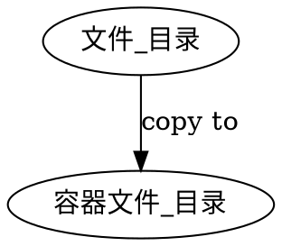
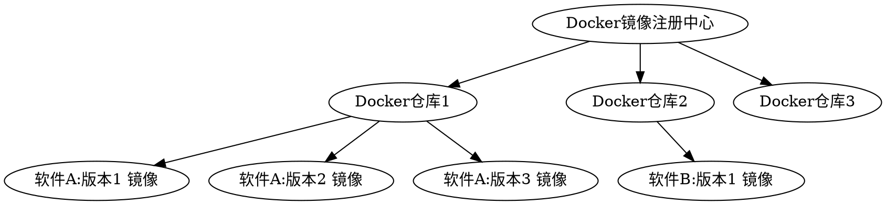

[TOC]


Docker 的主要笔记资料参考：
[Docker — 从入门到实践]https://yeasy.gitbooks.io/docker_practice/content/


# 1. Docker 安装
目前docker已经分为社区版(docker CE)和商业版（docker EE）。docker-ce 是docker公司维护的开源项目， 本节主要针对此版本进行说明。

## 1.1. For Linux
```shell 
# 使用官方安装脚本自动安装 （仅适用于公网环境 阿里云）
curl -fsSL https://get.docker.com | bash -s docker --mirror Aliyun
```
## 1.2. For windows

Docker Windos客户端 主要由2种：
1. 针对Windows 10+ ，开启Hyper-V的系统：推荐使用 `Docker for Windows`（下载地址：[点击这里](http://mirrors.aliyun.com/docker-toolbox/windows/docker-for-windows/)）
2. 针对Windows 10- ,使用 `Docker Toolbox
Windows`（下载地址：[点击这里](http://mirrors.aliyun.com/docker-toolbox/windows/docker-toolbox/)）

* 可以使用迅雷p2p 下载境外资源


## 1.3. 注意与优化


1. Docker for Windows 和 Docker Toolbox互不兼容，如果同时安装两者的话，需要使用 hyper-v的参数启动。
```shell 
docker-machine create --engine-registry-mirror=http://hub-mirror.c.163.com -d hyperv default
```
2. Docker for Windows 有两种运行模式，一种运行Windows相关容器，一种运行传统的Linux容器。同一时间只能选择一种模式运行。

```shell
docker-machine ssh 

sudo mkdir -p /etc/docker
sudo tee /etc/docker/daemon.json <<-'EOF'
{
  "registry-mirrors": ["http://hub-mirror.c.163.com"]
}
EOF
```

3. Windows 10 家庭版开启 hyper-v
```shell 
pushd "%~dp0"
dir /b %SystemRoot%\servicing\Packages\*Hyper-V*.mum >hyper-v.txt
for /f %%i in ('findstr /i . hyper-v.txt 2^>nul') do dism /online /norestart /add-package:"%SystemRoot%\servicing\Packages\%%i"
del hyper-v.txt
Dism /online /enable-feature /featurename:Microsoft-Hyper-V-All /LimitAccess /ALL
```
步骤： 
   1. 新建 `Hyper-V.cmd` 文件，并以管理员身份运行。
   2. 等待处理完成以后，在最末处输入：Y，电脑自动重启，进行配置更新。注意：不能关闭计算机。
   3. 重启动后Windows管理工具中就会出现Hyper-V管理器。

4. 绕过校验
因为docker for windows安装时会校验windows版本，因此我们需要通过以下方式通过校验：将以下代码复制并保存为`.cmd`文件并右键管理员方式运行

```shell
REG ADD "HKEY_LOCAL_MACHINE\software\Microsoft\Windows NT\CurrentVersion" /v EditionId /T REG_EXPAND_SZ /d Professional /F
```


# 2. Docker 概念

**容器** --模拟系统：运行在更为完全隔离的沙盒中，出现在每个容器里的仅仅是操作系统的最小内核，共享了底层系统的资源。容器化的最大优势在于对于相同的硬件占用空间更小，可以比虚拟机运行更多的实例。

**虚拟机** --模拟硬件：运行的是一个完整的组件堆栈——从操作系统到应用服务器，以及仿真的虚拟硬件包括网络组件、CPU和内存

**Boot2Docker** 是一个专为Docker而设计的轻量级Linux发型包，解决Windows或者OS X用户不能安装Docker的问题。 Boot2Docker完全运行于内存中，24M大小，启动仅5-6秒。


**CoreOS** 是一个基于Linux内核的轻量级操作系统，为了计算机集群的基础设施建设而生，专注于自动化、轻松部署、安全、可靠、规模化。作为一个操作系统，CoreOS 提供了在应用容器内部署应用所需要的基础功能环境以及一系列用于服务发现和配置共享的内建工具。


**Alpine** 操作系统是一个面向安全的轻型 Linux 发行版。它不同于通常 Linux 发行版，Alpine 采用了 musl libc 和 busybox 以减小系统的体积和运行时资源消耗，但功能上比 busybox 又完善的多，因此得到开源社区越来越多的青睐。在保持瘦身的同时，Alpine 还提供了自己的包管理工具 apk，可以通过 https://pkgs.alpinelinux.org/packages 网站上查询包信息，也可以直接通过 apk 命令直接查询和安装各种软件。

Alpine 由非商业组织维护的，支持广泛场景的 Linux发行版，它特别为资深/重度Linux用户而优化，关注安全，性能和资源效能。Alpine 镜像可以适用于更多常用场景，并且是一个优秀的可以适用于生产的基础系统/环境。

Alpine Docker 镜像也继承了 Alpine Linux 发行版的这些优势。相比于其他 Docker 镜像，它的容量非常小，仅仅只有 5 MB 左右（对比 Ubuntu 系列镜像接近 200 MB），且拥有非常友好的包管理机制。官方镜像来自 docker-alpine 项目。

目前 Docker 官方已开始推荐使用 Alpine 替代之前的 Ubuntu 做为基础镜像环境。这样会带来多个好处。包括镜像下载速度加快，镜像安全性提高，主机之间的切换更方便，占用更少磁盘空间等。


# 3. Docker 命令


# 4. Docker 数据管理

做好docker的数据管理，需要先对docker 的文件系统有深刻认识。
1. 镜像文件是**只读的**（read-only）
2. 当您打开一个镜像，运行容器实例的时候，Docker 添加一个**可读写层**在镜像文件上层。


容器运行时应该尽量保持的**操作原则**：
1. 容器存储层**不发生写操作**，
2. 对于需要保存动态数据的应用，其数据库文件应该保存于卷(volume)中。


## 4.1. 数据传输

### 4.1.1. 复制cp
最原始的数据管理方式，是将数据通过复制copy的方式，在容器和宿主机之间进行转换。




```shell 
# HOST->Container
docker cp <FILES/DIR_IN_HOST> <Container_ID>:<FILES/DIR_IN_Container>
docker cp 需要拷贝的文件或者目录  容器名称：容器目录

# Container->HOST
docker cp <Container_ID>:<FILES/DIR_IN_Container> <FILES/DIR_IN_HOST> 
docker cp 容器名称：容器目录    宿主机目录
```
**注意区分**：
- Dockerfile 中的`COPY` 是在构建镜像文件时候，将本地文件写入到镜像中，形成只读文件。

- `docker cp` 命令是将host 机器文件 复制到政治运行的容器中。
 


## 4.2. 数据挂载
docker 的数据挂载分为三种：
1. 数据卷（volume）[^use_volume]
2. 挂载主机目录（bind mount）
3. tmpfs


### 4.2.1. volume

`数据卷 volume` 是由Docker容器创建并使用的数据持久化机制，也是由docker默认及推荐的数据挂载方式。

**原理**
数据卷提供了供一个或多个特殊目录给容器使用，它绕过 UFS(UNIX文件系统)，它将主机操作系统目录直接映射进容器。

**优点** 
1. 数据隔离
   -  Volume机制可以将容器以及容器产生的数据分离开来，使得**volume和容器的生命周期完全独立**。对数据卷Volume的更新，不会影响镜像，不增加镜像大小，容器删除时volume仍然存在。
   - 对数据卷的修改会立马生效，并反映在容器中。

2. 数据共享
   - 同一个数据卷可以在多个容器之间更安全地共享和重用。

3. Docker 专用 
   - 数据卷 volume由docker直接管理，非 docker 进程不应该去修改该区域。
   - volume 在生成的时候如果不指定名称，便会随机生成。
4. 功能强大
   - volume 在 Linux 和 Windows 容器上都能工作。
   - volume 驱动程序允许你在远程主机或云上提供存储、加密或其他功能。
   - 新 volume 的内容可以由容器预填充。
   - volume 更容易备份或迁移。可以使用 Docker CLI 命令或 Docker API 来管理。

**缺点**: 
1. volume在宿主机上比较难定位.
   - 在Linux下，默认情况是`/var/lib/docker/volumes/<volumes_name>/_data`下创建了一个目录。
   - Window10 Hyper-V 条件下，默认情况是在`C:\Users\Public\Documents\Hyper-V\Virtual hard disks\` 下挂载 `/var/lib/docker`,使得`/var/lib/docker/volumes/<volumes_name>/_data`, 成为其地址
```shell
ls /var/lib/docker/volumes
>>>
ff664768bfe64e1a8cae4369dd4a2e1929362e29580735480290684e38c8f140
ffa4846b581c1a50a01e7a12a6342ad2aaa442701a35ae56ef2f0e5d7888b22c

```

2. 在宿主机上直接操作volume比较困难。
   - 非 docker 进程不应该去修改该区域。


**注意**
数据卷的使用，类似于 Linux 下对目录或文件进行 mount，镜像中的被指定为挂载点的目录中的文件会隐藏掉，能显示看的是挂载的数据卷。


**数据卷挂载实践**

**构建镜像时**

在 **Dockerfile** 中，我们可以使用`volume`命令，事先指定某些目录挂载为`匿名卷`，这样在运行时如果用户不指定挂载，其应用也可以正常运行，不会向容器存储层写入大量数据。

```Dockerfile
# Dockerfile 构建镜像文件中声明
VOLUME /data
# 容器中的/data 目录会在容器运行时自动挂载为匿名卷
```
这里的 `/data` 目录就会在运行时自动挂载为匿名卷，任何向 `/data` 中写入的信息都不会记录进容器存储层，从而保证了容器存储层的无状态化。

当然，运行时可以覆盖这个挂载设置。比如：
```shell
docker run -d -v mydata:/data xxxx
```
在这行命令中，就使用了 mydata 这个命名卷挂载到了 /data 这个位置，替代了 Dockerfile 中定义的匿名卷的挂载配置。


**运行容器时**

使用**命令行**主要有2种：
1. `-v/--volume`
2. `--mount`

`-v/--volume`，由（:）分隔的三个字段组成，`<卷名>:<容器路径>:<选项列表>`。选项列表，如：ro只读。

```shell
# 挂载数据集
docker run -v <volume-name>:<some_dir>:<opt> <Images_name>:<tag>
# 注意<volume-name>不能更改为文件夹路径<dir_path>,更改为<dir_path> 将会使用bind-mount 形式
docker run -v myvol2:/app 
```

`--mount`，由多个键值对组成，由,分隔，每个由一个`key=<value>`元组组成。
- `type` ，值可以为 `bind`，`volume`，`tmpfs`。
- `source/src`，对于命名卷，是卷名。对于匿名卷，这个字段被省略。可能被指定为 source 或 src。
- `destination/dst/target`, 文件或目录将被挂载到容器中的路径。
- `volume-opt` 可以多次指定。

```shell
# 挂载数据集
docker run --mount type=volume,source=<volume-name>,target=<some_dir> <Images_name>:<tag>

docker run --mount source=myvol2,target=/app nginx:latest
#默认情况下将数据卷<volume-name>挂载到容器中的指定路径<some_dir>
```


**数据共享**
如果要授权一个容器访问另一个容器的Volume，我们可以使用`-volumes-from` 参数来执行`docker run`。
```shell
docker run -it -h NEWCONTAINER --volumes-from container-test debian /bin/bash
```


**数据集管理实践**
```shell
# 创建数据卷
docker volume create <volume-name>
# 默认情况下是在/var/lib/docker下创建了一个目录

# 查看所有数据卷
docker volume ls
>>>
local               <volume-name>

#无主的数据卷可能会占据很多空间，要清理请使用以下命令
docker volume prune

#volume 在容器停止或删除的时候会继续存在，如需删除需要显示声明。
docker rm -v <container_id>
docker volume rm <volume_name>
```


### 4.2.2. bind mount

`bind mount` 是直接将宿主机文件系统上的文件路径映射到容器中，**两边双向同步**。


**优点**
1. 方便
可以直接访问，也可以被别的程序使用。比如我们打包一个本地应用到本地/target路径，我们就可以把这个路径使用bind mount的方式挂在到依赖他的应用的docker容器中，这样本地应用打包后，docker里的数据卷也会同时更新；

**缺点**
1. 安全问题
因为你可以把任何文件路径使用bind mount的方式绑定到容器中，这样有可能一些安全问题，比如把宿主机的系统文件绑定到容器中。


```shell
# 使用-v 添加本地宿主文件地址 是使用bind mount
-v <host path name>:<container path name>
--volume <host path name>:<container path name>

--mount type=bind,source=/src/webapp,target=/opt/webapp,readonly

# Docker 挂载主机目录的默认权限是 读写 用户也可以通过增加 readonly 指定为 只读
--mount type=bind,source=/src/webapp,target=/opt/webapp,readonly
```

- Tips:
1. 本地目录的路径必须是**绝对路径**，
2. 如果本地目录 
   1. 使用 `-v` 参数，Docker 会自动为你创建一个文件夹，
   2. 使用 `--mount` 参数，则报错。


### 4.2.3. tmpfs
tmpfs 这种方式是使用宿主机的内存作为存储，不会写到宿主机的文件系统中，和前两种区别较大。


**Docker Toolbox Windows中的数据挂载**

使用 Docker Toolbox Windows 实际是在VM 虚拟机上构建了Linux系统上运行的docker，需要VM 虚拟机与Windows宿主系统开启文件共享（挂载），再

```
win系统 -> VM 虚拟机（docker Machine）->docker 
```
Docker 再win系统中 挂载的docker Machine 中文件 
docker Machine 同过VM 虚拟机 与win系统中某一文件夹共享文件夹


# 5. Docker 网络

Docker支持的网络通信方式主要有4种:
1. bridge
2. host
3. container
4. none

除bridge方式，Docker还支持host、container、none三种网络通信方式，使用其它通信方式，只要在Docker启动时，指定–net参数即可，比如:


## 5.1. birdge 桥接方式

Docker的网络功能相对简单，没有过多复杂的配置，Docker默认使用**birdge桥接方式**与容器通信，启动Docker后，宿主机上会产生`docker0`这样一个虚拟网络接口， docker0不是一个普通的网络接口， 它是一个虚拟的以太网桥，可以为绑定到docker0上面的网络接口自动转发数据包，这样可以使容器与宿主机之间相互通信。每次Docker创建一个容器，会产生一对虚拟接口，在宿主机上执行ifconfig，会发现多了一个类似`veth****`这样的网络接口，它会绑定到docker0 上，由于所有容器都绑定到docker0上，容器之间也就可以通信。

在宿主机上执行ifconfig，会看到docker0这个网络接口， 启动一个container，再次执行ifconfig, 会有一个类似`veth****`的interface，每个container的缺省路由是宿主机上docker0的ip，在container中执行netstat -r可以看到如下图所示内容：container路由
container路由

容器中的默认网关跟docker0的地址是一样的：docker0
docker0

当容器退出之后，veth***虚拟接口也会被销毁。


## 5.2. host 寄主网络
host方式可以让容器无需创建自己的网络协议栈，而直接访问宿主机的网络接口，在容器中执行`ip addr`会发现与宿主机的网络配置是一样的，host方式让容器直接使用宿主机的网络接口，传输数据的效率会更加高效，避免bridge方式带来的额外开销，但是这种方式也可以让容器访问宿主机的D-bus等网络服务，可能会带来意想不到的安全问题，应谨慎使用host方式
```shel
docker run -i -t  --net=host ubuntu /bin/bash
```

## 5.3. container
container 方式可以让容器共享一个已经存在容易的网络配置；
## 5.4. None
none方式不会对容器的网络做任务配置，需要用户自己去定制。

# 6. 镜像管理

**概念再解析**
Docker Image：Docker 镜像 
Docker Registry ：Docker镜像注册中心，一个集中的存储、分发镜像的服务中心
Docker Repository：Docker仓库,一个仓库对应一个软件，一个软件有多个版本



## 6.1. Docker Registry

```shell
# 查看Registry
docker system info

```

### 6.1.1. 公共镜像注册中心

#### 6.1.1.1. Docker hub

##### 6.1.1.1.1. Docker hub 的国内加速器

#### 6.1.1.2. 阿里云

### 6.1.2. 私有镜像注册中心

## 6.2. 镜像下载

```shell
docker pull [选项] [Docker Registry 地址[:端口号]/]仓库名:[标签]
```
**Windows10** Hyper 模式镜像文件是存储在虚拟硬盘上，虚拟硬盘的位置为`C:\Users\Public\Documents\Hyper-V\Virtual hard disks`

**Linux** 下为`/var/lib/docker`


### 6.2.1. 更换镜像下载镜像

**针对Docker Toolbox用户**
1. 创建一台安装有Docker环境的Linux虚拟机，指定机器名称为default，同时配置Docker加速器地址。
```shell
docker-machine create --engine-registry-mirror=http://hub-mirror.c.163.com -d virtualbox default
```
2. 查看机器的环境配置，并配置到本地，并通过Docker客户端访问Docker服务。
```shell
docker-machine env defaulteval "$(docker-machine env default)"docker info
```
**针对Docker for Windows用户**
1. 在系统右下角托盘图标内右键菜单选择 Settings，打开配置窗口后左侧导航菜单选择 Docker Daemon。编辑窗口内的JSON串，填写下方加速器地址：
```shelkl
{
  "registry-mirrors": ["http://hub-mirror.c.163.com"]
}
```
2. 编辑完成后点击 Apply 保存按钮，等待Docker重启并应用配置的镜像加速器。


## 6.3. 本地镜像发布到远程仓库

我们的镜像现在已经构建并且在本地运行了。但我们通常需要将镜像发布到 Kubernetes 集群、容器镜像服务商处（Docker Hub、阿里云、腾讯云） 中。


```shell
# 发布镜像到容器镜像服务商 Docker Hub
# 1. 登入容器镜像服务商
docker login --username=<USERNAME>

docker push ${DOCKER_USERNAME}/<IMAGE-name>:<IMAGE-tag>
```


### 6.3.1. 阿里云实践

1. 登录阿里云Docker Registry

```shell
docker login --username=<USERNAME> registry.cn-hangzhou.aliyuncs.com
```

- `<USERNAME>`为阿里云账号全名
- 密码为开通服务时设置的密码,您可以在访问凭证页面修改凭证密码。

2. 从Registry中拉取镜像

```shell
docker pull registry.cn-hangzhou.aliyuncs.com/<NAMESPACEs> /<IMAGE-name>:<IMAGE-tag-num>
# NAMESPACEs 命名空间
# IMAGE-name 镜像名称
# IMAGE-tag-num 镜像版本号 
```

3. 将镜像推送到Registry

```shell 
docker login --username=<USERNAME> registry.cn-hangzhou.aliyuncs.com

docker tag [ImageId] registry.cn-hangzhou.aliyuncs.com/<NAMESPACEs> /<IMAGE-name>:<IMAGE-tag-num>
# NAMESPACEs 命名空间
# IMAGE-name 镜像名称
# IMAGE-tag-num 镜像版本号 

docker push registry.cn-hangzhou.aliyuncs.com/<NAMESPACEs> /<IMAGE-name>:<IMAGE-tag-num>
# 请根据实际镜像信息替换示例中的[ImageId]和[镜像版本号]参数。
```
4. 选择合适的镜像仓库地址

从ECS推送镜像时，可以选择使用镜像仓库**内网地址**。推送速度将得到提升并且将不会损耗您的公网流量。

如果您使用的机器位于VPC网络，请使用 `registry-vpc.cn-hangzhou.aliyuncs.com` 作为Registry的域名登录，并作为镜像命名空间前缀。
5. 示例
使用`docker tag `命令重命名镜像，并将它通过专有网络地址推送至Registry。

```shell 
# [1] 确定 tag id
docker images
>>>
REPOSITORY                                                         TAG                 IMAGE ID            CREATED             VIRTUAL SIZE
registry.aliyuncs.com/acs/agent                                    0.7-dfb6816         37bb9c63c8b2        7 days ago          37.89 MB
#　[2] 为镜像添加 tag
docker tag 37bb9c63c8b2 registry-vpc.cn-hangzhou.aliyuncs.com/acs/agent:0.7-dfb6816

#　[3] 为镜像添加 tag
## 使用"docker images"命令找到镜像，将该镜像名称中的域名部分变更为Registry专有网络地址。

docker push registry-vpc.cn-hangzhou.aliyuncs.com/acs/agent:0.7-dfb6816
```

d[^1][^2]


# 7. 参考资料

[^1]: [Docker — 从入门到实践](https://yeasy.gitbooks.io/docker_practice/content/)

[^2]:[VScode 开发指南Developing inside a Container]( https://code.visualstudio.com/docs/remote/containers
)
[^use_volume]:[官方文档：Use Volumes](https://docs.docker.com/storage/volumes/)