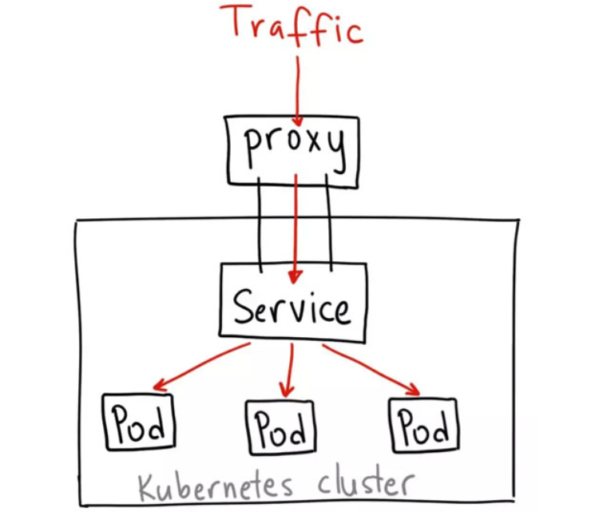

[TOC]


前面几节讲到如何访问kubneretes集群，本文主要讲解访问kubenretes中的Pod和Serivce的几种方式，包括如下几种：

1. hostNetwork
2. hostPort
3. NodePort
4. LoadBalancer
5. Ingress

说是**暴露Pod**其实跟**暴露Service**是一回事，因为Pod就是Service的backend。
# 1. hostNetwork

这是一种直接定义Pod网络的方式。
如果在Pod中使用`hostNotwork:true`配置的话，在这种pod中运行的应用程序可以直接看到pod启动的主机的网络接口。在主机的所有网络接口上都可以访问到该应用程序。以下是使用主机网络的pod的示例定义：
```yml

apiVersion: v1
kind: Pod
metadata:
  name: influxdb
spec:
  hostNetwork: true # 在这定义
  containers:
    - name: influxdb
      image: influxdb
```

部署该Pod：

```shell
kubectl create -f influxdb-hostnetwork.yml
```
访问该pod所在主机的8086端口：

```
curl -v http://$POD_IP:8086/ping
```
将看到204 No Content的204返回码，说明可以正常访问。

注意每次启动这个Pod的时候都可能被调度到不同的节点上，所有外部访问Pod的IP也是变化的，而且调度Pod的时候还需要考虑是否与宿主机上的端口冲突，因此一般情况下除非您知道需要某个特定应用占用特定宿主机上的特定端口时才使用hostNetwork: true的方式。

这种Pod的网络模式有一个用处就是可以将网络插件包装在Pod中然后部署在每个宿主机上，这样该Pod就可以控制该宿主机上的所有网络。

# 2. hostPort
这是一种直接定义Pod网络的方式。

hostPort是直接将容器的端口与所调度的节点上的端口路由，这样用户就可以通过宿主机的IP加上来访问Pod了，如:。
```yml
apiVersion: v1
kind: Pod
metadata:
  name: influxdb
spec:
  containers:
    - name: influxdb
      image: influxdb
      ports:
        - containerPort: 8086
          hostPort: 8086
```

这样做有个缺点，因为Pod重新调度的时候该Pod被调度到的宿主机可能会变动，这样就变化了，用户必须自己维护一个Pod与所在宿主机的对应关系。

这种网络方式可以用来做 **nginx ingress controller**。外部流量都需要通过`kubenretes node`节点的80和443端口。

# 3. NodePort

NodePort在kubenretes里是一个广泛应用的服务暴露方式。Kubernetes中的service默认情况下都是使用的ClusterIP这种类型，这样的service会产生一个ClusterIP，这个IP只能在集群内部访问，要想让外部能够直接访问service，需要将service type修改为 nodePort。

```yml
apiVersion: v1
kind: Pod
metadata:
  name: influxdb
  labels:
    name: influxdb
spec:
  containers:
    - name: influxdb
      image: influxdb
      ports:
        - containerPort: 8086
```

同时还可以给service指定一个nodePort值，范围是30000-32767，这个值在API server的配置文件中，用--service-node-port-range定义。

```yml
kind: Service
apiVersion: v1
metadata:
  name: influxdb
spec:
  type: NodePort
  ports:
    - port: 8086
      nodePort: 30000
  selector:
    name: influxdb
```
**访问**

外部
```
<Node-ip>：30000
```
集群外就可以使用kubernetes任意一个节点的IP加上30000端口访问该服务了。kube-proxy会自动将流量以round-robin的方式转发给该service的每一个pod。

这种服务暴露方式，无法让你指定自己想要的应用常用端口，不过可以在集群上再部署一个反向代理作为流量入口。

# 4. LoadBalancer
LoadBalancer 只能在service上定义。这是公有云提供的负载均衡器，如AWS、Azure、CloudStack、GCE等。

```yml
kind: Service
apiVersion: v1
metadata:
  name: influxdb
spec:
  type: LoadBalancer # 定义
  ports:
    - port: 8086
  selector:
    name: influxdb
```


```shell
kubectl get svc influxdb
NAME       CLUSTER-IP     EXTERNAL-IP     PORT(S)          AGE
influxdb   10.97.121.42   10.13.242.236   8086:30051/TCP   39s
```


**内部**： 可以使用ClusterIP加端口来访问服务，如：
```
19.97.121.42:8086
```
**外部**： 可以用以下两种方式访问该服务：

1. 使用任一节点的IP加 30051 端口访问该服务
   ```
   <Node-IP>:30051
   ```
2. 使用 `EXTERNAL-IP` 来访问，这是一个VIP，是云供应商提供的负载均衡器IP，如:
   ```
   <Load-Blance-IP>:8086
   10.13.242.236:8086
   ```

# 5. Ingress


Ingress 是一个API对象，用于**管理**对集群中服务的外部访问，通常是HTTP。

ingress相当于nginx反向代理服务器，它包括的规则定义就是URL的路由信息；它的实现需要部署Ingress controller(比如 traefik ingress-nginx 等)，Ingress controller通过apiserver监听ingress和service的变化，并根据规则配置负载均衡并提供访问入口，达到服务发现的作用。

Ingress 可以提供负载平衡，SSL终止和基于名称的虚拟主机。


通常情况下，service和pod仅可**在集群内部网络**中通过IP地址访问。所有到达边界路由器的流量或被丢弃或被转发到其他地方。从概念上讲，可能像下面这样：
```shll
    internet
        |
  ------------
  [ Services ]
```
**Ingress是授权入站连接到达集群服务的规则集合。**

```shell
    internet
        |
   [ Ingress ]
   --|-----|--
   [ Services ]
```
你可以给Ingress配置 提供外部可访问的URL、负载均衡、SSL、基于名称的虚拟主机等。

用户通过POST Ingress资源到API server的方式来请求ingress。 Ingress controller负责实现Ingress，通常使用负载平衡器，它还可以配置边界路由和其他前端，这有助于以HA方式处理流量。

Ingress是自 kubernetes 1.1版本后引入的资源类型。必须要部署 Ingress controller 才能创建Ingress资源，Ingress controller是以一种插件的形式提供。

Ingress controller 是部署在Kubernetes之上的Docker容器。它的Docker镜像包含一个像nginx或HAProxy的负载均衡器和一个控制器守护进程。控制器守护程序从Kubernetes接收所需的Ingress配置。它会生成一个nginx或HAProxy配置文件，并重新启动负载平衡器进程以使更改生效。换句话说，Ingress controller是由Kubernetes管理的负载均衡器。


Kubernetes Ingress提供了负载平衡器的典型特性：

HTTP路由，粘性会话，SSL终止，SSL直通，TCP和UDP负载平衡等。
目前并不是所有的 `Ingress controller`都实现了这些功能，需要查看具体的Ingress controller文档。

```yml
apiVersion: extensions/v1beta1
kind: Ingress
metadata:
  name: influxdb
spec:
  rules:
    - host: influxdb.kube.example.com
      http:
        paths:
          - backend:
              serviceName: influxdb
              servicePort: 8086
```

外部访问URL http://influxdb.kube.example.com/ping 访问该服务，入口就是80端口，然后Ingress controller直接将流量转发给后端Pod，不需再经过kube-proxy的转发，比LoadBalancer方式更高效。

总的来说 Ingress 是一个非常灵活和越来越得到厂商支持的服务暴露方式，包括Nginx、HAProxy、Traefik，还有各种Service Mesh，而其它服务暴露方式可以更适用于服务调试、特殊应用的部署。


# 6. ClusterIP

ClusterIP 服务是 Kubernetes 的默认服务。它给你一个集群内的服务，集群内的其它应用都可以访问该服务。集群外部无法访问它。



ClusterIP 服务的 YAML 文件类似如下：

```yml
    apiVersion: v1
    kind: Service
    metadata:  
    name: my-internal-service
    selector:    
    app: my-app
    spec:
    type: ClusterIP
    ports:  
    - name: http
    port: 80
    targetPort: 80
    protocol: TCP
```


如果 从Internet 没法访问 ClusterIP 服务，那么我们为什么要讨论它呢？那是因为我们可以通过 Kubernetes 的 proxy 模式来访问该服务！


启动 Kubernetes proxy 模式：

```shell
kubectl proxy --port=8080
```

这样你可以通过Kubernetes API，使用如下模式来访问这个服务：

```shell
http://localhost:8080/api/v1/proxy/namespaces/<NAMESPACE>/services/<SERVICE-NAME>:<PORT-NAME>/

http://39.99.85.99:9000/api/v1/proxy/namespaces/kubeflow/services/tensorboard:http/

```

要访问我们上面定义的服务，你可以使用如下地址：

```shell
http://localhost:8080/api/v1/proxy/namespaces/default/services/my-internal-service:http/

```

何时使用这种方式？

有一些场景下，你得使用 Kubernetes 的 proxy 模式来访问你的服务：

    由于某些原因，你需要调试你的服务，或者需要直接通过笔记本电脑去访问它们。
    容许内部通信，展示内部仪表盘等。

这种方式要求我们运行 kubectl 作为一个未认证的用户，因此我们不能用这种方式把服务暴露到 internet 或者在生产环境使用。

# 7. 参考资料
Accessing Kubernetes Pods from Outside of the Cluster - alesnosek.com