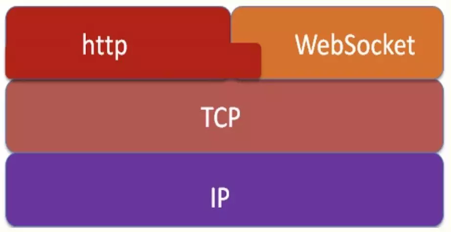

# websocket 开发


[TOC]

WebSocket是类似Socket的TCP长连接通讯模式。一旦WebSocket连接建立后，后续数据都以帧序列的形式传输。在客户端断开WebSocket连接或Server端中断连接前，不需要客户端和服务端重新发起连接请求。在海量并发及客户端与服务器交互负载流量大的情况下，极大的节省了网络带宽资源的消耗，有明显的性能优势，且客户端发送和接受消息是在同一个持久连接上发起，实时性优势明显。
WebSocket与HTTP轮询对比得出的结论：
**WebSocket是真正的全双工方式，建立连接后客户端与服务器端是完全平等的，可以互相主动请求**
而HTTP长连接基于HTTP，是传统的客户端对服务器发起请求的模式。




## 实例


服务器端
```python
from sys import stdout, stdin
import threading
from time import sleep
import datetime
import sys


def send(data):
    # send string to web page
    time_now=datetime.datetime.now().strftime("%Y-%m-%d-%H-%M-%S")
    _str="S->C:{}\n".format(data)
    stdout.write(_str)
    stdout.flush()

# start a thread to receive & echo back strings from web page
# and to change sleep time
def receive():
    while True:
        data = stdin.readline().strip()
        if data:
                _str="C->S:{}\n".format(data)
                send(_str)


def send_stuff():
    while True:
        time_now_str=datetime.datetime.now().strftime("%Y-%m-%d-%H-%M-%S")  
        __str=str("[{}] Test Data per 5s ".format(time_now_str))
        send(__str)
        sleep(5)
        __str=""
    

t0 = threading.Thread(target=receive)
t0.start()


t1 = threading.Thread(target=send_stuff)
t1.start()


# suspend main thread until worker threads are done
t0.join()
t1.join()

```
客户端
```html




<script type="text/javascript">
    function WebSocketSupportTest() {
        // 浏览器支持 WebSocket测试
        if ("WebSocket" in window) {
            alert("您的浏览器支持 WebSocket!");
        } else {
            // 浏览器不支持 WebSocket
            alert("您的浏览器不支持 WebSocket!");
        }
    }

    function WebSocketConnectTest() {
        // 客户端连接WebSocket服务器测试
        var ws = new WebSocket("ws://47.104.96.15:8088/");
        ws.onopen = function () {
            ws.send("发送连接测试数据");
            alert("Client send test data")

        };
        ws.onmessage = function (event) {
            var data = event.data;

            if (data == "S->C:C->S:发送连接测试数据") {
                alert("Web Socket 已连成功接上，发送数据正确返回");
            };
        };
        ws.onclose = function () {
            ws.close();
            alert('ws.close ');
        };


    }

    function WebSocketClose() {
        var has_not_ws = typeof ws != "undefined" ? false : true;
        if (has_not_ws) {
            alert("没有发现WebSocket链接");
        } else {
            alert("WebSocket链接存在");
        }
        ws.close();
        alert("连接已关闭...");
    }

    function ConnectStart() {
        var has_not_ws = typeof ws != "undefined" ? false : true;
        if (has_not_ws) {
            ws = new WebSocket("ws://47.104.96.15:8088/");
            alert("WebSocket新连接 ws://47.104.96.15:8088/");
        } else {

            if (ws.readyState != 1) {
                ws = new WebSocket("ws://47.104.96.15:8088/");
                alert("WebSocket新连接 ws://47.104.96.15:8088/");
            }
        }
        ws.onmessage = function (event) {
            var data = event.data;
            var div_i = document.getElementById("room");
            var html = div_i.innerHTML;
            var insert_html = "<p>" + data + "</p>";
            div_i.innerHTML = html + "\n" + insert_html;
        };
    }

    //Web Socket 已连接上，使用 send() 方法发送数据
</script>


<h1>Test WebSocket</h1>

<div id="Support_test">
    <a href="javascript:WebSocketSupportTest()"> 测试浏览器是否支持WebSocket</a>
</div>

<div id="ConnectTest">
    <a href="javascript:WebSocketConnectTest()"> WebSocket 连接测试</a>
</div>


<div id="ConnectStart">
    <a href="javascript:ConnectStart()"> WebSocket 开启</a>
    <div id="room">
        <p>接收发送信息记录</p>

    </div>
</div>

<div id="ConnectEnd">
    <a href="javascript:WebSocketClose()"> WebSocket 关闭</a>
</div>

<div id="sse2">
    <h1>收发信息测试</h1>
    <input id="sendTxt" type="text" />
    <button id="sendBtn" type="text">发送信息</button>
</div>

<script type="text/javascript">
    //Web Socket 已连接上，使用 send() 方法发送数据
    document.getElementById("sendBtn").onclick = function () {

        ConnectStart()

        ws.onopen = function () {
            var data_2 = document.getElementById("sendTxt").value;
            alert("输入框数据是" + data_2);
            if (data_2) {
                ws.send(data_2);
                alert("Web Socket 已经发送" + data_2);
            };
        };
        ws.onopen()
    };
</script>



```